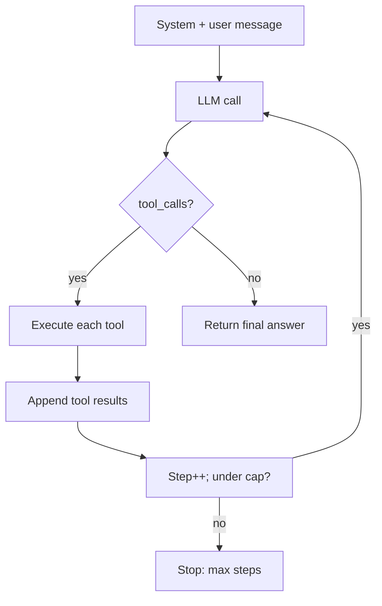
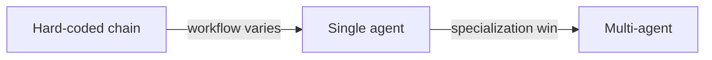

# The agent loop

> **In one line:** An agent is an LLM in a `while` loop: call the model, execute the tool(s) it requests, feed the results back, repeat until it stops requesting tools.

:::tip[In plain English]
There is no special "agent" code. There's just a loop. The model talks; you obey by running any tool it asks for; you tell it what happened; it talks again. Sometimes the talk is the final answer. Sometimes it's another tool request. You keep going until it stops asking. Every "agent framework" you've heard of is a fancy version of that loop.
:::

## The loop, in pseudocode

```python
messages = [system_prompt, user_message]
for step in range(MAX_STEPS):
    response = llm(messages, tools=tools)
    if response.tool_calls:
        for call in response.tool_calls:
            result = execute_tool(call.name, call.arguments)
            messages.append({"role": "tool", "tool_call_id": call.id, "content": result})
        messages.append(response)  # keep the assistant tool-request turn too
    else:
        return response.content  # the model stopped requesting tools — final answer
```

That's the whole architecture. Every "agentic framework" is some variation of this loop, plus convenience layers (retries, parallelism, observability, structured planning).



## Why this works

The model is using its trained-in reasoning ability to decide:

1. What information does it still need?
2. Which available tool gets that information?
3. What arguments to pass?

Repeat until the model believes it has enough to answer.

The same pattern handles wildly different tasks:

- **Research:** `search(q) → read(url) → search(refined_q) → answer`
- **Coding:** `read_file → edit → run_tests → fix_failures → done`
- **Customer support:** `lookup_user → check_orders → issue_refund → notify`
- **Data analysis:** `query_db → plot(result) → query_db(refined) → summarize`

You don't write 4 different agents. You write 4 different tool sets.

## Worked example: a research mini-agent

```python
tools = [
    {"type": "function", "function": {
        "name": "web_search", "description": "Search the web.",
        "parameters": {"type": "object", "properties": {"query": {"type": "string"}}, "required": ["query"]},
    }},
    {"type": "function", "function": {
        "name": "fetch_url", "description": "Fetch the readable text of a URL.",
        "parameters": {"type": "object", "properties": {"url": {"type": "string"}}, "required": ["url"]},
    }},
]

def execute_tool(name, args):
    if name == "web_search":
        return json.dumps(serpapi.search(args["query"])[:5])
    if name == "fetch_url":
        return readability.fetch(args["url"])

def research(question, max_steps=8):
    messages = [
        {"role": "system", "content": "Answer the user's question. Search and read sources as needed. Cite URLs."},
        {"role": "user", "content": question},
    ]
    for step in range(max_steps):
        resp = client.chat.completions.create(model="gpt-5-mini", messages=messages,
                                              tools=tools, parallel_tool_calls=True, temperature=0)
        msg = resp.choices[0].message
        messages.append(msg)
        if not msg.tool_calls:
            return msg.content
        for call in msg.tool_calls:
            args = json.loads(call.function.arguments)
            result = execute_tool(call.function.name, args)
            messages.append({"role": "tool", "tool_call_id": call.id, "content": result[:5000]})
    return "I couldn't finish within step budget."

print(research("What's the most-downloaded npm package in May 2026 and why?"))
```

Forty lines, full research agent. The model decides when to search, what to fetch, when it's done. You decided what tools it has and how to format their outputs.

## Where agents fail

- **Drift over many steps.** Each step has some error rate; long agentic workflows compound it. Keep agents short. If the workflow has more than ~10 steps, consider decomposing.
- **Tool selection errors.** Too many tools = model picks wrong. Tight, well-described tool sets beat sprawling ones.
- **Infinite loops.** Always cap iterations.
- **Silent partial failure.** A tool returned an error message and the model "handled" it by ignoring it. Treat tool errors as first-class signals in the prompt.
- **Cost surprises.** Each loop step is a full LLM call with the full growing context. Costs can balloon. Monitor steps-per-conversation.
- **Context bloat.** After 5 tool calls each returning 2K of JSON, your prompt is 30K and the model loses focus. Truncate / summarize tool results.

## Single-agent vs chain vs multi-agent

- **Chain** — fixed pipeline of LLM/tool calls in a predetermined order. Predictable. Use when the workflow is known.
- **Single agent** — one model, dynamic tool selection. Use when the workflow varies per request.
- **Multi-agent** — multiple specialized agents that delegate to each other. Sometimes useful (planner + worker), often premature complexity. See [multi-agent](./multi-agent.md).

The 2026 default: **start with a chain. Promote to a single agent when the chain branches too much. Reach for multi-agent only with evidence.**



## Observability you should ship from day one

For every agent run, log:

- The full message list at each step.
- Each tool call (name, args) and its result.
- Step count, total tokens in/out, total cost.
- Final outcome (success / max_steps / error).
- Wall-clock time per step.

Without this you can't debug *anything*. Frameworks (LangSmith, Langfuse, Arize, Helicone, Phoenix) wrap this; even just `JSONL` to a file beats nothing.

## What beginners get wrong

:::caution[Common mistakes]
- **No step cap.** A confused model can chew through hundreds of steps and a fortune. Cap.
- **Sending 50 tools and wondering why selection is bad.** Curate. Group. Route first.
- **Returning huge tool results.** A 50K JSON dump in the context pollutes attention. Return summaries; let the model request detail.
- **No retry on tool failures.** Network blip → tool errors → agent gives up. Wrap tools in retry-with-backoff for transient errors.
- **Pretty-print everything.** Use JSON for tool I/O, not markdown tables. The model doesn't care about formatting; you'll pay for the extra tokens.
- **Forgetting that the model's "thinking" between tool calls is also paid output.** Reasoning models can spend thousands of tokens between visible turns.
- **Treating the agent as autonomous when it shouldn't be.** "Email the customer" or "transfer the funds" should require a confirmation step, not be inside the loop.
- **Hot-loading prompts mid-loop.** Changing the system prompt or tool list during a run breaks reproducibility.
:::

## A reasonable agent skeleton

```python
async def run_agent(system: str, user_msg: str, tools: list,
                     max_steps: int = 10, max_tokens_total: int = 100_000):
    messages = [{"role": "system", "content": system},
                {"role": "user", "content": user_msg}]
    total_tokens = 0
    for step in range(max_steps):
        resp = await client.chat.completions.create(
            model="gpt-5-mini", messages=messages, tools=tools,
            parallel_tool_calls=True, temperature=0,
        )
        total_tokens += resp.usage.total_tokens
        if total_tokens > max_tokens_total:
            return {"status": "budget_exceeded", "final": None}
        msg = resp.choices[0].message
        messages.append(msg)
        log_step(step, msg, resp.usage)
        if not msg.tool_calls:
            return {"status": "done", "final": msg.content, "steps": step + 1, "tokens": total_tokens}
        results = await asyncio.gather(*[safe_exec(c) for c in msg.tool_calls])
        for call, res in zip(msg.tool_calls, results):
            messages.append({"role": "tool", "tool_call_id": call.id, "content": truncate(res, 4000)})
    return {"status": "max_steps", "final": None, "steps": max_steps}
```

Step cap, token cap, error-tolerant exec, truncated results, logged steps. 95% of what a framework gives you, in 25 lines.

:::info[Highlight: agents are loops you can debug]
The hype paints agents as autonomous beings. They're not. They're loops over an LLM that calls tools. If you can read the loop, you can debug the agent. If you can't read the loop (because a framework hid it), you can't debug it. Pick frameworks that let you see the loop.
:::

---

→ Next: [Planning and reflection](./planning-and-reflection.md)
