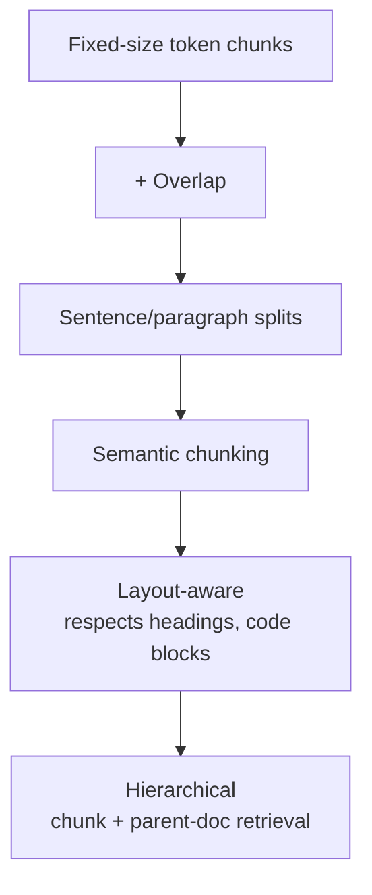
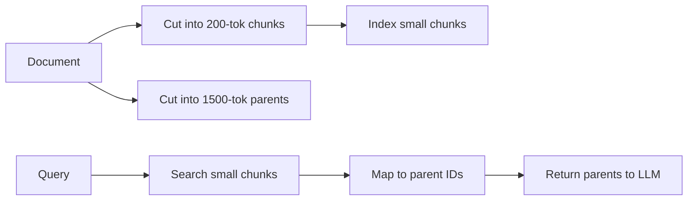

# Chunking strategies

> **In one line:** How you cut documents into chunks determines what your retriever can possibly find. Bad chunking is the #1 cause of bad RAG; no model upgrade or fancy reranker fixes it. Pick a strategy that matches the *shape* of your content.

:::tip[In plain English]
Imagine you're indexing a cookbook. If you index *one chunk per recipe*, "how do I make pancakes" finds the right recipe. If you index *every paragraph as a chunk*, the model gets the "1 cup of flour" line out of context. If you index *the whole book as one chunk*, the search returns "yep, that's a cookbook." Chunking is the act of cutting the book into useful units.
:::

## Why this is the highest-leverage knob in RAG

You can buy a better embedding model. You can add a reranker. You can switch from vector to hybrid. Each gains 5–15% on retrieval quality. Bad chunking can cost you 50%+ — and no other improvement can fully recover it.

Most RAG-quality complaints I've debugged trace back to chunking, not retrieval.

## The strategies (least to most effort)



### 1. Fixed-size token chunks

Cut every N tokens. Dirt simple, surprisingly good baseline.

```python
import tiktoken
enc = tiktoken.encoding_for_model("text-embedding-3-small")

def chunk_fixed(text: str, size: int = 600, overlap: int = 100):
    toks = enc.encode(text)
    chunks = []
    for i in range(0, len(toks), size - overlap):
        chunks.append(enc.decode(toks[i:i + size]))
    return chunks
```

**Pros:** trivial, predictable size, easy budget math.
**Cons:** cuts mid-sentence, splits code blocks weirdly.

### 2. Sentence / paragraph splits

Cut at natural boundaries (`\n\n`, `. `), then pack up to N tokens.

```python
def chunk_by_paragraph(text: str, target: int = 600):
    paragraphs = [p.strip() for p in text.split("\n\n") if p.strip()]
    chunks, current, current_tokens = [], [], 0
    for p in paragraphs:
        t = len(enc.encode(p))
        if current_tokens + t > target and current:
            chunks.append("\n\n".join(current))
            current, current_tokens = [p], t
        else:
            current.append(p)
            current_tokens += t
    if current:
        chunks.append("\n\n".join(current))
    return chunks
```

**Pros:** keeps paragraphs intact, reads naturally.
**Cons:** chunk size varies; very long paragraphs still get cut.

### 3. Semantic chunking

Use embeddings to detect topic shifts. Compute embeddings sentence-by-sentence; chunk boundaries fall at the largest cosine distances between adjacent sentences.

LangChain's `SemanticChunker`, LlamaIndex's `SemanticSplitterNodeParser`, and a Greg Kamradt notebook popularized this. Quality often beats fixed-size on prose; cost is higher (extra embeddings during chunking).

**Pros:** chunks align with topic boundaries.
**Cons:** slow + expensive at indexing time; needs a sensitivity threshold; bad on heavily formatted content.

### 4. Layout-aware

Respect document structure: don't split mid-heading-section, don't split mid-code-block, don't split mid-table-row.

```python
def chunk_markdown(md: str, target: int = 600):
    # Split by H2/H3 headings first
    sections = re.split(r'(?=^##? )', md, flags=re.MULTILINE)
    chunks = []
    for s in sections:
        if len(enc.encode(s)) <= target:
            chunks.append(s)
        else:
            chunks.extend(chunk_by_paragraph(s, target))
    return chunks
```

For PDFs: tools like `unstructured`, `LlamaParse`, `Docling`, `MarkItDown` (Microsoft) extract headings, tables, and code blocks before chunking.

**Pros:** respects intent of the document; tables stay tables.
**Cons:** more complex; quality depends on the parser; needs per-format logic.

### 5. Hierarchical / parent-document retrieval

Index *small* chunks for precision; on retrieval, return the *parent section* (or document) for context.



You search the precise small chunks (high recall), but feed the model the surrounding context. Classic in LangChain (`ParentDocumentRetriever`) and LlamaIndex (`AutoMergingRetriever`).

**Pros:** best of both — precise matching, generous context.
**Cons:** more storage, more complex retrieval.

## Overlap

Almost always include 10–20% overlap between adjacent chunks:

- A fact that straddles a chunk boundary won't be split-and-lost.
- The model can stitch context together when adjacent chunks both come back.

Too much overlap (>30%) wastes storage and pollutes top-K with near-duplicates.

## Choosing by content type

| Content type            | Recommended strategy                          |
|-------------------------|-----------------------------------------------|
| Long prose articles     | Paragraph split, 400–800 tokens, 10% overlap  |
| Technical docs (MD)     | Layout-aware by heading + paragraph fallback  |
| Source code             | Per-function / per-class chunks               |
| PDFs (digital)          | LlamaParse/Docling → layout-aware             |
| PDFs (scanned)          | OCR → paragraph chunks                        |
| Tables / spreadsheets   | Row-as-chunk (with header context) or "table → text" pre-pass |
| Chat transcripts        | Per-message or per-turn windows               |
| Legal contracts         | Per-clause; layout-aware by section #         |
| Q&A / FAQ               | Per-question (each Q+A is one chunk)          |

The single best move is to **look at your data first**. Open a few representative docs, ask "what would a human consider a useful retrieval unit here?", then chunk to match that.

## Worked example: chunking a technical doc

Input: 10K-word product manual with H2 sections, code blocks, and tables.

**Bad strategy:** 1000-token fixed chunks. → Code blocks get split mid-function; tables get cut; user query "how do I configure SSL?" finds half the procedure.

**Better:** Layout-aware → split on H2, fall back to paragraph if a section is too long, keep code blocks whole.

```python
def chunk_tech_doc(md: str, target: int = 800):
    sections = re.split(r'(?=^## )', md, flags=re.MULTILINE)
    chunks = []
    for sec in sections:
        # Extract code blocks intact
        code_blocks = re.findall(r'```.*?```', sec, flags=re.DOTALL)
        text_only = re.sub(r'```.*?```', '[CODE]', sec, flags=re.DOTALL)
        sec_chunks = chunk_by_paragraph(text_only, target)
        # Restore code blocks
        for i, cb in enumerate(code_blocks):
            for j, c in enumerate(sec_chunks):
                if '[CODE]' in c:
                    sec_chunks[j] = c.replace('[CODE]', cb, 1)
                    break
        chunks.extend(sec_chunks)
    return chunks
```

Same corpus, 25% better recall@5 on a 100-query eval — measured, not assumed.

## What beginners get wrong

:::caution[Common mistakes]
- **Picking a chunking strategy without looking at the corpus.** What's "right" depends on what's in there. Open a few files first.
- **Using character count instead of token count.** Your chunks will overshoot the model's chunk-size budget on dense content (code, JSON).
- **Zero overlap.** Facts get split; the retriever can't find them.
- **Massive overlap (50%+).** Top-K gets filled with near-duplicates, all from the same paragraph.
- **One chunking strategy for a mixed corpus.** A repo that contains markdown, code, and PDFs needs different strategies per type.
- **Chunking the wrong unit entirely.** For a FAQ, the right chunk is Q+A. For chat transcripts, it might be a 5-turn window. Match the unit to the user's intent.
- **Not re-chunking when you change embedding models.** Different models have different effective context for "what's one good chunk." Re-test.
- **Forgetting to keep metadata.** Strip headings from chunk text → lose the section title that gave it meaning. Keep the title as both a metadata field *and* prepended to the chunk text.
- **Stripping document context.** A chunk that says "click 'Save' to confirm" is useless without knowing it's from the billing settings docs. Prepend doc title or section path.
:::

## A reasonable starting recipe

For most text corpora:

1. **Strategy:** layout-aware → paragraph fallback.
2. **Target size:** 500–800 tokens.
3. **Overlap:** 10–15% (50–100 tokens).
4. **Prepend** doc title and section path to each chunk's text *and* store them as metadata.
5. **Re-chunk + re-embed** every time you change embedding model.
6. **Eval set** of 50 queries with known-relevant chunk IDs to compare strategies.

This recipe beats every "we used the default" RAG implementation I've ever seen.

:::info[Highlight: chunking is design work, not configuration]
There is no universal chunking config because there are no universal documents. The 30 minutes you spend looking at five representative documents and deciding what a "useful unit" is — that's the difference between a working RAG system and a frustrating one.
:::

## Practice: fixed-size chunking with overlap

The simplest chunker — and the one most production RAG systems start with — is a sliding window: take `size` tokens, slide forward by `size − overlap`, repeat. Overlap is what stops a fact from being severed at a chunk boundary. Implement the windowing once and the "overlap" knob stops being abstract.

Here it is traced once on a tiny input, so the exercise below is just reproducing the loop you've already watched run:

```text
tokens = [A, B, C, D, E],  size = 3,  overlap = 1
step = size − overlap = 2

start = 0 → tokens[0:3] = [A, B, C]
start = 2 → tokens[2:5] = [C, D, E]   ← C reappears: that's the overlap
start = 4 → tokens[4:7] = [E]         ← last window, shorter than size
start = 6 → 6 ≥ length, stop
```

Now write it yourself — same loop, same `step = size − overlap`:

<CodeChallenge
  id="foundations-chunk"
  fnName="chunk"
  prompt="Write chunk(tokens, size, overlap) — split the array `tokens` into consecutive windows of length `size`, each starting `size − overlap` after the previous one. The last window may be shorter. (Assume 0 ≤ overlap < size.)"
  starter={`function chunk(tokens, size, overlap) {\n  // step = size - overlap; slide a window across the array\n}`}
  solution={`function chunk(tokens, size, overlap) {\n  const step = size - overlap;\n  const out = [];\n  for (let start = 0; start < tokens.length; start += step) {\n    out.push(tokens.slice(start, start + size));\n  }\n  return out;\n}`}
  tests={[
    {args: [[1, 2, 3, 4, 5, 6], 3, 0], expected: [[1, 2, 3], [4, 5, 6]]},
    {args: [[1, 2, 3, 4, 5], 3, 1], expected: [[1, 2, 3], [3, 4, 5], [5]]},
    {args: [[1, 2], 5, 2], expected: [[1, 2]]},
    {args: [[1, 2, 3, 4], 2, 0], expected: [[1, 2], [3, 4]]},
  ]}
  hint="The step between window starts is size − overlap. Loop `start` from 0 while it's less than the length, pushing tokens.slice(start, start + size) each time."
/>

---

→ Next: [Reranking](./reranking.md)
