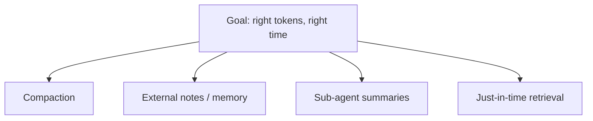

# Context engineering

> **In one line:** Context engineering is deciding which tokens go into the model's [context window](./context-window.md) at every step — and what to leave out, summarize, or fetch later — so a long-running task stays reliable instead of drowning in its own history.

:::tip[In plain English]
Think of the context window as a small workbench. You can only fit so many tools and papers on it at once. If you pile on every document, every old conversation, and every tool result you've ever seen, you can't find anything and you start making mistakes. Context engineering is the habit of keeping the bench clear: only the right things out, at the right time, with the rest filed away where you can grab it again.
:::

## From prompt engineering to context engineering

**Prompt engineering** is wording a single prompt well. **Context engineering** is the broader discipline of curating the *whole evolving context* across a long task — the system prompt, the running history, tool outputs, retrieved documents, and notes — and continuously deciding what stays and what goes.

As of 2026 this has largely displaced "prompt engineering" as the headline production skill. Anthropic's *Effective context engineering for AI agents* (Sept 2025) is the canonical reference. The shift happened because [agents](./agent-loop.md) don't run one prompt — they loop, and every loop adds more tokens. Managing that accumulation *is* the job.

## Why this is hard: context rot

A long-running agent accumulates tool outputs, observations, and conversation history that steadily fill the window. The trap is **context rot**: as the window fills, the model's effective recall and reasoning degrade. The *usable* context is well below the advertised limit. A model advertised at 1M tokens does not give you 1M tokens of reliable recall — quality starts slipping well before you hit the cap.

So more context is not free, and not just for cost and latency reasons (see [context windows](./context-window.md)). Past a point, adding tokens actively makes the model *worse* at the task. The goal is not "fit everything in" — it's **the right tokens in the window at the right time.**

## The four core techniques

### 1. Compaction

When the window approaches full, summarize the older turns into a compact running summary and drop the raw history. You trade verbatim detail for room to keep working.

```python
def maybe_compact(messages, summary, count_tokens, summarize, limit=200_000):
    """Compact older turns once the window is ~70% full."""
    used = sum(count_tokens(m["content"]) for m in messages)
    if used < 0.70 * limit:
        return messages, summary            # plenty of room, leave it alone

    # Keep the system prompt + the most recent turns verbatim.
    head, recent = messages[:1], messages[-6:]
    to_fold = messages[1:-6]

    # Roll the old turns into the running summary (an LLM call).
    summary = summarize(prior=summary, turns=to_fold)
    summary_msg = {"role": "system", "content": f"Summary so far:\n{summary}"}

    return head + [summary_msg] + recent, summary
```

The raw `to_fold` turns are gone from the context after this; their *gist* survives in `summary`. Tune the 0.70 threshold and how many recent turns you keep verbatim to your task.

### 2. Structured note-taking (external memory)

Don't keep everything in the window. Persist progress, decisions, and a todo list to a file or store *outside* the context, then read back only what's needed for the current step. This is how tools like Claude Code keep going on tasks far longer than any single window.

```python
def checkpoint(path, *, done, next_steps, decisions):
    """Write progress to disk so it survives outside the context window."""
    with open(path, "w", encoding="utf-8") as f:
        f.write("## Done\n" + "\n".join(f"- {d}" for d in done) + "\n\n")
        f.write("## Next\n" + "\n".join(f"- {n}" for n in next_steps) + "\n\n")
        f.write("## Key decisions\n" + "\n".join(f"- {d}" for d in decisions))

def resume(path):
    """Read only the notes back — not the full transcript that produced them."""
    with open(path, encoding="utf-8") as f:
        return f.read()
```

The agent writes a checkpoint, then on the next step reads the small notes file instead of replaying thousands of tokens of history. See [memory patterns](./memory.md) for the storage side of this.

### 3. Sub-agent summaries

Have an isolated [sub-agent](./multi-agent.md) do scoped work in its *own* context window and return only a tight ~1–2k-token summary — not its full transcript. The orchestrator's window stays clean; the messy exploration stays quarantined in the sub-agent that did it.

### 4. Just-in-time retrieval

Fetch a document or tool result *at the moment it's needed*, rather than stuffing everything in up front. [Agentic RAG](../10-patterns/agentic-rag.md) is exactly this: retrieval offered to the agent as a tool it calls when a question demands it, instead of pre-loading every doc that *might* be relevant.

## The umbrella view

RAG, memory, and multi-agent summaries are not competing approaches — they are all **tools in service of context engineering**. Each one is a different lever for the same goal: keeping the right tokens in the window at the right time, and keeping everything else out.



## Why it matters

Context engineering is now *the* discipline that separates a demo agent from a production one. A demo runs for five turns and looks brilliant. A real agent runs for fifty steps on a messy task — and without compaction, external notes, scoped sub-agents, and just-in-time retrieval, it hits context rot and starts forgetting its own goal, repeating tool calls, or contradicting earlier decisions. The wording of any single prompt barely matters once you're 30 steps deep; what matters is what's *in the window* at step 30. Get that right and the same model becomes dramatically more reliable, cheaper, and able to tackle longer tasks.

:::caution[Common pitfalls]
- **Treating the advertised window as usable headroom.** Quality degrades well before the cap. Budget for *effective* recall, not the marketing number.
- **Letting history grow unbounded.** No compaction means every long task eventually rots. Add a threshold (e.g. ~70% full) and summarize before you hit it.
- **Keeping everything in-context instead of on disk.** If progress and decisions live only in the window, you lose them the moment you compact. Write notes externally and read them back.
- **Dumping a sub-agent's full transcript into the parent.** That defeats the purpose — sub-agents exist to *contain* token sprawl and return a small summary.
- **Pre-loading documents "just in case."** Retrieve just-in-time. Up-front stuffing both crowds the window and adds distracting, irrelevant tokens.
- **Optimizing prompt wording while ignoring accumulation.** A perfectly worded prompt still fails at step 40 if you never managed the context that piled up to get there.
:::

<Quiz id="context-engineering-quiz" title="Check yourself: context engineering" sampleSize={3}>
  <Question
    prompt="What is the difference between prompt engineering and context engineering?"
    options={[
      { text: "Context engineering curates the whole evolving context across a long task; prompt engineering is wording a single prompt." },
      { text: "They are two names for the same thing." },
      { text: "Prompt engineering is for agents; context engineering is for chatbots." },
      { text: "Context engineering only matters when the window is smaller than 8K tokens." }
    ]}
    correct={0}
    explanation="Prompt engineering = wording one prompt well. Context engineering is the broader discipline of deciding what goes into (and stays out of) the context window at every step of a long, evolving task. As of 2026 it has largely displaced prompt engineering as the headline production skill."
  />
  <Question
    prompt="What does 'context rot' refer to?"
    options={[
      { text: "Tokens being silently corrupted in transit to the API." },
      { text: "The model's effective recall and reasoning degrading as the window fills, well before the advertised limit." },
      { text: "Old cached prompts expiring and needing to be re-sent." },
      { text: "The context window physically shrinking over the life of a session." }
    ]}
    correct={1}
    explanation="Context rot is the degradation of effective recall and reasoning as the window fills up. The usable context is well below the advertised cap — a 1M-token model does not give you 1M tokens of reliable recall — which is why more context is not free."
  />
  <Question
    prompt="An agent's window is approaching full mid-task. Which technique keeps it going by trading verbatim detail for room?"
    options={[
      { text: "Increasing max_output_tokens." },
      { text: "Lowering the temperature." },
      { text: "Compaction — summarize older turns into a running summary and drop the raw history." },
      { text: "Switching to a smaller model." }
    ]}
    correct={2}
    explanation="Compaction summarizes older turns into a compact running summary and drops the raw history, freeing space while preserving the gist. It's one of the four core context-engineering techniques, alongside external note-taking, sub-agent summaries, and just-in-time retrieval."
  />
</Quiz>

---

→ Next: [Computer use & browser agents](./computer-use.md)
