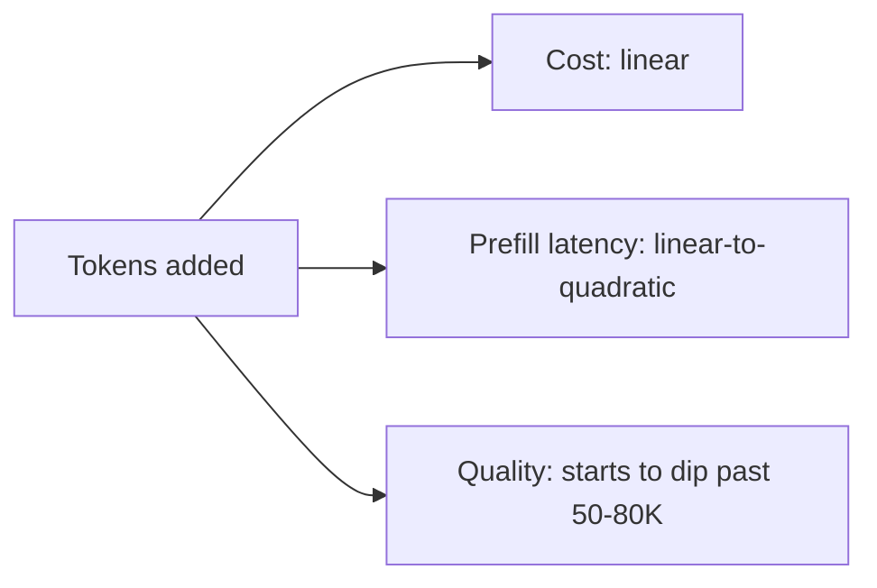
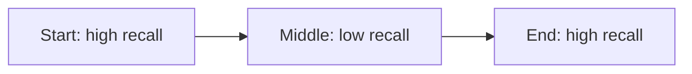

# Context windows

> **In one line:** The context window is the maximum tokens (input + output combined, for most providers) that fit in a single call. 2026 frontier models are typically 200K–2M tokens.

:::tip[In plain English]
The context window is the model's working memory for one call — everything it can "see" at once. Picture a giant whiteboard. You write the system prompt, the conversation, any documents, anything the model should reference. The whiteboard has a fixed size. Run out of room? You have to erase, summarize, or pick smaller documents.
:::


## Numbers to know (June 2026)

- **Frontier chat models:** 1M tokens is now the baseline (Claude Opus 4.8, GPT-5.5, Gemini 3.x) — but *effective* recall degrades well before the advertised limit.
- **Workhorse:** 128K–200K is standard.
- **Small / mid-tier:** 32K–128K is the common floor.
- **Open-weight models:** 8K–1M depending on architecture and how it was fine-tuned for long context. Llama 4 and Qwen 3 ship 128K+ out of the box.

A million tokens is roughly a 750,000-word document — *War and Peace* twice over. You can fit a lot. Whether you *should* is a different question.

## Why bigger isn't free

- **Cost** — every token in the prompt is billed.
- **Latency** — long prompts take longer to process (the "prefill" stage).
- **Quality** — "lost in the middle" effects are real: information buried mid-context is recalled less reliably than info at the start or end.
- **Quadratic attention cost** — providers absorb most of this with flash attention and KV cache tricks, but it's why long context costs scale super-linearly under the hood.



## Worked example: budgeting a 200K window

You have a 200K window. You want:

- 4K-token system prompt (cached).
- 20-message conversation history (~10K).
- 5 RAG chunks of 1K each (~5K).
- Tool definitions (~2K).
- Response budget (~4K).

```
system:        4,000
history:      10,000
RAG:           5,000
tools:         2,000
output budget: 4,000
overhead:        500
total:        25,500 / 200,000 = 13% used
```

You have plenty of room. If the user uploads a 500-page PDF (~250K tokens), you suddenly *don't*. Now you have to chunk it and use RAG instead of stuffing the whole thing in.

<PredictThenReveal
  id="context-lost-in-middle"
  question="A model gets a long document and one fact it needs to answer the question. The fact could sit at the START, the MIDDLE, or the END of that context. Which placement will the model recall most reliably — and which worst?">

**Best: the start and the end. Worst: the middle.** Long-context models recall information at the edges of the context far more reliably than facts buried in the middle — accuracy on mid-context facts can drop **20–40%**. This is the counterintuitive "lost in the middle" effect, and it's why *where* you place context matters as much as *how much* you include.

</PredictThenReveal>

## The "lost in the middle" effect

Studies (Liu et al. 2023, replicated since) show that long-context models recall the **start** and **end** of their context reliably, but accuracy on facts buried in the *middle* drops 20–40%.



Practical implications:

- Put the user's actual question at the **end** of the prompt, after the context.
- Put the system prompt and "answering rules" at the **start**.
- If you have a critical fact, repeat it both places — start (rule) and end (reminder).
- Don't trust "needle in a haystack" benchmark scores. Real workloads are messier than the synthetic tests.

## Practical patterns

- **Pack the right things, not all things.** RAG with a strong retriever almost always beats "shove the whole document in."
- **Put the most important context near the end.** Long-context models recall the *most recent* tokens best.
- **Use prompt caching for stable prefixes.** A long system prompt or a long document being asked many questions becomes 5–10× cheaper if cached. See [Prompt caching](./prompt-caching.md).
- **Watch your *output* budget separately.** The same context window holds both input and output for most providers; if you let the prompt grow to 199K of a 200K window, the model can only generate 1K tokens.
- **Reserve headroom.** Always leave at least 10–20% of the window unused — both for the response and for an unexpected long retrieval result.

## When to actually use a 1M+ window

Useful:

- **Single-shot doc analysis** — "here's a 500-page contract, find every clause about liquidated damages." Beats chunking-and-stitching for one-off tasks.
- **Code repo Q&A on small repos** — paste the whole repo and ask questions. Beats RAG when the repo fits.
- **Multi-document synthesis** — comparing 50 PDFs in one call to look for contradictions.

Not useful:

- **Chatbots** — recent history is enough. Hauling 100K tokens of history every turn is just expensive.
- **High-volume production** — long inputs are billed every call. Multiply by your QPS.
- **Tasks where you don't know exactly which parts matter** — RAG outperforms huge-context most of the time, on both quality and cost.

## What beginners get wrong

:::caution[Common mistakes]
- **Treating "200K context" as a free buffet.** Every token in is paid. A 100K-token prompt at $3/M is 30 cents *per call*. 100K queries/day = $30K/month.
- **Letting context grow unbounded.** Chat with 200 messages and no summarization will eventually break (cost first, then window). Implement [memory](./memory.md) early.
- **Confusing input window with output cap.** Most providers have a separate `max_output_tokens` cap (often 4K–16K) much smaller than the input window. Read the model card.
- **Not measuring TTFT vs total latency.** A 100K prompt has a long prefill (slow first token) but normal decode rate. If users complain "it's slow to start," that's prefill — caching helps.
- **Believing the marketing.** "2M context" benchmarks rarely match real-world recall at 2M. Test with *your* docs and *your* questions before relying on it.
- **Ignoring rate limits.** A 100K-token request might fit in the context window but blow your TPM rate limit. Two different ceilings.
:::

:::info[Highlight: context window is the wrong knob to chase]
You can solve almost any "I need more context" problem with better retrieval, summarization, or caching — for a fraction of the cost. Reach for the giant context window when the task genuinely demands it, not because it sounds capable.
:::

## A useful checklist before you decide "we need more context"

- [ ] Have you run a retrieval baseline (top-5 chunks instead of the whole doc)?
- [ ] Have you measured per-query token usage at p50 / p95 / p99?
- [ ] Have you confirmed lost-in-the-middle isn't hurting you on long inputs?
- [ ] Have you enabled prompt caching for the stable prefix?
- [ ] Have you compared cost of "big context every call" vs "small context + RAG"?
- [ ] Does the workload genuinely require *cross-document reasoning* (where the model needs to compare facts from page 3 and page 250)?

If you can't check all six, retrieval beats raw context for this workload.

<Quiz id="context-window-quick-check" variant="micro" title="Quick check">

<Question
  prompt="You place a critical fact in the middle of a 150K-token prompt and the model keeps missing it. What is happening?"
  options={[
    { text: "The 'lost in the middle' effect — recall drops for facts buried mid-context" },
    { text: "The model silently truncated your prompt" },
    { text: "Middle tokens are billed but not processed" },
    { text: "The fact exceeded a per-paragraph token limit" }
  ]}
  correct={0}
  explanation="Long-context models recall the start and end of the context reliably, but accuracy on mid-context facts drops 20 to 40 percent. Nothing was truncated, and every token was processed and billed — attention just favors the edges. The fix: rules at the start, the question at the end, and repeat critical facts in both places."
/>

<Question
  prompt="Your team wants to send a user's whole 100K-token document on every call because 'the window fits it'. What is the strongest objection from this page?"
  options={[
    { text: "The provider will throttle accounts that use full windows" },
    { text: "Long prompts disable streaming" },
    { text: "Every token is billed every call — about 30 cents per call at 3 dollars per million — and retrieval usually wins on both cost and quality" },
    { text: "Documents over 50K tokens must be uploaded as separate files" }
  ]}
  correct={2}
  explanation="Fitting is not the same as free: a 100K-token prompt at 3 dollars per million input is 30 cents per call, which at 100K queries a day is 30,000 dollars a month — and quality starts dipping past 50 to 80K tokens anyway. RAG with a strong retriever usually beats whole-document stuffing on cost and quality. The window is a limit, not a target."
/>

<Question
  prompt="Which workload is a genuinely good fit for a 1M-token context window?"
  options={[
    { text: "A high-volume chatbot that hauls full history every turn" },
    { text: "One-off analysis of a 500-page contract for every liability clause" },
    { text: "Classifying short support tickets at scale" },
    { text: "Any task — more context always improves answers" }
  ]}
  correct={1}
  explanation="Giant windows earn their cost on one-shot cross-document tasks — analyzing a whole contract, comparing 50 PDFs for contradictions, question-answering over a small repo — where the model truly needs everything at once. Chatbots and high-volume production are the anti-pattern: you would pay for huge inputs on every call when recent history or retrieval would do."
/>

</Quiz>

---

→ Next: [Prompt caching](./prompt-caching.md)
