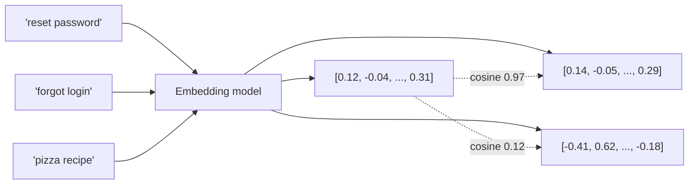

# Embeddings

> **In one line:** An embedding is a fixed-length vector of floats (e.g., 1,536 dimensions) that captures the *meaning* of a piece of text. Texts with similar meanings have vectors that point in similar directions.

:::tip[In plain English]
Think of every possible string mapped to a point in a high-dimensional space — like a city map, but with 1,536 axes instead of 2. "How do I reset my password?" lands next to "I forgot my login." "Pizza recipe" lands far away. To find similar text, you find nearby points. That's the whole trick.
:::


## What you actually do with them

You hand a string to an embedding model and get back a vector. You store many such vectors. Later, you embed a query the same way and find the vectors closest to the query vector — those are the texts most semantically similar to the query.



That single operation powers a huge fraction of useful AI features:

- **Semantic search** — "find docs about reset passwords" matches docs about *"trouble logging in"* even though no word overlaps.
- **RAG** — retrieve the K most relevant chunks of your knowledge base to give the model as context.
- **Deduplication** — find near-duplicate support tickets, posts, leads.
- **Classification & clustering** — embed examples, run k-NN or k-means, get a working classifier without training a model.
- **Recommendation** — embed users by their history, items by their content, recommend nearby items.

<PredictThenReveal
  id="embeddings-no-word-overlap"
  question="You'll search 5 short docs (one is a pizza recipe) with the query 'I can't log in to my account' — which shares NO words with any of the docs. Will semantic search still surface the login-related docs, or fall apart because nothing overlaps word-for-word?">

**It still finds them.** Embeddings match on *meaning*, not shared words — "I can't log in" lands nearest "Account locked after too many attempts" and "How to reset your password," while the pizza recipe sits far away. The worked example below shows the exact cosine scores (top match ≈ 0.61 with zero word overlap; pizza ≈ 0.04).

</PredictThenReveal>

## Worked example: a 20-line semantic search

```python
from openai import OpenAI
import numpy as np

client = OpenAI()

docs = [
    "How to reset your password",
    "Account locked after too many attempts",
    "Updating your billing address",
    "Cancelling a subscription",
    "Pizza dough recipe with sourdough starter",
]

def embed(texts):
    r = client.embeddings.create(model="text-embedding-3-small", input=texts)
    return np.array([d.embedding for d in r.data])

doc_vecs = embed(docs)
q_vec = embed(["I can't log in to my account"])[0]

# cosine similarity (embeddings are already normalized)
scores = doc_vecs @ q_vec
for s, d in sorted(zip(scores, docs), reverse=True):
    print(f"{s:.3f}  {d}")
```

Output:
```
0.612  Account locked after too many attempts
0.587  How to reset your password
0.341  Cancelling a subscription
0.298  Updating your billing address
0.041  Pizza dough recipe with sourdough starter
```

Notice: "log in" matched "Account locked" and "reset password" *without sharing a single word*. That's the magic — and the entire reason every modern search box uses embeddings.

## "Closeness" between vectors

Almost always **cosine similarity** (dot product after normalization). Higher = more similar. Values typically range from ~0 (unrelated) to ~1 (near-identical). Negative values exist but rarely matter in practice for modern embedding models — most cluster everything in a relatively narrow positive cone.

Other metrics: Euclidean distance and dot product (without normalization). Pick the one the embedding model was trained for — check the model card.

## Picking an embedding model (May 2026)

| Model                                | Dim    | Notes                                          |
|--------------------------------------|--------|------------------------------------------------|
| **OpenAI `text-embedding-3-small`**  | 1,536  | Cheap default, great quality, MRL support      |
| **OpenAI `text-embedding-3-large`**  | 3,072  | When quality matters more than cost            |
| **Cohere `embed-v3` / `embed-v4`**   | 1,024  | Strong on retrieval benchmarks                 |
| **voyage-3 / voyage-3-large**        | 1,024  | Competitive, especially for code               |
| **BGE-M3, E5-mistral, nomic-embed**  | 1,024  | Open weights for self-hosting                  |
| **Gemini `text-embedding-005`**      | 768    | Cheap, integrates with Google stack            |

Dimensionality matters: bigger vectors = better quality but more storage and slower search. **1,024–1,536 is the sweet spot** for most apps. Some models (OpenAI's `-3-` family, BGE) support **Matryoshka Representation Learning** — you can truncate the vector to e.g. 512 dims with minimal quality loss.

## What embeddings are *not*

- **Not a search engine on their own.** You still need a vector index (Pinecone, pgvector, etc.) to find nearest neighbors at scale. See [Vector search](./vector-search.md).
- **Not a replacement for keyword search.** Hybrid (BM25 + vector) almost always beats pure vector for production retrieval. See [Hybrid search](./hybrid-search.md).
- **Not interchangeable across models.** A query embedded with one model can't be matched against a corpus embedded with another.
- **Not for arbitrary semantic tasks.** Two embeddings being close means "these texts are about similar topics in similar styles." It does *not* mean "they say the same thing" or "they're logically equivalent."

## What beginners get wrong

:::caution[Common mistakes]
- **Embedding the wrong unit.** Embedding a whole 50-page PDF gives you one vector that means "this is a PDF about insurance." Useless for retrieval. Chunk first. See [Chunking strategies](./chunking-strategies.md).
- **Mixing models in one index.** Re-embedding every document is annoying, but a corpus embedded by model A and queried by model B returns garbage. The cosine similarity is meaningful only within one model's space.
- **Comparing raw cosine scores across queries.** A 0.85 for one query may mean "great match"; for another it may mean "barely related." Always look at relative ranking, not absolute thresholds — or calibrate per-query.
- **Storing only the vector.** Always store the source text, source ID, and metadata alongside the vector. You'll need them at retrieval time, and re-fetching from the source is expensive.
- **Treating cosine 0.99 as "the same."** It usually means "near-paraphrase." For dedup, set a high threshold and *then* verify with a string comparison.
:::

## Practical implications

- **Always normalize once** if your library doesn't (OpenAI's API returns pre-normalized vectors; some open models don't). Comparing un-normalized vectors with cosine is a footgun.
- **Batch embed.** Most APIs let you submit 100–2,000 strings per call; one round trip is 10–50× faster than one-at-a-time.
- **Cache embeddings.** They're deterministic per (model, input). Re-embedding the same string twice is wasted money.
- **Re-embed when you upgrade.** A model bump (e.g., `-3-small` → `-3-large`) means re-indexing everything. Budget for it.

:::info[Highlight: embeddings made semantic search a commodity]
Pre-2020, "find similar text" required hand-tuned synonyms, query expansion, and BM25 tweaks. Today it's one API call and a vector index. The single most useful technique in this whole guide.
:::

## Practice: compute cosine similarity

"Closest vector" is just cosine similarity, and cosine similarity is a four-line function. Write it once and the rest of retrieval stops being magic: `cosine(a, b) = dot(a, b) / (‖a‖·‖b‖)`. Parallel vectors score `1`, orthogonal score `0`, opposite score `-1` — exactly the behaviour the cluster map above shows.

<CodeChallenge
  id="foundations-cosine"
  fnName="cosine"
  prompt="Write cosine(a, b) — the cosine similarity of two equal-length number arrays. Identical direction → 1, orthogonal → 0, opposite → -1."
  starter={`function cosine(a, b) {\n  // dot product over the product of magnitudes\n}`}
  solution={`function cosine(a, b) {\n  let dot = 0, na = 0, nb = 0;\n  for (let i = 0; i < a.length; i++) {\n    dot += a[i] * b[i];\n    na += a[i] * a[i];\n    nb += b[i] * b[i];\n  }\n  return dot / (Math.sqrt(na) * Math.sqrt(nb));\n}`}
  tolerance={0.001}
  tests={[
    {args: [[1, 0], [1, 0]], expected: 1},
    {args: [[1, 0], [0, 1]], expected: 0},
    {args: [[1, 0], [-1, 0]], expected: -1},
    {args: [[1, 2, 3], [2, 4, 6]], expected: 1},
    {args: [[0.12, -0.04, 0.31], [0.14, -0.05, 0.29]], expected: 0.9962},
  ]}
  hint="Accumulate three sums in one pass: the dot product, and the squared magnitude of each vector. Then divide the dot product by sqrt(na) * sqrt(nb)."
/>

<Quiz id="embeddings-quick-check" variant="micro" title="Quick check">

<Question
  prompt="A query 'I cannot log in' retrieves the doc 'Account locked after too many attempts' even though they share no words. Why does this work?"
  options={[
    { text: "The embedding model translates both into synonyms first" },
    { text: "The vector index stores a thesaurus of related terms" },
    { text: "Keyword search falls back to fuzzy matching" },
    { text: "Both texts map to nearby points in vector space because their meanings are similar" }
  ]}
  correct={3}
  explanation="Embeddings place texts in a high-dimensional space where semantic similarity becomes geometric closeness, so meaning matches even with zero word overlap. There is no thesaurus or translation step — the model learned that these phrasings occur in similar contexts. This is exactly the thing keyword search cannot do, and it is the whole trick behind semantic search and RAG."
/>

<Question
  prompt="You embedded your corpus with model A, then started embedding queries with model B without re-indexing. What should you expect?"
  options={[
    { text: "Garbage results — similarity is only meaningful within one model's vector space" },
    { text: "Slightly lower quality but mostly fine" },
    { text: "Identical results, since both models understand English" },
    { text: "An API error, because providers block mixed-model comparisons" }
  ]}
  correct={0}
  explanation="Each embedding model defines its own coordinate system, so distances between vectors from two different models are noise — not just slightly degraded. Nothing errors out, which makes this failure sneaky: the pipeline runs fine and quietly returns garbage. Changing the embedding model means re-embedding the entire corpus."
/>

<Question
  prompt="You embed an entire 50-page PDF as a single vector for retrieval. What is the problem?"
  options={[
    { text: "The vector will be too large to store in most databases" },
    { text: "One vector averages everything into 'this is a PDF about X', which is useless for finding specific passages" },
    { text: "Embedding APIs reject any input longer than one page" },
    { text: "PDFs must be converted to JSON before embedding" }
  ]}
  correct={1}
  explanation="An embedding has a fixed length regardless of input size, so a whole document collapses into one blurry summary of its overall topic — fine for 'what is this about', useless for retrieving the paragraph that answers a question. Chunk first, then embed each chunk. Storage is not the issue: the vector is the same size whether you embed a sentence or a book."
/>

</Quiz>

---

→ Next: [Neural networks](./neural-networks.md) — the machine that turns these vectors into predictions.
