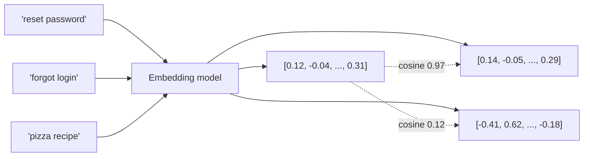

# Embeddings

> **In one line:** An embedding is a fixed-length vector of floats (e.g., 1,536 dimensions) that captures the *meaning* of a piece of text. Texts with similar meanings have vectors that point in similar directions.

:::tip[In plain English]
Think of every possible string mapped to a point in a high-dimensional space — like a city map, but with 1,536 axes instead of 2. "How do I reset my password?" lands next to "I forgot my login." "Pizza recipe" lands far away. To find similar text, you find nearby points. That's the whole trick.
:::


## What you actually do with them

You hand a string to an embedding model and get back a vector. You store many such vectors. Later, you embed a query the same way and find the vectors closest to the query vector — those are the texts most semantically similar to the query.



That single operation powers a huge fraction of useful AI features:

- **Semantic search** — "find docs about reset passwords" matches docs about *"trouble logging in"* even though no word overlaps.
- **RAG** — retrieve the K most relevant chunks of your knowledge base to give the model as context.
- **Deduplication** — find near-duplicate support tickets, posts, leads.
- **Classification & clustering** — embed examples, run k-NN or k-means, get a working classifier without training a model.
- **Recommendation** — embed users by their history, items by their content, recommend nearby items.

## Worked example: a 20-line semantic search

```python
from openai import OpenAI
import numpy as np

client = OpenAI()

docs = [
    "How to reset your password",
    "Account locked after too many attempts",
    "Updating your billing address",
    "Cancelling a subscription",
    "Pizza dough recipe with sourdough starter",
]

def embed(texts):
    r = client.embeddings.create(model="text-embedding-3-small", input=texts)
    return np.array([d.embedding for d in r.data])

doc_vecs = embed(docs)
q_vec = embed(["I can't log in to my account"])[0]

# cosine similarity (embeddings are already normalized)
scores = doc_vecs @ q_vec
for s, d in sorted(zip(scores, docs), reverse=True):
    print(f"{s:.3f}  {d}")
```

Output:
```
0.612  Account locked after too many attempts
0.587  How to reset your password
0.341  Cancelling a subscription
0.298  Updating your billing address
0.041  Pizza dough recipe with sourdough starter
```

Notice: "log in" matched "Account locked" and "reset password" *without sharing a single word*. That's the magic — and the entire reason every modern search box uses embeddings.

## "Closeness" between vectors

Almost always **cosine similarity** (dot product after normalization). Higher = more similar. Values typically range from ~0 (unrelated) to ~1 (near-identical). Negative values exist but rarely matter in practice for modern embedding models — most cluster everything in a relatively narrow positive cone.

Other metrics: Euclidean distance and dot product (without normalization). Pick the one the embedding model was trained for — check the model card.

## Picking an embedding model (May 2026)

| Model                                | Dim    | Notes                                          |
|--------------------------------------|--------|------------------------------------------------|
| **OpenAI `text-embedding-3-small`**  | 1,536  | Cheap default, great quality, MRL support      |
| **OpenAI `text-embedding-3-large`**  | 3,072  | When quality matters more than cost            |
| **Cohere `embed-v3` / `embed-v4`**   | 1,024  | Strong on retrieval benchmarks                 |
| **voyage-3 / voyage-3-large**        | 1,024  | Competitive, especially for code               |
| **BGE-M3, E5-mistral, nomic-embed**  | 1,024  | Open weights for self-hosting                  |
| **Gemini `text-embedding-005`**      | 768    | Cheap, integrates with Google stack            |

Dimensionality matters: bigger vectors = better quality but more storage and slower search. **1,024–1,536 is the sweet spot** for most apps. Some models (OpenAI's `-3-` family, BGE) support **Matryoshka Representation Learning** — you can truncate the vector to e.g. 512 dims with minimal quality loss.

## What embeddings are *not*

- **Not a search engine on their own.** You still need a vector index (Pinecone, pgvector, etc.) to find nearest neighbors at scale. See [Vector search](./vector-search.md).
- **Not a replacement for keyword search.** Hybrid (BM25 + vector) almost always beats pure vector for production retrieval. See [Hybrid search](./hybrid-search.md).
- **Not interchangeable across models.** A query embedded with one model can't be matched against a corpus embedded with another.
- **Not for arbitrary semantic tasks.** Two embeddings being close means "these texts are about similar topics in similar styles." It does *not* mean "they say the same thing" or "they're logically equivalent."

## What beginners get wrong

:::caution[Common mistakes]
- **Embedding the wrong unit.** Embedding a whole 50-page PDF gives you one vector that means "this is a PDF about insurance." Useless for retrieval. Chunk first. See [Chunking strategies](./chunking-strategies.md).
- **Mixing models in one index.** Re-embedding every document is annoying, but a corpus embedded by model A and queried by model B returns garbage. The cosine similarity is meaningful only within one model's space.
- **Comparing raw cosine scores across queries.** A 0.85 for one query may mean "great match"; for another it may mean "barely related." Always look at relative ranking, not absolute thresholds — or calibrate per-query.
- **Storing only the vector.** Always store the source text, source ID, and metadata alongside the vector. You'll need them at retrieval time, and re-fetching from the source is expensive.
- **Treating cosine 0.99 as "the same."** It usually means "near-paraphrase." For dedup, set a high threshold and *then* verify with a string comparison.
:::

## Practical implications

- **Always normalize once** if your library doesn't (OpenAI's API returns pre-normalized vectors; some open models don't). Comparing un-normalized vectors with cosine is a footgun.
- **Batch embed.** Most APIs let you submit 100–2,000 strings per call; one round trip is 10–50× faster than one-at-a-time.
- **Cache embeddings.** They're deterministic per (model, input). Re-embedding the same string twice is wasted money.
- **Re-embed when you upgrade.** A model bump (e.g., `-3-small` → `-3-large`) means re-indexing everything. Budget for it.

:::info[Highlight: embeddings made semantic search a commodity]
Pre-2020, "find similar text" required hand-tuned synonyms, query expansion, and BM25 tweaks. Today it's one API call and a vector index. The single most useful technique in this whole guide.
:::

---

→ Next: [The transformer](./transformer.md)
