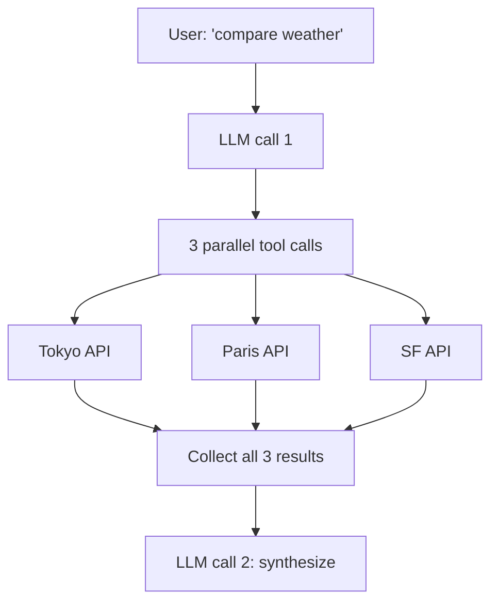

# Function calling, deep

> **In one line:** Basic tool use is "model calls one function, you run it, repeat." Production tool use is parallel calls, forced choice, streaming partial arguments, and using the tool schema as a structured-output trick. Each pattern unlocks a real-world scenario.

:::tip[In plain English]
Once you've done one tool call, the next questions appear: "what if the model wants to call three tools at once?", "what if I want to *force* a specific tool?", "what if the JSON is taking 4 seconds to stream and I want to show partial UI?". This page is the answers.
:::

## Pattern 1: Parallel tool calls

Modern providers (OpenAI, Anthropic, Gemini) emit *multiple* tool calls in one response when the model thinks several are independent. Run them concurrently.

```python
response = client.chat.completions.create(
    model="gpt-5-mini",
    messages=[{"role": "user", "content": "Compare the weather in Tokyo, Paris, and SF."}],
    tools=[weather_tool],
)

calls = response.choices[0].message.tool_calls
# [ToolCall(name='get_weather', args={'city':'Tokyo'}),
#  ToolCall(name='get_weather', args={'city':'Paris'}),
#  ToolCall(name='get_weather', args={'city':'San Francisco'})]
```

Execute them concurrently:

```python
import asyncio

async def run_call(call):
    args = json.loads(call.function.arguments)
    return call.id, await get_weather_async(**args)

results = await asyncio.gather(*[run_call(c) for c in calls])
for call_id, result in results:
    messages.append({"role": "tool", "tool_call_id": call_id, "content": json.dumps(result)})
```

Three serial weather lookups: ~900ms. Three parallel: ~300ms. Multiply that across an agent loop and it adds up.



To enable: set `parallel_tool_calls=True` (OpenAI default in modern models). Anthropic does this by default; Gemini does too.

## Pattern 2: Forced tool choice

Sometimes you don't want the model to *decide* whether to use a tool — you want it to use one. Options:

- **`tool_choice="auto"`** (default) — model decides.
- **`tool_choice="required"`** / `"any"` — model must call *some* tool.
- **`tool_choice={"type": "function", "function": {"name": "extract_invoice"}}`** — model must call *this* tool.
- **`tool_choice="none"`** — model must *not* call any tool.

```python
# Force the model to extract structured data
response = client.chat.completions.create(
    model="gpt-5-mini",
    messages=[{"role": "user", "content": email_body}],
    tools=[invoice_extraction_tool],
    tool_choice={"type": "function", "function": {"name": "extract_invoice"}},
)
```

This pattern *is* structured output before structured-output APIs existed. Still useful when you want one of N tool calls forced.

## Pattern 3: Structured output via tools

You can use a single forced tool as a guaranteed-schema output channel:

```python
class Invoice(BaseModel):
    vendor: str
    amount: float
    due_date: str

tool = {
    "type": "function",
    "function": {
        "name": "submit_invoice",
        "description": "Submit the extracted invoice.",
        "parameters": Invoice.model_json_schema(),
    },
}

response = client.chat.completions.create(
    model="gpt-5-mini",
    messages=[{"role": "user", "content": email_body}],
    tools=[tool],
    tool_choice={"type": "function", "function": {"name": "submit_invoice"}},
)

args = json.loads(response.choices[0].message.tool_calls[0].function.arguments)
invoice = Invoice(**args)
```

Pre-2024 this was the *only* way to get reliable structured JSON. Today, real structured-output APIs are preferred for pure extraction — but tools-as-schema still wins when:

- You want to expose the same schema *as a tool* for an agent and *as an output* for extraction.
- The provider's structured-output API doesn't support your nesting depth.
- You need multiple competing output shapes (model picks one of N tools).

## Pattern 4: Streaming partial JSON arguments

Tool call arguments stream just like text. You'll see them arrive incrementally:

```
chunk 1: tool_call.arguments = '{"ci'
chunk 2: tool_call.arguments = '{"city": "To'
chunk 3: tool_call.arguments = '{"city": "Tokyo'
chunk 4: tool_call.arguments = '{"city": "Tokyo", "units": "celsius"}'
```

You can't *execute* the tool until the arguments are complete (you'd be passing invalid JSON). But you can:

- **Render UI as args arrive** — "calling `get_weather` with city: Tokyo..." appears character-by-character.
- **Pre-warm** dependencies — once you see `"city":` is being filled, you could open a DB connection.
- **Cancel early** — if the user changes their mind, abort the stream before the call completes.

```python
import partial_json_parser

buffer = ""
for chunk in stream:
    tc = chunk.choices[0].delta.tool_calls
    if tc and tc[0].function.arguments:
        buffer += tc[0].function.arguments
        try:
            partial = partial_json_parser.loads(buffer)
            render_status(f"Calling get_weather({partial})")
        except Exception:
            pass
```

The `partial-json-parser` (npm: `partial-json`, Python: `partial-json-parser`) tolerates incomplete JSON and returns the best parse it can.

## Pattern 5: Tool result streaming back

Some patterns let the *tool result* itself stream into the model — useful when a tool takes 10 seconds and you want the model to react before it completes. Most providers don't natively support this; you simulate it by:

1. Run the tool, accumulate partial results.
2. When you have an interim result, make a second LLM call with the partial.
3. Decide whether to wait for the full or proceed.

Rarely worth it. Better pattern: design tools to return *quickly* with a job ID, then provide a `check_status` tool.

## Pattern 6: Tool errors as first-class messages

Always surface errors *through* the model, never silently:

```python
try:
    result = get_weather(**args)
    content = json.dumps(result)
except CityNotFoundError as e:
    content = json.dumps({"error": "city_not_found", "message": str(e), "suggestion": "verify spelling"})
except APIError as e:
    content = json.dumps({"error": "api_unavailable", "retry_after": 5})

messages.append({"role": "tool", "tool_call_id": call.id, "content": content})
```

The model can recover: try a different city, retry after a delay, ask the user for clarification. Silent failures → models hallucinate plausible-looking results to fill the gap.

## What beginners get wrong

:::caution[Common mistakes]
- **Running parallel tool calls serially.** You got them in one response — run them with `asyncio.gather` or equivalent.
- **Re-prompting "use this tool" in the system prompt instead of using `tool_choice`.** The API has the right knob. Use it.
- **Trying to parse streaming tool args with `json.loads`.** It will fail mid-stream. Use a partial-JSON parser or wait for completion.
- **Throwing on tool errors.** The agent crashes; the user sees a 500. Catch errors, return them as structured tool results, let the model decide.
- **Hardcoding tool order assumptions.** Don't assume the model calls `auth_check` before `get_data`. If the order matters, make the tool itself enforce it.
- **Using tool calls when structured output is what you want.** If you're never going to *execute* the "tool," use the real structured-output API — it's simpler.
- **Forgetting `tool_choice="none"` for the final synthesis step.** After enough loops, you might want to force the model to *just answer* without calling more tools.
:::

## A reusable agent step

```python
async def agent_step(messages, tools, max_steps=10):
    for step in range(max_steps):
        resp = await client.chat.completions.create(
            model="gpt-5-mini", messages=messages, tools=tools,
            parallel_tool_calls=True, temperature=0,
        )
        msg = resp.choices[0].message
        messages.append(msg)
        if not msg.tool_calls:
            return msg.content  # done
        results = await asyncio.gather(*[exec_call(c) for c in msg.tool_calls])
        for call, res in zip(msg.tool_calls, results):
            messages.append({"role": "tool", "tool_call_id": call.id,
                             "content": json.dumps(res)})
    raise RuntimeError("agent exceeded max steps")
```

Forty lines. Parallel calls. Error-tolerant. Step cap. This is 80% of what every agent framework gives you, written from scratch.

:::info[Highlight: function calling is the LLM's API to your code]
Treat it like an API contract: stable names, clear descriptions, validated inputs, structured errors. Sloppy tool definitions → unreliable agents. Tight ones → robust ones.
:::

---

→ Next: [Multimodal inputs](./multimodal-inputs.md)
