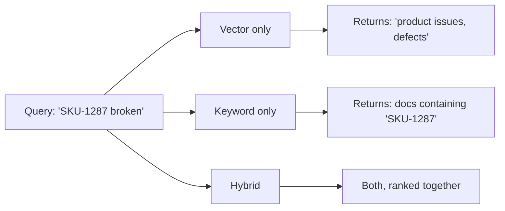

# Hybrid search

> **In one line:** Run BM25 keyword search and vector semantic search in parallel, then blend their scores. Pure vector misses rare terms (product codes, names, error strings); pure keyword misses synonyms and paraphrases. The blend reliably beats either alone.

:::tip[In plain English]
Vector search is great for "I forgot my password" matching "reset login credentials." It's terrible for "SKU-44827-A" matching "SKU-44827-A" because embeddings don't *care* about exact strings. Keyword search is the opposite. Hybrid search runs both and combines them — getting the best of each.
:::

## Why each one alone is wrong

### Pure vector misses

- **Exact identifiers**: product codes ("AC-1287B"), error codes ("E0x0F"), proper names ("Höffler-Bach"), commit hashes.
- **Rare jargon** not well-represented in the embedding model's training data.
- **Negations** — "without sugar" embeds very similarly to "with sugar."
- **Tiny but important differences** — "Python 2" vs "Python 3" embed almost identically.

### Pure keyword (BM25) misses

- **Synonyms** — "car" vs "automobile" vs "vehicle."
- **Paraphrases** — "I can't log in" vs "authentication is failing."
- **Conceptual matches** — "refund policy" vs "money-back guarantee."
- **Cross-language** — Spanish query won't match English doc.



## The standard blend: Reciprocal Rank Fusion (RRF)

The most popular blend ignores absolute scores (which are incomparable between BM25 and cosine) and just looks at *rank position*.

```python
def rrf(rankings, k=60):
    """
    rankings: list of lists of doc IDs, each ranked best-first.
    Returns merged ranking.
    """
    scores = {}
    for ranking in rankings:
        for rank, doc_id in enumerate(ranking):
            scores[doc_id] = scores.get(doc_id, 0) + 1 / (k + rank + 1)
    return sorted(scores.items(), key=lambda x: x[1], reverse=True)

bm25_top = bm25_search(query, k=50)
vector_top = vector_search(query, k=50)
merged = rrf([bm25_top, vector_top])
top_k = [doc_id for doc_id, _ in merged[:10]]
```

`k=60` is a magic number from the RRF paper that works well across most domains. Documents that appear in both rankings get boosted; documents that only show up in one still contribute.

## The other blend: weighted score combination

Normalize both scores to [0,1] then combine:

```python
final_score = alpha * vector_score + (1 - alpha) * bm25_score_normalized
```

`alpha` tunes the balance (0.5 is a default starting point). Works fine but requires more tuning than RRF, especially if BM25 score distributions shift with corpus size.

## Worked example: Postgres + pgvector + ts_vector

Postgres can do both:

```sql
CREATE TABLE chunks (
    id bigserial PRIMARY KEY,
    text text,
    embedding vector(1536),
    tsv tsvector GENERATED ALWAYS AS (to_tsvector('english', text)) STORED
);

CREATE INDEX ON chunks USING hnsw (embedding vector_cosine_ops);
CREATE INDEX ON chunks USING gin (tsv);
```

```python
def hybrid_search(query: str, k: int = 10):
    q_vec = embed(query)
    vector_rows = db.execute("""
        SELECT id FROM chunks
        ORDER BY embedding <=> %s::vector LIMIT 50
    """, (q_vec,)).fetchall()
    bm25_rows = db.execute("""
        SELECT id, ts_rank(tsv, websearch_to_tsquery('english', %s)) AS rank
        FROM chunks WHERE tsv @@ websearch_to_tsquery('english', %s)
        ORDER BY rank DESC LIMIT 50
    """, (query, query)).fetchall()
    
    vec_ids = [r[0] for r in vector_rows]
    bm25_ids = [r[0] for r in bm25_rows]
    merged = rrf([vec_ids, bm25_ids])
    return [doc_id for doc_id, _ in merged[:k]]
```

Two parallel queries, RRF, done. On a million-chunk corpus this typically runs in 50–150ms.

## Services that ship hybrid out of the box

| Service       | Hybrid built in?                  |
|---------------|-----------------------------------|
| **Weaviate**  | Yes, single API, RRF + alpha     |
| **Qdrant**    | Yes (fusion API)                  |
| **Pinecone**  | Sparse-dense (sparse = BM25-like) |
| **Vespa**     | Yes (rank profiles)               |
| **Elastic / OpenSearch** | Yes (RRF on the same index) |
| **Typesense** | Yes (hybrid mode)                 |
| **Algolia**   | Hybrid via NeuralSearch add-on    |

If you're starting fresh: Weaviate, Qdrant, or Elastic are the smoothest. If you're already on Postgres: pgvector + tsvector is fine.

## When pure vector is actually enough

- **Pure-prose corpora with no codes/names** — long-form articles, internal essays, customer reviews.
- **Tiny corpora** (under ~1K docs) where retrieval rarely fails for any reason.
- **High-quality embeddings on niche domains** — finetuned domain embeddings can close the gap.

When pure BM25 is enough:

- **Highly structured corpora** with known vocabulary — code search, log search, legal codes.
- **When the user always knows the right terms** — internal tools used by power users.

For everything else: hybrid wins.

## Why this matters more than embedding-model choice

A 2024–2025 round of benchmarks (MTEB, BEIR, public RAG evals) consistently shows: switching from a mid-tier to a top-tier embedding model gains ~3–8% on recall. Adding hybrid search to either gains ~10–15%. **The blend is a bigger lever than the model.**

Spending two weeks finetuning an embedding model when you don't have BM25 in your stack is bad prioritization.

## What beginners get wrong

:::caution[Common mistakes]
- **Skipping BM25 because "embeddings are smarter."** They're not smarter at every job; they're complementary. Pure-vector RAG is a common production mistake.
- **Comparing absolute scores from BM25 and cosine.** They live on different scales. Always normalize or use rank-based fusion (RRF).
- **Forgetting to filter both branches the same way.** If you pre-filter the vector search by `tenant_id` and forget to filter BM25, you'll leak data.
- **Hand-tuning `alpha` without an eval set.** You'll convince yourself it's better on three example queries. Build a 50-query eval; tune against it.
- **Indexing the same field for BM25 with no language analyzer.** Default `simple` tokenization can hurt — set `english`, `german`, etc., matching your corpus.
- **Treating hybrid as the finish line.** Hybrid + reranker is the real production default. See [reranking](./reranking.md).
- **Reindexing only one side after a doc update.** If you update text in pgvector but forget to re-generate the tsvector, the two indices drift. Use generated columns or transactional updates.
:::

## A useful eval mental model

For a 50-query eval, measure:

- **Recall@10** for BM25 alone, vector alone, hybrid.
- **MRR (mean reciprocal rank)** of the first-relevant result.
- **Per-query diff** — find the queries hybrid wins on and the ones it loses on. They tell you what your corpus looks like.

Typical pattern: hybrid wins on queries with exact terms; vector wins on highly paraphrased queries. The diff is more informative than the average.

:::info[Highlight: hybrid is free quality]
You already have your vectors. Adding a BM25 index alongside is one schema change and 30 lines of fusion code. The quality jump is large enough that "we should add hybrid" is almost never a wrong call.
:::

---

→ Next: [Chunking strategies](./chunking-strategies.md)
