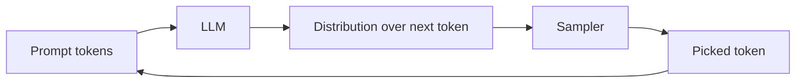

# Part 1: Foundations of LLM Systems

*Just enough about how LLMs work to make every decision later make sense.*

> **In one line:** An LLM is a function that takes a sequence of tokens in and produces a probability distribution over the next token out. Everything else — chat, RAG, agents, multimodal — is layered on top of that one primitive.

:::note[New to the field?]
Start with [The map of AI](./map-of-ai.md) to see where LLMs sit inside artificial intelligence, machine learning, and deep learning — then come back here for how they work. This chapter is the LLM/agent slice of that map.
:::

:::tip[In plain English]
You don't need a PhD to build LLM apps. You need a working mental model of: what a token is, what a context window is, how the model decides what to say next, and what new patterns (retrieval, tool use, agents) exist on top of that core. This chapter gives you exactly that — no calculus, no PyTorch.
:::

## Why "foundations" matters even if you just want to ship

You can write your first LLM app in ten lines of code without understanding any of this. You can't ship a *good* one. Almost every production decision — what model to pick, how to control cost, why outputs are slow, why outputs are wrong, when RAG helps and when it doesn't, when to reach for an agent and when not to — is downstream of a foundational concept. Engineers who skip this chapter spend the next year confused about the same five things on a loop.

## The mental model

An LLM is a **stochastic, next-token function**:

- Input: a sequence of tokens (your prompt).
- Output: a probability distribution over what the next token should be.
- The sampler picks one token, appends it, and the model runs again — until a stop condition.

That's it. The rest is engineering:

- **Streaming** is delivering those tokens to the client as they're produced.
- **Structured output** is constraining the sampler so the result parses as JSON or matches a schema.
- **Tool calling** is the model emitting a structured "I want to call function X with these arguments" instead of plain text.
- **RAG** is stuffing relevant documents into the prompt before generation.
- **Agents** are running the model in a loop and feeding tool results back in.

Every "magical" AI product is one or more of these patterns assembled carefully.

Read that loop until it feels boring. Every concept in this chapter is some way of feeding that loop better data, harvesting its output more usefully, or chaining several passes through it.

## How this chapter is organized

Each page focuses on a single concept. Read in order the first time. *(This list is generated from the sidebar, so the order and numbering never drift from the source of truth.)*

<ChapterContents />

---

:::note[Where this leads]
Foundations is the *vocabulary*. Everything after it builds on these primitives: you'll learn the project [lifecycle](/docs/lifecycle) and [tech stack](/docs/stack), then the disciplines that separate a demo from a product — [evaluation](/docs/evaluation) and [responsible & safe AI](/docs/safety) — then specializations like [fine-tuning](/docs/fine-tuning) and [multimodal & voice](/docs/multimodal), the [workflows](/docs/solo) at every team scale, and finally [decisions](/docs/decisions), [career](/docs/career), and real [case studies](/docs/case-studies). Read in order and you go from "what's a token?" to job-ready.
:::

When you finish this chapter, move on to [Chapter 2: Roadmap](/docs/roadmap).
