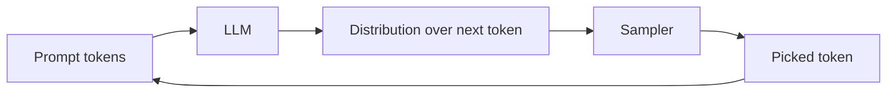

# Part 1: Foundations of LLM Systems

*Just enough about how LLMs work to make every decision later make sense.*

> **In one line:** An LLM is a function that takes a sequence of tokens in and produces a probability distribution over the next token out. Everything else — chat, RAG, agents, multimodal — is layered on top of that one primitive.

:::tip[In plain English]
You don't need a PhD to build LLM apps. You need a working mental model of: what a token is, what a context window is, how the model decides what to say next, and what new patterns (retrieval, tool use, agents) exist on top of that core. This chapter gives you exactly that — no calculus, no PyTorch.
:::

## Why "foundations" matters even if you just want to ship

You can write your first LLM app in ten lines of code without understanding any of this. You can't ship a *good* one. Almost every production decision — what model to pick, how to control cost, why outputs are slow, why outputs are wrong, when RAG helps and when it doesn't, when to reach for an agent and when not to — is downstream of a foundational concept. Engineers who skip this chapter spend the next year confused about the same five things on a loop.

## The mental model

An LLM is a **stochastic, next-token function**:

- Input: a sequence of tokens (your prompt).
- Output: a probability distribution over what the next token should be.
- The sampler picks one token, appends it, and the model runs again — until a stop condition.

That's it. The rest is engineering:

- **Streaming** is delivering those tokens to the client as they're produced.
- **Structured output** is constraining the sampler so the result parses as JSON or matches a schema.
- **Tool calling** is the model emitting a structured "I want to call function X with these arguments" instead of plain text.
- **RAG** is stuffing relevant documents into the prompt before generation.
- **Agents** are running the model in a loop and feeding tool results back in.

Every "magical" AI product is one or more of these patterns assembled carefully.

Read that loop until it feels boring. Every concept in this chapter is some way of feeding that loop better data, harvesting its output more usefully, or chaining several passes through it.

## How this chapter is organized

Each page focuses on a single concept. Read in order the first time.

### The model
1. [Tokens](./tokens.md) — The unit of LLM input and output.
2. [Tokenizers](./tokenizers.md) — BPE, SentencePiece, and why the same string is 100 tokens for one model and 130 for another.
3. [Embeddings](./embeddings.md) — Vectors that capture meaning.
4. [The transformer](./transformer.md) — Just enough architecture to be useful.
5. [Training vs. inference](./training-vs-inference.md) — Why one is rare and the other is your daily reality.
6. [Reasoning models](./reasoning-models.md) — o1/o3, extended thinking, R1; when "thinking" beats more context.
7. [Model families](./model-families.md) — Frontier vs workhorse vs small; closed vs open; reasoning vs base.

### Using the API
8. [Messages: system, user, assistant](./messages.md) — How you actually call an LLM.
9. [Prompting — the craft](./prompting-craft.md) — Chain-of-thought, few-shot, ReAct, self-consistency, prompt chaining — the named techniques.
10. [Context windows](./context-window.md) — The hard limit on what fits in one call.
11. [Prompt caching](./prompt-caching.md) — Reusing KV cache across calls for 5–10× cost savings.
12. [Sampling: temperature, top_p, top_k](./sampling.md) — How the next token is picked.
13. [Streaming](./streaming.md) — Delivering tokens as they're generated.
14. [Structured output](./structured-output.md) — Forcing JSON or schema-conformant responses.
15. [Tool use / function calling](./tool-use.md) — Letting the model invoke your code.
16. [Function calling, deep](./function-calling-deep.md) — Parallel tools, forced choice, streaming partial JSON.
17. [MCP — Model Context Protocol](./mcp.md) — The open protocol for connecting LLM clients to tool servers, resources, and prompts.
18. [Multimodal inputs](./multimodal-inputs.md) — Vision, audio, document inputs.

### Retrieval & memory
19. [Vector search](./vector-search.md) — Finding semantically similar text.
20. [Hybrid search](./hybrid-search.md) — BM25 + vector; what each catches that the other misses.
21. [Chunking strategies](./chunking-strategies.md) — The biggest single lever on RAG quality.
22. [Reranking](./reranking.md) — The cheap-retrieval → expensive-rerank pattern.
23. [RAG basics](./rag-basics.md) — Retrieval-Augmented Generation, end to end.
24. [Memory](./memory.md) — Giving an assistant continuity across conversations.

### Agents
25. [The agent loop](./agent-loop.md) — Tool → observation → next tool → done.
26. [Planning and reflection](./planning-and-reflection.md) — Explicit plan-act-reflect; when reflection helps.
27. [Multi-agent systems](./multi-agent.md) — When (and when not) to add a second agent.
28. [Computer use & browser agents](./computer-use.md) — Vision-loop agents that operate any UI.

### Checkpoint
29. [Foundations checkpoint](./foundations-checkpoint.md) — A self-test before moving on.

### Appendix
- [Math primer](./math-primer.md) — Optional 1-page intuition for embeddings, softmax, attention, and gradient descent.

---

:::note[Where this leads]
Foundations is the *vocabulary*. Everything after it builds on these primitives: you'll learn the project [lifecycle](/docs/lifecycle) and [tech stack](/docs/stack), then the disciplines that separate a demo from a product — [evaluation](/docs/evaluation) and [responsible & safe AI](/docs/safety) — then specializations like [fine-tuning](/docs/fine-tuning) and [multimodal & voice](/docs/multimodal), the [workflows](/docs/solo) at every team scale, and finally [decisions](/docs/decisions), [career](/docs/career), and real [case studies](/docs/case-studies). Read in order and you go from "what's a token?" to job-ready.
:::

When you finish this chapter, move on to [Chapter 2: Roadmap](/docs/roadmap).
