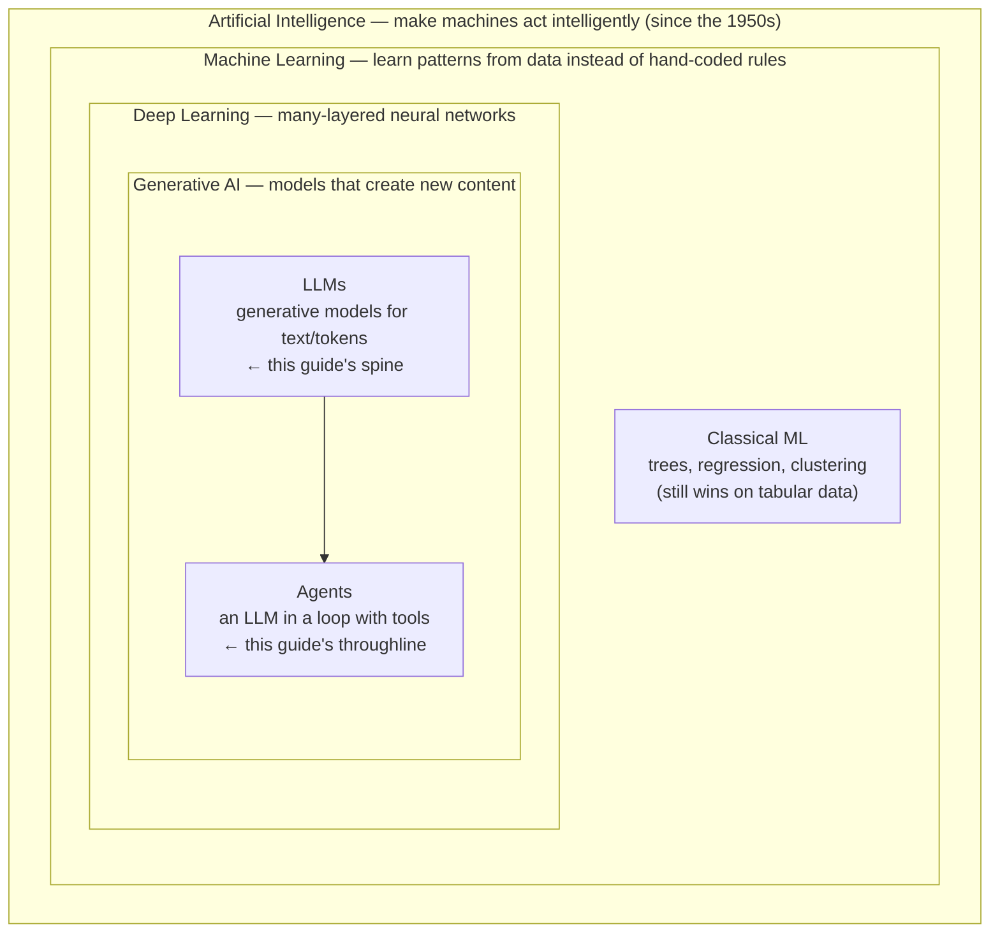

# The map of AI: where LLMs fit

> **In one line:** "AI" is a set of nested ideas — artificial intelligence contains machine learning, which contains deep learning, which contains generative AI, of which **large language models (LLMs)** are the text branch — and **agents** are LLMs wired into a loop with tools. This guide teaches the LLM + agent slice, because that's where most of the useful 2026 work is.

:::tip[In plain English]
"AI" has been a moving target since the 1950s — it has meant chess programs, spam filters, recommendation feeds, and self-driving cars at different times. Today, when most people say "AI," they mean one recent breakthrough: large language models like the one behind ChatGPT. That's a *branch* of a much older tree, not the whole tree. This page draws the tree once, so that every later lesson — tokens, embeddings, agents — has a place you can point to and say "I am *here*."
:::

## The nested map

Each ring below is *contained in* the one outside it. Bigger ring = broader, older idea; inner ring = newer, more specific.

Reading it from the outside in:

- **Artificial Intelligence (AI)** — any technique that makes a machine do something that *seems* to need intelligence. The umbrella. Includes old rule-based "expert systems," search and planning algorithms, robotics, and everything below.
- **Machine Learning (ML)** — systems that **learn patterns from data** rather than being explicitly programmed. The shift that made modern AI work. ML learns in three ways:
  - **Supervised** — learn from *labeled* examples ("this email is spam, that one isn't"). Most classical ML, and the instruction-tuning step of an LLM.
  - **Unsupervised** — find structure in *unlabeled* data (clustering customers, or the [embeddings](./embeddings.md) you'll meet soon).
  - **Reinforcement learning (RL)** — learn by *trial and error* against a reward signal (game-playing AIs — and the RLHF that aligns LLMs to human preferences).
- **Deep Learning** — ML built on many-layered [neural networks](./neural-networks.md). What made vision, speech, and language suddenly work in the 2010s.
- **Generative AI** — deep-learning models that **produce new content** (text, images, audio, video) instead of only labeling or scoring existing data. The two big families are **diffusion models** (images/video) and **LLMs** (text).
- **LLMs** — generative models that work over **tokens** of text; the [transformer](./transformer.md) is their architecture. This is the guide's spine.
- **Agents** — an LLM run in a loop with tools and memory so it can **take actions**, not just talk. The guide's throughline.

## Where classical AI/ML still wins

Generative AI did not delete the rest of the map. For huge classes of problems, an older, smaller, cheaper model is still the right answer:

- **Tabular prediction** (fraud, churn, credit scoring) — gradient-boosted trees beat LLMs on structured data and are thousands of times cheaper per call.
- **Recommendations at scale** — collaborative filtering still carries the steady state; LLMs mostly help with cold-start.
- **Structured lookups** — a SQL `SELECT` or a regex is faster, deterministic, and auditable.

Knowing the map is what lets you say "this is a gradient-boosting problem, not an LLM problem." The full treatment lives in [When *not* to use AI](/docs/decisions/when-not-to-use-ai).

## What this guide covers (and what it doesn't)

This is a guide to the **LLM + agent slice** of AI and the **engineering** around it — building, evaluating, shipping, and operating LLM-powered and agentic systems. It teaches the deep-learning ideas you need to use these models well (next: [neural networks](./neural-networks.md)), but it is **not** a course in training classical ML models, computer vision from scratch, or robotics. Those are their own fields; this page is your pointer to where they sit on the map so the boundary is honest.

## Why it matters

- **Orientation.** Every later lesson is a zoom-in on the inner rings. When something feels abstract, come back here and locate it.
- **Vocabulary.** "Deep learning," "generative AI," and "LLM" are not synonyms — they're nested. Using them precisely marks you as someone who understands the field, not just the hype.
- **Judgment.** The single most valuable habit is recognizing when a problem belongs to an *outer* ring (a rule, a query, a classical model) rather than reaching for the newest, biggest tool by reflex.

## Common pitfalls

:::caution[Where beginners trip]
- **Thinking "AI = LLMs."** LLMs are one branch of one sub-field. The umbrella is far older and wider.
- **Believing generative AI replaced classical ML.** It didn't — for tabular and structured-data problems, classical ML still wins on cost, speed, and accuracy.
- **Confusing the training with the model you call.** Building an LLM (deep learning at huge scale) happens once at a lab; your daily work is *calling* the finished model. See [training vs. inference](./training-vs-inference.md).
- **Skipping the map because you "just want to build."** Without it, you'll reach for an LLM on problems a regex would solve, and you'll mix up paradigms when reading docs and papers.
:::

<Quiz id="map-of-ai-quick-check" variant="micro" title="Quick check">

<Question
  prompt="Which statement correctly describes how these terms relate?"
  options={[
    { text: "AI, machine learning, and LLMs are three separate, unrelated fields" },
    { text: "LLMs contain deep learning, which contains machine learning, which contains AI" },
    { text: "AI contains machine learning, which contains deep learning, which contains generative AI and LLMs" },
    { text: "Generative AI is the broadest term and AI is a specific kind of it" }
  ]}
  correct={2}
  explanation="The terms are nested from broad to specific: Artificial Intelligence is the umbrella; machine learning is the data-driven subset of it; deep learning (many-layered neural networks) is a subset of ML; generative AI is the content-producing subset of deep learning; and LLMs are the text branch of generative AI. Getting the nesting right is what keeps you from using the words as interchangeable buzzwords."
/>

<Question
  prompt="You need to flag fraudulent transactions from structured payment data at massive scale. What does the map suggest?"
  options={[
    { text: "Always use the largest frontier LLM — it's the most capable AI" },
    { text: "A classical ML model (e.g. gradient-boosted trees) likely beats an LLM on cost, speed, and accuracy here" },
    { text: "Use a generative image model since fraud is a visual pattern" },
    { text: "This isn't an AI problem at all and must be hand-coded rules" }
  ]}
  correct={1}
  explanation="Fraud detection on tabular, structured data is the classic home turf of classical ML — gradient-boosted trees are accurate, fast, and thousands of times cheaper per decision than an LLM call. The point of the map is exactly this judgment: recognizing that a problem belongs to an outer ring rather than reflexively reaching for the newest, biggest generative model."
/>

<Question
  prompt="Which is an example of the 'reinforcement learning' paradigm as described here?"
  options={[
    { text: "Learning to classify spam from a labeled inbox" },
    { text: "Clustering customers into segments from unlabeled data" },
    { text: "Aligning an LLM to human preferences via RLHF — learning from a reward signal" },
    { text: "Storing documents in a vector database for retrieval" }
  ]}
  correct={2}
  explanation="Reinforcement learning means learning by trial and error against a reward, and RLHF (reinforcement learning from human feedback) is the headline example in LLMs — it nudges the model toward responses humans prefer. Labeled spam is supervised learning; clustering is unsupervised; storing vectors for retrieval isn't a learning paradigm at all."
/>

</Quiz>

---

→ Next: [Before you start: the programming you need](./programming-basics.md) — the small coding bar this guide assumes.
