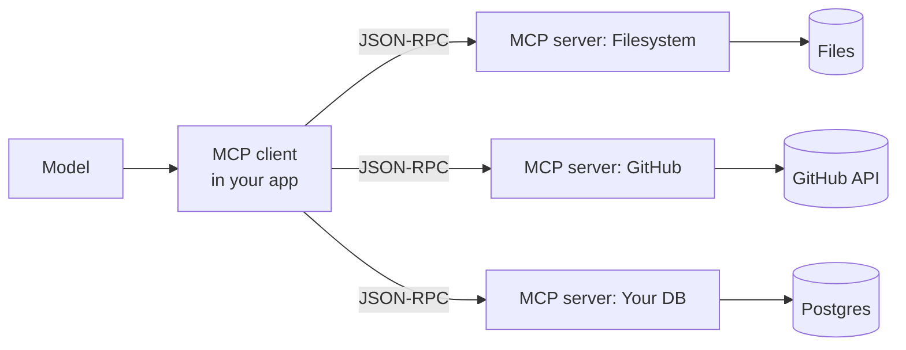

# MCP — the Model Context Protocol

> **In one line:** MCP is an open protocol (introduced by Anthropic, late 2024) that standardizes how an LLM client discovers and calls tools, reads resources, and pulls prompts from a remote process — so the same "weather server" or "GitHub server" works in Claude Desktop, Cursor, VS Code, ChatGPT, and your own app, without rewriting glue.

:::tip[In plain English]
Before MCP, every app shipped its own bespoke way to register tools: a JSON in your prompt, a Python decorator, a YAML in a framework. Five clients, five integration jobs. MCP is the USB-C of that world — write the tool **once** as an MCP server, and any MCP-aware client can use it. By mid-2026, "is there an MCP server for X?" is the first question before writing tool glue.
:::

## What MCP actually is

A small JSON-RPC protocol between two processes:

- **MCP server** — a process that exposes *tools* (functions the model can call), *resources* (read-only data — files, DB rows, URLs), and *prompts* (reusable prompt templates).
- **MCP client** — embedded in the host app (Claude Desktop, Cursor, your agent). It speaks the protocol, surfaces what the server offers to the model, and proxies calls.

The transport is one of: **stdio** (local subprocess — fastest, simplest), **HTTP+SSE** (remote — most flexible), or **streamable HTTP** (the 2025 spec update that replaces SSE for new servers).



The model never speaks MCP. The *client* speaks MCP and translates what the server exposes into tool definitions the model already understands (function-calling JSON schema, same shape as [Tool use](./tool-use.md)).

## The three primitives

### Tools

Same idea as function-calling: name, description, JSON-schema parameters, a result. The server registers a list; the client surfaces them; the model emits a tool call; the client forwards it to the server; the server returns a result.

```jsonc
// Server advertises
{
  "name": "search_repo",
  "description": "Search the current GitHub repo by keyword.",
  "inputSchema": {
    "type": "object",
    "properties": { "query": { "type": "string" } },
    "required": ["query"]
  }
}
```

### Resources

Read-only data the host can pull into context. A filesystem server exposes files as resources (`file:///path`). A database server exposes query results. A GitHub server exposes issues, PRs, files. The model doesn't *call* a resource — the host fetches it (often based on the user's click in the UI) and pastes it into the conversation.

This is the under-discussed half of MCP. It's how the protocol handles "give the model this file" without making every paste a tool call.

### Prompts

Server-defined prompt templates the user can invoke by name (e.g., `/review-pr` in Claude Desktop pulls a template from the GitHub MCP server). The model never sees the template directly; the host fills it in and sends the result.

## Why this matters in 2026

1. **Tool ecosystems compound.** Once a vendor ships an MCP server, every MCP client gets the integration "for free." By mid-2026 there are 1000+ public MCP servers — filesystem, GitHub, Slack, Linear, Postgres, every major SaaS, and a long tail of internal ones at enterprises.
2. **Less framework lock-in.** You're no longer choosing "the LangChain integration" vs "the LlamaIndex integration." You're choosing whether your client speaks MCP.
3. **Inside-the-firewall reuse.** Enterprise teams stand up internal MCP servers (your CRM, your data lake, your runbook system) and any AI tool an employee uses can plug in with the same auth model.
4. **Distinction from function-calling, sharpened.** Function-calling is the *protocol between the model and its host*. MCP is the *protocol between the host and external tool processes*. Both exist; MCP composes on top.

## Worked example: a minimal MCP server (Python)

```python
# pip install mcp
from mcp.server.fastmcp import FastMCP

mcp = FastMCP("weather-server")

@mcp.tool()
def get_weather(city: str) -> dict:
    """Get current weather for a city."""
    # pretend to hit a real API
    return {"city": city, "temp_c": 22, "condition": "sunny"}

@mcp.resource("weather://history/{city}")
def history(city: str) -> str:
    """Last 7 days of weather for a city, as CSV."""
    return "date,temp_c\n2026-05-19,20\n..."

if __name__ == "__main__":
    mcp.run()  # stdio transport by default
```

Run it. Point Claude Desktop's config at the script. Claude now has a `get_weather` tool and can fetch `weather://history/Tokyo` as a resource. Same server works in Cursor, in your own agent, anywhere with an MCP client.

## Where MCP fits relative to other concepts

| Concept | What it does | Layer |
|---|---|---|
| Function-calling (JSON tool calls) | Model emits structured tool requests | Model ↔ host |
| MCP | Host discovers/calls remote tool processes | Host ↔ external server |
| Agent loop | Run model + tools in a loop until done | Orchestration |
| RAG | Retrieve documents into prompt | Data plane |

MCP doesn't replace function-calling — it *feeds* function-calling. Tools surfaced by an MCP server become tool entries in the model's tool list, called via the normal function-calling mechanism.

## When to write your own MCP server

- You have an internal system (DB, CRM, runbook) that you want Claude Code, Cursor, *and* your own agents to use without writing three integrations.
- You're a vendor and want your product accessible from every AI tool — ship an MCP server alongside your REST API.
- You're consolidating tool definitions across multiple internal agents. Write once, mount everywhere.

When *not* to: a one-off tool used only inside one app. Native function-calling is shorter.

## Auth, the awkward part

MCP didn't ship with a strong auth story; the 2025 spec update (OAuth 2.1 for HTTP transports) closed most of the gap. In practice:

- **Local stdio servers** inherit the user's machine credentials (env vars, keychain). Fine for desktop dev.
- **Remote HTTP servers** must do OAuth (the 2025+ pattern) or accept bearer tokens. Token scoping is the server's job, not the client's.
- **Don't let the LLM be the auth boundary.** Same rule as anywhere — authorization runs in the MCP server's code, not in the prompt.

See [Safety & privacy](../10-patterns/11-safety-privacy.md) for the threat model around tool-using agents.

## What beginners get wrong

:::caution[Common mistakes]
- **Treating MCP as a framework.** It's a protocol. The framework (FastMCP, the Anthropic SDK, the TypeScript SDK) is your choice; the wire format isn't.
- **Confusing MCP with function-calling.** Function-calling is how the *model* asks to run a tool. MCP is how your *host* connects to *external* tool processes. Both exist in the same request.
- **Building an MCP server when a single in-process function would do.** MCP earns its weight when there's reuse across hosts. For one app, one tool, just register a function.
- **Skipping auth on remote servers.** A public HTTP MCP server with no auth is an open RPC endpoint to your data. Always OAuth or scoped tokens.
- **Stuffing 100+ tools into one server.** Same tool-selection-degradation problem as native function-calling — the model picks worse past ~30 tools. Split into multiple servers and let the host expose the right subset.
- **Assuming all clients support all primitives.** As of 2026 every major client supports tools; resource and prompt support varies. Check before relying on the fancier primitives.
:::

:::info[Highlight: the protocol that became the integration standard]
The MCP bet was "if the protocol is open and the reference SDKs are good, the tool ecosystem will compound." Within 18 months that bet paid off — every major AI IDE, every frontier-lab desktop app, and most agent frameworks shipped MCP support. By 2026, "we expose an MCP server" is on enterprise AI vendors' websites next to "we have a REST API."
:::

## What MCP does NOT solve

- **Quality of tool descriptions.** Bad description → bad selection, same as native function-calling.
- **Long-running tools.** MCP calls are synchronous request/response. For multi-minute jobs, return a job ID and poll.
- **Streaming tool output.** Partially supported via streamable HTTP, but not universal across clients yet.
- **Cost.** Tool calls still hit your LLM and your downstream APIs. MCP saves integration time, not runtime money.

---

→ Next: [Multimodal inputs](./multimodal-inputs.md)
