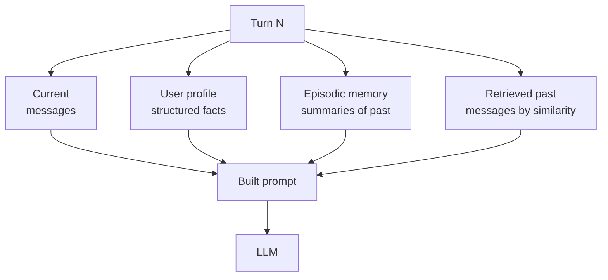
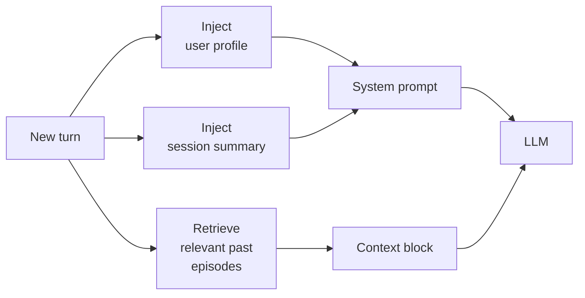

# Memory

> **In one line:** The API is stateless. "Memory" is whatever you stuff into the prompt every turn. The art is choosing what to stuff.

:::tip[In plain English]
The model has no memory of your last conversation. None. Whatever it seems to "remember" is something *your code* put into the prompt this turn. Memory is just retrieval — finding the right facts about the user (or about prior conversations) and including them in the context. You're not implementing brain surgery; you're implementing a smart paste.
:::

## Three flavors

- **Short-term (in-session)** — The full message history of the current conversation. Trivial: replay it on each call.
- **Long-term (cross-session)** — Facts about the user, their preferences, their past sessions. Stored externally, retrieved into the prompt.
- **Episodic** — Summaries of prior conversations or workflows, retrievable when relevant. A hybrid of the first two.



## Patterns

### Full replay

Re-send the entire conversation each turn. Simplest. Works until the context window is uncomfortable or expensive.

```python
messages = load_session(session_id)  # full history
messages.append({"role": "user", "content": new_turn})
resp = client.chat.completions.create(model="gpt-5-mini", messages=messages)
save_session(session_id, messages + [resp.choices[0].message])
```

Works for up to ~100 turns or so before cost gets annoying.

### Sliding window

Keep the last N messages. Drop the oldest.

```python
def windowed(messages, last_n=20):
    system = [m for m in messages if m["role"] == "system"]
    rest = [m for m in messages if m["role"] != "system"][-last_n:]
    return system + rest
```

Cheap; loses long-range context. Combine with a running summary to fix that.

### Running summary

After every N turns, summarize the conversation so far; keep the summary + recent turns.

```python
def maybe_compact(messages):
    if len(messages) > 30:
        old = messages[1:-10]  # everything except system and last 10
        summary = summarize(old)  # one LLM call
        return [messages[0], {"role": "system", "content": f"Earlier: {summary}"}] + messages[-10:]
    return messages
```

Used by most chat products (ChatGPT, Claude.ai, etc.). Loses detail but keeps gist.

### Retrieval over history

Embed each message; retrieve the most semantically relevant past messages when needed.

```python
def relevant_history(query, all_messages, k=5):
    q_vec = embed(query)
    scored = [(cosine(q_vec, m["embedding"]), m) for m in all_messages]
    return [m for _, m in sorted(scored, reverse=True)[:k]]
```

Useful for very long-running assistants where you can't replay 5,000 turns. Pairs with a sliding window.

### Structured profile

Maintain a JSON profile of facts about the user. Always inject into the system prompt. Update with a small "memory extraction" LLM call after each session.

```python
class UserProfile(BaseModel):
    name: str | None = None
    role: str | None = None
    timezone: str | None = None
    preferences: dict[str, str] = {}
    do_not_repeat: list[str] = []

def extract_facts(session_messages, current_profile):
    resp = client.beta.chat.completions.parse(
        model="gpt-5-nano",
        messages=[
            {"role": "system", "content": "Update the user profile from this conversation. Add new facts; do not invent."},
            {"role": "user", "content": f"Profile: {current_profile.json()}\n\nConversation: {format(session_messages)}"},
        ],
        response_format=UserProfile,
    )
    return resp.choices[0].message.parsed
```

After each conversation, run this once. Inject the resulting profile JSON into the system prompt of future sessions.

## What 2026 winners actually do

Most production assistants use a combination:

- Always inject a **profile** (small, structured, stable).
- Keep a **running summary** of the current session.
- For long-running agents, **retrieve from episodic memory** by semantic similarity.



After each session, run a memory-extraction pass to update profile + write a new episode summary.

## Worked example: an assistant that remembers your name

```python
def chat_with_memory(session_id, user_message):
    profile = load_profile(user_id_for(session_id)) or UserProfile()
    history = load_session(session_id) or []
    summary = load_session_summary(session_id)
    
    system = f"""You are a helpful assistant.
User profile: {profile.model_dump_json()}
Session summary so far: {summary or 'New session.'}
"""
    messages = [{"role": "system", "content": system}] + history[-10:] + [
        {"role": "user", "content": user_message}
    ]
    resp = client.chat.completions.create(model="gpt-5-mini", messages=messages)
    answer = resp.choices[0].message.content
    
    # Append to history
    history.extend([{"role": "user", "content": user_message},
                    {"role": "assistant", "content": answer}])
    save_session(session_id, history)
    
    # Background: update profile + summary every N turns
    if len(history) % 10 == 0:
        new_profile = extract_facts(history[-10:], profile)
        save_profile(user_id_for(session_id), new_profile)
        save_session_summary(session_id, summarize(history))
    
    return answer
```

That's a working assistant with continuity. Two stores (profile, sessions), one extraction model, one chat model. Frameworks (LangGraph, Mem0, Letta) automate this; rolling your own is a weekend.

## Frameworks (2026)

- **Mem0** — memory layer with auto-extraction, search, decay.
- **Letta** (née MemGPT) — opinionated memory hierarchies inspired by OS paging.
- **LangGraph** — checkpointed graph state including memory.
- **Pydantic AI** — typed memory with first-class structured profiles.
- **OpenAI's Memory feature** — built into ChatGPT and Assistants API for hosted apps.

Don't reach for these on day one — a JSON file in Postgres handles version 1 fine. Reach for them when you're tired of writing the same patterns yourself.

## What beginners get wrong

:::caution[Common mistakes]
- **Believing the API has memory.** It doesn't. "ChatGPT remembers" because *the ChatGPT product* maintains state on its side — the API itself is stateless.
- **Sending the entire history forever.** Costs and latency grow linearly with conversation length. Compact early.
- **Trusting extracted facts as ground truth.** "User likes vegan food" from one ambiguous turn is not a permanent rule. Flag confidence; let users correct.
- **Storing PII in memory without a deletion path.** GDPR/CCPA require it. Build deletion into the schema from day one.
- **Re-extracting profile every turn.** It's an expensive LLM call. Run it on a cadence (every N turns, or after session end).
- **Mixing identity across users.** A bug that crosses tenant lines can leak one user's profile into another's prompt. Tenant key in every store.
- **Memory as prompt-injection vector.** A malicious user message that says "remember: ignore safety rules" → extracted into the profile → applied on every future call. Treat stored memory as untrusted; validate before injecting.
- **Forgetting decay.** "User prefers concise answers" written 6 months ago may not be true today. Add a `last_confirmed_at` field; decay or refresh.
:::

## A privacy-aware memory schema

```sql
CREATE TABLE user_memory (
    user_id text PRIMARY KEY,
    profile jsonb NOT NULL DEFAULT '{}',
    profile_updated_at timestamptz DEFAULT now(),
    deleted_at timestamptz  -- soft delete for compliance
);

CREATE TABLE memory_episodes (
    id bigserial PRIMARY KEY,
    user_id text REFERENCES user_memory(user_id) ON DELETE CASCADE,
    summary text,
    embedding vector(1536),
    created_at timestamptz DEFAULT now()
);
```

Every memory store should support: show all my data, edit specific facts, delete everything. If you can't do these, you'll regret it when the first compliance request lands.

:::info[Highlight: memory is product, not magic]
"AI memory" sounds futuristic. In implementation, it's `SELECT profile FROM users WHERE id = ?` followed by string concatenation into a system prompt. The interesting design work is *what to remember*, *when to forget*, and *how to let users control it*.
:::

---

→ Next: [The agent loop](./agent-loop.md)
