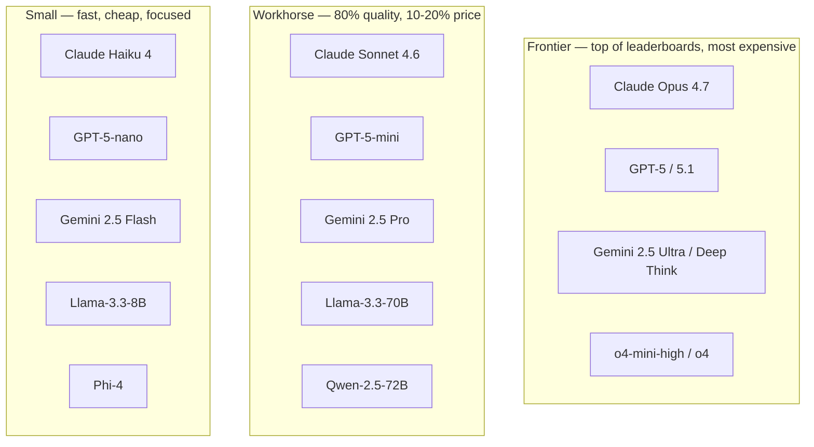
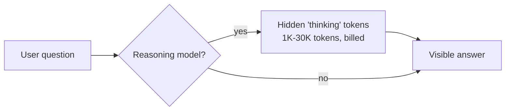

# Model families

> **In one line:** Models cluster into three tiers (frontier / workhorse / small), two licensing camps (closed API / open weights), and two thinking modes (chat / reasoning). Picking the right cell saves you 10× on cost and 5× on latency.

:::tip[In plain English]
There isn't "the LLM." There's a whole zoo. Frontier models are Ferraris — fastest, most expensive, used when nothing cheaper works. Workhorse models are Hondas — 80% of the speed at 20% of the price, the right default. Small models are e-bikes — perfect for one specific quick trip. Closed models are SaaS; open models you can host yourself. Reasoning models *think* before they answer, at the cost of latency and dollars.
:::

## The three tiers (May 2026)

### Frontier

- **Used for:** hard reasoning, agent backbones, complex code generation, anything where you'd otherwise need a human expert.
- **Examples:** Claude Opus 4.7, GPT-5 / 5.1, Gemini 2.5 Ultra, o4 reasoning series.
- **Price:** ~$3–$15 / 1M input, $15–$75 / 1M output.
- **Latency:** 1–5 seconds time-to-first-token, often slower for reasoning models.

### Workhorse

- **Used for:** the default for most user-facing features. Chat, summarization, classification, RAG synthesis, light coding.
- **Examples:** Claude Sonnet 4.6, GPT-5-mini, Gemini 2.5 Pro, Llama-3.3-70B-instruct.
- **Price:** ~$0.3–$3 / 1M input, $1.5–$15 / 1M output.
- **Latency:** 300ms–1s TTFT, 80–200 tokens/sec.

### Small

- **Used for:** classification, extraction, routing, simple chat, heavy-volume background jobs. Distilled from a bigger model for one job.
- **Examples:** Claude Haiku 4, GPT-5-nano, Gemini 2.5 Flash / Flash-Lite, Llama-3.3-8B, Phi-4, Qwen-2.5-7B.
- **Price:** ~$0.05–$0.30 / 1M input, $0.20–$1.50 / 1M output.
- **Latency:** sub-200ms TTFT, 200–500+ tokens/sec on dedicated infra (Groq, Cerebras can hit 1000+).

## Closed vs open

- **Closed (hosted only):** OpenAI (GPT-5, o-series), Anthropic (Claude), Google (Gemini). You hit an API; you don't see the weights. Best raw quality, simplest ops, but vendor lock-in and no offline.
- **Open weights (downloadable):** Meta (Llama 3.3, Llama 4), Mistral (Mistral Large 2, Codestral), Alibaba (Qwen 2.5, 3.0), DeepSeek (V3, R1), Cohere Command, Microsoft Phi-4. You can host them yourself, fine-tune them, run them air-gapped.

In 2026 the quality gap between top open and top closed has narrowed to ~3 months on most benchmarks. The lock-in gap has not.

| Need                                  | Default                                   |
|---------------------------------------|-------------------------------------------|
| Top quality, you don't mind paying    | Closed frontier (Claude Opus, GPT-5)      |
| Data must not leave your VPC          | Open, self-hosted (Llama, Qwen, DeepSeek) |
| High volume, cheap-per-token          | Open via managed inference (Groq, Fireworks) |
| Compliance / customer demands offline | Open, self-hosted                         |
| Just shipping fast                    | Closed workhorse (Claude Sonnet, GPT-5-mini) |

## Reasoning models vs base chat models

A second axis. *Reasoning models* spend "thinking" tokens internally before answering. They're better at multi-step math, code planning, and chain-of-thought problems — at the cost of higher latency and higher cost per visible answer token.

- **Reasoning:** OpenAI o-series (o3, o4, o4-mini, o4-mini-high), Claude with extended thinking, Gemini 2.5 Deep Think, DeepSeek R1, Qwen3-Reasoner.
- **Base chat:** Claude Sonnet 4.6, GPT-5, Gemini 2.5 Pro, Llama-3.3, default mode of most workhorses.

When to reach for a reasoning model:

- Multi-step math, formal logic, theorem-y proofs.
- Code involving non-trivial planning before writing.
- Hard agentic decomposition (planner role).
- Anything where you've watched a workhorse model bluff its way through.

When NOT to:

- Latency-sensitive chat (reasoning adds 5–60 seconds).
- High-volume classification (way overkill).
- Anything a workhorse + good prompt already passes.

## Worked example: picking a model for a real task

You're building a support-ticket router that reads incoming tickets and tags them with `category` and `priority`.

- **Volume:** 50K tickets/day.
- **Latency tolerance:** seconds.
- **Quality requirement:** >95% category accuracy.

Try, in order:

1. **Small model first.** Claude Haiku 4 or GPT-5-nano with a structured-output schema. Cost: ~$1–$3/day at this volume. Run on an eval set of 200 labeled tickets.
2. **If accuracy is \&lt;95%:** try workhorse (Sonnet, GPT-5-mini). Cost: ~$10–$30/day. Usually closes the gap.
3. **If still bad:** consider fine-tuning the small model on your labeled tickets (best ROI), or only routing the *hard* cases to a workhorse with the small model as gatekeeper (cascade pattern).
4. **Frontier:** almost never the right call for this. Save it for the 5% of tickets the workhorse refuses to tag.

The 2026 default is "cheapest tier that passes evals," not "most expensive that's available."

## What beginners get wrong

:::caution[Common mistakes]
- **Always picking frontier "to be safe."** You'll burn 10× the budget for no quality win on 80% of your traffic.
- **Always picking small "to save money."** Some tasks genuinely need a workhorse; using a small model on them hurts users and you'll churn anyway.
- **Treating "open" as automatically cheaper.** A self-hosted Llama on idle H100s is the most expensive model on Earth. Cheap requires utilization.
- **Mixing reasoning models into latency-critical UX.** Users will not wait 30 seconds for a chat bubble. Use reasoning for offline or "deep research" flows only.
- **Pinning to a specific model version forever.** Models deprecate. Build your code so the model name is one environment variable away from being swapped.
- **Not running evals before switching.** "Gemini 2.5 came out, let's switch" without an eval set is how regressions ship to prod.
:::

:::info[Highlight: the cascade pattern, your single best cost lever]
Run a small model first. If its confidence (or a cheap check) says "I'm not sure," escalate to a workhorse. If the workhorse still struggles, escalate to a frontier. Most traffic stays on the small model; quality matches the frontier on the few that matter. 5–20× cost reduction is typical.
:::

---

→ Next: [Messages: system, user, assistant](./messages.md)
