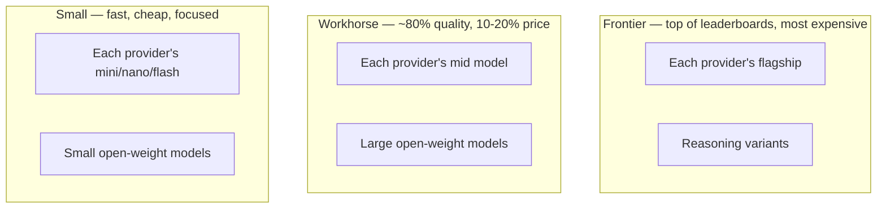
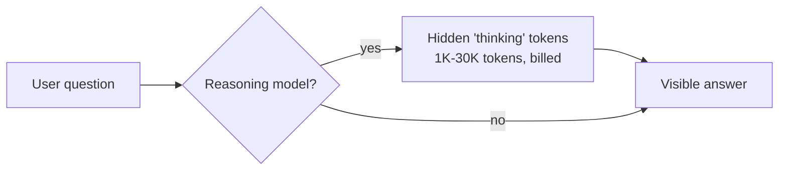

# Model families

> **In one line:** Models cluster into three tiers (frontier / workhorse / small), two licensing camps (closed API / open weights), and two thinking modes (chat / reasoning). Picking the right cell saves you 10× on cost and 5× on latency.

:::tip[In plain English]
There isn't "the LLM." There's a whole zoo. Frontier models are Ferraris — fastest, most expensive, used when nothing cheaper works. Workhorse models are Hondas — 80% of the speed at 20% of the price, the right default. Small models are e-bikes — perfect for one specific quick trip. Closed models are SaaS; open models you can host yourself. Reasoning models *think* before they answer, at the cost of latency and dollars.
:::

## The three tiers

Every major provider ships the same three-tier shape. The names rotate every few months; the
tiers don't. **Current names and per-token prices live on the
[Model snapshot](/docs/model-snapshot)** — this page teaches the durable shape.



### Frontier

- **Used for:** hard reasoning, agent backbones, complex code generation, anything where you'd otherwise need a human expert.
- **Examples:** each provider's flagship — see the [snapshot](/docs/model-snapshot) for current names.
- **Price shape:** roughly 4–10× the workhorse tier per token.
- **Latency:** 1–5 seconds time-to-first-token, often slower for reasoning models.

### Workhorse

- **Used for:** the default for most user-facing features. Chat, summarization, classification, RAG synthesis, light coding.
- **Examples:** each provider's mid-size model, plus the large open-weight instruct models.
- **Price shape:** roughly 5–10× the small tier per token.
- **Latency:** 300ms–1s TTFT, 80–200 tokens/sec.

### Small

- **Used for:** classification, extraction, routing, simple chat, heavy-volume background jobs. Distilled from a bigger model for one job.
- **Examples:** each provider's mini / nano / flash models, plus small open-weight models.
- **Price shape:** the cheapest tier — often 50–100× cheaper than frontier per token.
- **Latency:** sub-200ms TTFT, 200–500+ tokens/sec on dedicated fast-inference infra (1000+ is possible).

## Closed vs open

- **Closed (hosted only):** OpenAI, Anthropic, Google. You hit an API; you don't see the weights. Best raw quality, simplest ops, but vendor lock-in and no offline.
- **Open weights (downloadable):** Meta (Llama), Mistral, Alibaba (Qwen), DeepSeek, Cohere, Microsoft (Phi). You can host them yourself, fine-tune them, run them air-gapped.

The quality gap between top open and top closed has narrowed to a few months on most benchmarks (see the [snapshot](/docs/model-snapshot) for the current state). The lock-in gap has not.

| Need                                  | Default                                   |
|---------------------------------------|-------------------------------------------|
| Top quality, you don't mind paying    | Closed frontier                           |
| Data must not leave your VPC          | Open, self-hosted                         |
| High volume, cheap-per-token          | Open via managed inference                |
| Compliance / customer demands offline | Open, self-hosted                         |
| Just shipping fast                    | Closed workhorse                          |

## Reasoning models vs base chat models

A second axis. *Reasoning models* spend "thinking" tokens internally before answering. They're better at multi-step math, code planning, and chain-of-thought problems — at the cost of higher latency and higher cost per visible answer token.

- **Reasoning:** OpenAI's o-series, Claude with extended thinking, Gemini's Deep Think mode, and open-weight reasoners like DeepSeek R1 (current names: [snapshot](/docs/model-snapshot)).
- **Base chat:** the default mode of most workhorse and frontier models.



When to reach for a reasoning model:

- Multi-step math, formal logic, theorem-y proofs.
- Code involving non-trivial planning before writing.
- Hard agentic decomposition (planner role).
- Anything where you've watched a workhorse model bluff its way through.

When NOT to:

- Latency-sensitive chat (reasoning adds 5–60 seconds).
- High-volume classification (way overkill).
- Anything a workhorse + good prompt already passes.

## Dense vs MoE (why some huge models are cheap to run)

A third axis, and an increasingly important one. Most models are **dense**: every parameter runs for every token. A **Mixture-of-Experts (MoE)** model instead splits its layers into many "expert" sub-networks and a router sends each token through only a *few* of them. So two numbers come apart:

- **Total parameters** — how big the model is on disk and in memory (you must hold *all* experts in VRAM).
- **Active parameters** — how many actually run per token, which sets compute, latency, and cost.

```
Example MoE shape:  ~670B total params  →  ~37B active per token
You pay LATENCY/COST like a ~37B model, but need MEMORY for ~670B.
```

What that buys you:

| Property | Scales with | So MoE gives you… |
|---|---|---|
| Quality | total params | frontier-ish quality |
| Speed & cost/token | active params | workhorse-ish speed |
| VRAM to host it | total params | a big memory bill |

The net: MoE is how providers ship "frontier quality at workhorse speed." On a **hosted API this is invisible** — you just see the price and latency, and pick by tier as above. It matters the moment you **self-host**: an MoE model needs enough VRAM for *all* its experts, which is exactly where [quantization](./quantization.md) earns its keep. Open MoE families you'll see named (current specifics on the [snapshot](/docs/model-snapshot)): Mixtral, DeepSeek, and Qwen's MoE variants.

## Worked example: picking a model for a real task

You're building a support-ticket router that reads incoming tickets and tags them with `category` and `priority`.

- **Volume:** 50K tickets/day.
- **Latency tolerance:** seconds.
- **Quality requirement:** >95% category accuracy.

Try, in order:

1. **Small model first.** Any small-tier model with a structured-output schema. Cost: a few dollars a day at this volume. Run on an eval set of 200 labeled tickets.
2. **If accuracy is \&lt;95%:** try a workhorse model. Cost: roughly 10× the small tier per day. Usually closes the gap.
3. **If still bad:** consider fine-tuning the small model on your labeled tickets (best ROI), or only routing the *hard* cases to a workhorse with the small model as gatekeeper (cascade pattern).
4. **Frontier:** almost never the right call for this. Save it for the 5% of tickets the workhorse refuses to tag.

The default is "cheapest tier that passes evals," not "most expensive that's available."

## What beginners get wrong

:::caution[Common mistakes]
- **Always picking frontier "to be safe."** You'll burn 10× the budget for no quality win on 80% of your traffic.
- **Always picking small "to save money."** Some tasks genuinely need a workhorse; using a small model on them hurts users and you'll churn anyway.
- **Treating "open" as automatically cheaper.** A self-hosted Llama on idle H100s is the most expensive model on Earth. Cheap requires utilization.
- **Mixing reasoning models into latency-critical UX.** Users will not wait 30 seconds for a chat bubble. Use reasoning for offline or "deep research" flows only.
- **Pinning to a specific model version forever.** Models deprecate. Build your code so the model name is one environment variable away from being swapped.
- **Not running evals before switching.** "The new model came out, let's switch" without an eval set is how regressions ship to prod.
:::

:::info[Highlight: the cascade pattern, your single best cost lever]
Run a small model first. If its confidence (or a cheap check) says "I'm not sure," escalate to a workhorse. If the workhorse still struggles, escalate to a frontier. Most traffic stays on the small model; quality matches the frontier on the few that matter. 5–20× cost reduction is typical.
:::

<Quiz id="model-families-quick-check" variant="micro" title="Quick check">

<Question
  prompt="You are building a support-ticket tagger handling 50,000 tickets a day. According to this page, which model should you try first?"
  options={[
    { text: "A frontier model, to guarantee quality from day one" },
    { text: "A reasoning model, since classification requires careful thought" },
    { text: "A workhorse model, as a safe middle ground" },
    { text: "A small-tier model with structured output, measured against an eval set" }
  ]}
  correct={3}
  explanation="The default is the cheapest tier that passes your evals, not the most capable model available. For high-volume classification, a small model with a schema often hits the accuracy bar for a few dollars a day; you escalate to a workhorse only if the eval says you must. Starting at frontier 'to be safe' burns 10 times the budget with no measured quality win — and frontier is almost never right for this task."
/>

<Question
  prompt="Why does the page call a self-hosted Llama on idle H100s 'the most expensive model on Earth'?"
  options={[
    { text: "Open models carry hidden licensing fees" },
    { text: "Self-hosting requires rarer GPUs than closed providers use" },
    { text: "You pay for the GPUs whether or not they are busy — cheap self-hosting requires high utilization" },
    { text: "Open models use more tokens per request" }
  ]}
  correct={2}
  explanation="Open weights remove the per-token markup but replace it with a fixed infrastructure cost. If your GPUs sit idle, the effective cost per token skyrockets. Self-hosting wins only when volume keeps the hardware busy — which is why 'open' is not automatically 'cheaper', and why managed inference providers exist as a middle path."
/>

<Question
  prompt="What is the cascade pattern this page calls your single best cost lever?"
  options={[
    { text: "Run a small model first and escalate to bigger tiers only when it is unsure" },
    { text: "Run all three tiers in parallel and pick the best answer" },
    { text: "Start with frontier and downgrade once quality is proven" },
    { text: "Cache frontier responses and replay them from the small model" }
  ]}
  correct={0}
  explanation="The cascade routes most traffic to the cheap small model and escalates only the uncertain minority to a workhorse or frontier — typically a 5 to 20 times cost reduction while matching frontier quality on the requests that matter. Running all tiers in parallel pays for every tier on every request, which is the opposite of the goal."
/>

</Quiz>

---

→ Next: [Messages: system, user, assistant](./messages.md)
