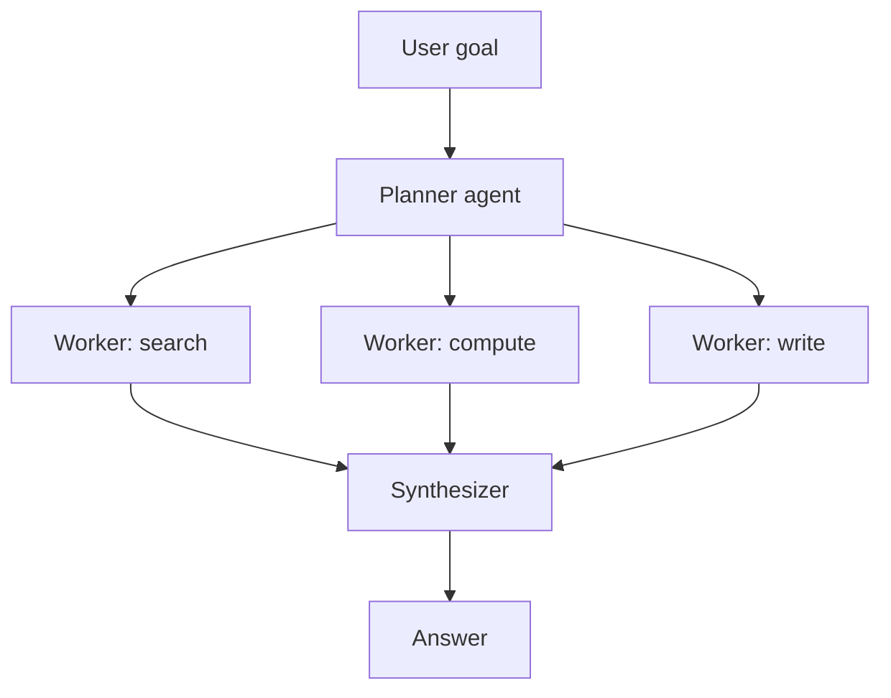
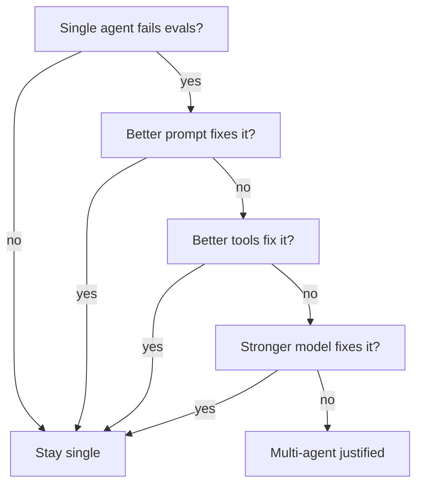

# Multi-agent systems

> **In one line:** Multi-agent = multiple LLMs with distinct roles that coordinate to solve a task. Powerful in narrow cases (planner + worker, debate, role-play simulation), wildly over-applied everywhere else.

:::tip[In plain English]
"Multi-agent" sounds futuristic but mostly means: instead of one model with tools, you have two or three models that talk to *each other* and have tools. Sometimes a clear win — a planner that hands work to specialized workers can outperform a generalist. Often a clear loss — twice the calls, twice the failure surface, no quality win. Most "multi-agent demos" should have been a chain.
:::

## When it actually helps

- **Planner + Worker** — One agent decomposes the task into steps; one or more workers execute each step. The planner reasons over the whole task; workers stay focused. Used by Devin, Cursor's agent mode, several research assistants.
- **Specialist + Generalist** — A general agent orchestrates; specialist agents handle bounded domains with custom tools and prompts. E.g., "SQL agent" + "Python agent" + "explain agent."
- **Adversarial / Debate** — Two agents argue different positions; a judge picks. Sometimes improves accuracy on hard reasoning tasks. Often slower and more expensive than just using a better single model.
- **Role-play simulation** — Multiple personas in a single conversation (writers' room, customer + agent training data generation). Mostly for research and synthetic data.
- **Cross-domain handoff** — Voice → STT → LLM → text-to-speech is technically a multi-agent pipeline. So is "classifier model → router → specialized handlers."



## When it's overkill

- **You added a second agent because the first wasn't reliable.** Fix the first one — better prompt, better tools, better evals. A second agent rarely fixes the first's quality problems; it usually doubles them.
- **The "agents" are just stages in a pipeline.** That's a chain, not multi-agent. Call it a chain.
- **You want the framework to look impressive.** Multi-agent demos are great. Multi-agent production systems are debugging nightmares.
- **The handoff structure is determined at design time.** That's a chain. Multi-agent earns its keep when *the model* decides who to call next.

## The real costs

- **Latency multiplies.** Each agent-to-agent handoff is a full LLM round trip.
- **Cost multiplies.** Same.
- **Debuggability collapses.** "Why did the final answer say X?" now requires tracing through 5 LLM calls across 3 agents.
- **Failure modes compound.** Each agent's hallucination rate compounds along the chain.
- **Prompt-injection surfaces multiply.** Each agent that consumes another agent's output is a new injection target.

## Worked example: planner + worker

```python
def planner(goal: str) -> list[str]:
    class Plan(BaseModel):
        steps: list[str]
    p = client.beta.chat.completions.parse(
        model="gpt-5",
        messages=[
            {"role": "system", "content": "Decompose into 3-6 self-contained sub-tasks."},
            {"role": "user", "content": goal},
        ],
        response_format=Plan, temperature=0,
    ).choices[0].message.parsed
    return p.steps

def worker(step: str, tools: list) -> str:
    # Run the basic agent loop on this sub-task
    return run_agent(step, tools, max_steps=5)

def synthesize(goal: str, step_results: list[str]) -> str:
    return client.chat.completions.create(
        model="gpt-5-mini",
        messages=[
            {"role": "system", "content": "Combine sub-results into a final answer."},
            {"role": "user", "content": f"Goal: {goal}\n\nSub-results:\n" + "\n\n".join(step_results)},
        ],
    ).choices[0].message.content

def multi_agent_solve(goal):
    steps = planner(goal)
    results = [worker(s, all_tools) for s in steps]
    return synthesize(goal, results)
```

Three roles. The planner only thinks; the workers only execute; the synthesizer only summarizes. Each has a tighter prompt and fewer tools than a generalist would.

Trade-off: 3+N agent calls for what *might* have been 1 agent call. Earns its keep when the planner reliably decomposes better than the generalist would have on its own.

## A reasonable rule

Use multi-agent when you have **evidence** (failing evals, latency budget allowed, clear specialization win) that a single agent with the right tools and prompt won't do the job. Otherwise: single agent with good tools.

Decision flow:



If you didn't traverse the whole flow, you're likely adding complexity before you've earned it.

## Common multi-agent patterns by name

- **Supervisor / orchestrator** — one agent calls others as tools (each sub-agent exposed as a function).
- **Sequential chain of agents** — agent A → agent B → agent C. Pipeline; arguably not "multi-agent" at all.
- **Hierarchical** — supervisor → team lead → workers. Each layer decomposes for the next.
- **Debate / consensus** — N agents answer, judge picks (or majority votes).
- **Hand-off graph** — agents can transfer control to each other based on state (OpenAI Swarm, AG2).
- **Editor + critic** — one writes, one critiques; iterate. A flavor of [reflection](./planning-and-reflection.md).

## Worked example: when multi-agent is the wrong call

Bug: "Our support bot misclassifies tickets 15% of the time."

**Tempting solution:** add a second "verifier agent" that double-checks the first.

**Better questions:**

- Is the classifier prompt clear? (often not)
- Does it see enough examples? (often not)
- Is the model right-sized? (sometimes too small)
- Is the eval set big enough to know which 15%? (almost never)

Most of the time, fixing the single classifier with a better prompt + a stronger model + a real eval beats wrapping it in a verifier. The verifier just adds latency and propagates the same errors with a "vetted" stamp on them.

## Frameworks (2026)

- **LangGraph** — graph-based orchestration with checkpointing, the most production-ready.
- **CrewAI** — role/task abstraction, popular for demos.
- **AutoGen / AG2** — Microsoft's, conversation-based agent groups.
- **OpenAI Swarm / Agents SDK** — handoff primitives, lightweight.
- **Agno / Phidata** — multi-agent + memory + RAG primitives.
- **smolagents** — Hugging Face's minimal one.

They all give you orchestration primitives, message-passing, and observability. They do *not* give you a reason to use multi-agent.

## What beginners get wrong

:::caution[Common mistakes]
- **Calling chains "multi-agent" for the resume.** Chains are great; just call them what they are.
- **Two agents with the same tools and similar prompts.** They'll behave the same. The split adds latency, not capability.
- **Letting agents talk forever.** Without a moderator or hard turn cap, two agents will happily debate "is the sky blue" for 50 turns. Cap rounds.
- **Trusting agent-to-agent messages without validation.** Agent A's output is agent B's input; treat it as untrusted text. Validate / structure it.
- **Forgetting that each agent needs its own observability.** Five agents = five trace streams. Most frameworks unify this; verify yours does.
- **Multi-agent for cost reasons.** "Cheap workers + expensive planner" is sometimes a win, but often the orchestration cost eats the savings. Measure.
- **No clear ownership.** If something goes wrong, *which agent* is at fault? Build error attribution into the system.
- **Skipping the single-agent baseline.** You can't know multi-agent helps until you compare to a careful single-agent solve.
:::

## The honest summary

In 2026, the strongest workhorse models with good tools, prompt caching, and a reranker handle 80%+ of what people reach for multi-agent to solve. The remaining 20% — true open-ended reasoning, code agents working over hours, multi-domain research — is where the multi-agent investment pays back.

If you can't articulate which agent in your system uniquely makes the result better, you don't need multi-agent yet.

:::info[Highlight: the single-agent baseline is your honest comparison]
Every multi-agent system should be measured against the same task solved by a single agent with the same tools and a careful prompt. If multi-agent doesn't win that comparison, ship the single agent.
:::

<Quiz id="multi-agent-quick-check" variant="micro" title="Quick check">

<Question
  prompt="Your single support-ticket classifier is wrong 15% of the time. A teammate proposes adding a second 'verifier agent' to double-check it. The page's take:"
  options={[
    { text: "Good idea — verification layers reliably halve error rates" },
    { text: "Fix the single classifier first — better prompt, examples, model, and a real eval; a verifier mostly adds latency and re-stamps the same errors" },
    { text: "Good idea, but only if the verifier uses the same model" },
    { text: "Replace both with a fine-tuned classifier immediately" }
  ]}
  correct={1}
  explanation="A second agent rarely fixes the first one's quality problems — it usually doubles them, since the verifier consumes the classifier's output and tends to confirm it with a 'vetted' stamp. The questions to ask first: is the prompt clear, does it see enough examples, is the model right-sized, and is the eval big enough to know WHICH 15% fails? The verifier reflex is exactly the over-application the page warns about."
/>

<Question
  prompt="Your 'multi-agent system' is three LLM stages that always run in the same fixed order, decided at design time. The page says:"
  options={[
    { text: "That's a chain, not multi-agent — multi-agent earns the name when the model decides who to call next" },
    { text: "That's a hierarchical multi-agent system" },
    { text: "That's adversarial debate" },
    { text: "Any system with more than one LLM call counts as multi-agent" }
  ]}
  correct={0}
  explanation="When the handoff structure is fixed at design time, you have a pipeline — and that's a good thing: chains are predictable and debuggable. Multi-agent earns its keep when the model dynamically decides who handles what next. The page is blunt about calling chains 'multi-agent' for the resume; the label matters because it sets expectations about complexity and failure modes."
/>

<Question
  prompt="Before shipping a multi-agent design, what comparison does the page insist on?"
  options={[
    { text: "Benchmark each individual agent against a frontier model" },
    { text: "Compare against a system with no LLM at all" },
    { text: "A/B test two different multi-agent frameworks" },
    { text: "Measure it against a single agent with the same tools and a careful prompt — if multi-agent doesn't win, ship the single agent" }
  ]}
  correct={3}
  explanation="The single-agent baseline is the honest comparison: same tools, same task, one well-prompted agent. In 2026, strong workhorse models with good tools handle 80%+ of what people reach for multi-agent to solve, so without this baseline you can't know whether the extra latency, cost, and debugging surface bought anything. If you can't articulate which agent uniquely improves the result, you don't need multi-agent yet."
/>

</Quiz>

---

→ Next: [Context engineering](./context-engineering.md)
