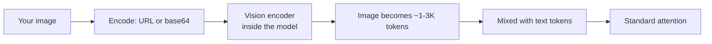

# Multimodal inputs

:::info[Dated content — June 2026]
This page names specific tools, models, and prices, which rotate quarterly. The *selection
logic* is durable; the names are a snapshot. Cross-check the
[Model snapshot](/docs/model-snapshot) for current model names and pricing.
:::


> **In one line:** Modern frontier and workhorse models accept images, audio, and PDFs alongside text. Inputs cost differently per modality, and a 1024×1024 image is typically 1K–3K tokens. Use them when the *content* is visual or auditory — not because they sound cool.

:::tip[In plain English]
A multimodal model is the same transformer underneath; it just has extra adapters that turn images, audio, or PDFs into tokens the model can attend to. From your code's perspective, you're still sending messages — some message parts are images or audio instead of text. The model sees them as more tokens.
:::

## What's actually supported (May 2026)

| Model                | Vision | PDF (native) | Audio in | Audio out | Video |
|----------------------|--------|--------------|----------|-----------|-------|
| GPT-5 / 5.1          | yes    | yes          | yes (Realtime) | yes (Realtime) | partial |
| Claude Sonnet 4.6 / Opus 4.7 | yes | yes | no (use Whisper) | no | no |
| Gemini 2.5 Pro / Ultra | yes  | yes          | yes      | yes (Live API) | yes |
| Llama 3.3 / 4 vision | yes    | via OCR      | no       | no        | no    |

Each provider's "yes" is slightly different — check before you depend on a specific behavior (max image dimensions, max PDF pages, audio sample rates).

## Vision: image URLs and base64

```python
# OpenAI / GPT-5
response = client.chat.completions.create(
    model="gpt-5",
    messages=[{
        "role": "user",
        "content": [
            {"type": "text", "text": "What's in this image? Be specific."},
            {"type": "image_url", "image_url": {"url": "https://example.com/cat.jpg"}},
        ],
    }],
)
```

For local files, base64-encode:

```python
import base64
with open("invoice.png", "rb") as f:
    b64 = base64.b64encode(f.read()).decode()

response = client.chat.completions.create(
    model="gpt-5",
    messages=[{
        "role": "user",
        "content": [
            {"type": "text", "text": "Extract line items as JSON."},
            {"type": "image_url", "image_url": {"url": f"data:image/png;base64,{b64}"}},
        ],
    }],
)
```

Anthropic uses `{"type": "image", "source": {"type": "base64", ...}}`. Gemini uses `parts: [{"inline_data": {...}}]`. SDKs paper over this.



## Image token cost

A common gotcha — images are *not* free. Typical accounting:

- **OpenAI GPT-5:** ~85 tokens base + ~170 per 512×512 tile. A 1024×1024 image ≈ ~765 tokens; a 2048×2048 ≈ ~3000+.
- **Anthropic Claude:** ~1.15 × (width × height / 750) tokens. A 1024×1024 ≈ ~1400 tokens.
- **Gemini:** 258 tokens per image for "small" mode; up to several thousand for "high resolution."

A bill spike from "we added image uploads" is almost always images costing more than expected. Resize before sending — 512×512 is plenty for most "what does this look like" questions; reserve high-res for OCR/detail tasks.

## What vision is genuinely great at

- **Document OCR + understanding** — invoices, receipts, screenshots of forms, handwritten notes. Often beats traditional OCR + LLM pipelines.
- **Chart and table extraction.**
- **UI understanding** — "click the submit button" in agentic browsers.
- **Visual QA** — accessibility descriptions, content moderation, product cataloging.
- **Code-from-screenshot** — "build this UI" from a Figma export.

What it's mediocre at (May 2026):

- **Precise spatial reasoning** ("is the red box left or right of the blue?") — improving but unreliable.
- **Counting many small objects** ("how many ants in this photo?") — usually wrong past ~10.
- **Reading tiny text** — resize and tile yourself if it matters.

## Audio inputs

Two flavors:

- **Speech-to-text first, then text LLM** — classic pipeline. Use Whisper (`whisper-1`, Whisper Large v3), Deepgram, AssemblyAI. Cheap (~$0.006/min) and reliable. Then send the transcript to any LLM.
- **Native audio-in models** — GPT-5 Realtime, Gemini Live API. Audio goes straight to the model; it can hear tone, pauses, accents, and respond with audio. Much higher cost (~$0.06+/min in 2026) but enables real conversational latency (\&lt;500ms round trip).

```python
# Classic STT
audio = open("call.mp3", "rb")
transcript = client.audio.transcriptions.create(model="whisper-1", file=audio)
print(transcript.text)

# Then a regular text LLM call
summary = client.chat.completions.create(
    model="gpt-5-mini",
    messages=[{"role": "user", "content": f"Summarize:\n{transcript.text}"}],
)
```

For the Realtime API, you stream audio chunks in via WebSocket and receive audio chunks (or text deltas) back. The model can interrupt itself if the user starts speaking. Best for voice assistants and real-time agents — way overkill for batch transcription.

## Document inputs (PDFs)

Anthropic and Gemini accept PDFs natively (no OCR preprocessing). The provider extracts text and images from each page and feeds them to the model.

```python
# Anthropic
with open("contract.pdf", "rb") as f:
    pdf_b64 = base64.standard_b64encode(f.read()).decode()

response = client.messages.create(
    model="claude-sonnet-4-5",
    max_tokens=2048,
    messages=[{
        "role": "user",
        "content": [
            {"type": "document", "source": {"type": "base64", "media_type": "application/pdf", "data": pdf_b64}},
            {"type": "text", "text": "Summarize clauses about liability."},
        ],
    }],
)
```

PDFs cost roughly *text tokens + image tokens* per page. A 30-page contract can easily be 50K+ tokens. For repeated questions on the same PDF, combine with [prompt caching](./prompt-caching.md) — first call pays; subsequent calls are 5–10× cheaper.

## Worked example: invoice extraction from a scanned image

```python
class LineItem(BaseModel):
    description: str
    qty: int
    amount: float

class Invoice(BaseModel):
    vendor: str
    total: float
    line_items: list[LineItem]

with open("scanned-invoice.jpg", "rb") as f:
    b64 = base64.b64encode(f.read()).decode()

result = client.beta.chat.completions.parse(
    model="gpt-5",
    messages=[{
        "role": "user",
        "content": [
            {"type": "text", "text": "Extract the invoice as JSON."},
            {"type": "image_url", "image_url": {"url": f"data:image/jpeg;base64,{b64}"}},
        ],
    }],
    response_format=Invoice,
)
invoice = result.choices[0].message.parsed
```

Vision + structured output = end-to-end document automation in 20 lines. This is the single most common multimodal pattern in B2B in 2026.

## What beginners get wrong

:::caution[Common mistakes]
- **Sending 4000×4000 images "for quality."** You're paying for the tiles. Downscale to what the task needs — 1024×1024 for general tasks, 2048 max for OCR.
- **Forgetting that PDFs are *image* tokens, not just text.** A scanned PDF costs more than a digital one. A 100-page PDF can blow your context window.
- **Using native audio Realtime for batch transcription.** Use Whisper. Realtime is for live conversation.
- **Assuming the model can OCR tiny text reliably.** Resize and crop the relevant region; or pre-process with a real OCR (Tesseract, Textract) and send text.
- **Embedding raw images for similarity search.** Use a real vision-embedding model (CLIP, SigLIP), not the chat API.
- **Sending PII images without thought.** Provider terms of service vary; some retain inputs for training (default off for enterprise; check). Strip metadata; consider on-prem for sensitive workloads.
- **Pasting screenshots when text would do.** A screenshot of a stack trace is 2K tokens; the text is 200. Paste the text.
:::

## Cost comparison rule of thumb

For the same "extract structured data from a document" task:

| Approach                           | Cost per doc | Quality |
|------------------------------------|--------------|---------|
| Vision LLM directly                | $$           | high    |
| OCR (Tesseract) + text LLM         | $            | medium  |
| Cloud OCR (Textract) + text LLM    | $$           | high    |
| Vision LLM + structured output     | $$           | highest |

For high-volume pipelines, benchmark all three on *your* documents. For prototyping, vision LLM with structured output is the fastest path from PDF to typed data.

:::info[Highlight: multimodal unlocked the boring-document goldmine]
80% of B2B data lives in PDFs, scans, screenshots, and Word docs nobody wants to manually re-key. Multimodal LLMs turned that pile into a queryable dataset. The unsexy invoice-extraction use case is doing more revenue in 2026 than every consumer AI startup combined.
:::

:::tip[→ Going deeper]
This page covers the *inputs*. For building real vision and voice systems — production OCR pipelines, video understanding, voice-agent latency budgets, and how to evaluate multimodal output — see [Chapter 8: Multimodal & Voice AI](/docs/multimodal), especially [vision](/docs/multimodal/mm-vision) and [voice](/docs/multimodal/mm-voice).
:::

<Quiz id="multimodal-inputs-quick-check" variant="micro" title="Quick check">

<Question
  prompt="Your API bill spiked the week after you added image uploads. The most likely cause from the page is:"
  options={[
    { text: "Full-resolution images are being tokenized into thousands of tokens each; downscaling before sending would cut the cost" },
    { text: "The vision encoder charges per pixel of generated output text" },
    { text: "Images are billed at a flat per-image fee regardless of size" },
    { text: "Enabling vision raises the price of every text token too" }
  ]}
  correct={0}
  explanation="Images become tokens, and size matters: a 2048x2048 image can cost 3000+ tokens where a 1024x1024 is around 765. The flat-fee assumption is the beginner trap — there is no flat fee, which is exactly why 'we added image uploads' bill spikes happen. Resize to what the task needs: 512x512 covers most 'what does this look like' questions; save high-res for OCR."
/>

<Question
  prompt="You need to transcribe 10,000 recorded support calls overnight. Which approach does the page recommend?"
  options={[
    { text: "Stream each call through the Realtime API for best quality" },
    { text: "Send the audio files directly to a text-only chat model" },
    { text: "Use a speech-to-text model like Whisper, then send transcripts to a text LLM" },
    { text: "Convert each call to an image of its waveform and use vision" }
  ]}
  correct={2}
  explanation="The classic STT-then-LLM pipeline costs about $0.006 per minute versus about $0.06+ for native Realtime audio — roughly 10x cheaper. Realtime's value is sub-500ms conversational latency, which is irrelevant for an overnight batch job. Using Realtime for batch transcription is a named beginner mistake on this page."
/>

<Question
  prompt="You will ask 20 different questions about the same 30-page PDF contract. What does the page suggest to control cost?"
  options={[
    { text: "Re-upload the PDF each time; providers automatically dedupe identical files for free" },
    { text: "Combine the PDF with prompt caching so calls after the first are 5 to 10 times cheaper" },
    { text: "Convert the PDF to a single low-resolution image first" },
    { text: "Split the PDF into 30 separate one-page requests" }
  ]}
  correct={1}
  explanation="A 30-page contract can easily be 50K+ tokens, and PDFs cost text tokens plus image tokens per page. Prompt caching makes the repeated PDF prefix cheap on every follow-up question. Automatic dedupe doesn't exist — without caching you pay full price all 20 times — and splitting into per-page calls destroys the cross-page context the questions need."
/>

</Quiz>

---

→ Next: [Vector search](./vector-search.md)
