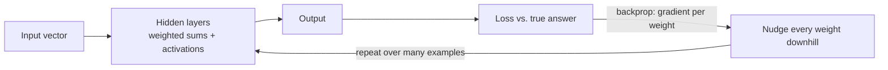

# Neural networks (the machine under every model)

> **In one line:** A neural network is a big stack of very simple steps — multiply the inputs by some numbers (weights), add them up, apply a simple bend (an activation) — repeated layer after layer; "learning" is just nudging those numbers until the outputs match real examples. Every LLM is one of these, scaled up enormously.

:::tip[In plain English]
Picture a machine covered in millions of little knobs. You feed numbers in one end, they flow through the knobs, and numbers come out the other end. At first the knobs are set randomly, so the output is nonsense. *Training* is the process of turning the knobs, a tiny bit at a time, until the machine reliably turns inputs into the right outputs — cat photos into "cat," or "The capital of France is" into "Paris." A neural network is that machine, the knobs are called **weights**, and **deep learning** just means the machine has many layers of them stacked deep. That's the whole idea; the rest of this page is the mechanics.
:::

:::note[Prerequisites]
This builds directly on [Embeddings](./embeddings.md) — a network's input is a vector of numbers, which is exactly what an embedding is. No calculus is needed; we'll explain the one calculus-flavored idea (gradients) in plain words.
:::

## Terms, defined once

- **Neuron (unit)** — the basic building block: it multiplies each input by a weight, adds them up plus a bias, and applies an activation function.
- **Weight** — a number that says how much one input matters. The thing training adjusts.
- **Bias** — a per-neuron offset added to the sum; lets a neuron shift its output up or down.
- **Activation function** — a simple non-linear bend (e.g. **ReLU**: "keep positives, zero out negatives"). Without it, stacking layers would collapse into one boring straight-line function.
- **Layer** — a row of neurons that all read the previous layer's output. **Input layer** (the data), **hidden layers** (the middle), **output layer** (the answer).
- **Deep** — "deep learning" just means *many* hidden layers.
- **Parameters** — all the weights and biases together. "A 70B model" = 70 billion of these numbers.
- **Forward pass** — running data through the network to get an output.
- **Loss** — a single number measuring how wrong the output was versus the correct answer.
- **Gradient descent / backpropagation** — the method that nudges every weight in the direction that lowers the loss.

## One neuron

A neuron takes inputs `x`, has weights `w` and a bias `b`, and computes:

```
output = activation( w₁·x₁ + w₂·x₂ + … + b )
```

That's it — a weighted sum, then a bend. Stack many neurons side by side and you get a **layer**; stack layers and you get a **network**. Depth is what lets early layers detect simple patterns and later layers combine them into complex ones (edges → shapes → faces; letters → words → meaning).

## Worked example: one full forward pass

Let's trace a tiny network with **2 inputs → 2 hidden neurons → 1 output**, using ReLU in the hidden layer and a sigmoid at the end (sigmoid squashes any number into 0–1, handy for a probability).

Input: `x = [1, 2]`.

**Hidden neuron 1** — weights `[0.5, -0.3]`, bias `0.3`:
```
z1 = 0.5·1 + (-0.3)·2 + 0.3 = 0.5 - 0.6 + 0.3 = 0.2
ReLU(0.2) = 0.2          (positive, so it passes through)
```

**Hidden neuron 2** — weights `[0.2, 0.4]`, bias `-0.1`:
```
z2 = 0.2·1 + 0.4·2 + (-0.1) = 0.2 + 0.8 - 0.1 = 0.9
ReLU(0.9) = 0.9
```

**Output neuron** — reads `[0.2, 0.9]`, weights `[1.0, -1.0]`, bias `0.5`:
```
z = 1.0·0.2 + (-1.0)·0.9 + 0.5 = 0.2 - 0.9 + 0.5 = -0.2
sigmoid(-0.2) ≈ 0.45
```

The network's answer is **0.45** — read as "45% confident." Every number that flowed through was just *multiply, add, bend*. A frontier LLM does exactly this, except the input vector is your tokens' [embeddings](./embeddings.md), there are tens of billions of weights across ~100 layers, and the output is a probability for every possible next token.

Count the parameters in our toy network: the hidden layer has `2×2 + 2 = 6`, the output neuron has `2 + 1 = 3` — **9 parameters**. That's the same kind of number a "70B-parameter model" has 70 billion of. (And it's why [quantization](./quantization.md) — storing each of those numbers in fewer bits — saves so much memory.)

## How it learns: gradient descent, in plain words

A freshly built network has random weights, so our 0.45 is meaningless. Training fixes that with a loop over examples:

1. **Forward pass** — run an example through; get the output (e.g. 0.45).
2. **Loss** — compare it to the true answer (say the label was 1.0) and compute one number for "how wrong": here, far off.
3. **Find the slope (the gradient).** For each weight, ask: *if I nudge this weight up a hair, does the loss go up or down, and how steeply?* That direction-and-steepness is the **gradient**. **Backpropagation** is just the efficient bookkeeping that computes this for *every* weight in one backward sweep — that's the only "calculus" in the building, and you never do it by hand.
4. **Nudge.** Move each weight a small step *against* its gradient (downhill, toward lower loss). The step size is the **learning rate**.
5. **Repeat** over millions of examples, many times (each full pass over the data is an **epoch**), and the loss drops — the knobs settle into a setting that maps inputs to right outputs.

That's the entire engine behind [pre-training and fine-tuning](./training-vs-inference.md): pre-training runs this loop on trillions of tokens to set the weights from scratch; fine-tuning runs a little more of it to nudge an already-trained set.



## Why it matters

You will almost never build or train a network from scratch — but its vocabulary *is* the vocabulary of everything else in this guide:

- **"Parameters" / model size** are the count of these weights. More parameters ≈ more capacity (and more memory and cost).
- **[Training vs. inference](./training-vs-inference.md):** training = running the learning loop to set weights; inference = a forward pass with the weights frozen. That's your daily reality.
- **[Fine-tuning](/docs/fine-tuning):** a short burst of the same gradient-descent loop on your data.
- **[Quantization](./quantization.md):** storing those weights in fewer bits.
- **The [transformer](./transformer.md)** (next page) is not a different thing — it's a *specific arrangement* of these layers, with one extra trick (attention) that makes it brilliant at sequences.

## Common pitfalls

:::caution[Where beginners trip]
- **Thinking you need the calculus.** You need the *intuition* — loss measures wrongness, gradients point downhill, nudge repeatedly. Libraries (PyTorch, JAX) compute the gradients for you.
- **Confusing parameters with tokens.** Parameters are the model's fixed internal weights (set during training). Tokens are the text flowing through at inference. A 70B-parameter model still only sees a few thousand tokens per call.
- **Believing "deep learning" is separate from LLMs.** An LLM *is* a deep neural network. There's no second technology — just this one, scaled up and arranged as a transformer.
- **Assuming more layers is always better.** Past a point, extra depth adds cost and training difficulty without quality. Architecture and data quality matter more than raw depth.
- **Reading the output number as certainty.** 0.45 is the model's *learned* confidence, which can be confidently wrong — the whole reason [evals](/docs/evaluation) exist.
:::

:::info[Try it — a 15-line network, by hand]
In a notebook, recreate the worked example in NumPy: define the three weight vectors and biases as arrays, write `relu` and `sigmoid`, and reproduce the **0.45**. Then change one weight and watch the output move. For the full picture, do one learning step: pick a target of `1.0`, compute the loss `(output − target)²`, and nudge the output neuron's weights down their gradient by hand for a single step — you'll watch the output crawl from 0.45 toward 1.0. Doing this *once* by hand demystifies every training run you'll ever launch. (For a no-code version, the TensorFlow Playground lets you train a tiny net in the browser and watch the boundary form.)
:::

<Quiz id="neural-networks-quick-check" variant="micro" title="Quick check">

<Question
  prompt="What does a single neuron actually compute?"
  options={[
    { text: "It stores one token of the input text" },
    { text: "A weighted sum of its inputs plus a bias, then a simple activation function" },
    { text: "The cosine similarity between two embeddings" },
    { text: "The probability of the next token directly" }
  ]}
  correct={1}
  explanation="A neuron multiplies each input by a weight, adds them up with a bias, and applies a non-linear activation (like ReLU). That 'multiply, add, bend' is the atom of every neural network; stacking many of them into layers is what produces complex behavior. Tokens, cosine similarity, and next-token probabilities are things built on top of networks, not what one neuron does."
/>

<Question
  prompt="In one line, what is 'training' a neural network?"
  options={[
    { text: "Feeding it more tokens at inference time" },
    { text: "Adding more layers until it works" },
    { text: "Repeatedly nudging the weights downhill against the loss gradient so outputs match examples" },
    { text: "Quantizing the weights to fewer bits" }
  ]}
  correct={2}
  explanation="Training is the learning loop: forward pass → measure loss → compute the gradient (via backpropagation) → nudge every weight a small step downhill → repeat over many examples. Adding tokens is inference; adding layers is an architecture change; quantization is a storage trick applied after training. Only the nudge-the-weights loop is learning."
/>

<Question
  prompt="How does the transformer relate to a neural network?"
  options={[
    { text: "It replaces neural networks with a different technology" },
    { text: "It's a specific arrangement of neural-network layers, plus the attention mechanism" },
    { text: "It's a database of embeddings, not a network" },
    { text: "It only exists at inference time, not training time" }
  ]}
  correct={1}
  explanation="A transformer is a neural network — a particular way of stacking these layers — with one extra ingredient (attention) that makes it exceptional at sequences. 'Deep learning' and 'LLMs' aren't two technologies: an LLM is a deep neural network arranged as a transformer, trained with the same gradient-descent loop described here."
/>

</Quiz>

---

→ Next: [The transformer](./transformer.md) — a specific kind of neural network, built for sequences.
