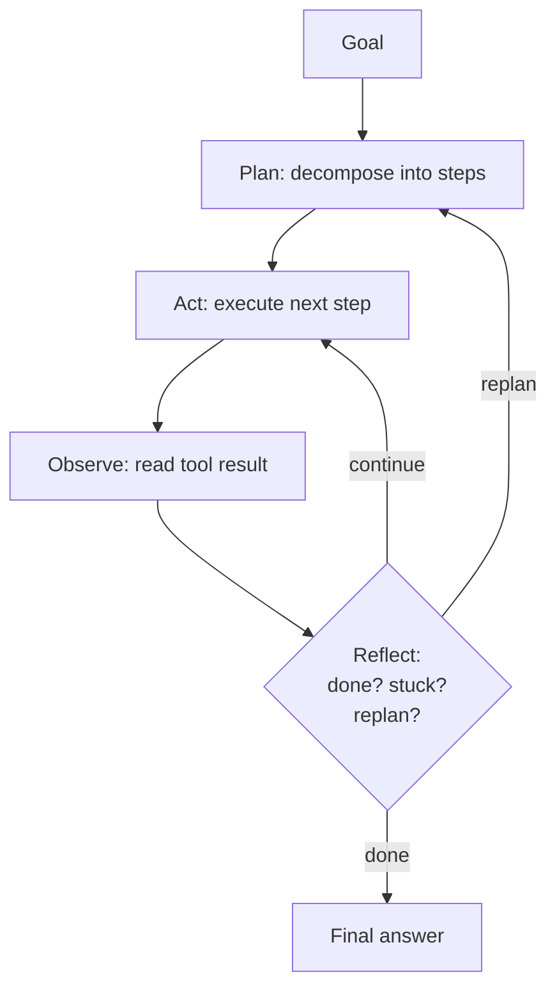
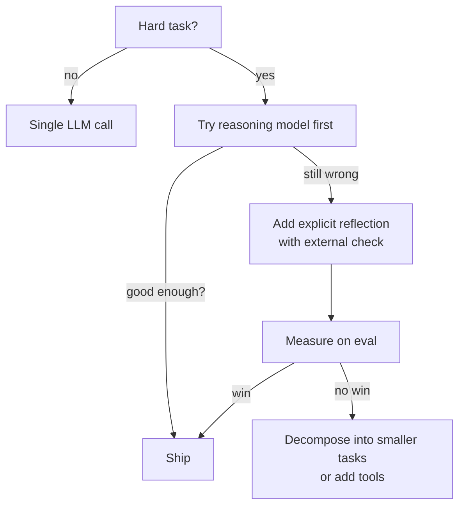

# Planning and reflection

> **In one line:** A planning step has the model write down what it's about to do *before* doing it; a reflection step has it review what just happened. Both can lift quality on hard tasks. Both are easy to ship as latency tax with no win, so measure.

:::tip[In plain English]
A basic agent looks at the goal and starts pressing buttons. A *planning* agent first writes a plan ("step 1, step 2..."). A *reflecting* agent, after each step, asks "did that work? what next?". Sometimes this is the difference between solving the problem and spinning. Sometimes it's just doubling your bill. The trick is knowing which.
:::

## Plan → Act → Observe → Reflect → Repeat



Each box is a (possibly small) LLM call. You can collapse any of them; you can collapse all of them into the basic [agent loop](./agent-loop.md). The interesting question is *which boxes earn their cost*.

## Pattern 1: Explicit plan, then execute

Have the model write a plan first, then execute against it.

```python
class Plan(BaseModel):
    steps: list[str]
    expected_outcome: str

def plan(goal):
    return client.beta.chat.completions.parse(
        model="gpt-5-mini",
        messages=[{"role": "system", "content": "Decompose the goal into 3-7 concrete steps."},
                  {"role": "user", "content": goal}],
        response_format=Plan, temperature=0,
    ).choices[0].message.parsed

def execute(goal, plan):
    messages = [
        {"role": "system", "content": f"Execute this plan step-by-step.\nPlan: {plan.json()}"},
        {"role": "user", "content": goal},
    ]
    # ... normal agent loop with tools
```

**When this helps:**

- Tasks with many possible paths where premature commitment is expensive.
- Tasks where the model often forgets a sub-goal mid-loop.
- Tasks where you want to *show the user* what's about to happen (transparency UX).

**When it doesn't:**

- Simple lookups where the model knows what to do in one step.
- Tasks where the right plan is obvious from the goal.
- Highly dynamic tasks where the plan would change after step 1 anyway.

## Pattern 2: Reflection (self-critique)

After producing an output, have the model critique it and try again.

```python
def with_reflection(generate, critique, max_revisions=2):
    draft = generate()
    for _ in range(max_revisions):
        critique_result = critique(draft)
        if critique_result.is_good_enough:
            return draft
        draft = generate(previous=draft, feedback=critique_result.feedback)
    return draft
```

**When this helps:**

- Writing tasks (essays, emails) where a second pass catches errors.
- Code where the model can run the code and see failures.
- Math/reasoning where a "check your work" pass catches arithmetic slips.

**When it doesn't:**

- Pure factual lookups (a reflection pass on "what's 2+2" is theater).
- Tasks where the model is equally confident in wrong and right answers (it'll keep affirming the wrong one).
- Latency-critical UX.

## Pattern 3: ReAct (Reason + Act, interleaved)

Yao et al.'s ReAct paper formalized it: at each step, have the model write *Thought:* then *Action:* then *Observation:* in alternation. Many "agentic" papers since are descendants.

```
Thought: I need to find the company's last earnings.
Action: search("Acme Inc Q1 2026 earnings")
Observation: Q1 revenue $87M, up 12% YoY.
Thought: I should check the analyst guidance for next quarter.
Action: search("Acme Inc Q2 2026 guidance")
...
```

In modern API agents, the "Thought" is often invisible (reasoning tokens in o-series / extended thinking) and the "Action"/"Observation" are tool calls. The pattern is the same.

## Pattern 4: Reflexion (memory of past failures)

After a failed attempt, write a *lesson* to memory. Use it as context on retry.

```python
def reflexion_attempt(goal, lessons_so_far):
    sys = f"Goal: {goal}\nLessons from previous attempts:\n{lessons_so_far}\nNow try again."
    result = agent_run(sys)
    if not result.success:
        lesson = extract_lesson(goal, result)
        return reflexion_attempt(goal, lessons_so_far + [lesson])
    return result
```

Useful for self-improving agents on the same recurring task (coding benchmarks, multi-day workflows).

## When extra steps pay off (a useful rule)

Add a planning or reflection pass when **all** of the following hold:

1. **The base agent fails on this task class >20% of the time.** Below that, you're optimizing noise.
2. **You can describe what the extra step should check.** Vague "be more careful" doesn't help.
3. **Your latency / cost budget can absorb 2–3× the calls.**

If any of those is false, skip the ceremony.

## Worked example: code-with-reflection

```python
def write_function_with_reflection(spec, tests):
    code = generate_code(spec)
    for revision in range(3):
        result = run_tests(code, tests)
        if result.all_passed:
            return code
        code = generate_code(
            spec,
            previous=code,
            feedback=f"Tests failed:\n{result.failures}",
        )
    return code  # last attempt
```

Three rounds; each round the model sees what failed and tries again. On a HumanEval-like benchmark, this lifts pass-rate from ~70% (single attempt) to ~85% (with reflection). At 3× the tokens. Worth it for offline batch; usually not worth it for interactive UX.

## Reasoning models vs explicit reflection

In 2026, reasoning models (o-series, Claude extended thinking, Gemini Deep Think) do a *lot* of internal reflection for free — they emit "thinking" tokens between turns and self-critique invisibly. For many tasks, the right answer is:

- **Default model, no extra ceremony** — fast, cheap, works for most things.
- **Reasoning model, no ceremony** — for hard reasoning; pay in tokens + latency for native chain-of-thought.
- **Default model + explicit reflection pattern** — when you need to *see* the critique or chain it into a tool.

Don't stack: a reasoning model *plus* explicit reflection is usually double-paying for the same effect.

## What beginners get wrong

:::caution[Common mistakes]
- **Adding a planning step to a task that doesn't need one.** "Look up the user's name" doesn't need a plan. You just pay 2× for nothing.
- **Trusting the plan as a contract.** Plans drift. The model may invent steps that turn out to be wrong. Re-plan when the world contradicts the plan.
- **Self-critique without a *criterion*.** "Is this good?" → "Yes!" → done. Give the critique pass a checklist or rubric.
- **Infinite revision loops.** Always cap reflection rounds. After 2–3 attempts with no improvement, stop and return.
- **Reflection that confirms wrong answers.** Models are often equally confident in correct and incorrect outputs. If reflection alone isn't catching errors, you need *external* signal — a test, a tool result, a human.
- **Showing the user every plan + reflection step.** They're noisy. Show outcomes; hide ceremony unless the user asks.
- **Using a frontier model for the planner when a workhorse would do.** Plans are short and structured; cheap models often plan fine.
- **Building reflection without an eval.** You can't tell if it helps without a held-out benchmark.
:::

## A useful decision flow



The decisions cascade: simple → reasoning model → explicit reflection → decomposition. Don't skip ahead.

## Tools > ceremony

A frequently-overlooked pattern: most of what looks like "this agent needs to plan" is actually "this agent needs better tools." A model can't reflect its way to a fact it doesn't have; give it a `lookup` tool instead. A model can't plan its way around a buggy API; fix the API.

Before adding planning ceremony, ask: *is the model missing information, or missing thinking?* If it's the former (most of the time), better tools or retrieval is cheaper and more reliable than extra LLM passes.

:::info[Highlight: extra LLM passes aren't free thinking]
Every reflection step is a real bill, real latency, and real points of failure. Treat planning and reflection as optimizations to add *after* you've measured the baseline — not as default architecture.
:::

---

→ Next: [Multi-agent systems](./multi-agent.md)
