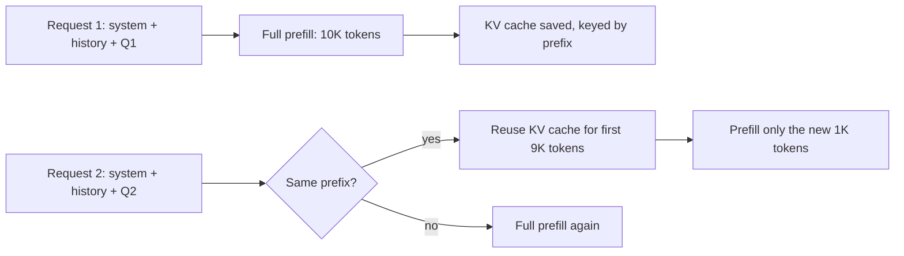
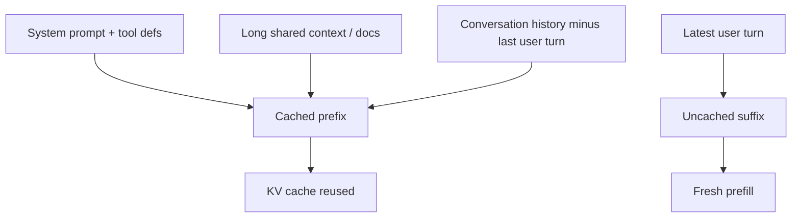

# Prompt caching

> **In one line:** If two calls share an identical prompt prefix, the provider can reuse the work it already did on that prefix — billing you a fraction of the price and serving the first token faster. Structure prompts so the stable stuff is *first* and you're done.

:::tip[In plain English]
Remember the transformer phases — prefill (process the input) then decode (generate output)? Prefill is the expensive part. Prompt caching is the provider saying "I already processed this exact prefix two minutes ago; I'll skip that work and start where it differs." You get the same answer for 10–30% of the input cost.
:::

## How it works (mechanically)

When the model processes your input tokens, it computes a **KV cache** — a giant tensor of intermediate attention state, one slice per token. Generating the next token only requires the KV cache of all previous tokens, not re-running the whole prefill.

Providers cache that KV tensor keyed by the *prefix hash*. If your next request has the *exact same first N tokens*, they reuse the cached KV state for those N tokens and only do prefill on the new tail.



The cache lives for minutes (provider-specific). A new call within the TTL hits warm cache. A new call after expiry pays full price again.

## Provider differences (May 2026)

| Provider     | How to enable                       | Cache TTL          | Cached input price          |
|--------------|-------------------------------------|--------------------|------------------------------|
| **OpenAI**   | Automatic; prefixes ≥1024 tokens   | ~5–10 min          | 50% of normal input          |
| **Anthropic**| Explicit `cache_control` breakpoints | 5 min (5-min cache) or 1 hour (extended) | 10% (5-min) / 25% (1-hour) |
| **Google Gemini** | Explicit context caching API   | configurable 1 min–24 hours | ~25% of normal input    |
| **DeepSeek / Together / etc.** | Often automatic | varies              | varies (often 10-20%)        |

Anthropic gives the deepest discount (10× on the cached portion) but requires you to mark cache boundaries explicitly. OpenAI's is automatic but only 2× off. Gemini lets you pre-create caches with a long TTL for very expensive prefixes (huge docs).

## Worked example: a chatbot with a 4K system prompt

Without caching, every turn:

```
4,000 input × $3/M = $0.012 just on system prompt
× 50K turns/day      = $600/day in system-prompt tokens alone
```

With Anthropic caching at 10% on the cached portion:

```
First turn:  4,000 × $3.75/M = $0.015 (cache write costs 25% more)
Subsequent:  4,000 × $0.30/M = $0.0012 each
50K turns/day, most cache hits: ~$60/day
```

Same model, same prompt, 10× cheaper on the system-prompt portion. Multiplied across every turn of every conversation, it's the single biggest cost lever in production chat apps.

## How to structure prompts for cache hits



**Rules:**

1. **Stable stuff first, variable stuff last.** System prompt → tool definitions → long shared context → conversation history → latest user message.
2. **Don't put a timestamp in the system prompt.** "Current date: 2026-05-23 14:30:11" makes the prefix change on every request — zero cache hits.
3. **Don't shuffle tool definitions.** Same tools in the same order every call.
4. **For Anthropic, mark cache breakpoints explicitly:** add `cache_control: {"type": "ephemeral"}` to the last block you want cached.

## Worked example: Anthropic with explicit caching

```python
from anthropic import Anthropic
client = Anthropic()

response = client.messages.create(
    model="claude-sonnet-4-5",
    max_tokens=1024,
    system=[
        {
            "type": "text",
            "text": LONG_SYSTEM_PROMPT,  # 4,000 tokens
            "cache_control": {"type": "ephemeral"},
        },
    ],
    messages=[
        {
            "role": "user",
            "content": [
                {
                    "type": "text",
                    "text": HUGE_DOCUMENT,  # 50,000 tokens
                    "cache_control": {"type": "ephemeral"},
                },
                {"type": "text", "text": "Summarize the section on liability."},
            ],
        }
    ],
)
print(response.usage)
# cache_creation_input_tokens: 54,000  (first call writes the cache)
# cache_read_input_tokens: 0
```

Second call within 5 minutes with the same prefix:

```
cache_creation_input_tokens: 0
cache_read_input_tokens: 54,000
input_tokens: 8  (just the new question)
```

Same call, ~10× cheaper.

## What cache *doesn't* solve

- **Output tokens** — never cached. The model has to generate them fresh.
- **Truly novel prompts** — first call pays full price. The win is on repeated calls.
- **Cache misses from subtle differences** — even one different token in the prefix invalidates everything from that point on.
- **Stale knowledge** — if you cached "today is Monday" and it's now Tuesday, your model is wrong. Don't cache things that should change.

## What beginners get wrong

:::caution[Common mistakes]
- **Putting variable content first.** "Hi $username" at the top of the system prompt = zero cache hits. Move variables to the user message.
- **Reordering tool definitions or context between calls.** Stable order = cache hit. Random order = miss.
- **Assuming all providers cache the same way.** OpenAI does it automatically and silently. Anthropic requires explicit annotations. Gemini wants you to pre-create caches via a separate API.
- **Not measuring `cache_read_input_tokens`.** If you're not checking the usage stats, you don't actually know whether your cache is hitting.
- **Caching tiny prompts.** Below the minimum (often 1K tokens), nothing is cached. Don't try to optimize for tiny prefixes.
- **Forgetting TTL.** A low-traffic endpoint with 1 request every 30 minutes will never warm-cache. Either accept the cost or use a longer-TTL cache (Anthropic 1-hour, Gemini explicit cache).
:::

## When the math works

Cache pays off when:

- **(Stable prefix tokens) × (calls per TTL window) × (cache discount) > break-even.**
- Rule of thumb: any chatbot or RAG endpoint with >5 calls/minute on the same prefix wins.

Cache *doesn't* pay off when:

- You serve one query at a time per unique prompt.
- Your prefix changes every call (avoid: timestamps, random nonces, reordered fields).

:::info[Highlight: structure for cache from day one]
Refactoring a production prompt to be cache-friendly is annoying. Designing for it from the start costs nothing. Put stable content first, mark caching boundaries on the providers that need them, and monitor `cache_read` ratios. It's the cheapest 5–10× cost win you'll ever ship.
:::

<Quiz id="prompt-caching-quick-check" variant="micro" title="Quick check">

<Question
  prompt="You add 'Current time: 14:30:11' to the top of your system prompt and your cache hit rate drops to zero. Why?"
  options={[
    { text: "Caching is disabled when timestamps are detected" },
    { text: "Time-sensitive prompts are routed to a different model" },
    { text: "The cache TTL expires every second" },
    { text: "Caching requires an exactly identical prefix — a changing timestamp invalidates it on every call" }
  ]}
  correct={3}
  explanation="The provider reuses the KV cache only when the first N tokens match exactly; even one different token invalidates everything from that point on. A per-request timestamp at the top guarantees a unique prefix every single call. There is no timestamp detection or special routing — it is pure prefix matching, which is why stable content must come first and variable content last."
/>

<Question
  prompt="Prompt caching gives you a big discount on which part of the request?"
  options={[
    { text: "Output tokens, since the model can reuse previous answers" },
    { text: "The cached input prefix — the prefill work the provider already did" },
    { text: "The whole request, input and output alike" },
    { text: "Network transfer costs between you and the provider" }
  ]}
  correct={1}
  explanation="Caching reuses the KV cache computed during prefill for a previously seen prefix, so you pay a fraction — 10 to 50 percent depending on provider — for those input tokens. Output tokens are never cached; the model still generates every answer fresh. That is why the win scales with how large and how stable your prompt prefix is."
/>

<Question
  prompt="Your prompts are cache-friendly on OpenAI, but after switching to Anthropic you see no cache savings. What did you most likely miss?"
  options={[
    { text: "Anthropic requires explicit cache_control breakpoints — caching is not automatic" },
    { text: "Anthropic does not support prompt caching" },
    { text: "Anthropic only caches prompts over 100K tokens" },
    { text: "You must re-register your API key for caching access" }
  ]}
  correct={0}
  explanation="OpenAI caches automatically for prefixes of 1024 tokens or more, but Anthropic makes you mark cache boundaries explicitly with cache_control annotations — in exchange for a much deeper discount (10 percent of normal input price versus OpenAI's 50 percent). Same concept, different activation. Check cache_read_input_tokens in the usage stats to confirm your cache is actually hitting."
/>

</Quiz>

---

→ Next: [Sampling](./sampling.md)
