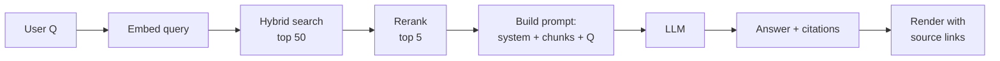
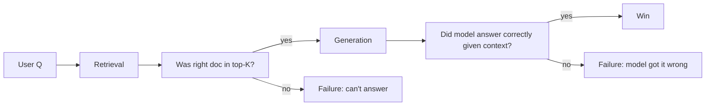

# RAG basics

> **In one line:** RAG = "before you answer, look stuff up." Retrieve the documents most relevant to the user's question, paste them into the prompt, ask the model to answer using them. Citeable, updateable, cheap.

:::tip[In plain English]
A bare LLM is like a smart student taking a test from memory — sometimes right, often confidently wrong on specifics. RAG is letting that student open a textbook during the test. Find the right pages, hand them over, ask the question. The student still has to read and reason, but now they're answering from real source material instead of guessing.
:::

## The minimal pipeline

1. **User asks a question.**
2. **Retrieve** the top K (typically 3–10) most relevant chunks from your knowledge base via vector / hybrid search.
3. **Rerank** the candidates (see [reranking](./reranking.md)).
4. **Prompt** the LLM: "Answer the user's question using ONLY the context below. If the answer isn't in the context, say so." Then paste the chunks.
5. **Generate.**
6. **Cite.** Have the model emit which chunks it used; render those as sources in the UI.



That's it. The first version of every successful RAG app is about 200 lines of code.

## Worked example: a 50-line RAG endpoint

```python
SYSTEM = """You are a documentation assistant.
Answer ONLY from the provided context.
If the answer isn't there, say "I don't know from the docs."
Cite source chunks using [chunk_id] notation."""

def rag_answer(question: str) -> dict:
    # 1. Retrieve
    candidates = hybrid_search(question, k=30)
    # 2. Rerank
    top = co.rerank(model="rerank-english-v3.0", query=question,
                    documents=[c["text"] for c in candidates], top_n=5)
    chunks = [candidates[r.index] for r in top.results]
    
    # 3. Build context
    context = "\n\n".join(
        f"[{c['id']}] {c['text']}" for c in chunks
    )
    
    # 4. Generate
    resp = client.chat.completions.create(
        model="gpt-5-mini",
        messages=[
            {"role": "system", "content": SYSTEM},
            {"role": "user", "content": f"Context:\n{context}\n\nQuestion: {question}"},
        ],
        temperature=0,
    )
    return {
        "answer": resp.choices[0].message.content,
        "sources": [{"id": c["id"], "text": c["text"][:200]} for c in chunks],
    }
```

That's a working RAG endpoint. Add caching, rate limits, and observability and you're production.

## Why RAG instead of fine-tuning

- **Updateable.** New docs land tomorrow; RAG sees them tomorrow. Fine-tuning takes days and a rebuild.
- **Citeable.** Users (and auditors) need to see *where the answer came from*. Fine-tuned models can't tell you.
- **Cheaper.** No training run, no model hosting if you use a provider API.
- **Reversible.** Bad retrieval is a config tweak. Bad fine-tune is a rollback.
- **Composable.** Different users see different docs (multi-tenant), and the model never "leaks" doc A's content into doc B's tenant.

Fine-tuning still wins for: tone/style at scale, structured output the model can't already produce, and ultra-low-latency narrow tasks.

## Where RAG goes wrong

- **Bad chunking.** Most RAG quality problems are retrieval problems, and most retrieval problems are chunking problems. See [chunking strategies](./chunking-strategies.md).
- **No hybrid search.** Pure vector loses on rare-term queries (SKUs, names, error codes). See [hybrid search](./hybrid-search.md).
- **No re-ranking.** Cheap retriever pulls 50 candidates → cross-encoder reranker picks the top 5. Big quality jump. See [reranking](./reranking.md).
- **No evals.** You ship, things look fine in spot checks, then 20% of answers are subtly wrong. Build evals *before* you ship.
- **Citations that lie.** Always make the model cite source IDs *from the provided chunks*; never accept invented URLs.
- **"Answer from context" prompt that the model ignores.** Stronger phrasing helps; structured output (return an `answer` field and a `cited_chunk_ids: list[str]` field) helps more.

## The 2026 RAG checklist

- [ ] **Chunking** that matches your content type (see [chunking strategies](./chunking-strategies.md)).
- [ ] **Hybrid (BM25 + vector)** search.
- [ ] **Reranker** over the top 30–50 candidates.
- [ ] **Pre-filter** by tenant / language / freshness.
- [ ] **Strong instruction:** "answer with citations, say 'I don't know' if absent."
- [ ] **Structured output** with `answer` + `cited_chunk_ids` fields.
- [ ] **Eval set** with at least 50 graded question/answer/source-id triples.
- [ ] **Observability** on retrieval (what was retrieved? was the right doc in there?).
- [ ] **Source UI** — the user can click a citation and see the original chunk.
- [ ] **Failure mode UX** — graceful "I don't know" instead of confabulation.

## Worked example: enforcing citations with structured output

```python
class RagAnswer(BaseModel):
    answer: str
    cited_chunk_ids: list[str]
    confidence: Literal["high", "medium", "low"]

resp = client.beta.chat.completions.parse(
    model="gpt-5-mini",
    messages=[
        {"role": "system", "content": SYSTEM},
        {"role": "user", "content": f"Context:\n{context}\n\nQuestion: {question}"},
    ],
    response_format=RagAnswer,
    temperature=0,
)
result = resp.choices[0].message.parsed

# Verify citations actually exist
chunk_ids_in_context = {c["id"] for c in chunks}
result.cited_chunk_ids = [c for c in result.cited_chunk_ids if c in chunk_ids_in_context]
```

The `cited_chunk_ids` field guarantees the model thinks about *which* sources it used. The post-check guarantees they're real.

## Generation vs retrieval as separate quality questions



Two failure modes, two fixes:

- **Retrieval failed → improve chunking, hybrid, reranker.**
- **Retrieval succeeded but generation failed → improve prompt, switch to a stronger model.**

Don't conflate them. Always measure both separately. A retrieval recall@5 of 90% with a generation accuracy of 70% means you ship at 63% — better than either component's score suggests.

## Variants you'll meet

- **Conversational RAG** — multi-turn chat, where you also have to handle "what about that one?" follow-ups. Rewrite the user's query to be standalone before searching.
- **Multi-hop RAG** — questions that need to chain multiple lookups. Often better solved as an agent with a `search` tool, not as one giant retrieval.
- **GraphRAG** — build a knowledge graph from your docs, query it for entities, then retrieve. Heavy lift; useful when entity relationships matter (legal, biomedical).
- **Self-RAG / corrective RAG** — model checks its own answer and re-retrieves if confidence is low. Useful when accuracy > latency.

## What beginners get wrong

:::caution[Common mistakes]
- **Treating RAG as one box.** It's four steps (chunk, embed/index, retrieve+rerank, generate). Every step has its own quality knobs.
- **Skipping evals.** No measurement = no improvement. Spot checks lie.
- **Pasting raw chunks without IDs.** Then the model can't cite, and you can't verify.
- **Letting the model answer when retrieval returned nothing relevant.** It will confabulate. Detect zero/low-confidence retrieval and short-circuit to "I don't know."
- **Re-running retrieval on every conversational turn with the same query.** Cache results; rewrite the query when it's a follow-up.
- **Treating chunk count as more = better.** Past ~10 chunks, the model gets confused or "loses" some. Top-5 with reranking beats top-20 raw.
- **Forgetting freshness.** If docs update, you need a re-index pipeline. Many RAGs ship answering questions from 6-month-old indexes.
:::

:::info[Highlight: RAG is the default LLM architecture in 2026]
If you're building an LLM feature on top of your own data — internal docs, knowledge bases, support archives, codebases — RAG is the starting point. Long context, fine-tuning, and agents are all alternatives you reach for *after* RAG has been measured and found insufficient.
:::

**→ Going deeper:** For the production pipeline — hybrid search, reranking, metadata/tenant filtering, citation validation, and splitting retrieval vs generation evals — see [The RAG pattern in production](../10-patterns/rag-prod.md).

<Quiz id="rag-basics-quick-check" variant="micro" title="Quick check">

<Question
  prompt="Your product docs change weekly and auditors must see where each answer came from. Why does the page favor RAG over fine-tuning here?"
  options={[
    { text: "Fine-tuned models are always less accurate than RAG" },
    { text: "RAG is legally required for documentation systems" },
    { text: "RAG sees new docs as soon as they're indexed and can cite sources; a fine-tune needs a retrain and can't tell you where an answer came from" },
    { text: "Fine-tuning cannot learn from documents at all" }
  ]}
  correct={2}
  explanation="Updateability and citeability are RAG's structural advantages: re-index tomorrow's docs and they're live tomorrow, and the model cites the exact chunks it used. A fine-tuned model bakes knowledge into weights — no sources, days to update. 'Fine-tuning is always worse' overstates it: the page notes fine-tuning still wins for tone, style, and ultra-low-latency narrow tasks."
/>

<Question
  prompt="An answer is wrong. You check the logs and the right chunk WAS in the top-5 context the model received. Where should you focus the fix?"
  options={[
    { text: "Generation — improve the prompt or use a stronger model; retrieval did its job" },
    { text: "Retrieval — switch to hybrid search" },
    { text: "Chunking — re-chunk the entire corpus" },
    { text: "The embedding model — re-embed everything" }
  ]}
  correct={0}
  explanation="RAG has two separate failure modes: the right doc never arrived (retrieval failure) or it arrived and the model still got it wrong (generation failure). Here retrieval succeeded, so reworking chunking, hybrid, or embeddings is wasted effort — those fix a problem you don't have. Measure the two stages separately or you'll keep tuning the wrong one."
/>

<Question
  prompt="How does the page recommend making citations trustworthy?"
  options={[
    { text: "Ask the model to include URLs in its prose and trust them" },
    { text: "Have the model return cited_chunk_ids via structured output, then verify each ID actually exists in the provided chunks" },
    { text: "Show the user the full retrieved context instead of citations" },
    { text: "Citations can't be made reliable, so omit them" }
  ]}
  correct={1}
  explanation="The structured field forces the model to commit to specific sources, and the post-check filters out any invented IDs — shape from the schema, truth from your verification code. Free-text URLs are exactly the 'citations that lie' failure the page warns about: models happily invent plausible-looking links that were never in the context."
/>

</Quiz>

---

→ Next: [Memory](./memory.md)
