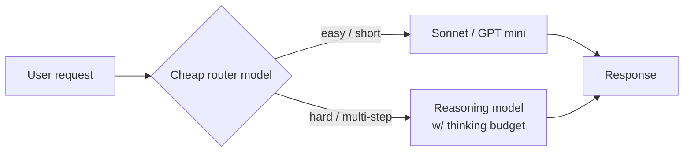

# Reasoning models

> **In one line:** A reasoning model spends extra compute generating an internal "thinking" trace before its final answer — this dramatically improves multi-step reasoning (math, code, planning, debugging) at the cost of higher latency and 5–20× more output tokens, and they want a different prompt shape than chat models.

:::tip[In plain English]
A normal LLM emits tokens one after another and hopes the answer comes out right. A reasoning model first generates a long, hidden "scratchpad" — sometimes thousands of tokens of self-talk — and only then produces the user-visible answer. It's like the difference between blurting and pausing to think. For problems where one wrong step ruins everything (math, code, debugging, multi-hop reasoning), this is transformative. For "summarize this email," it's overkill.
:::

## The reasoning model family

By mid-2026 every major lab ships a reasoning variant:

| Model | Lab | What "thinking" looks like |
|---|---|---|
| **o1 / o3 / o4** | OpenAI | Hidden reasoning tokens; you pay for them but never see them |
| **Claude extended thinking** (3.7+ and 4.x) | Anthropic | Visible `<thinking>` blocks; budget configurable per call |
| **DeepSeek R1** (and successors) | DeepSeek | Visible reasoning; open weights |
| **Gemini Deep Think / 2.5 Pro reasoning** | Google | Visible reasoning; depth budget |
| **Qwen QwQ** | Alibaba | Open-weights reasoning; visible chain-of-thought |

Two design variants matter:

- **Hidden reasoning (OpenAI style).** Reasoning tokens never reach you but are billed. You can't introspect *why* the model decided something. Simpler to use.
- **Visible reasoning (Anthropic/DeepSeek/Google style).** You see the thinking. You can log it, audit it, train evals against it, surface it as "AI is thinking…" UX. More observability; more prompt-injection surface if you display it raw.

## When reasoning models actually help

The benchmarks that move:

- **Math.** AIME, MATH, frontier-level competition problems.
- **Code with verification.** SWE-Bench, competitive programming, anything where the model can mentally trace through execution.
- **Multi-step planning.** "Plan a 3-stage migration with rollback at each stage" — a reasoning model catches dependencies a one-shot model misses.
- **Debugging.** "Why does this code fail on input X?" — reasoning models trace through execution mentally.
- **Logic puzzles, constraint satisfaction.**

Where reasoning models do **not** help much:

- **Summarization.** No reasoning required.
- **Classification / extraction.** Often *worse* — they overthink obvious cases.
- **Retrieval-grounded Q&A** where the answer is in the retrieved chunks.
- **Creative writing.** Reasoning can suppress creativity; "thinking" is the wrong primitive for "write a poem."
- **Anything where latency matters more than depth.** Voice agents, autocomplete, low-stakes chat.

## The cost and latency cliff

Reasoning models are dramatically more expensive than their non-reasoning siblings:

- **5–20× more output tokens** per response (the thinking trace is billed).
- **2–10× higher TTFT.** The user waits 5–30s before *anything* appears.
- **Higher per-token output price** at most providers, on top of the volume increase.

A back-of-envelope:

| Model | Tokens per "what's 2+2 + show work" | Approx cost (relative) |
|---|---|---|
| Sonnet 4.6 non-thinking | ~50 output | 1× |
| Sonnet 4.6 + extended thinking (medium) | ~800 output | ~16× |
| o3 | ~1200 output (some hidden) | ~20× |

This is why the right default is **not a reasoning model**. Reach for one when the task actually needs it.

## Prompting reasoning models differently

Reasoning models reward a different prompt shape than chat models. The patterns that matter:

### Less is more

- **Skip the few-shot examples.** Few-shot suppresses reasoning ("just follow the pattern"). Reasoning models do better with zero-shot problem statements.
- **Skip "let's think step by step."** It's built in; you'd be telling the chef to chop the onions. With Anthropic extended thinking, you set a `thinking.budget_tokens` parameter instead.
- **Skip chain-of-thought scaffolding** ("First analyze X, then consider Y…"). The model does this internally; over-scripting it constrains the reasoning.

### State the problem and the success criteria

```text
Bad (over-prompted):
You are an expert mathematician. Think step by step. First understand
the problem, then identify the relevant theorems, then apply them.

Good (under-prompted):
Solve: find all integer pairs (a, b) with a > 0, b > 0, and
a² + b² = 2026. Verify each solution.
```

### Tighten the output, not the reasoning

You want a clean final answer. Constrain the *output*, not the thinking:

```text
After thinking, output the answer in this exact JSON shape:
{"pairs": [[a, b], ...], "count": N}
```

This works because the model finishes thinking, *then* produces the structured output. The schema doesn't interfere with the reasoning.

### Set a thinking budget (when the API supports it)

Anthropic extended thinking exposes `thinking.budget_tokens`. Google's Deep Think exposes a similar dial. Typical settings:

- **Low (1–3k tokens):** Easy multi-step problems. Catch most reasoning gains for 2–3× cost.
- **Medium (8–16k tokens):** Hard problems. Math competitions, gnarly debugging.
- **High (32k+ tokens):** Frontier problems. Rare in production; common in evals.

```python
# Anthropic SDK
response = client.messages.create(
    model="claude-sonnet-4-6",
    max_tokens=8000,
    thinking={"type": "enabled", "budget_tokens": 4000},
    messages=[{"role": "user", "content": problem}],
)
# response.content[0] is a ThinkingBlock; response.content[1] is the final text
```

## When to use a reasoning model in production

Three decision questions:

1. **Does the task have a verifiable right answer?** Math, code, logic — yes. Tone, summary, creative — no.
2. **Is the latency budget > 5s?** Voice and autocomplete say no. Backend job queues and "Generate a plan" buttons say yes.
3. **Is the per-request cost acceptable at 10–20× baseline?** Power user features and B2B, often yes. Free-tier consumer features, often no.

If 1 + 2 + 3 are all yes, the reasoning model is the right pick. If any is no, use a non-reasoning model and lean on structure (chain-of-thought in the prompt, multi-step orchestration, RAG).

## Hybrid pattern — router + reasoning

The common production pattern in 2026:



The router itself is a cheap, non-reasoning call (Haiku-class) that classifies the request. ~95% of requests go to the cheap path; ~5% to the reasoning model. This keeps the average cost and latency low while still serving the hard cases well.

## Showing thinking in the UI

If you're using a visible-reasoning model (Anthropic, DeepSeek, Google), you have a UX decision:

- **Hide it.** Simplest. "AI is thinking…" spinner, then the answer.
- **Show a summary.** Some products show the first line of each thinking step ("Considering edge cases…", "Verifying my answer…"). Better UX, more dev work.
- **Show the full trace.** Power-user features (Cursor, Claude Code, internal tools). Power users love this; consumer users find it overwhelming.

If you show thinking to users, **never display it raw without sanitization** — it's still LLM output, vulnerable to prompt-injected instructions appearing in the thinking trace.

## What beginners get wrong

:::caution[Common mistakes]
- **Defaulting to a reasoning model for everything.** 80% of LLM tasks don't need it. You're paying 10× for the same answer, slowly.
- **Few-shotting a reasoning model.** Suppresses the reasoning it's supposed to do. Zero-shot or one-shot is the right shape.
- **Adding "think step by step" to a reasoning model prompt.** Already happening. The instruction makes things worse.
- **Asking a reasoning model to roleplay or be creative.** The "thinking" primitive often suppresses fluency. Use a non-reasoning model for creative work.
- **Streaming the thinking to the user as fast as it generates.** With hidden thinking (OpenAI), there's nothing to stream until the answer starts. With visible thinking (Anthropic), the thinking trace can be 30 seconds long — show a summary or hide it; raw streaming is bad UX.
- **Forgetting to cap `thinking.budget_tokens`.** Unbounded thinking on a hostile input can run for minutes and cost dollars per request.
- **Using a reasoning model for retrieval-grounded Q&A.** If the answer is in the retrieved chunks, you don't need reasoning — you need [reranking](./reranking.md) and faithfulness.
:::

:::info[Highlight: the depth-vs-latency frontier widened]
Pre-2024, "better model" was a single axis — bigger = more capable, slower, more expensive. Reasoning models split this into two axes: capability without thinking, and capability with thinking. The same base model can be a fast workhorse or a slow reasoner depending on a budget flag. This is the most important architectural shift since tool use, and it changes how you pick models per route.
:::

<Quiz id="reasoning-models-quick-check" variant="micro" title="Quick check">

<Question
  prompt="Which task is the worst fit for a reasoning model?"
  options={[
    { text: "Debugging why code fails on a specific input" },
    { text: "Planning a multi-stage migration with rollbacks" },
    { text: "Real-time voice agent responses" },
    { text: "A frontier-level math competition problem" }
  ]}
  correct={2}
  explanation="Reasoning models add 5 to 30 seconds of thinking before anything appears, which is fatal for voice and other latency-critical UX. They shine exactly where the other options live — math, debugging, multi-step planning — where one wrong step ruins the answer. The decision test: a verifiable right answer, a latency budget over 5 seconds, and tolerance for 10 to 20 times the cost."
/>

<Question
  prompt="You add five worked examples to your prompt for a reasoning model and accuracy drops. Why?"
  options={[
    { text: "The examples used the wrong formatting" },
    { text: "Few-shot examples push the model to pattern-match instead of reasoning — zero-shot is the right shape" },
    { text: "Reasoning models have smaller context windows" },
    { text: "More examples always require a higher thinking budget" }
  ]}
  correct={1}
  explanation="Few-shot prompting tells the model 'just follow this pattern', which suppresses the internal thinking these models are built around. The same applies to adding 'think step by step' — it is already built in, so the instruction makes things worse. State the problem and the success criteria plainly, and constrain the output format rather than the reasoning process."
/>

<Question
  prompt="With OpenAI's hidden-reasoning models like o3, what is true about the thinking tokens?"
  options={[
    { text: "You are billed for them even though you never see them" },
    { text: "They are free, since they are never delivered to you" },
    { text: "You can stream them to your UI for transparency" },
    { text: "They count against input tokens, not output" }
  ]}
  correct={0}
  explanation="Hidden reasoning tokens never reach you but still show up on the bill — part of why reasoning responses cost 5 to 20 times more in output tokens. If you want to log, audit, or display the thinking, you need a visible-reasoning model like Claude extended thinking or DeepSeek R1; with hidden reasoning there is simply nothing to stream until the final answer begins."
/>

</Quiz>

---

→ Next: [Model families](./model-families.md)
