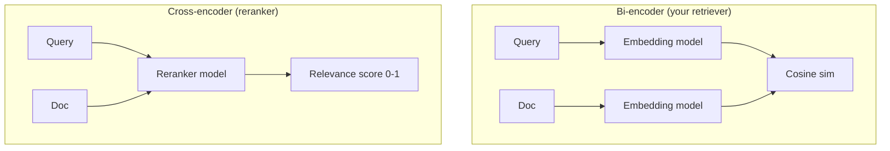
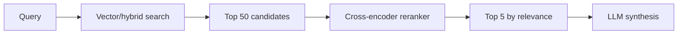
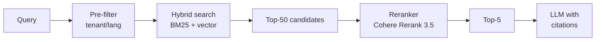

# Reranking

> **In one line:** Retrieve 50 candidates cheaply with vector/hybrid search, then re-score them with an expensive cross-encoder that reads each candidate alongside the query. Return the top 5–10 to the LLM. The biggest single-knob quality win in RAG after chunking.

:::tip[In plain English]
Vector search is fast but coarse — it scores by "are these two embeddings nearby" without ever comparing the *actual texts*. A reranker is a small model that takes the query and one candidate at a time, reads them both, and gives a real relevance score. Way slower per pair, but you only run it on the top 50 candidates, not the whole corpus. Net: 30%+ quality gain for ~50ms more latency.
:::

## The shape: bi-encoder vs cross-encoder



- **Bi-encoder** (used at retrieval): query and doc are embedded *separately*. Comparison is one cheap operation. Scales to billions of vectors. Loses fine-grained interaction.
- **Cross-encoder** (used at rerank): query and doc are concatenated and passed through a transformer *together*. The model sees how each query word relates to each doc word. Much more accurate, but you can't pre-compute anything — every pair needs its own forward pass.

You couldn't use a cross-encoder over a whole corpus (it'd take days). You can absolutely use it over 50 pre-filtered candidates (30–100ms total).

## The pattern



Two-stage retrieval. Stage 1 is fast and approximate; stage 2 is slow and precise. Production RAG in 2026 looks like this almost universally.

## Worked example: Cohere Rerank

```python
import cohere
co = cohere.Client()

def hybrid_then_rerank(query: str, top_k_retrieve: int = 50, top_k_final: int = 5):
    # Stage 1: cheap retrieval
    candidates = hybrid_search(query, k=top_k_retrieve)  # returns [{id, text}, ...]
    
    # Stage 2: rerank
    docs = [c["text"] for c in candidates]
    result = co.rerank(
        model="rerank-english-v3.0",
        query=query,
        documents=docs,
        top_n=top_k_final,
    )
    
    # Re-order
    return [candidates[r.index] for r in result.results]
```

`top_n=5` means Cohere returns the 5 best out of the 50 you sent. Each result has a `relevance_score` in [0,1]. Median latency: ~80ms for 50 docs.

## The major rerankers (May 2026)

| Reranker                    | Hosted? | Latency (50 docs) | Strength                  |
|-----------------------------|---------|-------------------|---------------------------|
| **Cohere Rerank 3.5**       | Yes     | ~80ms             | Industry default, multilingual |
| **Voyage rerank-2.5**       | Yes     | ~100ms            | Strong on code + technical|
| **Jina Reranker v2**        | Yes/self| ~120ms            | Good open option          |
| **BGE-reranker-v2-m3**      | Self    | ~150ms            | Best open multilingual    |
| **Mixedbread mxbai-rerank** | Self    | ~100ms            | Compact, strong English   |
| **In-context LLM reranking** | Yes (any) | ~500ms+        | Use a workhorse LLM with structured score output |

For starting out: **Cohere Rerank** is the boring, correct default. Switch later if you have a specific need (self-hosted, code-heavy, etc.).

## When reranking pays off (and when it doesn't)

**Worth it:**

- Top-K from your retriever has the right answer somewhere but it's at rank 12 instead of 1.
- Corpus is large enough that the bi-encoder casts a wide net (50+ candidates).
- Latency budget allows ~100ms extra.

**Skip it:**

- Tiny corpus (under ~1K docs). Just retrieve more directly.
- Retrieval is already perfect (rare; verify with an eval).
- You're billing $0.001/query and can't add the rerank cost.

## A useful eval comparison

On a 100-query RAG eval (your mileage will vary):

| Stage                    | Recall@5 | MRR  |
|--------------------------|----------|------|
| Pure vector              | 62%      | 0.48 |
| + Hybrid                 | 71%      | 0.55 |
| + Hybrid + reranker (top-50→5) | 83% | 0.71 |

The reranker is doing the most work of any single step. It's also the *cheapest to add* — no schema changes, no infra changes, one API call.

## LLM-as-reranker

You can use a workhorse LLM as a reranker by asking it to score each candidate. Slower and pricier, but composable with the rest of your stack and no extra vendor.

```python
class CandidateScore(BaseModel):
    candidate_id: str
    relevance: float  # 0..1

# Send 20 candidates, ask the model to score each
prompt = f"""Score how relevant each candidate is to this query.
Query: {query}
Candidates:
{json.dumps([{'id': c['id'], 'text': c['text'][:500]} for c in candidates], indent=2)}
"""
result = client.beta.chat.completions.parse(
    model="gpt-5-mini",
    messages=[{"role": "user", "content": prompt}],
    response_format=list[CandidateScore],
    temperature=0,
)
```

Quality is competitive with dedicated rerankers for many tasks; latency and cost are worse. Useful when you can't take on another vendor.

## Pairwise vs listwise rerankers

- **Pairwise (most rerankers, including Cohere):** scores each (query, doc) independently. Predictable, parallelizable.
- **Listwise:** the model sees all candidates at once and ranks them as a list. Captures inter-candidate context (e.g., "candidate B is just a rephrase of A; skip the duplicate"). Slower, used in research-grade systems.

For 95% of apps, pairwise is the right default.

## What beginners get wrong

:::caution[Common mistakes]
- **Skipping the rerank.** "Vector + a workhorse LLM should be enough." Rerankers consistently add 10–20% recall — at a few cents per million queries. Take the deal.
- **Sending too few candidates.** Rerank's value is *finding the right answer that the retriever missed*. If you only send top-10, you have nowhere for the reranker to dig. Send 30–100.
- **Sending too many.** Past ~100, latency hurts and the reranker quality plateaus. Find your knee experimentally.
- **Using a multilingual reranker on English only (wasted cost) or vice versa.** Pick the model trained on your languages.
- **Truncating doc text mid-sentence before reranking.** The reranker reads the truncated version — make truncation respect sentences.
- **Mixing reranker model with embedding model assumptions.** They're independent; a Cohere reranker works on top of OpenAI embeddings.
- **Caching rerank results too aggressively.** Document text changes → cached scores lie. Invalidate on content updates.
- **Not measuring per-query.** Average gains hide the cases where rerank tanked a previously-good query. Look at the diff.
:::

## A production-grade RAG pipeline



Five stages, well under 300ms total. The shape of every serious RAG system I've audited in 2026.

:::info[Highlight: reranking is the cheapest path from prototype to production]
A working "cheap retrieval → expensive rerank" pipeline takes one afternoon to add and reliably bumps quality from "demo-good" to "ship-able." If your RAG feels janky, this is the first place to look.
:::

<Quiz id="reranking-quick-check" variant="micro" title="Quick check">

<Question
  prompt="Why is a cross-encoder more accurate than a bi-encoder at judging relevance?"
  options={[
    { text: "It uses a larger embedding dimension" },
    { text: "It reads the query and the document together in one forward pass, so it sees how each query word relates to each doc word" },
    { text: "It pre-computes document scores at index time" },
    { text: "It always runs on faster hardware" }
  ]}
  correct={1}
  explanation="A bi-encoder embeds query and doc separately and only compares the two finished vectors — all the fine-grained word-to-word interaction is lost. A cross-encoder processes the pair together and captures it. Pre-computing is the giveaway wrong answer: that's exactly the bi-encoder's trick, and the cross-encoder's accuracy comes at the price of NOT being able to pre-compute anything — which is why you only run it on about 50 candidates."
/>

<Question
  prompt="Your reranker receives only the top 10 retrieval results and barely improves anything. What does the page recommend?"
  options={[
    { text: "Replace it with a multilingual reranker" },
    { text: "Lower the final top_n to 3" },
    { text: "Cache the rerank scores more aggressively" },
    { text: "Send 30 to 100 candidates — the reranker's value is surfacing right answers the retriever ranked low" }
  ]}
  correct={3}
  explanation="The reranker shines when the right answer is sitting at rank 12 or 30 in the retriever's list — but if you only send the top 10, that answer was already cut before the reranker ever saw it. Send a wide candidate set so it has somewhere to dig. Going much past 100 hits diminishing returns: latency grows and quality plateaus."
/>

<Question
  prompt="For which setup does the page say reranking is usually NOT worth adding?"
  options={[
    { text: "A corpus of under about 1,000 documents" },
    { text: "A corpus of over 1 million documents" },
    { text: "Any pipeline that already uses hybrid search" },
    { text: "Any system with users in multiple languages" }
  ]}
  correct={0}
  explanation="On a tiny corpus you can simply retrieve more and let the LLM sort it out — there's not enough haystack for a reranker to earn its latency. Large corpora are where reranking pays MOST, not least. And hybrid plus reranker stack rather than compete: the page's eval shows recall going from 71% with hybrid alone to 83% after adding the reranker on top."
/>

</Quiz>

---

→ Next: [RAG basics](./rag-basics.md)
