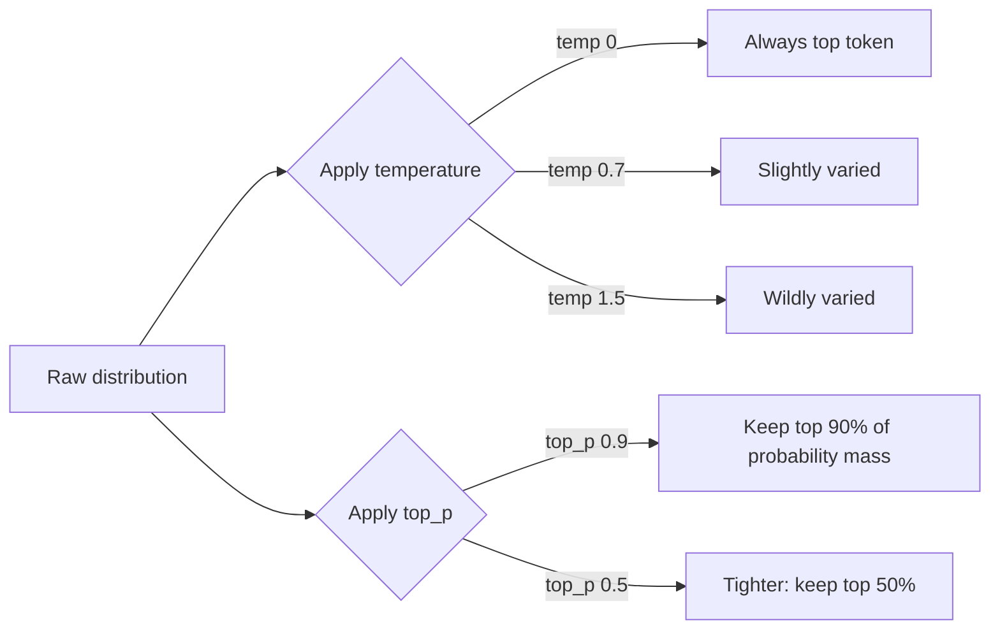

# Sampling

> **In one line:** The model outputs a probability over every possible next token; the sampler picks one. `temperature`, `top_p`, and `top_k` shape how adventurous that pick is.

:::tip[In plain English]
Imagine the model handing you a stack of cards, each showing a candidate next word and how likely it thinks that word is. The sampler is the rule for picking one card. *Always pick the highest* → boring, deterministic. *Reshuffle proportionally to weights* → varied, sometimes surprising. *Throw out the long tail first* → safer creativity. That's it.
:::

## The three knobs

- **`temperature`** (typically 0–2) — Sharpens or flattens the distribution. **0** = always pick the top token (most deterministic). **1** = use the raw distribution. **>1** = flatter, more random. For factual/structured tasks: 0–0.3. For creative writing: 0.7–1.2.
- **`top_p`** (nucleus sampling, 0–1) — Only consider the smallest set of tokens whose probabilities sum to `p`. **0.9** is a common default. Lower = safer/more conservative.
- **`top_k`** — Only consider the top K tokens. Less common in modern APIs (top_p usually replaces it).

You typically set **one** of `temperature`, `top_p`, or `top_k` — combining them is mostly overkill.



Reading about temperature only gets you so far — *feel* it. Drag the sliders below and watch the same set of next-token probabilities sharpen toward one word or spread across the long tail:

<SamplingExplorer />

## When to use what

- **Deterministic-ish output (classification, JSON extraction, code):** `temperature=0`. Note: even at temp 0, perfect determinism is not guaranteed across providers and across time (batching, hardware non-determinism).
- **Default chat / Q&A:** `temperature=0.7` is the OpenAI default. Reasonable starting point.
- **Brainstorming / creative writing:** `temperature=1.0–1.2`.
- **High-stakes evals:** drop to 0 to compare runs, then verify the live config matches.
- **Function-calling / tool use:** `temperature=0` or near. You want the model to pick the right tool with the right args, not improvise.

## Worked example: same prompt, three temperatures

Prompt: *"Suggest a name for a coffee shop near a library."*

| Temperature | Sample output                     |
|-------------|-----------------------------------|
| 0           | "The Reading Room"                |
| 0.7         | "Margin Notes Coffee"             |
| 1.2         | "Foxglove & Foxed Pages Espresso" |

At 0, you'd get "The Reading Room" *every* time. At 0.7, you'd get a small spread of plausible names. At 1.2, you get oddballs — useful for brainstorming, terrible for "extract this user's email."

## Other relevant params

- **`seed`** — Some providers expose a seed for reproducibility. Best-effort, not guaranteed (batching, version drift, hardware non-determinism still apply).
- **`stop`** — A list of strings that, if generated, end the response. Useful for structured outputs and chain-of-thought termination.
- **`presence_penalty` / `frequency_penalty`** — Discourage repeats. Rarely needed in modern models.
- **`max_tokens` / `max_output_tokens`** — Hard cap on output length. Always set this. Always.
- **`logprobs`** — Some providers return the top-K logprobs per token. Useful for confidence estimates and reranking.

## Logprobs: the secret weapon

When you need to know "how sure was the model?", request logprobs:

```python
response = client.chat.completions.create(
    model="gpt-5-mini",
    messages=[{"role": "user", "content": "Sentiment of: 'It's fine I guess.'"}],
    logprobs=True,
    top_logprobs=5,
)
for tok in response.choices[0].logprobs.content[:3]:
    print(tok.token, [(t.token, round(t.logprob, 2)) for t in tok.top_logprobs])
```

You'll see for each output token, the top 5 alternatives and their log-probabilities. Convert to probability with `math.exp(logprob)`. Use cases:

- **Confidence-based routing.** If top token < 0.7 prob → escalate to a stronger model.
- **Calibrated classification.** Take the logprob of each class label, normalize, use as probability.
- **Better reranking.** Score candidate completions by total logprob.

## The "deterministic at temp 0" myth

`temperature=0` makes the *sampling step* deterministic, but the model itself isn't. You can get different outputs from the same prompt because:

- **Batching** — your request runs with different siblings, causing tiny floating-point differences that flip the top token at ties.
- **Hardware non-determinism** — different GPU schedules give different rounding.
- **Provider version drift** — `gpt-5-mini` today is not the exact same checkpoint as `gpt-5-mini` two months ago.

For evals you care about: pin the version (e.g., `gpt-5-mini-2026-04-15`), use temp 0, and log the response so you can compare exact strings.

## What beginners get wrong

:::caution[Common mistakes]
- **Setting temperature high "for creativity" on a structured task.** Higher temperature = more invented JSON keys, more malformed schemas, more hallucinated facts. Use temp 0 for extraction.
- **Setting both `temperature` and `top_p` aggressively.** Either alone is enough; both together gives unpredictable behavior.
- **Believing temp 0 means perfect reproducibility.** It doesn't. Test, log, expect drift.
- **Forgetting `max_tokens`.** A runaway generation is a budget incident. Set a hard cap.
- **Using `stop` strings that appear naturally in the output.** `stop=["\n"]` will end a code block mid-line.
- **Tuning sampling before tuning the prompt.** Sampling moves the needle 5%; prompt structure moves it 50%. Fix the prompt first.
- **Setting `presence_penalty` to mask a bad prompt.** Penalties paper over repetition; a better instruction fixes it at the root.
:::

## A reasonable defaults table

| Task                          | temperature | top_p | max_tokens |
|-------------------------------|-------------|-------|------------|
| JSON extraction               | 0           | -     | tight cap  |
| Classification                | 0           | -     | tight cap  |
| Chat (general)                | 0.7         | 1     | 1000–4000  |
| Code generation               | 0.2         | -     | as needed  |
| Brainstorming / naming        | 1.0         | -     | small      |
| Creative writing              | 0.9–1.1     | -     | as needed  |
| Tool calling                  | 0           | -     | small      |

:::info[Highlight: temperature is a UX dial, not a quality dial]
Lower temperature isn't "smarter" — it's just *less varied*. The model knows the same things at temp 0 and temp 1; the difference is whether you see its second-best guess as easily as its first.
:::

## Reproducibility recipe

When you need the *same* prompt to produce the *same* output as often as possible:

1. Pin the model version explicitly (`gpt-5-mini-2026-04-15`, not `gpt-5-mini`).
2. Set `temperature=0`.
3. Pass `seed` if the provider supports it.
4. Log the exact request and response.
5. Re-test on a small fixture set after any model upgrade — silent drift is real.

This still isn't *guaranteed* reproducibility (see the myth section above), but it's as close as the providers allow today.

## Practice: greedy decoding (temperature 0)

`temperature=0` means "always pick the highest-probability token" — i.e., `argmax` over the distribution. That's the whole of greedy decoding. Write it and you've implemented the deterministic end of the sampling dial. (Ties resolve to the lowest index, which is how most implementations break them.)

<CodeChallenge
  id="foundations-argmax"
  fnName="argmax"
  prompt="Write argmax(probs) — given an array of next-token probabilities, return the index of the largest. On a tie, return the lowest index. This is exactly what temperature=0 does."
  starter={`function argmax(probs) {\n  // return the index of the maximum value\n}`}
  solution={`function argmax(probs) {\n  let best = 0;\n  for (let i = 1; i < probs.length; i++) {\n    if (probs[i] > probs[best]) best = i;\n  }\n  return best;\n}`}
  tests={[
    {args: [[0.1, 0.7, 0.2]], expected: 1},
    {args: [[0.9, 0.05, 0.05]], expected: 0},
    {args: [[0.2, 0.2, 0.6]], expected: 2},
    {args: [[0.5, 0.5]], expected: 0},
    {args: [[0.1, 0.3, 0.3, 0.29]], expected: 1},
  ]}
  hint="Track the index of the best value seen so far. Use strict greater-than (>) when comparing so the first of any tied maxima wins."
/>

<Quiz id="sampling-quick-check" variant="micro" title="Quick check">

<Question
  prompt="You are extracting structured JSON from documents and want maximum reliability. What temperature should you start with?"
  options={[
    { text: "1.2, to give the model creative freedom with edge cases" },
    { text: "0.7, the general chat default" },
    { text: "0 — always pick the top token" },
    { text: "It does not matter; temperature does not affect structured tasks" }
  ]}
  correct={2}
  explanation="Extraction has a right answer, so you want the model's most probable token at every step — temperature 0. Higher temperatures mean more invented keys, malformed schemas, and hallucinated values, because the sampler deliberately picks lower-probability options. The 0.7 chat default exists for conversational variety, which is the opposite of what extraction needs."
/>

<Question
  prompt="With temperature 0 and an identical prompt, you occasionally get different outputs across days. Is something broken?"
  options={[
    { text: "Yes — temperature 0 guarantees identical outputs" },
    { text: "Yes — the provider is silently sampling at 0.1" },
    { text: "No, but only because you forgot to also set top_p" },
    { text: "No — batching effects, hardware non-determinism, and provider version drift can all change the output" }
  ]}
  correct={3}
  explanation="Temperature 0 makes the sampling step deterministic, but the system around it is not: floating-point differences from batching, GPU scheduling, and silent checkpoint updates can flip the top token at near-ties. For evals, pin the exact model version, use temperature 0, pass a seed if supported, and log exact responses — that is as close to reproducible as providers allow."
/>

<Question
  prompt="A teammate says 'lower the temperature to make the model smarter'. What is wrong with that claim?"
  options={[
    { text: "Nothing — temperature 0 maximizes intelligence" },
    { text: "Temperature changes variety, not knowledge — the model knows the same things at 0 and at 1" },
    { text: "Lowering temperature actually makes the model less capable" },
    { text: "Temperature only affects the first token of a response" }
  ]}
  correct={1}
  explanation="Temperature reshapes how adventurously the sampler picks from the model's probability distribution; the distribution itself — what the model 'knows' — is unchanged. Low temperature suits tasks with one right answer, high suits brainstorming, but neither setting adds or removes capability. It is a UX dial, not a quality dial."
/>

</Quiz>

---

→ Next: [Streaming](./streaming.md)
