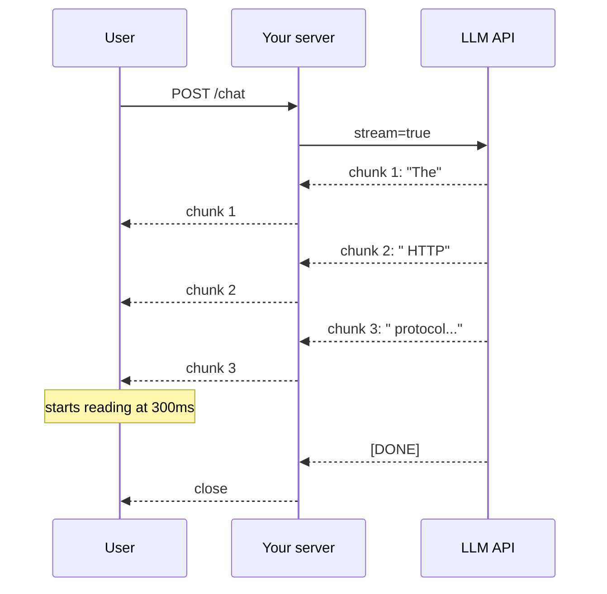

# Streaming

> **In one line:** Streaming is the difference between waiting 8 seconds staring at a spinner and watching the answer appear word-by-word. For any user-facing AI feature, it's effectively non-optional.

:::tip[In plain English]
The model produces tokens one at a time (autoregressive — see [transformer](./transformer.md)). Streaming just means: instead of waiting until they're *all* done to ship them, ship each one as soon as it's ready. The user starts reading within 300ms instead of staring at a spinner for 5 seconds. Same total time; vastly better feel.
:::

## How it works

Provider APIs support a `stream=True` (or equivalent) flag. Instead of returning a single response, the API streams **Server-Sent Events (SSE)** — each event contains a chunk of newly-generated tokens. Your server forwards those chunks to the browser, also as SSE (or WebSocket, or a streaming HTTP response), and the UI appends them as they arrive.

```python
from openai import OpenAI
client = OpenAI()

stream = client.chat.completions.create(
    model="gpt-5-mini",
    messages=[{"role": "user", "content": "Explain HTTP in 200 words."}],
    stream=True,
)
for chunk in stream:
    delta = chunk.choices[0].delta.content
    if delta:
        print(delta, end="", flush=True)
```



## Why it matters

- **Perceived latency drops by ~80%.** The user sees the *first token* in 200–500ms instead of waiting for the full response (5–15s).
- **Users tolerate longer total responses.** A 10-second streamed response feels faster than a 4-second blocking one.
- **You can cancel mid-stream.** If the user navigates away or hits stop, you abort the stream and stop billing.
- **You can render progressively.** Partial markdown, partial code block, partial structured fields — all become interactive instead of "loading."

## End-to-end streaming, full example

**Server (Next.js Route Handler):**

```typescript
import { openai } from '@ai-sdk/openai';
import { streamText } from 'ai';

export async function POST(req: Request) {
  const { messages } = await req.json();
  const result = streamText({
    model: openai('gpt-5-mini'),
    messages,
  });
  return result.toDataStreamResponse();
}
```

**Client (React with Vercel AI SDK):**

```typescript
'use client';
import { useChat } from 'ai/react';

export default function Chat() {
  const { messages, input, handleInputChange, handleSubmit } = useChat();
  return (
    <div>
      {messages.map(m => (
        <div key={m.id}><b>{m.role}:</b> {m.content}</div>
      ))}
      <form onSubmit={handleSubmit}>
        <input value={input} onChange={handleInputChange} />
      </form>
    </div>
  );
}
```

Twenty lines for a fully-streaming chat UI. The hook handles SSE parsing, state, and rendering.

## Where it gets tricky

- **You need streaming end-to-end.** Provider → your server → browser → DOM. One blocking hop in the middle breaks the whole UX. Common culprits: a server framework that buffers responses, a CDN/proxy that batches, a logger that holds chunks.
- **Structured output + streaming = partial JSON.** You'll need a partial-JSON parser if you want to render fields as they arrive (Vercel AI SDK, Pydantic AI, `partial-json` npm package handle this).
- **Tool calls stream too.** Arguments arrive incrementally; you can't execute the tool until the call is complete.
- **Error handling is harder.** A failure mid-stream looks different than a failed request — design retries accordingly. Usually you have to render an error inline and let the user retry.
- **Buffering buffers the experience.** A proxy that flushes every 16KB will hold ~16 seconds of tokens at typical rates. Disable buffering on the streaming route.

## Worked example: parsing partial JSON

The model streams `{"name": "Alice", "email": "a@`... — your UI wants to show *something* without waiting for the closing brace.

```typescript
import { parse } from 'partial-json';

let buffer = '';
for await (const chunk of stream) {
  buffer += chunk;
  try {
    const partial = parse(buffer);  // tolerates incomplete JSON
    renderForm(partial);            // {name: "Alice", email: "a@"}
  } catch {
    // partial-json couldn't repair yet; wait for more
  }
}
```

The form fields fill in as the model emits them. Used by tools like the Vercel AI SDK's `useObject` hook, Pydantic AI's `iter_stream`, and any "fill the form as you talk" UX.

## Common stack (May 2026)

- **Provider:** any major LLM API (all support streaming).
- **Server:** Next.js Route Handlers, FastAPI with SSE, Hono, Express + SSE, Cloudflare Workers. The Vercel AI SDK, LangChain LCEL, and Pydantic AI all wrap this nicely.
- **Client:** `EventSource` or `fetch` with a `ReadableStream` reader. Frameworks (Vercel AI SDK React hooks, ai-sdk-rsc, `useChat`/`useCompletion`) remove the boilerplate.

## What beginners get wrong

:::caution[Common mistakes]
- **Streaming the provider but buffering on your server.** Setting up `stream=true` on the OpenAI call and then collecting the response with `.join('')` defeats the entire point.
- **Forgetting to disable proxy buffering.** Nginx, Cloudflare, and most CDNs buffer by default. Set the right headers (`X-Accel-Buffering: no`, `Cache-Control: no-cache`) or the user sees nothing for seconds.
- **Re-rendering the whole message on every chunk.** Each token triggers a React re-render of a multi-paragraph div = jank. Use a streaming-friendly renderer or memoize aggressively.
- **Showing a spinner *and* streaming.** Pick one. The streaming is the loading indicator.
- **Not handling stream abort.** If the user navigates away, you should `controller.abort()` to stop billing and free resources.
- **Treating `delta.content` as always-present.** Tool calls and finish reasons come through the same stream with different fields. Always check.
- **Logging the full response after the stream completes by joining chunks.** Fine, but don't *wait* on it before responding — log async.
:::

## When NOT to stream

- **Background batch jobs.** No one's watching; latency doesn't matter. Skip the SSE plumbing.
- **Short responses (\&lt;200 tokens) on fast models.** A 400ms total response doesn't need streaming.
- **When you need the full response before doing anything** — e.g., the model emits a JSON plan you must validate before showing the user. Stream internally if useful, but show only when complete.

:::info[Highlight: streaming is product UX, not engineering polish]
A non-streaming AI chat in 2026 feels broken. Users have been trained by ChatGPT, Claude, Gemini, and every clone to expect tokens flowing in real time. Anything else feels slow even when it's fast.
:::

<Quiz id="streaming-quick-check" variant="micro" title="Quick check">

<Question
  prompt="Streaming does not make the model generate any faster. Why does it still transform the user experience?"
  options={[
    { text: "It compresses tokens for faster network transfer" },
    { text: "It lets the provider skip the prefill phase" },
    { text: "The user sees the first token within a few hundred milliseconds instead of waiting seconds for the full response" },
    { text: "It reduces the total number of output tokens generated" }
  ]}
  correct={2}
  explanation="Total generation time is the same — streaming just ships each token as soon as it exists, so perceived latency drops by about 80 percent, and a long streamed answer feels faster than a shorter blocking one. Nothing about prefill, compression, or token count changes; the win is purely about when the user starts reading."
/>

<Question
  prompt="You set stream=true on the provider call, but users still stare at a blank screen for 10 seconds and then see the whole answer at once. What is the likely cause?"
  options={[
    { text: "A hop in the middle — your server, a proxy, or a CDN — is buffering the stream" },
    { text: "The model does not actually support streaming" },
    { text: "The browser cannot render Server-Sent Events" },
    { text: "stream=true only applies to responses under 200 tokens" }
  ]}
  correct={0}
  explanation="Streaming must survive every hop: provider to server to proxy to browser to DOM. One buffering link — Nginx or a CDN flushing every 16KB, a framework that collects the full response, a logger holding chunks — silently turns the stream back into a blocking response. The provider side was fine; check headers like X-Accel-Buffering and your middleware."
/>

<Question
  prompt="In which case does this page say you should NOT bother streaming?"
  options={[
    { text: "A consumer chat product" },
    { text: "A coding assistant generating long answers" },
    { text: "Any feature where users watch the response appear" },
    { text: "A background batch job no one is watching" }
  ]}
  correct={3}
  explanation="Streaming is product UX — its entire value is a human watching tokens arrive, so batch jobs with no audience make the SSE plumbing pure overhead. The same logic covers very short fast responses and outputs you must validate in full before showing. For anything user-facing and chat-like, though, streaming is effectively mandatory in 2026."
/>

</Quiz>

---

→ Next: [Structured output](./structured-output.md)
