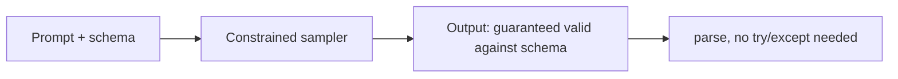

# Structured output

> **In one line:** Structured output makes the model emit data your code can `JSON.parse`/`pydantic.parse` directly. It's the bridge between probabilistic text and deterministic systems.

:::tip[In plain English]
LLMs naturally emit free-form text. Your code wants typed objects. Structured output is the provider promising "I'll constrain the model's word choices so the result is valid JSON matching your schema." You stop writing "extract the JSON from this prose with a regex" code, forever.
:::

:::note[Prerequisites]
This lesson leans on **[JSON](./programming-basics.md#3-json)** throughout — the output format and the schema that describes it are both JSON. New to it? → [Programming on-ramp](./programming-basics.md#3-json).
:::

## Three levels of guarantee

1. **"Please respond in JSON" in the prompt.** Sometimes works, often doesn't. Don't ship this.
2. **JSON mode** — provider guarantees the output is valid JSON. Doesn't guarantee it matches your schema.
3. **Schema-constrained / "structured outputs"** — provider constrains the sampler so the output is guaranteed to conform to your JSON Schema or Pydantic model. The right choice for almost any production extraction or classification task.



OpenAI, Anthropic, Google, and most open-source inference servers (vLLM, llama.cpp via Outlines/Instructor) now support level 3 in some form.

## What to ask for

Define the schema in your code — Pydantic in Python, Zod in TypeScript, or raw JSON Schema. Pass it to the API. The model is sampled subject to the schema's constraints; the result is guaranteed parseable.

### Python (Pydantic) example

```python
from pydantic import BaseModel
from typing import Literal
from openai import OpenAI

client = OpenAI()

class TicketTriage(BaseModel):
    category: Literal["billing", "technical", "account", "other"]
    priority: Literal["low", "medium", "high"]
    summary: str
    needs_human: bool

result = client.beta.chat.completions.parse(
    model="gpt-5-mini",
    messages=[
        {"role": "system", "content": "Triage support tickets."},
        {"role": "user", "content": "I've been charged twice for my subscription this month!!!"},
    ],
    response_format=TicketTriage,
    temperature=0,
)
triage: TicketTriage = result.choices[0].message.parsed
print(triage.category)  # 'billing'
print(triage.priority)  # 'high'
```

`triage` is a real Pydantic object. Autocomplete works. Type checkers are happy. The function this lives in *returns a typed thing*.

### TypeScript (Zod) example

```typescript
import { z } from 'zod';
import { generateObject } from 'ai';
import { openai } from '@ai-sdk/openai';

const TicketTriage = z.object({
  category: z.enum(['billing', 'technical', 'account', 'other']),
  priority: z.enum(['low', 'medium', 'high']),
  summary: z.string(),
  needsHuman: z.boolean(),
});

const { object } = await generateObject({
  model: openai('gpt-5-mini'),
  schema: TicketTriage,
  prompt: "I've been charged twice this month!!!",
});

object.category;  // 'billing', fully typed
```

Same idea, Zod schema, fully typed output.

## Why this changes design

- **You can treat LLM output as a typed function return.** Suddenly LLMs compose with the rest of your code without a regex-and-prayer parsing layer.
- **Classification becomes a one-line tool.** A `Literal[...]` field plus a 3-line prompt replaces a fine-tuned classifier for most cases.
- **Multi-field extraction in one shot.** "Pull the name, date, dollar amount, and urgency from this email" → one call, one typed object.
- **Forms fill themselves.** Combine with streaming partial JSON and the UI can render fields as they arrive.
- **You can pipe one LLM call's output into another's input** with no glue code.

## Worked example: extracting structured data from messy emails

```python
class Invoice(BaseModel):
    vendor: str
    amount_usd: float
    due_date: str  # ISO format
    line_items: list[str]
    is_recurring: bool

email = """
Hi,
Reminder: your monthly invoice from Acme Cloud Hosting is due May 30, 2026.
Amount: $129.95 USD
Items: 2x VPS (small), 1x backup storage.
Thanks!
"""

invoice = client.beta.chat.completions.parse(
    model="gpt-5-nano",
    messages=[
        {"role": "system", "content": "Extract invoice details. Use ISO dates."},
        {"role": "user", "content": email},
    ],
    response_format=Invoice,
).choices[0].message.parsed

# invoice.vendor       == 'Acme Cloud Hosting'
# invoice.amount_usd   == 129.95
# invoice.due_date     == '2026-05-30'
# invoice.is_recurring == True
```

Half a page of code, no regex, runs on a *small* model, costs fractions of a cent per email. This pattern — "extract a typed record from natural language" — is the single most lucrative LLM application in B2B.

## Gotchas

- **Schemas with deeply nested or recursive types may be rejected** by providers. Flatten when possible.
- **Constrained sampling is slightly slower** than unconstrained — the sampler has to mask invalid tokens at every step.
- **The model still has to *want* to fill the right values.** A schema can't fix a bad prompt or missing context. If a field is `Optional`, the model will leave it blank when it can't find the answer; if it's required, it may hallucinate.
- **`enum` / `Literal` is powerful.** Use it generously — it eliminates a class of errors.
- **Some providers require schemas to set `additionalProperties: false`** at every level. The SDK usually handles this; raw JSON Schema users may need to add it.
- **Streaming + structured output = partial JSON.** Use a partial-JSON parser if you want to render fields as they arrive. See [Streaming](./streaming.md).

## When NOT to use schema-constrained output

- **Long-form prose** — book chapters, essays. JSON wrapping just gets in the way.
- **When the schema is so loose it's useless** — `{"text": str}` adds friction without benefit; just take the string.
- **When you need maximum quality on a hard reasoning task** — constrained sampling subtly reduces quality vs unconstrained on long, open-ended outputs. For extraction it's net positive; for "write me a deep analysis" it's net negative.

## What beginners get wrong

:::caution[Common mistakes]
- **Believing JSON mode = schema mode.** JSON mode returns valid JSON, with whatever keys the model felt like emitting. Schema mode forces *your* shape.
- **Building schemas the model can't actually fill from the input.** Asking for `customer_lifetime_value: float` from a single tweet will get you a hallucinated number. Make required fields the ones the input actually contains.
- **Recursive or deeply nested schemas.** Providers cap depth and complexity. Flatten where possible; reach for two passes (extract IDs, then resolve) if you must.
- **Forgetting to handle refusals.** A model that refuses to answer for safety reasons may emit `null` or a refusal object. Always check.
- **Setting temperature high while extracting structured data.** Higher temperature = more invented values. Use 0.
- **Treating the parsed object as truth.** The shape is guaranteed; the *values* aren't. Validate critical fields (emails, amounts) downstream.
:::

:::info[Highlight: structured output collapsed a thousand parsing pipelines]
Pre-2024, every team had a homegrown "fix the LLM's broken JSON" function. Today it's a one-line `response_format=YourModel`. If you're still writing regex against LLM output, you're working harder than you need to.
:::

**→ Going deeper:** For the production view — defaulting *everything* to typed output, validation as defense-in-depth, streaming partials, and the provider matrix — see [Structured output everywhere](../10-patterns/structured-output.md).

<Quiz id="structured-output-quick-check" variant="micro" title="Quick check">

<Question
  prompt="A teammate switches an extraction endpoint from plain prompting to the provider's JSON mode and declares the schema problem solved. What is still NOT guaranteed?"
  options={[
    { text: "That the output is syntactically valid JSON" },
    { text: "That the model will respond at all" },
    { text: "That the JSON contains the keys and types your schema expects" },
    { text: "That the response can be streamed" }
  ]}
  correct={2}
  explanation="JSON mode only promises well-formed JSON — the model can still emit whatever keys it feels like. Schema-constrained structured output is the level that forces your exact shape. The first option is the tempting trap because it sounds like the same promise, but validity and schema conformance are different guarantees: JSON mode gives you the first, only schema mode gives you the second."
/>

<Question
  prompt="You make customer_lifetime_value a required float field while extracting from a single short tweet. What is the most likely outcome?"
  options={[
    { text: "The model hallucinates a plausible-looking number to satisfy the schema" },
    { text: "The API rejects the request because the field cannot be filled" },
    { text: "The field is automatically returned as null" },
    { text: "Constrained sampling slows down until the model finds the true value" }
  ]}
  correct={0}
  explanation="The schema guarantees shape, not truth. If a required field can't be found in the input, the model invents a value rather than violate the schema. The API has no idea whether a value is findable, so it won't reject the request — and a required float can't legally be null. The fix is to make unfindable fields Optional, or only require fields the input actually contains."
/>

<Question
  prompt="For which task is schema-constrained output likely to make results WORSE rather than better?"
  options={[
    { text: "Triaging support tickets into fixed categories" },
    { text: "Extracting invoice fields from messy emails" },
    { text: "Classifying sentiment with a Literal field" },
    { text: "Writing a long, open-ended analytical essay" }
  ]}
  correct={3}
  explanation="Constrained sampling subtly reduces quality on long, open-ended outputs — the sampler masks tokens at every step, which is net negative for deep prose. For extraction and classification it's net positive, which is why the first three options are exactly where structured output shines. For essays, just take the string."
/>

</Quiz>

---

→ Next: [Tool use / function calling](./tool-use.md)
