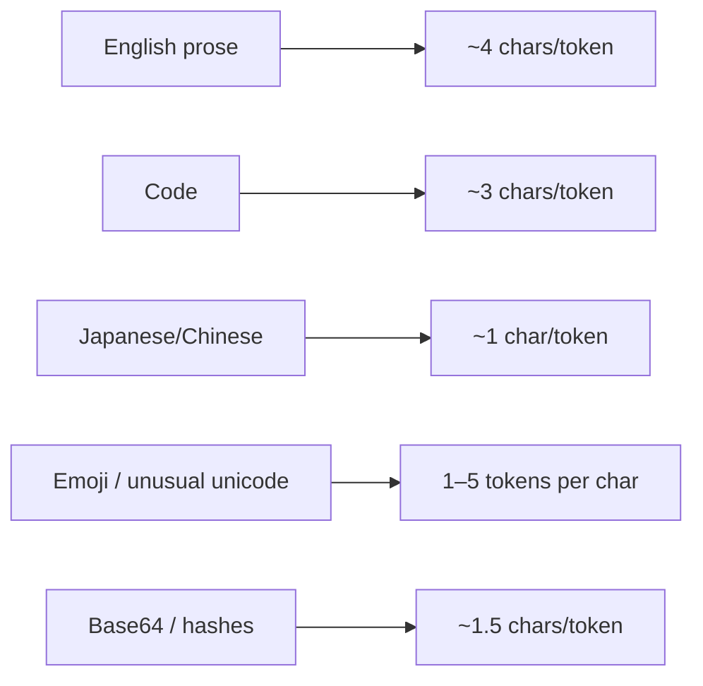

# Tokenizers

> **In one line:** A tokenizer is the deterministic function that splits text into the integer IDs an LLM consumes. Different models use different tokenizers — same input string, different token count, different bill.

:::tip[In plain English]
Tokenizers are like spell-checkers but for chopping text. They learn, during training, which character sequences appear so often that they deserve their own ID — "the", "ation", "json", " function". Common stuff becomes one token. Weird stuff (emoji, rare languages, base64 blobs) gets split into many small pieces and costs you more.
:::

## The two algorithms you'll meet

Almost every modern LLM tokenizer is one of these:

- **BPE (Byte-Pair Encoding)** — Start with raw bytes. Repeatedly merge the most common adjacent pair into a single new token. Used by GPT-2/3/4, Claude, Llama, Mistral, most open models. Variant: **byte-level BPE** (works on UTF-8 bytes, can encode literally any string).
- **SentencePiece (unigram or BPE mode)** — Treats text as a raw stream (no pre-tokenization on whitespace). Used by Gemini, T5, many multilingual models. Better for languages without word boundaries (Chinese, Japanese).

You'll never implement one. You will care that **they're not interchangeable** — a string tokenized with one will not decode correctly with another.

## tiktoken — what to actually run

For OpenAI / GPT-style models:

```python
import tiktoken

enc = tiktoken.encoding_for_model("gpt-4o")
ids = enc.encode("Hello, world!")
print(ids)           # [13225, 11, 2375, 0]
print(enc.decode(ids))  # 'Hello, world!'
```

For Anthropic:

```python
from anthropic import Anthropic
client = Anthropic()
count = client.messages.count_tokens(
    model="claude-sonnet-4-5",
    messages=[{"role": "user", "content": "Hello, world!"}],
)
print(count.input_tokens)
```

For Google Gemini:

```python
from google import genai
client = genai.Client()
result = client.models.count_tokens(model="gemini-2.5-pro", contents="Hello, world!")
print(result.total_tokens)
```

Three different SDKs, three different numbers for the same string. That's the point.

## Worked example: the same paragraph across three tokenizers

```python
text = "Retrieval-Augmented Generation (RAG) lets the model cite sources."

# OpenAI o200k_base (used by gpt-4o, o-series)
import tiktoken
print(len(tiktoken.encoding_for_model("gpt-4o").encode(text)))  # ~13

# Anthropic
# claude.count_tokens(...)  # ~14

# Llama 3 (sentencepiece BPE)
# from transformers import AutoTokenizer
# AutoTokenizer.from_pretrained("meta-llama/Llama-3.1-8B").encode(text)  # ~15
```

Three models, three counts within ±15% of each other. For one short sentence that's noise. For a 100K-token document being uploaded across providers, that's hundreds of dollars of difference per million queries.

## Where tokenization hurts the most



**Multilingual:** English is the cheapest language for most tokenizers because the training corpus was mostly English. Translating a paragraph from English to Japanese can 3–4× its token count for OpenAI tokenizers; SentencePiece-based ones (Gemini, multilingual Llama variants) handle it better but still not as efficiently as English.

**Code:** Indentation, brackets, and operators each become tokens. A Python function that's 30 lines and 800 characters might be 280 tokens. Same logic in a more verbose language (Java) — more.

**Big random strings:** UUIDs, hashes, base64 blobs, JWTs. These are nearly worst-case — no patterns to merge, so the tokenizer falls back to short pieces. A 4-line base64 image can be 2,000 tokens.

## Counting tokens *before* sending

You should do this any time:

- You build a context out of variable-sized chunks (RAG) and need to stay under a window.
- You estimate cost in a UI before a user submits.
- You batch many requests and need to predict TPM consumption.

```python
def fits_in_window(messages, model="gpt-4o", window=128_000, output_budget=4_000):
    enc = tiktoken.encoding_for_model(model)
    used = sum(len(enc.encode(m["content"])) for m in messages)
    used += 4 * len(messages)  # rough overhead per message
    return used + output_budget <= window
```

The `4 * len(messages)` is a heuristic for role/format overhead. The real number depends on the provider; for production accounting, use the provider's own counter.

## What beginners get wrong

:::caution[Common mistakes]
- **Mixing tokenizers across an embedding+retrieval pipeline.** If you embed with one model's tokenizer and retrieve with another's, distances become noise. Re-embed when you change models.
- **Estimating with `len(text) / 4`.** Fine for English prose. Wildly wrong for code, JSON, Japanese, or anything with whitespace shaped weirdly.
- **Sending one giant string when you could send pre-tokenized arrays.** Some providers accept token IDs directly (faster, cheaper to pre-process locally). Worth it for high-throughput pipelines.
- **Forgetting that special tokens (`<|im_start|>`, `<|endoftext|>`, etc.) count.** Every chat message has 2–10 tokens of overhead you can't see.
- **Treating Hugging Face's `AutoTokenizer` as authoritative for a hosted model.** Sometimes the deployed tokenizer drifts from the public one. The provider's `count_tokens` API is the truth.
:::

## Practical implications

- **For multilingual products:** budget 2–3× more tokens than the English equivalent, or pick a tokenizer optimized for the target languages (Gemini, multilingual Llama, BLOOM).
- **For code-heavy prompts:** budget 30% more tokens than the same content as prose. Watch out for huge JSON tool schemas.
- **For RAG:** chunk by token count, not character count — otherwise some chunks will be too big and silently truncated.
- **For cost estimates:** always count with the provider's actual tokenizer at runtime, not a rule of thumb at design time.

:::info[Highlight: tokenizers are silently the most asymmetric part of pricing]
Two models advertised at the same $/1M tokens can have 30%+ different real costs on your actual workload, just because their tokenizers chop your text differently. Always benchmark on *your* prompts.
:::

<Quiz id="tokenizers-quick-check" variant="micro" title="Quick check">

<Question
  prompt="You count the same paragraph with tiktoken, with Anthropic's counter, and with a Llama tokenizer, and get three different numbers. What does this tell you?"
  options={[
    { text: "One of the libraries has a bug" },
    { text: "Each model family uses its own tokenizer, so counts legitimately differ" },
    { text: "You need to normalize the text encoding first" },
    { text: "Token counts are random and only the final bill is meaningful" }
  ]}
  correct={1}
  explanation="Tokenizers are not interchangeable — each model family learned its own vocabulary during training, so the same string genuinely produces different token counts. This is why comparing prices across providers implicitly compares tokenizers too: two models with the same advertised per-token price can have 30 percent different real costs on your actual workload."
/>

<Question
  prompt="Which input is closest to worst-case for a tokenizer, costing the most tokens per character?"
  options={[
    { text: "A base64 blob, UUID, or random hash" },
    { text: "Common English prose" },
    { text: "A short Python function" },
    { text: "A frequently used English word like 'the'" }
  ]}
  correct={0}
  explanation="Tokenizers compress by merging frequently seen character patterns. Random strings like base64, UUIDs, and hashes have no patterns to merge, so they shatter into many tiny tokens — a 4-line base64 image can be about 2,000 tokens. Common prose is the cheapest case, and code sits in between at roughly 3 characters per token."
/>

<Question
  prompt="Your cost estimator divides character count by 4 to predict tokens. Where will it break down badly?"
  options={[
    { text: "On long English essays" },
    { text: "On short English tweets" },
    { text: "On code, JSON, and Japanese text" },
    { text: "Nowhere — 4 characters per token is exact for all text" }
  ]}
  correct={2}
  explanation="The divide-by-4 heuristic only fits English prose. Code and JSON tokenize denser because brackets, operators, and indentation each become tokens, and Japanese can approach one token per character. When the number actually matters — RAG chunk budgets, cost estimates, TPM planning — count with the provider's real tokenizer at runtime."
/>

</Quiz>

---

→ Next: [Embeddings](./embeddings.md)
