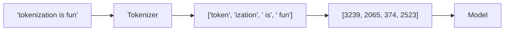

# Tokens

> **In one line:** A token is the chunk of text an LLM actually sees — usually 3–4 characters or about ¾ of a word in English. Every bill, every context limit, and every latency number is measured in tokens.

:::tip[In plain English]
Computers don't think in words; they think in numbers. A *tokenizer* is the dictionary that converts your text ("Hello, world!") into integers (`[9906, 11, 1917, 0]`) the model can multiply. Each integer is a "token." When you pay for an LLM, you're paying per integer in and per integer out — not per character, not per word.
:::

## What a token actually is

Models don't read characters or words directly. They read tokens — integer IDs from a **tokenizer**'s vocabulary. Common words become a single token (`" the"` → 262). Rarer words split into pieces (`"tokenization"` → `"token"` + `"ization"`). Whitespace and punctuation become their own tokens. Non-English text and code often tokenize less efficiently than English prose.

Rough rule of thumb for English: **1 token ≈ 4 characters ≈ ¾ of a word**. So 1,000 tokens ≈ 750 words ≈ a long-ish email.

<PredictThenReveal
  id="tokens-count-guess"
  question="Before you read on, commit to a guess: the Japanese greeting 'こんにちは世界' is 7 characters. Will it tokenize into FEWER than 7 tokens, about 7, or MORE than 7?">

**More** — about **8 tokens** for 7 characters. English is what tokenizers are optimized for (~4 characters per token); many non-English scripts land near *one token per character* or worse, so the same-looking sentence costs more. You'll see this exact example measured in the worked section below.

</PredictThenReveal>



## Worked example: counting tokens before sending

```python
import tiktoken

enc = tiktoken.encoding_for_model("gpt-4o")
text = "The quick brown fox jumps over the lazy dog."
tokens = enc.encode(text)

print(len(tokens))  # 10
print(tokens)       # [791, 4062, 14198, 39935, 35308, 927, 279, 16053, 5679, 13]
print([enc.decode([t]) for t in tokens])
# ['The', ' quick', ' brown', ' fox', ' jumps', ' over', ' the', ' lazy', ' dog', '.']
```

Notice three things: the leading space on most tokens (whitespace is part of the *next* token, not the previous), the period is its own token, and "fox" / "jumps" / "lazy" all happen to be single tokens because they're common.

Try it with code or another language and watch the ratio fall apart:

```python
print(len(enc.encode("def foo(x): return x * 2")))     # 9 tokens, ~28 chars (3.1 chars/token)
print(len(enc.encode("こんにちは世界")))                  # 8 tokens, 7 chars (0.9 chars/token!)
print(len(enc.encode("supercalifragilisticexpialidocious")))  # 8 tokens, 34 chars
```

Japanese needs *more tokens per character* than English. That's why non-English chat costs more per "word" — same content, more integers.

## Why this matters

Every cost and limit you'll see is per token, not per request:

- **Pricing** — $/million input tokens and $/million output tokens. Output is usually 3–5× more expensive than input.
- **Context window** — the model's hard limit (e.g., 200K tokens) is measured in tokens, not characters.
- **Latency** — output tokens are generated one at a time. A 2,000-token answer takes ~20× longer than a 100-token answer at the same throughput.
- **Rate limits** — provider quotas are TPM (tokens per minute) and RPM (requests per minute). The TPM cap bites first for any non-trivial app.

"$5 per million tokens" stays abstract until it's a monthly bill. Set your request shape and volume below, switch pricing tiers, and watch the cost — and the input-vs-output split — move:

<TokenCostCalculator />

The thing to internalize: **output tokens dominate the bill** (they're billed several times higher than input), so a verbose model costs more than a long prompt. This is why trimming output and [caching stable prefixes](./prompt-caching.md) pay off so fast.

## A useful mental conversion table (English prose)

| Tokens   | Words   | What that's about                  |
|----------|---------|------------------------------------|
| 50       | 38      | A tweet                            |
| 500      | 375     | A short email                      |
| 2,000    | 1,500   | A long blog post                   |
| 8,000    | 6,000   | A chapter                          |
| 100,000  | 75,000  | A short novel                      |
| 1,000,000| 750,000 | *War and Peace* twice over         |

For code, JSON, and non-English: assume roughly 1.5–2× more tokens for the same character count.

## Tokenizers vary by model

Different model families use different tokenizers (BPE, SentencePiece, etc.). The same string can be 100 tokens for one model and 130 for another. When you compare prices across providers, you're implicitly comparing tokenizers too. We cover this in detail on the next page.

## What beginners get wrong

:::caution[Common mistakes]
- **Confusing tokens with words.** "8K context" doesn't mean 8,000 words — it means about 6,000 words, less for code.
- **Ignoring the output budget.** Most providers count input *and* output against the context window. A 199K-token prompt in a 200K-window model can emit at most 1K tokens.
- **Estimating in characters and being off by 30%.** Use a real tokenizer (`tiktoken`, `anthropic.count_tokens`, `@google/generative-ai` token counter) when the number matters.
- **Forgetting that JSON eats tokens.** `{"name": "Alice", "email": "a@b.c"}` is ~20 tokens; the same data as prose ("Alice's email is a@b.c") is ~10. Schema-heavy prompts cost more than you expect.
- **Not capping `max_tokens`.** The model has no idea your UI only shows the first paragraph. Without a cap, a runaway generation can burn 4K tokens and 30 seconds answering "what's 2+2?".
:::

## Practical implications

- **Shorten system prompts you reuse.** A 2,000-token system prompt that runs on every request is a tax on every call.
- **Cap output length explicitly** with `max_tokens` or `max_output_tokens`. The model has no idea your UI only shows the first paragraph.
- **Code and JSON tokenize denser than prose.** Budget accordingly.
- **Estimate token counts before you ship.** Most provider SDKs ship a `count_tokens` helper. Use it.
- **Cache stable prefixes.** A long system prompt that doesn't change between requests can be cached server-side for 5–10× cost savings. See [Prompt caching](./prompt-caching.md).

:::info[Highlight: tokens are the unit of every conversation about LLMs]
When someone says "this model is cheap," they mean dollars per million tokens. When someone says "this model is fast," they mean tokens per second. When someone says "this model has long context," they mean a large token limit. Master the token and you master most LLM conversations.
:::

## Quick reference: token counters in three SDKs

```python
# OpenAI / tiktoken
import tiktoken
enc = tiktoken.encoding_for_model("gpt-4o")
n = len(enc.encode(text))

# Anthropic
from anthropic import Anthropic
n = Anthropic().messages.count_tokens(
    model="claude-sonnet-4-5",
    messages=[{"role": "user", "content": text}],
).input_tokens

# Google Gemini
from google import genai
n = genai.Client().models.count_tokens(model="gemini-2.5-pro", contents=text).total_tokens
```

Three lines per provider. Worth keeping a `count_tokens(text, provider)` helper in your codebase so cost estimates are always one call away.

---

→ Next: [Tokenizers](./tokenizers.md)
