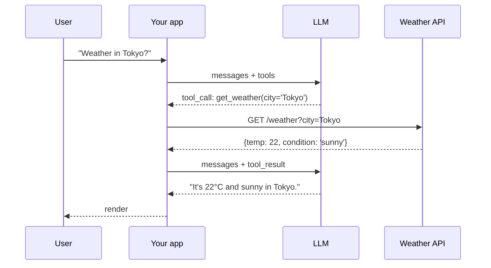

# Tool use / function calling

> **In one line:** You give the model a list of functions it's allowed to call (name, description, JSON-schema parameters). The model can emit "I want to call `get_weather(city='SF')`" instead of plain text. Your code runs the function, returns the result, and the conversation continues.

:::tip[In plain English]
A bare LLM is a brain in a jar — it can talk but can't *do* anything. Tools are the hands. You tell the model "here's a list of buttons you can press, each does X with inputs Y," and it picks the right button at the right time. Your code presses the button. That single mechanism is the foundation of every "AI agent" you've heard of.
:::

## The shape

```python
from openai import OpenAI
client = OpenAI()

tools = [{
    "type": "function",
    "function": {
        "name": "get_weather",
        "description": "Get the current weather for a city.",
        "parameters": {
            "type": "object",
            "properties": {
                "city": {"type": "string", "description": "City name, e.g. 'San Francisco'"},
                "units": {"type": "string", "enum": ["celsius", "fahrenheit"], "default": "celsius"}
            },
            "required": ["city"],
        },
    },
}]

response = client.chat.completions.create(
    model="gpt-5-mini",
    messages=[{"role": "user", "content": "What's the weather in Tokyo?"}],
    tools=tools,
)
```

If the model decides to call a tool, the response contains a `tool_calls` field instead of plain content:

```python
response.choices[0].message.tool_calls
# [ToolCall(id='call_abc', function=Function(name='get_weather', arguments='{"city":"Tokyo"}'))]
```

Your code:

1. Parses the tool call.
2. Executes the function (with the model-provided arguments).
3. Sends the result back as a `tool` role message.
4. Calls the model again — it now has the result and can either call another tool or produce a final answer.



That single turn-by-turn loop is the foundation of every agent.

## Worked example: one full tool round-trip

```python
def get_weather(city: str, units: str = "celsius") -> dict:
    # pretend this hits a real API
    return {"city": city, "temp": 22, "units": units, "condition": "sunny"}

messages = [{"role": "user", "content": "What's the weather in Tokyo?"}]
response = client.chat.completions.create(model="gpt-5-mini", messages=messages, tools=tools)
msg = response.choices[0].message

if msg.tool_calls:
    messages.append(msg)  # keep the assistant's tool-request turn
    for call in msg.tool_calls:
        args = json.loads(call.function.arguments)
        result = get_weather(**args)
        messages.append({
            "role": "tool",
            "tool_call_id": call.id,
            "content": json.dumps(result),
        })
    # Second call: now the model has the tool result
    final = client.chat.completions.create(model="gpt-5-mini", messages=messages, tools=tools)
    print(final.choices[0].message.content)
    # "It's 22°C and sunny in Tokyo right now."
```

Three roles, two API calls, one tool execution. Wrap that in a `while` loop and you have an agent (see [agent loop](./agent-loop.md)).

## Why this is a big deal

- **The LLM becomes a controller.** It picks *which* of your functions to call, with *which* arguments, based on the user's request. You don't write a router; the model is the router.
- **External data and side effects are now accessible** without you parsing free-text intents.
- **Composes with structured output.** A tool's parameters are a JSON schema; the call is guaranteed schema-conformant.
- **Tools are how LLMs grow new abilities.** Code interpreter, web search, database access, file I/O — all just tool definitions.

## Patterns

- **Single-shot tool call** — the model calls one tool, gets the result, answers. Most "AI features" are this.
- **Multi-tool selection** — give the model 3–10 tools, let it pick. Don't go past ~30 unless you've tested it; selection accuracy degrades.
- **Parallel tool calls** — most modern providers support emitting multiple tool calls in one response. Execute them concurrently for latency. See [function calling deep](./function-calling-deep.md).
- **Forced tool choice** — `tool_choice="required"` or `tool_choice={"name": "X"}` forces the model to call (a specific) tool. Useful for guaranteed-structured outputs.
- **Agent loop** — keep calling the model with new tool results until it stops requesting tools (see [The agent loop](./agent-loop.md)).

## Designing good tools

The model picks tools based on:

1. **Tool name** — short, action-y verb. `search_docs`, not `DocumentSearchService_v2_query`.
2. **Description** — the *most important field*. Write it like a docstring for a junior dev. Explain *when* to use this tool and *when not to*.
3. **Parameter descriptions** — clarify units, formats, gotchas. `"city": "City name including country if ambiguous, e.g. 'Paris, France'"`.
4. **Enum values** — use them aggressively. The model can't typo an enum.

A good tool description is the difference between 60% and 95% tool selection accuracy.

## What beginners get wrong

:::caution[Common mistakes]
- **Vague descriptions.** "Searches stuff" tells the model nothing. Write 2–3 sentences explaining when this tool wins.
- **Too many tools.** Past ~20–30 tools, selection accuracy tanks. Group related actions, use a routing first-step, or use multi-agent.
- **Tools with overlapping responsibilities.** Two tools that both "look up users" → the model picks randomly. Make boundaries crisp.
- **Not validating arguments.** Schema constrains shape, not semantics. If `email` must be a real email, validate before acting.
- **Beware tool-use loops.** A model that's confused can call the same tool over and over. Set a max-iteration cap.
- **Forgetting to send `tool_call_id` back.** Each tool result must reference the call ID it's responding to, or the provider rejects it.
- **Stringifying complex tool results poorly.** A 50KB JSON dump as a tool result wastes tokens. Return only what the model needs.
- **Treating tool errors as fatal.** Always return errors *as tool results* so the model can recover (`{"error": "city not found, try again"}`) instead of crashing.
:::

## Tool result format that works

```python
# Bad
{"role": "tool", "content": str(db.query(...).all())}

# Good
{"role": "tool", "tool_call_id": call.id, "content": json.dumps({
    "results": [{"id": r.id, "title": r.title} for r in rows[:5]],
    "total_count": total,
    "truncated": total > 5,
})}
```

Return JSON, paginate, indicate truncation, surface errors as structured fields. The model uses what you give it.

:::info[Highlight: tools are how LLMs grew up]
Pre-2023 LLMs could only emit text. Tools turned them from "fancy autocomplete" into systems that can search, compute, and act. Every agent framework, every Cursor-style coding assistant, every retrieval-augmented chat is downstream of this one primitive.
:::

**→ Going deeper:** For the production discipline — tight tool sets, description craft, parallel execution, structured errors, and human confirmation on destructive actions — see [Tool use done right](../10-patterns/tool-use.md).

<Quiz id="tool-use-quick-check" variant="micro" title="Quick check">

<Question
  prompt="The model responds with a tool_calls entry for get_weather. What must happen before the user gets a final answer?"
  options={[
    { text: "Nothing — the provider executes the function on its servers and returns the answer" },
    { text: "Your code executes the function, appends the result as a tool role message, and calls the model again" },
    { text: "You re-send the same request with tool_choice set to none" },
    { text: "You parse the arguments and show them to the user as the answer" }
  ]}
  correct={1}
  explanation="The model only emits a structured request — it never runs anything. Your code presses the button: execute the function, send the result back referencing the tool_call_id, and make a second model call so it can produce the final answer. The first option is the classic beginner assumption, but the provider has no access to your functions; tools live entirely in your code."
/>

<Question
  prompt="The model keeps picking the wrong tool from your list of five. According to the page, the highest-impact fix is usually to:"
  options={[
    { text: "Switch to a larger model" },
    { text: "Lower the temperature to zero" },
    { text: "Rename all the tools with version numbers" },
    { text: "Rewrite each tool's description to explain when to use it and when not to" }
  ]}
  correct={3}
  explanation="The description is called out as the most important field — written like a docstring for a junior dev, it's the difference between 60% and 95% selection accuracy. A bigger model is the tempting reach, but the model can only choose well based on what you told it about each tool; vague descriptions fail on any model."
/>

<Question
  prompt="A tool call throws an exception because the city wasn't found. What should your code do?"
  options={[
    { text: "Return the error as a structured tool result so the model can recover" },
    { text: "Crash the request so the user sees the failure immediately" },
    { text: "Silently retry the same call until it succeeds" },
    { text: "Remove the tool from the list and call the model again" }
  ]}
  correct={0}
  explanation="Errors returned as tool results (like an error field with a suggestion) let the model try a corrected spelling, retry later, or ask the user for clarification. Letting it crash turns a recoverable hiccup into a 500 for the user — and silently swallowing the failure is worse: the model fills the gap by hallucinating a plausible-looking result."
/>

</Quiz>

---

→ Next: [Function calling, deep](./function-calling-deep.md)
