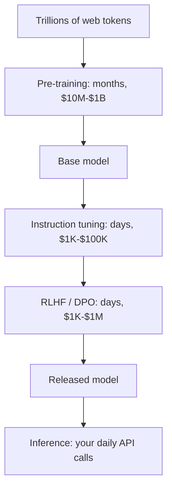
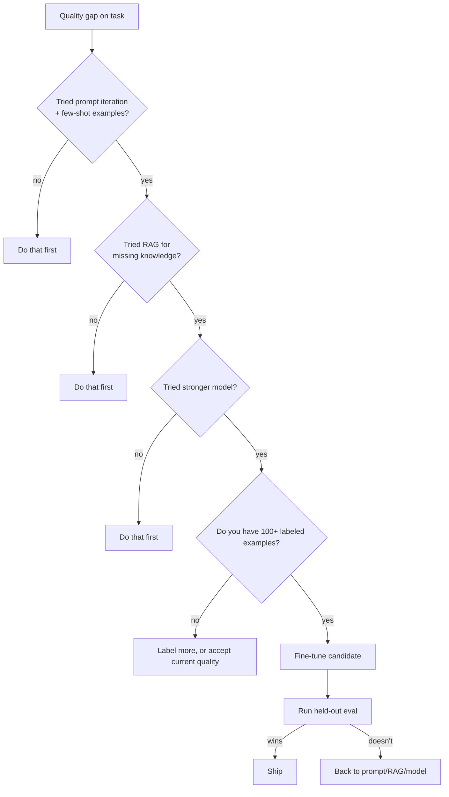

# Training vs. inference

> **In one line:** Training builds the model (rare, expensive, slow). Inference runs the model (constant, cheaper per call, your daily life). Almost everything in this guide is about inference.

:::tip[In plain English]
Think of training as building the recipe book and inference as cooking from it. Building the book takes a team of professional chefs, a year, and a warehouse full of ingredients. Once it's done, anyone can cook a dish in a few minutes. You're going to cook. You're not going to write the book.
:::

## Training

Updates the model's weights using examples. Three flavors:

- **Pre-training** — Building a foundation model from scratch on trillions of tokens. Done by a handful of labs (OpenAI, Anthropic, Google, Meta, Mistral, DeepSeek, xAI). Costs tens of millions to billions of dollars. You will almost certainly never do this.
- **Fine-tuning** — Continuing training on a smaller, task-specific dataset to specialize a model. Now affordable (~$10s–$1000s) for narrow domains. Useful, but not your first move — see [chapter 13](/docs/decisions).
- **RLHF / preference tuning / DPO** — Aligning a model to human preferences. The technique that turned raw pre-trained models into ChatGPT-style assistants. Increasingly accessible via tools like TRL, OpenAI's preference fine-tuning, Anthropic's Constitutional AI.



The whole pipeline above happens once per model release, every 6–18 months. The bottom row — inference — happens millions of times a day.

## Inference

Running the model to generate output. This is what your code does every time it calls an API. Three modes:

- **Hosted API** — You POST a request to OpenAI / Anthropic / Google, you get tokens back. Default for almost everyone.
- **Managed inference of open models** — Together, Fireworks, Groq, Cerebras, Replicate, Modal, Bedrock serve open-weight models (Llama, Mistral, Qwen, DeepSeek, Mixtral) on your behalf.
- **Self-hosted** — You run vLLM / TGI / SGLang / Ollama on your own GPUs. Right when volume justifies it or when data must not leave your environment.

## Worked example: cost shape of one user query

A user asks a 500-token question. The model answers with 1,000 tokens. Using May 2026 prices for a frontier model (~$3 / 1M input, $15 / 1M output):

```
input cost:  500   tokens × $3  / 1M = $0.0015
output cost: 1,000 tokens × $15 / 1M = $0.0150
total: $0.0165 per query
```

At 100K queries/day: ~$1,650/day, ~$50K/month. With prompt caching on a 4K-token system prompt: ~30% lower. With a smaller workhorse model: ~70% lower. Your bill is dominated by output tokens, then input tokens, then almost nothing else. There is no "training cost" line — you're using someone else's model.

## Why the distinction matters

- **Daily reality is inference.** Your performance budget, cost model, and tooling are all about per-call latency and per-token price — not training compute.
- **Fine-tuning is a *last* resort, not a first.** Prompting and retrieval get you 90% of the way for ~1% of the work. Reach for fine-tuning when you have evidence the base model can't do the task even with great prompts and good retrieval.
- **2026 trend: cheaper, faster inference.** Speculative decoding, KV-cache reuse, quantization (FP8, INT4), prompt caching, and per-token pricing wars have made inference 5–20× cheaper than it was in 2023. Plan capacity around 2026 prices, not 2024 ones.
- **The training/inference gap is asymmetric.** Pre-training a frontier model costs $100M+; running it for a single user costs cents. That's why the foundation model business model works.

## When fine-tuning actually pays off

Despite the disclaimers, fine-tuning has clear wins:

- **Tone / style at scale** — getting a small model to consistently match your brand voice without a giant system prompt on every call.
- **Structured output the base model fights you on** — extreme schema constraints, custom formats.
- **Latency-critical narrow tasks** — distilling a frontier model into a smaller one for a single repetitive task (classification, routing, extraction). Often 5–20× cheaper per call.
- **Domain language** — heavy specialist vocab (medical, legal, code in a rare framework) where the base model keeps "translating."

Fine-tuning does *not* fix:

- Lack of knowledge (use RAG).
- Reasoning errors (use a stronger model or chain-of-thought).
- Hallucinations on facts (use RAG + citations).

## What beginners get wrong

:::caution[Common mistakes]
- **Reaching for fine-tuning to fix bad prompts.** Spend a day on the prompt and examples first. Most "fine-tune this" tickets I've seen turn out to be "improve the prompt."
- **Confusing fine-tuning with RAG.** Fine-tuning teaches *style and behavior*. RAG provides *knowledge*. Mixing them up sends you down the wrong rabbit hole for weeks.
- **Picking self-hosted before you need to.** vLLM on an H100 is great, but if you're doing 1M tokens/day, the hosted API is cheaper and you have zero ops. Self-host when volume × price-gap > your time.
- **Forgetting the eval set.** Without a held-out eval, you can't tell if your fine-tune helped or hurt. Build the eval before you train. Always.
- **Assuming hosted = always cheapest.** At very high volume, self-hosting a strong open model (Llama-3.3-70B, Qwen-2.5-72B) on H100s can be 3–10× cheaper per token than a frontier hosted API. The crossover point keeps moving — re-check yearly.
:::

:::info[Highlight: the cheapest place on the curve in 2026]
For most workloads, the cheapest production setup is **a strong open model served by a managed inference provider** (Groq, Fireworks, Together, Cerebras), with prompt caching on. This beats both "hit the most expensive frontier API" and "self-host on day one." Check your real numbers — don't assume.
:::

## A decision flow for "should I fine-tune?"



Most teams that "need fine-tuning" find the answer in B, D, or F.

## Provider landscape for inference (May 2026)

| Provider             | Best for                                             |
|----------------------|------------------------------------------------------|
| **OpenAI**           | GPT-5 family, Realtime API, broad SDK                |
| **Anthropic**        | Claude family, strong agent + caching primitives     |
| **Google**           | Gemini, longest context, integrated with GCP         |
| **xAI**              | Grok models                                          |
| **Mistral / Cohere** | Closed APIs over their own open + closed models      |
| **Together / Fireworks / Replicate / Modal** | Open models, managed             |
| **Groq / Cerebras / SambaNova** | Specialty hardware, very low latency     |
| **AWS Bedrock / Azure AI / Vertex** | Multi-vendor through hyperscalers       |
| **vLLM / SGLang / TGI / Ollama** | Self-hosting OSS                           |

Most production apps end up multi-provider: a frontier API for hard requests, a workhorse for the bulk, sometimes a small self-hosted model for high-volume tasks.

<Quiz id="training-vs-inference-quick-check" variant="micro" title="Quick check">

<Question
  prompt="Your model keeps giving outdated answers about your product's features. Should you fine-tune it on your docs?"
  options={[
    { text: "Yes — fine-tuning is how you teach the model product knowledge" },
    { text: "Yes, but only once you have 100 labeled examples" },
    { text: "No — missing or stale knowledge is a RAG problem; fine-tuning teaches style and behavior, not facts" },
    { text: "No — you should pre-train a new model on your docs" }
  ]}
  correct={2}
  explanation="Fine-tuning shapes tone, format, and behavior; it is a poor and expensive way to inject knowledge, and it goes stale the moment your docs change. Retrieval (RAG) supplies current facts at request time. Confusing the two sends teams down the wrong rabbit hole for weeks — it is the page's headline warning. Pre-training costs tens of millions and is done by a handful of labs."
/>

<Question
  prompt="As an AI engineer building product features, which of these will you actually do every day?"
  options={[
    { text: "Pre-training foundation models" },
    { text: "Inference — calling a trained model via an API" },
    { text: "RLHF preference tuning" },
    { text: "Writing GPU kernels for training runs" }
  ]}
  correct={1}
  explanation="Pre-training happens once per model release at a handful of labs; your daily work is inference — sending requests and handling responses. Even fine-tuning and RLHF are occasional, evidence-driven moves, not routine. That is why your performance budget, cost model, and tooling all revolve around per-call latency and per-token price."
/>

<Question
  prompt="In the worked example, a 500-token question gets a 1,000-token answer at 3 dollars per million input and 15 dollars per million output. What dominates the bill?"
  options={[
    { text: "Input tokens, because the prompt includes the system prompt" },
    { text: "Training amortization fees from the provider" },
    { text: "A fixed per-request charge" },
    { text: "Output tokens — 1.5 cents of the 1.65-cent total" }
  ]}
  correct={3}
  explanation="Output tokens cost 5 times more per token here and the answer is twice as long as the question, so output is roughly 90 percent of the cost. There is no training line and no fixed per-request fee — you pay per token in and per token out, which is why capping and shortening outputs is the first cost lever to pull."
/>

</Quiz>

---

→ Next: [Reasoning models](./reasoning-models.md)
