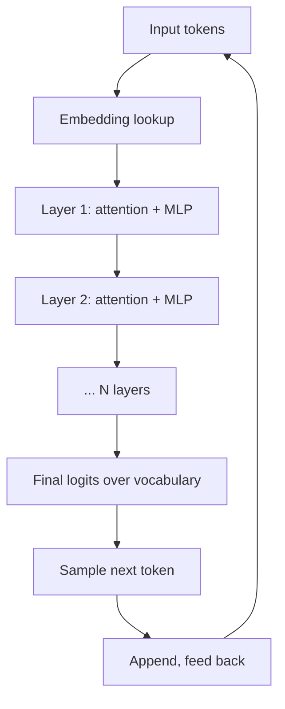
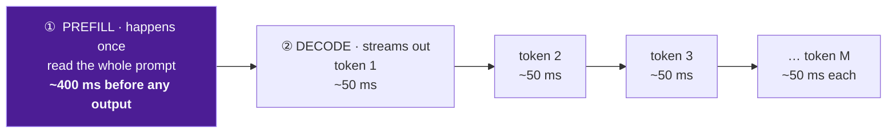

# The transformer (just enough)

> **In one line:** Every modern LLM is a transformer — a stack of layers that, for each token, computes a weighted view of every other token in the context (that's "attention") and uses it to predict the next token.

:::tip[In plain English]
A transformer reads a sequence by letting each word "look at" every other word and decide how much to listen to it. That's *attention*. Stack 60–100 of those layers, train on the internet, and you get something that can finish your sentence in a way that's usually correct. The architecture is the same — the magic is the scale and the training data.
:::

You don't need to implement one to build with one. You do need a mental model so concepts like *context window*, *KV cache*, *prefix caching*, and *quadratic cost in context length* make sense.

## The 30-second version

1. **Tokenize** the input into a sequence of token IDs.
2. **Embed** each token into a vector.
3. **Pass through N transformer layers.** Each layer's core trick: **attention** — each token computes how much it cares about every other token, then mixes their information accordingly.
4. **Predict** the next token: a probability distribution over the whole vocabulary.
5. **Sample** one token, append, repeat.

That loop is *inference*. It's the only operation you'll ever invoke.

## Attention, intuitively

Imagine reading the sentence *"The trophy didn't fit in the suitcase because it was too big."* What does "it" refer to? You probably re-read and considered both "trophy" and "suitcase" before deciding "trophy."

That's attention. Each token, at each layer, computes a query vector, looks at every other token's key vector, and gets a similarity score. The scores are normalized into weights. The token then mixes in a weighted sum of the other tokens' value vectors.

The result: every token's representation is updated to reflect "what every other relevant token says about me." Stack 60 of these layers and the model has effectively re-read the entire context dozens of times, each time refining its understanding.

## Why this shape matters in practice

- **Attention is roughly O(n²) in context length.** Doubling the context quadruples some costs. This is why long contexts are expensive and why prompt caching matters so much.
- **Generation is autoregressive.** Output tokens are produced one at a time, each depending on all previous tokens. You can't parallelize a single response's tokens — only batch across requests.
- **The KV cache** stores intermediate attention state for prior tokens so each new token doesn't re-process everything. This is what providers cache in "prompt caching" — same prefix, same KV cache.
- **More parameters ≠ always better.** A 405B model is more capable than a 7B one, but ~50× more expensive to serve. The 2026 trick is "the cheapest model that passes your evals."

## Prefill vs decode — two phases you'll see in the bill

A single LLM call has two phases:

- **Prefill** — process all the input tokens. Highly parallel; one big matrix multiply. Cost scales with *input length × model size*.
- **Decode** — generate output tokens one at a time. Each token does one matrix multiply against the KV cache. Cost scales with *output length × model size*.

Providers price them differently:

- **Input tokens** are cheap (usually 3–5× cheaper than output) because prefill is parallel and amortized.
- **Output tokens** are expensive because decode is sequential and harder to batch.

Time-to-first-token (TTFT) is dominated by prefill. Tokens-per-second after that is dominated by decode. If a 1000-token answer feels slow to start but fast once it starts, you're seeing this distinction.

## Worked example: why a 200K-token prompt isn't 20× slower than a 10K-token one

Naively, attention is O(n²), so 200K should be 400× more expensive to prefill than 10K. In practice it's closer to 30–50× because:

- Providers use **flash attention** and **paged attention** to keep memory access cheap.
- **Speculative decoding** uses a small draft model to propose tokens that the big model only verifies.
- **Prefix caching** means if the same first 150K tokens were seen recently, they cost nothing on this call.

You don't need to understand these in detail. You do need to know they exist so you don't blindly assume "long context = ruinous."

## What you don't need to know

- The math of multi-head attention.
- Positional encodings (rotary vs. ALiBi vs. learned).
- Layer norm placement (pre-norm vs post-norm).
- Mixture-of-experts vs. dense weight distribution.
- Quantization formats (FP16 vs BF16 vs FP8 vs INT4).

You can productively build LLM apps for years without touching any of those. If you decide to specialize in inference optimization or fine-tuning, *then* dig in.

Go deeper (optional): how attention is actually computed

Nothing later in the guide depends on this — skip it freely. But if you want the concrete version of "each token computes a weighted view of every other token":

For each token the model builds three vectors — a **query** (`q`), a **key** (`k`), and a **value** (`v`) — by multiplying the token's embedding by three learned matrices. The attention weight from token *i* to token *j* is the dot product `qᵢ · kⱼ`, divided by √(head dimension) for stability, then passed through a **softmax** over all *j* so the weights sum to 1. The token's new representation is that softmax-weighted sum of every `vⱼ`. **Multi-head** attention just runs several independent `(q, k, v)` projections in parallel and concatenates the results, so different heads can specialize — one might track grammatical subjects, another long-range references like the "it → trophy" example above.

That "softmax over *all* tokens" is exactly where the **O(n²)** cost comes from: every token attends to every other, so work grows with the square of the context length.

## What beginners get wrong

:::caution[Common mistakes]
- **Picturing the LLM as a database lookup.** It's a *function*. Given the same prompt, it computes the answer fresh each time. There's no key-value store of "facts" inside.
- **Believing "more parameters = strictly better."** Below a threshold, yes. Above ~70B, marginal returns on most tasks are tiny and cost is huge. Eval-driven choice beats parameter-count theater.
- **Confusing context window with memory.** The transformer has no memory across calls. Each request starts from scratch with whatever tokens you sent. "Memory" is something *you* implement.
- **Assuming attention is the whole model.** Half the parameters in a transformer block are the *feed-forward MLP*, not attention. That's where most of the learned "facts" live.
- **Treating model size as the only knob.** A small model with good RAG and tools often beats a huge model alone. Architecture > size for most production decisions.
:::

:::info[Highlight: the transformer didn't get better; we got better at scaling it]
The 2017 paper invented attention as we know it. Eight years later the architecture is essentially unchanged — bigger, better-trained, sparser experts, longer contexts, but the same skeleton. Most progress has come from data quality, RLHF, and engineering, not from a new architecture.
:::

## A useful mental picture for the bill

Think of each request as two phases — one slow prefill, then token-by-token decode:

- Prefill (~400ms in the diagram) is what you wait for before *anything* shows up. Long prompts blow this up. Caching cuts it dramatically.
- Decode (~50ms per token after) is the streaming phase. The total decode time scales with output length, almost linearly.

Two distinct latency knobs, two distinct billing lines — same call.

## Mixture-of-experts in one paragraph

Modern frontier models often use MoE — instead of every token using all 400B parameters, only 30–50B "experts" activate per token. Same quality as a dense model with the same active params, ~5–10× cheaper to serve. Examples in 2026: Mixtral-style, DeepSeek V4, GPT-5 (assumed), Claude Opus 4.8 (assumed). You don't pick this; the provider does. It just means "open weights = X B params" and "active per token = Y B params" are two different numbers worth knowing when self-hosting.

<Quiz id="transformer-quick-check" variant="micro" title="Quick check">

<Question
  prompt="A user complains the chatbot 'takes forever to start answering' but streams quickly once it starts. Which phase is the bottleneck?"
  options={[
    { text: "Decode — output tokens are generated too slowly" },
    { text: "Tokenization — converting text to IDs is slow" },
    { text: "Prefill — processing the long input prompt dominates time-to-first-token" },
    { text: "The network — the provider is buffering tokens" }
  ]}
  correct={2}
  explanation="Time-to-first-token is dominated by prefill, where the model processes every input token before generating anything. Once decode starts, tokens stream at a steady per-token rate. A slow start with fast streaming is the signature of a long prompt — and it is exactly the cost that prompt caching, which skips repeated prefill work, eliminates."
/>

<Question
  prompt="You call the model twice and expect the second call to remember the first. What does this page say actually happens?"
  options={[
    { text: "The model keeps a short-term memory of recent requests" },
    { text: "Memory persists, but only within the same API key" },
    { text: "The provider stores your session for a few minutes" },
    { text: "Nothing persists — each request starts from scratch with whatever tokens you send" }
  ]}
  correct={3}
  explanation="A transformer is a function, not a database: given the same input it computes the output fresh each time, and no state survives between calls. Anything that looks like 'memory' in a chat product is the application re-sending history inside the prompt. Confusing the context window with memory is one of the most common beginner mistakes."
/>

<Question
  prompt="Why do providers typically charge 3 to 5 times more for output tokens than input tokens?"
  options={[
    { text: "Decode generates output tokens one at a time, which is sequential and harder to batch than the parallel prefill" },
    { text: "Output tokens carry more information than input tokens" },
    { text: "It is a pricing trick to encourage shorter prompts" },
    { text: "Output tokens come from a larger vocabulary" }
  ]}
  correct={0}
  explanation="Prefill processes the whole input in one highly parallel matrix multiply, so its cost amortizes well. Decode must produce each output token sequentially, with every token depending on all previous ones — work that cannot be parallelized within a single response. The price gap reflects that compute asymmetry, not information content or marketing."
/>

</Quiz>

---

→ Next: [Training vs. inference](./training-vs-inference.md)
