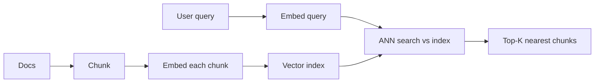
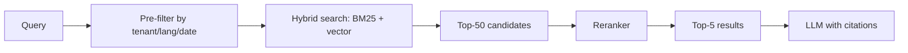

# Vector search

> **In one line:** Vector search is "find the K records whose embedding is closest to my query's embedding." It's how every RAG system, semantic search bar, and recommendation feature works under the hood.

:::tip[In plain English]
You have a million sentences, each represented as a point in 1,536-dimensional space (see [embeddings](./embeddings.md)). A user types a query; you embed it the same way and find the K nearest points. That's vector search. The hard part isn't the math — it's doing it fast over millions of vectors. That's what vector indexes (ANN algorithms like HNSW) are for.
:::

## The setup

1. **Embed everything.** Chunk your documents, embed each chunk, store the chunk text + vector + metadata.
2. **Embed the query.** When a user asks something, embed the question with the same model.
3. **Search.** Find the K vectors closest (usually by cosine similarity) to the query vector. Return the matching chunks.

The whole pipeline takes 50–200 ms in production at millions of vectors, with the right index.



## Brute force vs ANN

- **Brute force** (exact nearest neighbors): compare query to every vector. O(N·d) per query. Fine up to ~100K vectors; painful above.
- **ANN (Approximate Nearest Neighbors)**: indexes like HNSW, IVF, ScaNN, DiskANN trade a tiny bit of recall for *huge* speedups. O(log N)-ish. The default for any production system.

HNSW (Hierarchical Navigable Small World) is the de facto winner — used by pgvector (≥0.5), Qdrant, Weaviate, Lance. Tune two knobs: `M` (graph degree, higher = more memory) and `ef_search` (search width, higher = better recall, slower).

## Picking an index (May 2026)

| Index/Service       | When to use                                                |
|---------------------|------------------------------------------------------------|
| **pgvector**        | You already use Postgres, under ~10M vectors. Zero new infra. |
| **Pinecone**        | Hosted, easy, expensive at scale. Good "just works" pick.  |
| **Weaviate**        | Hybrid built in, BYO embedder, decent ops.                 |
| **Qdrant**          | Self-hostable, fast HNSW, generous filters.                |
| **Milvus**          | Largest-scale (>1B vectors), serious ops.                  |
| **Turbopuffer**     | Object-storage-backed; very cheap for huge cold corpora.   |
| **LanceDB**         | Embedded, columnar, great for analytics + vectors.         |
| **Chroma**          | Prototyping, dev experience.                               |
| **FAISS / hnswlib** | In-process. Prototypes only. No persistence story.         |

For most apps: **start with pgvector, migrate only when it hurts**. The pain points to watch for: index build time > minutes, latency > 200ms at p95, vector count > ~10M.

## Worked example: pgvector end-to-end

```sql
CREATE EXTENSION vector;

CREATE TABLE chunks (
    id bigserial PRIMARY KEY,
    doc_id text,
    text text,
    embedding vector(1536)
);

CREATE INDEX ON chunks USING hnsw (embedding vector_cosine_ops);
```

```python
from openai import OpenAI
import psycopg

client = OpenAI()
db = psycopg.connect("postgresql://...")

def embed(text: str) -> list[float]:
    return client.embeddings.create(model="text-embedding-3-small", input=text).data[0].embedding

# Insert
for chunk_text, doc_id in chunks:
    vec = embed(chunk_text)
    db.execute("INSERT INTO chunks (doc_id, text, embedding) VALUES (%s, %s, %s)",
               (doc_id, chunk_text, vec))

# Query
q_vec = embed("How do I reset my password?")
rows = db.execute("""
    SELECT text, 1 - (embedding <=> %s::vector) AS similarity
    FROM chunks
    ORDER BY embedding <=> %s::vector
    LIMIT 10
""", (q_vec, q_vec)).fetchall()
```

`<=>` is pgvector's cosine distance operator; `1 - distance` gives similarity. Under 10M rows with HNSW, this returns in 5–30ms.

## Pre-filtering vs post-filtering

If your data has structure (tenant ID, language, date range), filter *before* the vector search, not after.

```sql
-- BAD: vector search first, then filter
SELECT * FROM chunks
ORDER BY embedding <=> %s::vector
LIMIT 100
WHERE tenant_id = 'acme';  -- might return 0 rows if no acme in top 100

-- GOOD: filter first
SELECT * FROM chunks
WHERE tenant_id = 'acme'
ORDER BY embedding <=> %s::vector
LIMIT 10;
```

Filtering 10M → 10K records first, then doing the vector search on those 10K, is much faster *and* more accurate than doing the vector search first and filtering the K results.

Most vector DBs support "pre-filtered ANN search" but the syntax varies. Qdrant and Weaviate are particularly good at it. pgvector handles it well through standard SQL.

## Hybrid search teaser

A 2024–2026 consensus: combining BM25 (keyword) and vector search ("hybrid search") consistently outperforms either alone in retrieval evals. Vector catches semantic matches; BM25 catches rare-term matches (product codes, names, acronyms). Covered in detail on the next page.

## What beginners get wrong

:::caution[Common mistakes]
- **Chunking strategy dominates quality.** Chunk too small → no context. Too big → diluted relevance. Start with 300–800 tokens, 50–100 token overlap, then tune with evals. See [chunking strategies](./chunking-strategies.md).
- **Re-embed when you change models.** All vectors must come from the same model.
- **Distance metric must match the embedding model's training.** Most modern models use cosine. Read the model card.
- **Indexing before you have data.** HNSW with 100 vectors is overhead, not optimization. Start brute-force, add an index when latency hurts.
- **Storing only the vector.** Always store the source text and metadata alongside. You'll need them at retrieval time.
- **Treating top-K as "answers."** Top-K is *candidates*. You still need to rerank (see [reranking](./reranking.md)) and let the LLM synthesize.
- **Not measuring recall.** Build a small eval set: 50 queries with known-relevant doc IDs. Measure recall@10. Without this you can't tell if your search works.
- **Mixing vector types in one table.** Indexes are built per vector column with per-dimension metadata. Don't put 1536-dim and 768-dim vectors in the same column.
:::

## A reasonable production setup



Five stages: filter → retrieve → blend → rerank → generate. Each adds a step but compounds quality. Most production RAG in 2026 looks like this; the rest is either simpler (and worse) or fancier (and not always better).

:::info[Highlight: vector search is a means, not an end]
You're never going to ship "vector search" as a feature. You're going to ship "answers my support docs questions," "finds relevant past tickets," "recommends related products." Vector search is the cheap, semantic primitive underneath. Master it and dozens of features become afternoons of work.
:::

---

→ Next: [Hybrid search](./hybrid-search.md)
