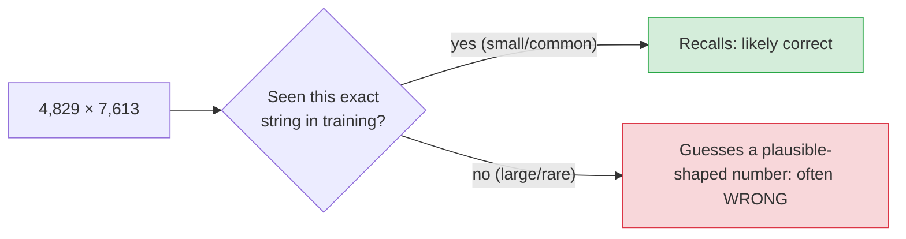

# Where LLMs fail (and why)

> **In one line:** An LLM is brilliant at fuzzy, language-shaped tasks and weak at precise, rule-bound, stateful, symbolic ones — the *opposite* of a normal computer — and almost every "it messed up something simple" moment traces back to that one fact.

:::tip[In plain English]
You've now seen how the model works: it reads [tokens](./tokens.md), runs them through a [transformer](./transformer.md), and predicts the next token. Hold onto that, because it explains every weakness on this page. The model isn't looking things up, counting, or calculating — it's producing the *most likely-sounding continuation* of the text so far. When "likely-sounding" and "correct" line up (most fluent writing, summarizing, explaining), it feels like magic. When they come apart — counting letters, exact arithmetic, tracking a changing state, citing a real source — it fails, and worse, it fails *confidently*. This page is the map of where they come apart, so the failures stop surprising you.
:::

People call this **"jagged intelligence"**: the same model that drafts a working program can't reliably count the letters in a word. The skill profile is spiky, not a smooth line from easy to hard. The trap is assuming *easy-for-a-human* means *easy-for-the-model* — they're different axes.

## The terms, defined once

- **Symbolic task** — one with exact, rule-based right answers you get by *following a procedure*: arithmetic, counting, sorting, logic puzzles. Computers nailed these in the 1950s; LLMs are shaky at them.
- **Statistical / pattern task** — one solved by recognizing and continuing patterns: writing prose, paraphrasing, classifying sentiment, explaining a concept. This is what LLMs are built for.
- **Confabulation / hallucination** — a fluent, confident, *fabricated* answer produced to fill a gap, rather than admitting "I don't know." (Covered in depth in [Chapter 6 → Hallucination](/docs/safety/safety-hallucination).)
- **State** — information that changes as a task progresses (who holds which item, the board after move 7). The model has no scratch memory beyond the visible text.

## Failure 1 — Counting and character-level work

Ask "how many *r*'s are in *strawberry*?" and models have famously answered "two." The reason is upstream of intelligence: the model never sees the letters. It sees [tokens](./tokenizers.md) — `straw` + `berry`, two opaque chunks. Asking it to count the *r*'s is like asking you to count the wheels in the word "bicycle" without unpacking what the word refers to. The information was thrown away before the model started thinking.

The same root cause breaks:
- **Reversing a string** (`"hello"` → `"olleh"`) — it can't see the characters in order.
- **Counting words / syllables / characters** — no internal counter exists.
- **Acrostics and exact letter constraints** ("a poem where each line starts with M-A-R-Y").

**The fix is to give it eyes.** Let it write and run code: `len("strawberry".split("r")) - 1` is exact and trivial. The model is great at *writing* that one line; it's bad at *being* it. This is the whole reason [tool use](./tool-use.md) exists.

## Failure 2 — Exact arithmetic and large numbers

Try this thought experiment before reading on: does the model *calculate* `4,829 × 7,613`, or does it *guess a plausible-looking number*?

It guesses. There's no ALU (the arithmetic circuit in a CPU) inside a transformer — only learned patterns over token sequences. It has seen `2 + 2 = 4` a billion times, so small, common sums are reliable. But `4,829 × 7,613` almost never appeared verbatim in training, so it produces a number of about the right magnitude with the right-ish first and last digits — *shaped* like the answer, often wrong in the middle.

**Two fixes, both reliable:**
- **Make it show its work** — "think step by step" forces it to break the multiplication into partial products it *has* seen, dramatically improving accuracy. This is the core idea behind [reasoning models](./reasoning-models.md).
- **Give it a calculator** via [tool use](./tool-use.md). For anything that must be exact — money, dosages, totals — never trust the model's mental math; hand it a tool.

## Failure 3 — Tracking changing state

LLMs have no working memory beyond the text in front of them. Give one a multi-step puzzle — a river-crossing, "put the red block on the blue, then swap them, now what's on top?", a long game of tic-tac-toe — and it loses the thread, because there's no internal board it's updating. Each step is re-derived from the written history, and small misreads compound.

You'll feel this in real apps as:
- An agent that **forgets a constraint** you gave it ten steps ago.
- A model that **contradicts itself** across a long conversation.
- Loop/counting instructions that **drift** ("end every sentence with 'cat'" holds for three sentences, then slips).

**The fix is to externalize the state** — write the current state into the text explicitly at each step (this is [context engineering](./context-engineering.md)), or have the model maintain it in a tool/file rather than "in its head."

## Failure 4 — Fresh facts, private facts, and confident fabrication

The model's knowledge is **frozen at its training cutoff** and contains only public text it was trained on. So it cannot, from memory alone, know yesterday's news, your company's internal policy, or a specific order's status. The dangerous part isn't the gap — it's what fills it. Because the model is rewarded for producing a *plausible continuation*, it will invent a confident, perfectly-formatted answer rather than say "I don't know": a fake citation, a non-existent API method, a made-up statistic.

This is **confabulation**, and it's the single most important failure to internalize, because unlike the others it's *invisible* — the wrong answer looks exactly as authoritative as a right one. It has no internal "I'm unsure" flag: a fact it saw a million times and a fact it's inventing come out in the same confident tone.

**The fixes** (covered fully in [Chapter 6 → Hallucination](/docs/safety/safety-hallucination)):
- **Ground it** — give it the real facts to answer *from* ([RAG](./rag-basics.md)) instead of asking what it remembers.
- **Let it abstain** — make "I don't know" a first-class, rewarded output.
- **Check the output** — verify citations and claims against sources before trusting them.

## Failure 5 — Trick questions and the "expected pattern" override

Ask "which weighs more, a pound of feathers or *two* pounds of bricks?" and models sometimes answer "they weigh the same" — the classic riddle's answer. The common version of the riddle is so strongly represented in training data that its pattern overrides the *actual words* of your question. The model pattern-matched the *shape* of the question instead of reading it literally.

This generalizes to a quiet, everyday risk: when your real request looks *almost* like a far more common one, the model can answer the common one. It's why precise, unambiguous prompts matter — you're competing against the gravitational pull of the most frequent pattern.

## Why it matters

Put the five together and a clean rule falls out:

| The model is **strong** at… | The model is **weak** at… |
|---|---|
| Fuzzy, pattern-rich language tasks | Precise, rule-based symbolic tasks |
| Summarizing, rewriting, explaining | Counting, exact math, sorting |
| Plausible, fluent generation | Saying "I don't know" |
| One-shot transformation of text | Tracking state across many steps |
| Anything in its training distribution | Fresh, private, or exact facts |

This is the **opposite** of a traditional computer, which is perfect at arithmetic and logic and hopeless at "write a warm reply to this angry email." The practical upshot: **pair the LLM with the tools it lacks.** Give it a calculator, a code sandbox, a search index, a database — let it do the language part and delegate the exact part. A model *plus* tools covers both axes; a model alone does not.

Keep this at the back of your mind as a single reflex: **when a task is exact, stateful, fresh, or symbolic, don't trust the model's bare output — verify it or give it a tool.**

## Common pitfalls

:::caution[Where people trip up]
- **Assuming "simple for me" means "simple for it."** Counting letters is trivial for you and genuinely hard for the model. Difficulty runs on a different axis.
- **Trusting mental math.** Any number that matters — money, dosage, a total — should come from a tool, never the model's head.
- **Reading confidence as correctness.** Fluent and confident is the model's *default tone*, not a signal of truth. A fabricated citation looks identical to a real one.
- **Expecting it to know fresh or private facts.** Outside its training cutoff and public data, it will confabulate unless you *give* it the facts (RAG).
- **Blaming the model instead of the setup.** Most "the AI is dumb" moments are really "I asked a statistical engine to do a symbolic job with no tool." The fix is usually architectural, not a better prompt.
- **Phrasing a request to look like a common pattern.** If your question resembles a famous riddle or a more frequent task, expect the pattern to win. Be explicit and literal.
:::

<Quiz id="what-llms-cant-do-quick-check" variant="micro" title="Quick check">

<Question
  prompt="Why does an LLM struggle to count the letter 'r' in 'strawberry'?"
  options={[
    { text: "Counting is too computationally expensive for a transformer" },
    { text: "It sees the word as a few opaque tokens, not individual characters — the letters were discarded before it started" },
    { text: "Its training data didn't contain the word 'strawberry'" },
    { text: "It can count, but rounds the answer to look natural" }
  ]}
  correct={1}
  explanation="The model consumes tokens (chunks like 'straw' + 'berry'), not letters, so character-level information isn't available to it at all. The fix isn't a better prompt — it's letting the model write and run a line of code that counts exactly."
/>

<Question
  prompt="You need an LLM-powered app to compute order totals to the cent. What's the right design?"
  options={[
    { text: "Lower the temperature so the arithmetic is deterministic" },
    { text: "Use a bigger, more capable model — it will do the math correctly" },
    { text: "Have the model call a calculator/code tool for the arithmetic instead of computing it itself" },
    { text: "Ask the model to double-check its own mental math twice" }
  ]}
  correct={2}
  explanation="There's no arithmetic unit inside a transformer — it pattern-matches number-shaped text, so large or uncommon sums come out plausible but wrong. Temperature controls randomness, not correctness, and a bigger model is still guessing. Anything that must be exact should be delegated to a tool."
/>

<Question
  prompt="A model gives a confident, perfectly-formatted answer that turns out to be completely fabricated. According to this page, what's the root cause?"
  options={[
    { text: "A bug in the provider's serving stack" },
    { text: "It optimizes for a plausible-sounding continuation and has no internal flag separating 'I know this' from 'I'm inventing this'" },
    { text: "The context window overflowed and corrupted the answer" },
    { text: "The temperature was set too high" }
  ]}
  correct={1}
  explanation="Confabulation is the default behavior of next-token prediction: a fluent guess often scores as more 'likely' than admitting ignorance, and nothing marks invented facts as guesses. That's why the fixes are grounding, abstention, and output-checking — not a single setting you can flip."
/>

<Question
  prompt="Which task profile is an LLM strongest on, all else equal?"
  options={[
    { text: "Sorting a list of 200 numbers exactly" },
    { text: "Tracking which player holds which card across 30 turns" },
    { text: "Rewriting an angry customer email into a warm, professional reply" },
    { text: "Computing 4,829 × 7,613 to the exact digit" }
  ]}
  correct={2}
  explanation="Rewriting tone is a fuzzy, pattern-rich language task — exactly what next-token prediction excels at. The other three are symbolic or stateful (sorting, state-tracking, exact arithmetic), which run on the axis where LLMs are weak and a tool or explicit state should carry the load."
/>

</Quiz>

---

→ Going deeper: [Hallucination & confabulation](/docs/safety/safety-hallucination) (Chapter 6) unpacks Failure 4 and its defenses in full. To give the model the capabilities it lacks, see [Tool use](./tool-use.md) and [RAG basics](./rag-basics.md).

→ Next: [Model families](./model-families.md)
