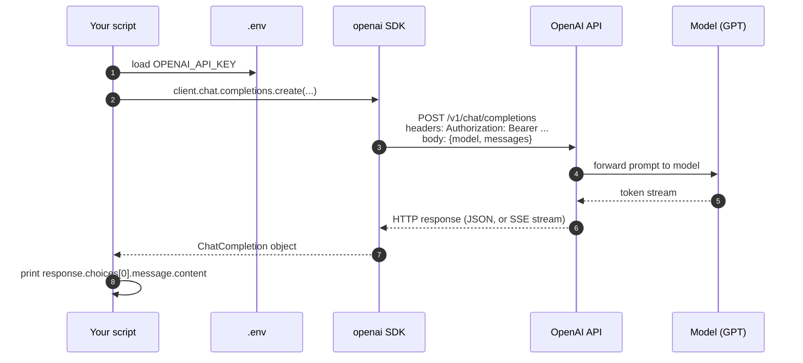

# Stage 0 — Setup

> **Time budget:** ~1 day

> **In one line:** Before you can build AI features, you need a working SDK, an API key, and a spend cap that protects you from your own mistakes.

This is the boring stage every tutorial skips, and then learners debug environment issues for two weeks. Do it properly. The bar by the end of Stage 0 is unambiguous: three small scripts run end-to-end and print real model output, and you've set spend limits on every provider you signed up with.

:::tip[In plain English]
You are *not* installing AI. You're installing a script-running environment (Python or Node), a library (the provider's SDK), and storing a password (the API key) somewhere your code can read but git can't see. That's it.
:::

## 1. Pick one language and stick with it

You'll do every stage of the roadmap in this language. You can re-do the whole roadmap in the other language later if you want — but switching mid-stage is how you make zero progress in two languages instead of real progress in one.

- **Python** — best if you're coming from ML/data, want the broadest framework support (LangChain, LlamaIndex, DSPy, Pydantic AI, OpenAI Agents SDK), or expect to do data work alongside the LLM calls.
- **TypeScript** — best if you're coming from web dev, want to ship full-stack apps quickly, or plan to deploy to Vercel/Cloudflare (Vercel AI SDK, Next.js streaming, edge runtimes).

Both are first-class — every major provider has equally good SDKs in both. There is no quality difference between the Python and TS paths; pick the one you're already faster in.

## 2. Install the runtime

### Python path

```bash
# Use uv — fastest Python package manager, written in Rust
curl -LsSf https://astral.sh/uv/install.sh | sh   # macOS/Linux
# Windows: irm https://astral.sh/uv/install.ps1 | iex

# Verify
uv --version
# uv 0.5.x

# Initialize a project
mkdir ai-roadmap && cd ai-roadmap
uv init --python 3.12
uv add openai anthropic python-dotenv
```

If you prefer `pip` + `venv`, that works too — but `uv` resolves dependencies in seconds instead of minutes, and you'll thank yourself by Stage 5.

### TypeScript path

```bash
# Install Node 20+ via nvm (Mac/Linux) or nvm-windows (Windows)
# nvm install --lts && nvm use --lts

node --version    # v20.x or higher
npm --version

mkdir ai-roadmap && cd ai-roadmap
npm init -y
npm install openai @anthropic-ai/sdk dotenv tsx typescript @types/node
npx tsc --init
```

`tsx` lets you run `.ts` files directly without a build step (`npx tsx hello.ts`). This is the dev loop for the whole roadmap.

## 3. Editor

VS Code or Cursor. Either is fine. Install:

- The Python or TypeScript extension (Microsoft's, the official one).
- The official linter (`ruff` for Python, `eslint` for TS).
- A formatter (`black` or `ruff format` for Python; `prettier` for TS).

If you use Cursor, the "Codebase" tab and AI completions will tempt you to skip thinking. **For Stage 0–6, type the code yourself.** You're building muscle memory for what `chat.completions.create` returns; AI autocompletion will hand you working code and skip the lesson.

## 4. API keys

Sign up for at least one provider. Two is better — model swapping is a Stage 2+ skill.

| Provider | Sign up at | Notable for |
|----------|------------|-------------|
| OpenAI | `platform.openai.com` | Broadest tutorial coverage, GPT-5 family, real-time voice |
| Anthropic | `console.anthropic.com` | Claude 4.x family, best for coding/long-context |
| Google | `aistudio.google.com` | Gemini 2.x, generous free tier, huge context window |
| Groq | `console.groq.com` | Fast open-model inference (Llama, Mixtral); cheapest fast inference |
| Together | `api.together.ai` | Wide open-model selection; fine-tuning |

:::caution[Set spend limits before you write any code]
Every provider dashboard has a *hard spend cap* and *email alerts* setting. Set both. **$10/month** is plenty for the whole roadmap. The horror stories ("my key leaked and I got a $5,000 bill") all share one thing: nobody set a hard cap.

- OpenAI: Settings → Billing → Usage limits → Hard limit
- Anthropic: Settings → Plans & Billing → Spend limits
- Google: AI Studio is free tier with quotas, no card required for the basic tier
:::

## 5. Store keys safely

```bash
# In your project root:
echo "OPENAI_API_KEY=sk-..." > .env
echo "ANTHROPIC_API_KEY=sk-ant-..." >> .env
echo ".env" >> .gitignore
```

**Never** commit `.env`. Both providers actively scan GitHub for leaked keys — they'll often revoke a leaked key within minutes, but the bot that scraped it for crypto mining has already burned through your spend cap. The `.gitignore` line is the second line of defence.

For production later, you'll switch to a secrets manager (Vercel env vars, AWS Secrets Manager, etc.). For now, `.env` is fine.

## 6. Verify with three scripts

Create three files. All three should run and print real output before you move on.

### Python: `verify_openai.py`

```python
import os
from dotenv import load_dotenv
from openai import OpenAI

load_dotenv()  # reads .env into os.environ

client = OpenAI()  # picks up OPENAI_API_KEY automatically

response = client.chat.completions.create(
    model="gpt-5-mini",  # or whatever the cheapest current model is
    messages=[
        {"role": "system", "content": "Reply in exactly one short sentence."},
        {"role": "user", "content": "What's 2 + 2?"},
    ],
)

print(response.choices[0].message.content)
print(f"Tokens: in={response.usage.prompt_tokens}, out={response.usage.completion_tokens}")
```

Run with `uv run verify_openai.py`. Expected output: a one-line answer and a tokens line.

### Python: `verify_anthropic.py`

```python
import os
from dotenv import load_dotenv
from anthropic import Anthropic

load_dotenv()
client = Anthropic()

msg = client.messages.create(
    model="claude-haiku-4-5",
    max_tokens=64,
    messages=[{"role": "user", "content": "Say hi in one word."}],
)

print(msg.content[0].text)
print(f"Tokens: in={msg.usage.input_tokens}, out={msg.usage.output_tokens}")
```

### Python: `verify_stream.py`

```python
from dotenv import load_dotenv
from openai import OpenAI

load_dotenv()
client = OpenAI()

stream = client.chat.completions.create(
    model="gpt-5-mini",
    messages=[{"role": "user", "content": "Count from 1 to 5 slowly."}],
    stream=True,
)

for chunk in stream:
    delta = chunk.choices[0].delta.content
    if delta:
        print(delta, end="", flush=True)
print()
```

You should see tokens appear progressively, not in one burst at the end. If they appear all at once, streaming isn't actually flushing — check `flush=True` and your terminal settings.

### TypeScript: `verify-openai.ts`

```ts
import "dotenv/config";
import OpenAI from "openai";

const client = new OpenAI();

const response = await client.chat.completions.create({
  model: "gpt-5-mini",
  messages: [
    { role: "system", content: "Reply in exactly one short sentence." },
    { role: "user", content: "What's 2 + 2?" },
  ],
});

console.log(response.choices[0].message.content);
console.log(`Tokens: in=${response.usage?.prompt_tokens}, out=${response.usage?.completion_tokens}`);
```

Run with `npx tsx verify-openai.ts`.

### TypeScript: `verify-stream.ts`

```ts
import "dotenv/config";
import OpenAI from "openai";

const client = new OpenAI();

const stream = await client.chat.completions.create({
  model: "gpt-5-mini",
  messages: [{ role: "user", content: "Count from 1 to 5 slowly." }],
  stream: true,
});

for await (const chunk of stream) {
  const delta = chunk.choices[0]?.delta?.content;
  if (delta) process.stdout.write(delta);
}
process.stdout.write("\n");
```

## 7. Sanity-check: what just happened?

When you ran `verify_openai.py`, this happened end-to-end:



That's the whole architecture you'll repeat for the next nine stages. Everything else is variations: different prompts, different parameters, different surrounding code. The HTTP round-trip to a hosted model is the atom.

## Where to go deeper

- [OpenAI Quickstart](https://platform.openai.com/docs/quickstart) — official, current, takes 15 minutes.
- [Anthropic Quickstart](https://docs.anthropic.com/en/docs/get-started) — same idea, the Anthropic flavor.
- [Vercel AI SDK docs](https://sdk.vercel.ai) — if you're on the TS/Next.js path, this is where to live.

## Deeper in this guide

- [Foundations: Messages](/docs/foundations/messages) — what those `{role, content}` objects really are.
- [Foundations: Tokens](/docs/foundations/tokens) — what `usage.prompt_tokens` is counting.
- [Stack: LLM SDKs](/docs/stack/llm-sdks) — every SDK you'll see, ranked.

## Project

:::tip[Project — Verify your environment]
Write three small scripts in a `stage-0/` folder: (a) `verify_openai.py` (or `.ts`) that prints a one-line answer and the token count; (b) `verify_anthropic.py` that does the same against Claude; (c) `verify_stream.py` that streams tokens to stdout. All three should run cleanly with your `.env` loaded. Trivial, but proves your entire toolchain works end-to-end. **Commit a git repo with these three scripts and a README that says how to run them.** That's your eval for Stage 0.
:::

## Common mistakes

:::caution[Where people commonly trip up]
- **Skipping the spend cap.** A leaked key + no cap = a $500 surprise bill. Set the hard limit *before* you commit your first script — even if you "promise" to revoke the key later.
- **Hardcoding the API key in a script.** Looks innocent in dev, will eventually end up in a `git add .` commit. Always read keys from `.env`, never inline them — even in throwaway code.
- **Installing both Python and TypeScript "to keep options open."** You will not, in fact, alternate. You'll do nothing in both for a month. Pick one and start.
- **Using the framework before the SDK.** Installing `langchain` in Stage 0 and trying to learn LLMs through it is the equivalent of learning to drive on a self-driving car. You'll have no model for what's happening when it fails. Raw SDK first; frameworks at Stage 5+ when you have something to compare them to.
- **Forgetting `.env` is in `.gitignore`.** Run `git status` after your first commit; if `.env` shows up, you've leaked. Rotate the key on every provider's dashboard immediately — don't trust "but I deleted the file."
:::

## Page checkpoint


→ [Next: Stage 1 — First API call](./02-stage-1-first-call.md) · [Back to Part I overview](./index.md)
