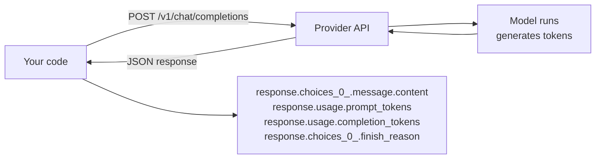

# Stage 1 — First API call

> **Time budget:** ~half a day

> **In one line:** A 20-line script that asks the model a question, prints the answer, and prints what it cost — the atom from which every later stage is built.

The whole stage is one script. The point is not the script — it's *what you internalize while writing it*: the message format, what the response object looks like, how token counting works, how cost relates to tokens, and why the API is stateless.

:::tip[In plain English]
An LLM call is like sending a postcard with the entire conversation written on it, every time. The model doesn't remember; the model doesn't have a session; the model reads your postcard, scribbles a reply, sends it back. To "have a conversation," you re-send the whole history on every postcard.
:::

## 1. The script

### Python

```python
# stage-1/first_call.py
from dotenv import load_dotenv
from openai import OpenAI

load_dotenv()
client = OpenAI()

question = input("Ask me anything: ")

response = client.chat.completions.create(
    model="gpt-5-mini",
    messages=[
        {"role": "system", "content": "You answer in exactly one short paragraph."},
        {"role": "user", "content": question},
    ],
    temperature=0.7,
)

answer = response.choices[0].message.content
print(f"\n{answer}\n")

# Inspect the cost
usage = response.usage
in_tok, out_tok = usage.prompt_tokens, usage.completion_tokens
# pricing is per million tokens — values change; check the dashboard
in_cost = in_tok / 1_000_000 * 0.25   # example: $0.25/M input
out_cost = out_tok / 1_000_000 * 2.00 # example: $2.00/M output
print(f"Tokens: in={in_tok}, out={out_tok}  Cost: ${in_cost + out_cost:.6f}")
```

### TypeScript

```ts
// stage-1/first-call.ts
import "dotenv/config";
import OpenAI from "openai";
import readline from "node:readline/promises";

const client = new OpenAI();
const rl = readline.createInterface({ input: process.stdin, output: process.stdout });
const question = await rl.question("Ask me anything: ");
rl.close();

const response = await client.chat.completions.create({
  model: "gpt-5-mini",
  messages: [
    { role: "system", content: "You answer in exactly one short paragraph." },
    { role: "user", content: question },
  ],
  temperature: 0.7,
});

console.log(`\n${response.choices[0].message.content}\n`);

const { prompt_tokens: inTok, completion_tokens: outTok } = response.usage!;
const cost = (inTok / 1_000_000) * 0.25 + (outTok / 1_000_000) * 2.0;
console.log(`Tokens: in=${inTok}, out=${outTok}  Cost: $${cost.toFixed(6)}`);
```

Run it. Ask a few things. Watch the token counts vary.

## 2. Anatomy of the response

`response` is a typed object. The important fields:

```python
response.choices[0].message.content   # the text the model produced
response.choices[0].message.role      # "assistant"
response.choices[0].finish_reason     # "stop" (natural end), "length" (hit max), "tool_calls", "content_filter"
response.usage.prompt_tokens          # input tokens charged
response.usage.completion_tokens      # output tokens charged
response.usage.total_tokens           # in + out
response.model                        # the actual model that served you (may be more specific than requested)
response.id                           # unique ID — log this for support / debugging
response.created                      # unix timestamp
```

`choices` is a list because some APIs let you ask for multiple completions in one call (`n=3`). You'll almost never do that. `choices[0]` is the only one you care about 99% of the time.

`finish_reason` is the field most beginners ignore and then debug for hours. If the model stops mid-word, it's almost always `length` — you hit `max_tokens`. Set a larger cap or shorter prompt.



## 3. The message format

```python
messages = [
    {"role": "system", "content": "..."},
    {"role": "user", "content": "..."},
    {"role": "assistant", "content": "..."},
    {"role": "user", "content": "..."},
]
```

Three roles, plus `tool` (Stage 4) and sometimes `developer` (newer OpenAI convention, similar to system).

- **`system`** — sets behavior, persona, rules. Optional. Goes first.
- **`user`** — what the human said. Required.
- **`assistant`** — what the model said in earlier turns. You add these when continuing a conversation.

The shape is the same across providers (with minor naming quirks). Anthropic's SDK uses `messages.create()` with a top-level `system` parameter; the role objects are identical otherwise. Google's Gemini has a slightly different shape but the same idea.

## 4. The API is stateless

Run the script. Ask "What's the capital of France?" The model says Paris. Run it again. Ask "What's its population?" The model has no idea what "it" refers to.

The model has no memory between calls. **You** maintain conversation history — appending to a list of messages and re-sending the whole list on each call. Stage 2 builds this; for now, just internalize:

> Every call sends the entire conversation. The model is a pure function: messages in → message out.

This is also why long conversations get expensive — the input grows linearly each turn.

## 5. Tokens, not characters

A token is roughly 4 characters of English, or 0.75 words. "Hello, world!" is 4 tokens. The Cyrillic alphabet, Chinese characters, code, and JSON all tokenize differently. The most important consequence: cost scales with tokens, and so do context-window limits.

| Model family | Input price (per M tokens) | Output price (per M tokens) | Approx ratio output:input |
|--------------|----------------------------|------------------------------|---------------------------|
| Cheap tier (Haiku, Gemini Flash, GPT mini) | $0.10–$0.30 | $0.50–$2.00 | ~4–10x more for output |
| Workhorse tier (Sonnet, GPT, Gemini Pro) | $2–$5 | $10–$25 | ~5x |
| Frontier tier (Opus, GPT-5, Gemini Ultra) | $10–$20 | $40–$100 | ~4–5x |

**Output is always more expensive than input.** This is why "ask the model to be concise" is the single most effective cost optimization for chat apps.

→ See also: [Foundations: Tokens](/docs/foundations/tokens) for the byte-pair-encoding details.

## 6. Read the cost on every call

Add this to every script you write in the next nine stages. It's the cheapest discipline that pays back forever:

```python
def log_call(response):
    u = response.usage
    cost = u.prompt_tokens / 1_000_000 * INPUT_PRICE + u.completion_tokens / 1_000_000 * OUTPUT_PRICE
    print(f"[{response.model}] in={u.prompt_tokens} out={u.completion_tokens} ${cost:.6f}")
```

Watching cost numbers tick up trains the intuition for [Cost intuition (Part III)](../03-part-3-beyond/05-cost-intuition.md) better than any blog post.

## 7. Stretch: add a follow-up loop

```python
history = [{"role": "system", "content": "You answer concisely."}]

while True:
    user_input = input("\nYou: ")
    if not user_input.strip():
        break

    history.append({"role": "user", "content": user_input})
    response = client.chat.completions.create(model="gpt-5-mini", messages=history)
    assistant_msg = response.choices[0].message.content
    print(f"Assistant: {assistant_msg}")
    history.append({"role": "assistant", "content": assistant_msg})

    print(f"  ({response.usage.total_tokens} tokens cumulative)")
```

Try it. Notice that token count grows on each turn — *the entire history is re-sent*. Notice also that the model now "remembers" — because you're including its prior responses in the messages list.

## 8. Stretch: try streaming

```python
stream = client.chat.completions.create(
    model="gpt-5-mini",
    messages=[{"role": "user", "content": "Explain mitochondria in 3 sentences."}],
    stream=True,
)

for chunk in stream:
    if chunk.choices[0].delta.content:
        print(chunk.choices[0].delta.content, end="", flush=True)
print()
```

You'll get one chunk per "delta" — usually a few characters at a time. The same content, just streamed instead of buffered. We'll use this everywhere in Stage 2.

## 9. Stretch: swap providers

Change OpenAI to Anthropic. Almost the same shape:

```python
from anthropic import Anthropic
client = Anthropic()

msg = client.messages.create(
    model="claude-haiku-4-5",
    max_tokens=512,
    system="You answer concisely.",
    messages=[{"role": "user", "content": question}],
)

print(msg.content[0].text)
print(f"Tokens: in={msg.usage.input_tokens}, out={msg.usage.output_tokens}")
```

Differences: `system` is a top-level parameter (not a message), response shape uses `content[0].text` instead of `choices[0].message.content`, and `max_tokens` is required. Everything else is the same conceptual call.

## Don't reach for frameworks yet

LangChain, LlamaIndex, Vercel AI SDK, OpenAI Agents SDK — all real and useful. None of them belong here. The reason: they hide exactly the thing you're trying to learn. By Stage 5 you'll have something to compare them to and the trade-off will be visible. Right now, raw SDK only.

## Where to go deeper

- [OpenAI API reference: chat completions](https://platform.openai.com/docs/api-reference/chat) — every parameter, every response field.
- [Anthropic API reference: messages](https://docs.anthropic.com/en/api/messages) — the Claude flavor.
- [Tiktokenizer](https://tiktokenizer.vercel.app/) — paste text, see how it tokenizes. Build the intuition.

## Deeper in this guide

- [Foundations: Messages](/docs/foundations/messages) — every role explained.
- [Foundations: Tokens](/docs/foundations/tokens) — what BPE actually does.
- [Foundations: Sampling](/docs/foundations/sampling) — temperature, top-p, what they do.
- [Foundations: Training vs Inference](/docs/foundations/training-vs-inference) — the gap that explains why the model has no memory.

## Project

:::tip[Project — A CLI that prints answers and costs]
Build a small command-line tool: it takes a question (from stdin or argv), sends it to one provider, prints the answer, and prints the token count + estimated cost. Add a `--model` flag so you can swap models. Add a `--system` flag for a custom system prompt. **Run it ten times** with different questions and different system prompts; watch how token counts and costs vary. By the end you should be able to look at a question and roughly predict whether it'll cost a fraction of a cent or a few cents.
:::

## Common mistakes

:::caution[Where people commonly trip up]
- **Forgetting the API is stateless.** "But it remembered my last question yesterday!" — no, ChatGPT.com remembered. The API doesn't. Every call is independent unless you re-send history.
- **Ignoring `finish_reason`.** When the model cuts off mid-sentence, your first reaction shouldn't be "the model is broken" — it should be "what does `finish_reason` say?" If it's `length`, raise `max_tokens` or shorten the prompt.
- **Treating temperature as the only knob.** `temperature=0` doesn't make the model deterministic on most providers — it just biases toward the most likely token. For determinism you also need to set a `seed` (where supported) and accept it's still not 100% guaranteed.
- **Comparing model costs by single calls.** A $0.0001 call looks tiny. A million of them a month is $100. Multiply by realistic call volume before drawing cost conclusions.
- **Skipping the streaming exercise.** Streaming is a load-bearing skill (every chat UI uses it) and the API quirk of "iterate chunks, append deltas" trips up everyone the first time. Do it now while there's no UI to debug.
:::

## Page checkpoint


→ [Next: Stage 2 — Streaming chatbot](./03-stage-2-chatbot.md) · [Back to Part I overview](./index.md)
