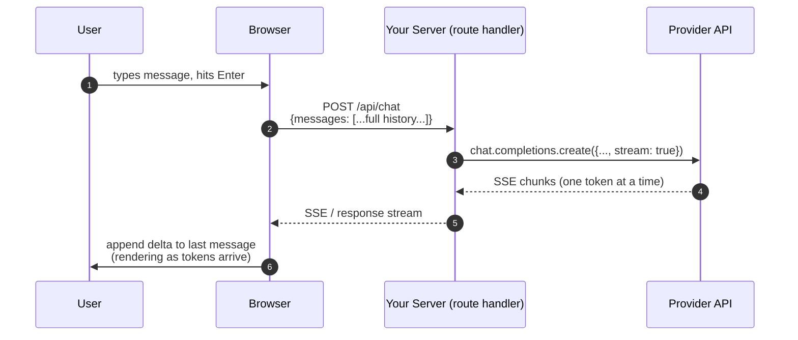

# Stage 2 — Streaming chatbot

> **Time budget:** ~1 week

> **In one line:** Build the chat interface every "AI app" uses — streamed tokens, persisted history, a working stop button — so you understand the patterns before any framework hides them.

This stage is mostly about plumbing, not models. The model call itself is identical to Stage 1; the work is getting tokens to flow from provider → your server → the browser, keeping conversation state, and handling the UX details that look trivial but aren't (abort, stop button, scroll behavior).

:::tip[In plain English]
A chatbot UI is a list of messages and an input box. The hard parts: tokens should appear as they're generated (not all at once), users should be able to interrupt, history should survive a page refresh, and the back-end should be cheap to run. None of that is the LLM's problem; all of it is yours.
:::

## 1. Pick a stack

| Path | Stack | Why |
|------|-------|-----|
| TypeScript/web | Next.js 16 (App Router) + Vercel AI SDK (`useChat` hook) | One afternoon to working chat; the SDK handles streaming end-to-end |
| Python/web | FastAPI + SSE + plain HTML/JS | Most explicit; you'll see every piece |
| Python/no-frontend | Streamlit or Gradio | Zero frontend code; great for internal tools |

This page shows the TypeScript path in full and sketches the Python path. The conceptual model is identical.

## 2. The architecture



The full message history is re-sent from the browser to the server every turn. The server adds it to the LLM call. The response streams back through.

## 3. The Next.js + Vercel AI SDK version

```bash
npx create-next-app@latest chat-app --typescript --tailwind --app
cd chat-app
npm install ai @ai-sdk/openai zod
```

### Route handler — `app/api/chat/route.ts`

```ts
import { openai } from "@ai-sdk/openai";
import { streamText, convertToModelMessages, UIMessage } from "ai";

export const maxDuration = 30; // seconds

export async function POST(req: Request) {
  const { messages }: { messages: UIMessage[] } = await req.json();

  const result = streamText({
    model: openai("gpt-5-mini"),
    system: "You are a concise assistant. Answer in short paragraphs.",
    messages: convertToModelMessages(messages),
  });

  return result.toUIMessageStreamResponse();
}
```

That's the entire backend. Three lines of useful logic.

### Frontend — `app/page.tsx`

```tsx
"use client";
import { useChat } from "@ai-sdk/react";
import { DefaultChatTransport } from "ai";
import { useState } from "react";

export default function Chat() {
  const [input, setInput] = useState("");
  const { messages, sendMessage, status, stop } = useChat({
    transport: new DefaultChatTransport({ api: "/api/chat" }),
  });

  return (
    <div className="mx-auto max-w-xl p-4">
      <ul className="space-y-3 mb-4">
        {messages.map(m => (
          <li key={m.id} className={m.role === "user" ? "text-right" : "text-left"}>
            <span className="inline-block rounded-lg px-3 py-2 bg-slate-100">
              <strong>{m.role}:</strong>{" "}
              {m.parts.map((p, i) =>
                p.type === "text" ? <span key={i}>{p.text}</span> : null
              )}
            </span>
          </li>
        ))}
      </ul>

      <form
        onSubmit={(e) => {
          e.preventDefault();
          if (input.trim()) {
            sendMessage({ text: input });
            setInput("");
          }
        }}
        className="flex gap-2"
      >
        <input
          className="flex-1 rounded border px-3 py-2"
          value={input}
          onChange={(e) => setInput(e.target.value)}
          placeholder="Say something…"
          disabled={status === "streaming"}
        />
        {status === "streaming" ? (
          <button type="button" onClick={stop} className="rounded bg-red-500 px-4 text-white">
            Stop
          </button>
        ) : (
          <button type="submit" className="rounded bg-blue-500 px-4 text-white">
            Send
          </button>
        )}
      </form>
    </div>
  );
}
```

`useChat` handles the message-list state, the streaming transport, the abort controller for the stop button, and re-renders as tokens arrive. Until you've debugged streaming by hand, it's hard to appreciate what this hook is doing for you.

`npm run dev`, open `localhost:3000`, type. You should see tokens appear progressively. Hit Stop mid-stream — the abort signal cancels the upstream call to OpenAI, saving you the output tokens you didn't need.

## 4. The Python / FastAPI version (sketch)

```python
# server.py
from fastapi import FastAPI
from fastapi.responses import StreamingResponse
from pydantic import BaseModel
from openai import OpenAI

app = FastAPI()
client = OpenAI()

class ChatRequest(BaseModel):
    messages: list[dict]

@app.post("/api/chat")
async def chat(req: ChatRequest):
    def event_stream():
        stream = client.chat.completions.create(
            model="gpt-5-mini",
            messages=req.messages,
            stream=True,
        )
        for chunk in stream:
            delta = chunk.choices[0].delta.content
            if delta:
                yield f"data: {delta}\n\n"
        yield "data: [DONE]\n\n"

    return StreamingResponse(event_stream(), media_type="text/event-stream")
```

```html
<!-- index.html — tiny SSE consumer -->
<script>
async function send() {
  const msg = document.getElementById("input").value;
  history.push({ role: "user", content: msg });
  const res = await fetch("/api/chat", {
    method: "POST",
    headers: { "Content-Type": "application/json" },
    body: JSON.stringify({ messages: history }),
  });
  const reader = res.body.getReader();
  const decoder = new TextDecoder();
  let assistant = "";
  while (true) {
    const { done, value } = await reader.read();
    if (done) break;
    const chunk = decoder.decode(value);
    // parse SSE — split on \n\n, strip "data: " prefix
    for (const line of chunk.split("\n\n")) {
      if (line.startsWith("data: ") && line !== "data: [DONE]") {
        assistant += line.slice(6);
        document.getElementById("out").textContent = assistant;
      }
    }
  }
  history.push({ role: "assistant", content: assistant });
}
</script>
```

Less polish, but every line is yours and inspectable.

## 5. What changed conceptually from Stage 1

| Thing | Stage 1 | Stage 2 |
|-------|---------|---------|
| Caller | Your script | Your browser → your server |
| Message history | Implicit (one call) | Explicit state object, replayed every turn |
| Output mode | Buffered (full string at end) | Streamed (token-by-token) |
| Abort | N/A | User can cancel mid-stream |
| Persistence | None | Belongs in a DB if you want it to survive refresh |

## 6. The four UX details people forget

### Auto-scroll on new tokens, but only if user is at the bottom

```ts
useEffect(() => {
  const el = scrollRef.current;
  if (!el) return;
  const nearBottom = el.scrollHeight - el.scrollTop - el.clientHeight < 100;
  if (nearBottom) el.scrollTop = el.scrollHeight;
}, [messages]);
```

If the user scrolled up to re-read a previous message, *don't* yank them back down. Subtle but critical.

### Disable the send button while streaming

Otherwise users double-submit, which racks up tokens for nothing.

### A real stop button

`useChat` gives you `stop()` — wire it to a visible button while `status === "streaming"`. The abort cancels the upstream API call, saving tokens.

### Show the "thinking" state

There's usually a 200ms–1.5s gap between Send and first token. Without a visible indicator, users hit Send again. A simple `…` or skeleton row is enough.

## 7. Persistence (when you want history across refreshes)

The simplest version: a `conversations` table.

```sql
CREATE TABLE messages (
  id          SERIAL PRIMARY KEY,
  conv_id     UUID,
  role        TEXT NOT NULL,
  content     TEXT NOT NULL,
  created_at  TIMESTAMPTZ DEFAULT now()
);
```

On each turn: append the user message, call the LLM, append the assistant message, return the conv_id back to the client. On page load: fetch messages for the conv_id and render.

For *production* persistence you'll also want: per-user scoping, soft delete, conversation-level metadata (model, system prompt at the time), and an index on `(conv_id, created_at)`. All of which falls into [Lifecycle](/docs/lifecycle) territory.

## 8. Bonus: switch providers behind a flag

```ts
const provider = process.env.PROVIDER === "anthropic"
  ? anthropic("claude-haiku-4-5")
  : openai("gpt-5-mini");

const result = streamText({ model: provider, messages: convertToModelMessages(messages) });
```

The Vercel AI SDK abstracts provider differences — same `streamText` call, different model. (This is what frameworks buy you: provider-swappability with zero rewrite.) Stage 1 you saw the raw differences; now you can appreciate why the abstraction exists.

## Where to go deeper

- [Vercel AI SDK docs](https://sdk.vercel.ai/docs) — every hook, every transport, with live examples.
- [MDN: Server-Sent Events](https://developer.mozilla.org/en-US/docs/Web/API/Server-sent_events) — the streaming protocol under the hood.
- [Streaming UX patterns](https://platform.openai.com/docs/guides/streaming) — official OpenAI guidance.

## Deeper in this guide

- [Foundations: Streaming](/docs/foundations/streaming) — SSE vs WebSocket vs HTTP/2, when each makes sense.
- [Patterns: Streaming UX](/docs/patterns/pattern-streaming-ux) — the production tricks (resumability, partial JSON, etc.).
- [Stack: LLM SDKs](/docs/stack/llm-sdks) — Vercel AI SDK vs raw provider SDK vs LiteLLM.

## Project

:::tip[Project — A real chat app you'd actually use]
Build a chat app and deploy it somewhere — Vercel free tier is fine. Requirements: streaming tokens, conversation persistence (DB or `localStorage` is OK for now), a working stop button, a model-picker dropdown that swaps between at least two providers, and a tiny info row at the bottom of each assistant turn showing tokens-used and approximate cost. **Use it yourself for a week.** You'll find five UX bugs nobody else would have caught.
:::

## Common mistakes

:::caution[Where people commonly trip up]
- **Sending only the latest user message.** The model has no memory between calls. If you only send the latest message, multi-turn breaks. Re-send the whole history on every call.
- **Forgetting to handle the abort.** When the user clicks Stop, you should both cancel the SSE on the client *and* abort the upstream LLM call on the server. Otherwise you keep getting charged for tokens nobody sees.
- **Wiring auto-scroll naively.** Yanking the user back to the bottom every time a token arrives is the worst UX in chat apps. Only auto-scroll if they're already near the bottom.
- **Persisting the system prompt in messages.** When you save a conversation to a DB, save the system prompt as conversation metadata (so you know what behavior was in effect), not as a message in the history. Otherwise you'll mix system prompt versions across turns when you change it later.
- **Hitting `maxDuration` on a serverless function.** Streaming a long response on a 10s-limit Lambda silently truncates. Configure `maxDuration` explicitly (Vercel allows 30–300s on different tiers), or move to a runtime without that limit (Cloudflare Workers, a long-lived Node server).
:::

## Page checkpoint

<Quiz id="stage-2-chatbot-quick-check" variant="micro" title="Quick check">

<Question
  prompt="Your chatbot answers the first message fine, but on the second turn it acts like the conversation just started. What is the most likely bug?"
  options={[
    { text: "The streaming response is being buffered instead of flushed" },
    { text: "The system prompt is missing from the route handler" },
    { text: "The frontend is sending only the latest user message instead of the full history" },
    { text: "The model's context window is too small for two turns" }
  ]}
  correct={2}
  explanation="The architecture re-sends the full message history from browser to server on every turn — the model has no memory, so anything you leave out simply does not exist for it. Sending only the latest message is the classic way multi-turn breaks. A buffering bug would change how tokens appear, not what the model knows, and two turns of chat is nowhere near any context limit."
/>

<Question
  prompt="A user clicks the Stop button mid-stream. What should a correct implementation do?"
  options={[
    { text: "Cancel the client-side stream and abort the upstream LLM call, so you stop paying for tokens nobody will see" },
    { text: "Hide the output but let the generation finish so the history stays complete" },
    { text: "Only stop rendering — the provider stops billing once the user disconnects" },
    { text: "Restart the request with a shorter max_tokens value" }
  ]}
  correct={0}
  explanation="Stopping has two halves: the client stops consuming the stream, and the server aborts the upstream call to the provider. If you skip the second half, the model keeps generating and you keep getting charged for output tokens that go nowhere — the provider does not stop billing just because your user closed the tap. This is exactly what the useChat hook's abort controller handles for you."
/>

<Question
  prompt="Your chat app streams perfectly in local dev, but on the deployed version long responses silently cut off partway through. What is the likely cause?"
  options={[
    { text: "The provider rate-limited your production API key" },
    { text: "Production traffic increased the model's latency" },
    { text: "The browser closed the SSE connection due to inactivity" },
    { text: "The serverless function hit its execution time limit mid-stream" }
  ]}
  correct={3}
  explanation="Local dev runs a long-lived process with no time ceiling; serverless platforms kill functions at their duration limit, truncating any stream still in flight — which is why you configure maxDuration explicitly or move to a runtime without the limit. Rate limiting produces errors at request start, not silent mid-stream cutoffs, and SSE connections do not idle out while tokens are actively flowing."
/>

</Quiz>

→ [Next: Stage 3 — Structured output](./04-stage-3-structured-output.md) · [Back to Part I overview](./index.md)
