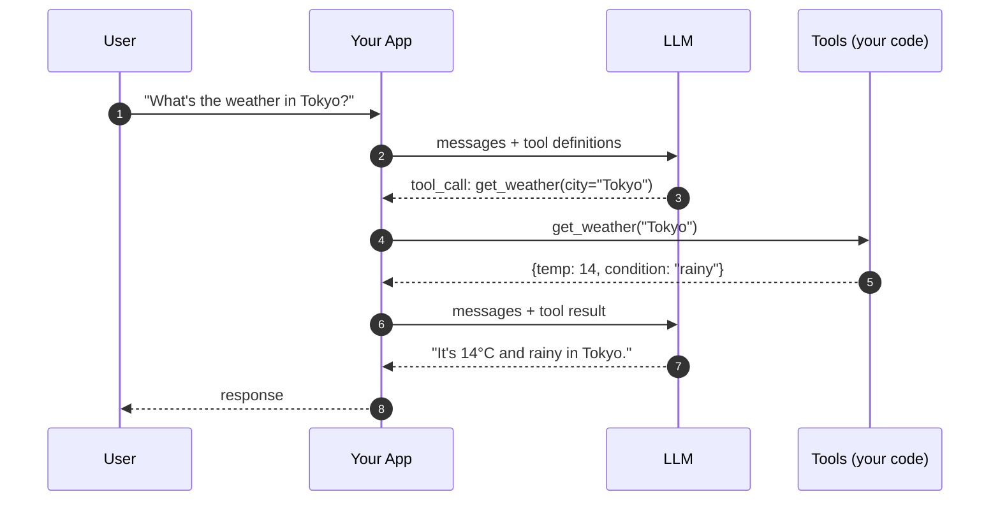

# Stage 4 — Tool calling

> **Time budget:** ~1 week

> **In one line:** Give the model a list of functions it could call, let it pick one, run the function, feed the result back — the architecture behind every assistant that "does things."

Tool calling (also called function calling) is the bridge from "LLM that talks" to "LLM that *acts*." A weather assistant, an email triage bot that actually labels tickets, a coding assistant that runs commands — all are tool-calling loops.

Crucially: the model doesn't run the code. You do. The model just *suggests* a structured call. Your code executes it (or refuses), then sends the result back to the model so it can continue reasoning.

:::tip[In plain English]
You hand the model a menu of functions: name, description, parameters. The model picks one and tells you "please call `get_weather(city='Tokyo')`." Your code runs it, gets a result like `{temp: 14, condition: 'rainy'}`, and sends that back. The model then answers the user using the result. It's a *conversation about function calls.*
:::

## 1. The mental model



Two LLM calls, one tool execution in between. The first call asks "what should I do?" The second call asks "given that result, what do I say to the user?"

## 2. The shape of a tool definition

```python
tools = [
    {
        "type": "function",
        "function": {
            "name": "get_weather",
            "description": "Get the current weather for a city. Returns temperature in Celsius and a condition string.",
            "parameters": {
                "type": "object",
                "properties": {
                    "city": {
                        "type": "string",
                        "description": "City name, e.g. 'Tokyo', 'Paris'. Avoid abbreviations.",
                    },
                },
                "required": ["city"],
            },
        },
    },
]
```

Three load-bearing things:

1. **`name`** — must be unique, code-identifier shape, descriptive.
2. **`description`** — the model picks tools largely by description. Treat this as docstring-quality prose. "Get the current weather" beats "weather thing." Add when *not* to use it: "Only for current weather, not forecasts."
3. **`parameters`** — a JSON schema. Be strict. Required fields. Enums where possible. Descriptions on each parameter.

The reality nobody warns you: **the model picks tools by reading descriptions far more than by reading code or examples**. Bad descriptions = wrong tool calls. Treat description-writing as the prompt-engineering of tool calling.

## 3. The full Python loop

```python
# stage-4/weather_assistant.py
import json
from dotenv import load_dotenv
from openai import OpenAI

load_dotenv()
client = OpenAI()


def get_weather(city: str) -> dict:
    """A stub. Replace with a real API call (e.g. open-meteo.com) when ready."""
    fake_data = {
        "Tokyo": {"temp_c": 14, "condition": "rainy"},
        "Paris": {"temp_c": 8, "condition": "cloudy"},
        "New York": {"temp_c": 20, "condition": "sunny"},
    }
    return fake_data.get(city, {"temp_c": None, "condition": "unknown"})


def get_top_headlines(topic: str) -> list[str]:
    """Another stub. Plug into a real news API."""
    return [f"Sample headline about {topic} #1", f"Sample headline about {topic} #2"]


TOOLS = [
    {
        "type": "function",
        "function": {
            "name": "get_weather",
            "description": "Get current weather for a city. Returns temperature in Celsius and a condition.",
            "parameters": {
                "type": "object",
                "properties": {"city": {"type": "string", "description": "City name"}},
                "required": ["city"],
            },
        },
    },
    {
        "type": "function",
        "function": {
            "name": "get_top_headlines",
            "description": "Get top news headlines on a topic. Use only for current news, not historical context.",
            "parameters": {
                "type": "object",
                "properties": {"topic": {"type": "string"}},
                "required": ["topic"],
            },
        },
    },
]


TOOL_REGISTRY = {
    "get_weather": get_weather,
    "get_top_headlines": get_top_headlines,
}


def chat_with_tools(user_input: str, max_iters: int = 5):
    messages = [
        {"role": "system", "content": "You answer user questions using the tools when relevant. If no tool fits, answer from your own knowledge."},
        {"role": "user", "content": user_input},
    ]

    for iteration in range(max_iters):
        response = client.chat.completions.create(
            model="gpt-5-mini",
            messages=messages,
            tools=TOOLS,
        )
        msg = response.choices[0].message

        # Case 1: model answered directly (no tool calls)
        if not msg.tool_calls:
            print(f"Assistant: {msg.content}")
            return

        # Case 2: model wants to call one or more tools
        # MUST append the assistant message (with tool_calls) before tool results
        messages.append(msg)

        for call in msg.tool_calls:
            fn_name = call.function.name
            args = json.loads(call.function.arguments)
            print(f"  -> calling {fn_name}({args})")

            if fn_name in TOOL_REGISTRY:
                result = TOOL_REGISTRY[fn_name](**args)
            else:
                result = {"error": f"unknown tool: {fn_name}"}

            messages.append({
                "role": "tool",
                "tool_call_id": call.id,
                "content": json.dumps(result),
            })

        # loop continues — next iteration sends tool results back

    print(f"Assistant: hit max iterations ({max_iters})")


if __name__ == "__main__":
    chat_with_tools("What's the weather in Tokyo, and what's the news on AI?")
```

What happens when you run this:

```
  -> calling get_weather({'city': 'Tokyo'})
  -> calling get_top_headlines({'topic': 'AI'})
Assistant: It's 14°C and rainy in Tokyo. Top AI headlines: ...
```

Two parallel tool calls in one turn. The model decided both tools were needed and emitted them together. Your loop executed both, fed both results back, and the model composed the final answer.

## 4. The TypeScript version

```ts
// stage-4/weather-assistant.ts
import "dotenv/config";
import OpenAI from "openai";

const client = new OpenAI();

const tools: OpenAI.ChatCompletionTool[] = [
  {
    type: "function",
    function: {
      name: "get_weather",
      description: "Get current weather for a city.",
      parameters: {
        type: "object",
        properties: { city: { type: "string" } },
        required: ["city"],
      },
    },
  },
];

const registry: Record<string, (args: any) => unknown> = {
  get_weather: ({ city }: { city: string }) =>
    ({ temp_c: 14, condition: "rainy", city }),
};

async function chatWithTools(userInput: string, maxIters = 5) {
  const messages: OpenAI.ChatCompletionMessageParam[] = [
    { role: "system", content: "Use tools when relevant. Otherwise answer directly." },
    { role: "user", content: userInput },
  ];

  for (let i = 0; i < maxIters; i++) {
    const res = await client.chat.completions.create({
      model: "gpt-5-mini",
      messages,
      tools,
    });
    const msg = res.choices[0].message;

    if (!msg.tool_calls?.length) {
      console.log("Assistant:", msg.content);
      return;
    }

    messages.push(msg);  // assistant turn with tool_calls

    for (const call of msg.tool_calls) {
      const args = JSON.parse(call.function.arguments);
      const result = registry[call.function.name](args);
      messages.push({
        role: "tool",
        tool_call_id: call.id,
        content: JSON.stringify(result),
      });
    }
  }
}

await chatWithTools("Weather in Tokyo?");
```

## 5. The non-obvious rules

### Always append the assistant tool-call turn before tool results

The message order MUST be: assistant (with `tool_calls`) → tool (result for call 1) → tool (result for call 2) → ... → user / next assistant. Skipping the assistant turn or interleaving tool results between user turns will fail validation.

### Tool descriptions are prompts

You'll write better tool definitions if you treat the description as a prompt-engineering exercise. Anti-pattern:

```python
"description": "Search docs"  # too terse
```

Good:

```python
"description": "Search the customer's internal documentation. Use for product-specific questions only — not general knowledge. Returns up to 5 relevant doc snippets with title + excerpt."
```

### Parallel tool calls

Modern models routinely emit several tool calls in one assistant turn. Execute them concurrently (they're independent function calls) — running them serially in a loop is needlessly slow.

```python
import asyncio

async def execute_calls(tool_calls):
    return await asyncio.gather(*[
        run_tool(call) for call in tool_calls
    ])
```

### Always cap iterations

The loop can theoretically run forever — the model keeps asking for more tool calls. Always have a `max_iters` ceiling. Three to ten is typical for non-agent workloads; agent workloads (Stage 8) need different caps.

### Never let the model call tools that change state without confirmation

If a tool sends emails, charges cards, deletes data — add a confirmation step before execution. Even one. The cost of getting this wrong is "the model emailed every customer at 2am with a hallucinated apology."

## 6. Tool choice control

```python
tool_choice="auto"      # default — model picks
tool_choice="none"      # disallow tool calls this turn (force a text reply)
tool_choice="required"  # MUST call a tool (no plain reply)
tool_choice={"type": "function", "function": {"name": "get_weather"}}  # force a specific tool
```

`"required"` is useful when you've decided "this user message must produce a structured action, even if the model wants to chat." `"none"` is useful for follow-up turns where you want a summary of what just happened, not more tool invocations.

## 7. Anthropic / Claude tool calling

Same idea, slightly different shape:

```python
from anthropic import Anthropic
client = Anthropic()

tools = [
    {
        "name": "get_weather",
        "description": "Get current weather.",
        "input_schema": {
            "type": "object",
            "properties": {"city": {"type": "string"}},
            "required": ["city"],
        },
    },
]

response = client.messages.create(
    model="claude-haiku-4-5",
    max_tokens=1024,
    tools=tools,
    messages=[{"role": "user", "content": "Weather in Tokyo?"}],
)

# response.content is a list of blocks. Some are TextBlock, some are ToolUseBlock.
for block in response.content:
    if block.type == "tool_use":
        # block.name, block.input, block.id
        result = registry[block.name](**block.input)
        # next turn: messages += [assistant turn, user turn with tool_result block]
```

Conceptually identical; field names differ. The Vercel AI SDK (`tool()` + `streamText`) and OpenAI Agents SDK both abstract over these differences.

## 8. Where to use tool calling (and where not to)

**Use it for:** asking the model to take an action that needs your code (DB query, API call, computation, sending email), letting the model decide which of several actions fits, multi-step workflows where each step is a function.

**Don't use it for:** structured *output extraction* — that's Stage 3. Tool calling is overkill if you just want one well-formed object; structured outputs are simpler. Use tool calling when the model is *choosing among actions*.

## Where to go deeper

- [OpenAI function-calling guide](https://platform.openai.com/docs/guides/function-calling) — current as of 2026, covers parallel tools and strict mode.
- [Anthropic tool use](https://docs.anthropic.com/en/docs/build-with-claude/tool-use) — Claude flavor.
- [Vercel AI SDK tools](https://sdk.vercel.ai/docs/foundations/tools) — provider-abstracted version.
- [MCP — Model Context Protocol](https://modelcontextprotocol.io) — the emerging standard for tool servers; once you've shipped one custom tool loop, learn this.

## Deeper in this guide

- [Foundations: Tool use](/docs/foundations/tool-use) — what the model is actually doing under the hood.
- [Patterns: Tool use](/docs/patterns/pattern-tool-use) — production patterns: timeouts, retries, sandboxing, observability.
- [Foundations: Agent loop](/docs/foundations/agent-loop) — the connection from tool calling to agents (Stage 8).

## Project

:::tip[Project — A 3-tool assistant]
Build an assistant with three real tools (no stubs). Suggestions: `get_weather(city)` against [open-meteo](https://open-meteo.com) (no key needed), `search_wikipedia(query)` against the Wikipedia REST API, and `calculate(expression)` using a sandboxed eval. The model picks which to use. Add a `max_iters=5` cap, log every tool call to stdout, and refuse to call any tool whose name isn't in your registry. **Then write 15 eval cases**: questions that should hit each tool, ambiguous questions, questions no tool can answer (the model should answer directly without calling anything). Track tool-call accuracy.
:::

## Common mistakes

:::caution[Where people commonly trip up]
- **Treating tool descriptions as code comments instead of prompts.** The model picks tools by reading descriptions. Terse descriptions = wrong tool choice. Spend disproportionate effort on this; it's the highest leverage tuning knob.
- **Forgetting the assistant tool-call turn in message history.** The required sequence is assistant(tool_calls=[...]) → tool(result for call 1) → tool(result for call 2). If you push tool results without first appending the assistant turn, the API rejects the next call.
- **No iteration cap.** Without `max_iters`, a confused model can loop forever — and you pay for every iteration. Set a cap. Three to five for non-agent flows, larger for agents.
- **Letting the model invoke write/destructive tools without confirmation.** "It worked in testing" → "the model emailed 5,000 customers in production." Any tool that changes state needs a human-in-the-loop confirmation, *especially* during early development.
- **Executing tool calls serially when they could be parallel.** Modern models emit parallel tool calls. Running them one-at-a-time multiplies latency. Use `asyncio.gather` (Python) or `Promise.all` (TS).
- **Confusing tool calling with structured output.** Stage 3 (structured output) is the right tool for "I want a typed object back." Stage 4 (tool calling) is for "the model should decide which action to take." Using tool calling just to get a JSON back is the long way around.
:::

## Page checkpoint

<Quiz id="stage-4-tools-quick-check" variant="micro" title="Quick check">

<Question
  prompt="In a tool-calling loop, who actually executes the function when the model emits a tool call?"
  options={[
    { text: "Your code — the model only suggests a structured call, and your app runs it (or refuses) and sends the result back" },
    { text: "The provider's servers run it in a sandbox and return the result" },
    { text: "The model executes it internally as part of generating its response" },
    { text: "A separate executor model dedicated to running tools" }
  ]}
  correct={0}
  explanation="This is the load-bearing fact of the whole architecture: the model never runs code. It emits a structured request like get_weather(city='Tokyo'); your application decides whether to execute it, runs the function, and feeds the result back so the model can continue reasoning. That separation is also why you can — and must — add safeguards like confirmation steps, since the decision to act always passes through your code."
/>

<Question
  prompt="Your assistant keeps picking the wrong tool for user questions. According to this page, what is the highest-leverage fix?"
  options={[
    { text: "Switch to a larger, more capable model" },
    { text: "Add few-shot examples of correct tool calls to every prompt" },
    { text: "Rewrite the tool descriptions — the model picks tools largely by reading descriptions, so treat them as prompt engineering" },
    { text: "Reduce the number of tools to exactly one" }
  ]}
  correct={2}
  explanation="The reality nobody warns you about: the model selects tools by reading their descriptions far more than anything else. A terse description like 'Search docs' gets wrong tool choices; a docstring-quality one that says what the tool returns and when NOT to use it fixes most selection errors. Bigger models and fewer tools can paper over the problem, but description-writing is the cheapest, highest-leverage knob you control."
/>

<Question
  prompt="After executing the model's tool calls, your next API request gets rejected by the provider. What ordering rule did you most likely violate?"
  options={[
    { text: "Tool results must be sent in a separate API call from user messages" },
    { text: "Each tool result must appear before the tool call that requested it" },
    { text: "Tool results must be wrapped in a system message" },
    { text: "The assistant message containing tool_calls must be appended to history before the tool result messages" }
  ]}
  correct={3}
  explanation="The required sequence is: assistant turn (with tool_calls) first, then one tool message per call referencing its tool_call_id. If you push tool results without first appending the assistant turn that requested them, the API rejects the conversation as malformed — there is a result with no matching request. The other orderings described here are inventions; the assistant-before-results rule is the one that actually bites people."
/>

</Quiz>

→ [Next: Stage 5 — RAG](./06-stage-5-rag.md) · [Back to Part I overview](./index.md)
