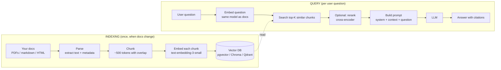

# Stage 5 — RAG over your own documents

> **Time budget:** ~2 weeks

> **In one line:** Index your documents, retrieve the relevant chunks for a question, and ask the model to answer using only those chunks — the pattern that lets the LLM "know" your private data without retraining.

This is the stage where AI engineering starts feeling like real engineering. The model is one component; the retrieval pipeline is most of the work; the failures are subtle and ranking-driven, not just prompt-driven.

:::tip[In plain English]
The model only knows what was in its training data, which is (a) public, (b) frozen at a date. RAG (Retrieval-Augmented Generation) is the pattern that says: before you ask the model a question about your data, look up the relevant snippets and paste them into the prompt as context. The model answers using those snippets. No fine-tuning, no millions of dollars of training, no exposing your data to the provider permanently.
:::

## 1. The pipeline



Two phases: index once (offline), retrieve per query (online). The index is your data turned into a searchable vector store; retrieval finds the K most similar chunks to the user's question; the LLM answers using those chunks as context.

## 2. The minimum viable RAG (Python, ~80 lines)

```python
# stage-5/rag.py
import os
import glob
from pathlib import Path
from openai import OpenAI
import psycopg
from pgvector.psycopg import register_vector

load_dotenv()
client = OpenAI()

# --- 1. INDEXING ---

def chunk_text(text: str, chunk_size: int = 500, overlap: int = 50) -> list[str]:
    """Split text into ~500-token chunks with overlap. Words approximate tokens."""
    words = text.split()
    chunks = []
    for i in range(0, len(words), chunk_size - overlap):
        chunks.append(" ".join(words[i:i + chunk_size]))
    return chunks


def embed(text: str) -> list[float]:
    response = client.embeddings.create(model="text-embedding-3-small", input=text)
    return response.data[0].embedding


def index_docs(folder: str, conn):
    with conn.cursor() as cur:
        cur.execute("DROP TABLE IF EXISTS chunks")
        cur.execute("""
            CREATE TABLE chunks (
                id SERIAL PRIMARY KEY,
                source TEXT,
                chunk_idx INT,
                text TEXT,
                embedding vector(1536)
            )
        """)
        for path in glob.glob(f"{folder}/**/*.md", recursive=True):
            text = Path(path).read_text()
            for i, chunk in enumerate(chunk_text(text)):
                vec = embed(chunk)
                cur.execute(
                    "INSERT INTO chunks (source, chunk_idx, text, embedding) VALUES (%s, %s, %s, %s)",
                    (path, i, chunk, vec),
                )
        conn.commit()


# --- 2. QUERY ---

def retrieve(question: str, conn, k: int = 5) -> list[tuple[str, str]]:
    q_embed = embed(question)
    with conn.cursor() as cur:
        cur.execute(
            "SELECT source, text FROM chunks ORDER BY embedding <=> %s::vector LIMIT %s",
            (q_embed, k),
        )
        return cur.fetchall()


def answer(question: str, conn) -> str:
    hits = retrieve(question, conn)
    context = "\n\n---\n\n".join(f"[Source: {src}]\n{txt}" for src, txt in hits)

    response = client.chat.completions.create(
        model="gpt-5-mini",
        messages=[
            {"role": "system", "content": (
                "Answer the user's question using ONLY the provided context. "
                "Cite sources with [Source: filename]. "
                "If the context doesn't contain the answer, say 'I don't know.'"
            )},
            {"role": "user", "content": f"Context:\n{context}\n\nQuestion: {question}"},
        ],
    )
    return response.choices[0].message.content


if __name__ == "__main__":
    conn = psycopg.connect("postgresql://localhost/rag_demo")
    register_vector(conn)
    # index_docs("./docs", conn)  # run once
    print(answer("What is structured output?", conn))
```

Setup: `docker run -d -p 5432:5432 -e POSTGRES_HOST_AUTH_METHOD=trust pgvector/pgvector:pg16`, then `CREATE EXTENSION vector;` in the database.

That's it. ~80 lines, end-to-end RAG. Point it at any folder of markdown.

## 3. What each piece is actually doing

### Embedding

An embedding is a fixed-length vector of floats (1,536 dims for `text-embedding-3-small`) that represents the *meaning* of a piece of text. Two semantically similar texts have similar vectors (small cosine distance). The vector DB lets you find "K nearest" in this space in milliseconds.

```python
embed("dog")           # vector A
embed("puppy")         # vector B — close to A
embed("automobile")    # vector C — far from A
```

You're not searching for keyword matches; you're searching for *meaning* matches. "What's the chunking strategy?" can retrieve a paragraph that uses the word "splitting" instead of "chunking" because their embeddings are close.

### Chunking

You can't paste a whole 100-page PDF into a prompt (or you can, but it's expensive and recall drops). So you split it into chunks (~500 tokens each), embed each one, store them. At query time, you retrieve the relevant chunks instead of the whole doc.

**Chunking strategy is the single biggest lever in RAG quality.** More on this in [Retrieval quality (Part III)](../03-part-3-beyond/03-retrieval-quality.md).

### Vector search

`embedding <=> %s::vector` (in pgvector) is cosine distance. The DB sorts all chunks by distance from your query embedding, returns the closest K. With an index (HNSW or IVFFlat) this is sub-millisecond even on millions of chunks.

### The prompt template

```
System: Answer the user's question using ONLY the provided context.
        Cite sources with [Source: filename].
        If the context doesn't contain the answer, say 'I don't know.'

User:   Context:
        [Source: docs/foundations/embeddings.md]
        Embeddings are vectors that represent meaning...

        ---

        [Source: docs/stack/vector-databases.md]
        Vector databases store embeddings and support nearest-neighbor search...

        Question: What is an embedding?
```

Three things you almost always want in the system prompt:

1. **"Use ONLY the provided context"** — without this, the model freely mixes its own knowledge in, hallucinating sources.
2. **"Cite sources"** — gives the user verifiability and gives you eval signal.
3. **"Say 'I don't know' if the answer isn't in context"** — *the* most important line. Without it, RAG hallucinates confidently when retrieval misses.

## 4. The TypeScript version (sketch)

```ts
// stage-5/rag.ts
import "dotenv/config";
import OpenAI from "openai";
import { Chroma } from "chromadb";  // local in-process vector DB

const openai = new OpenAI();
const client = new Chroma();
const collection = await client.getOrCreateCollection({ name: "docs" });

async function embed(text: string): Promise<number[]> {
  const res = await openai.embeddings.create({
    model: "text-embedding-3-small",
    input: text,
  });
  return res.data[0].embedding;
}

async function indexDoc(id: string, text: string) {
  // Naive chunking — see below for why this is too naive
  const chunks = text.match(/.{1,2000}/gs) || [];
  for (let i = 0; i < chunks.length; i++) {
    await collection.add({
      ids: [`${id}-${i}`],
      documents: [chunks[i]],
      embeddings: [await embed(chunks[i])],
      metadatas: [{ source: id }],
    });
  }
}

async function answer(question: string): Promise<string> {
  const qVec = await embed(question);
  const results = await collection.query({ queryEmbeddings: [qVec], nResults: 5 });
  const context = results.documents[0].map((d, i) => 
    `[Source: ${results.metadatas[0][i].source}]\n${d}`
  ).join("\n\n---\n\n");

  const res = await openai.chat.completions.create({
    model: "gpt-5-mini",
    messages: [
      { role: "system", content: "Answer using ONLY the provided context. Cite sources. Say 'I don't know' if not covered." },
      { role: "user", content: `Context:\n${context}\n\nQuestion: ${question}` },
    ],
  });
  return res.choices[0].message.content!;
}
```

## 5. The first version always feels magical

Run the minimum-viable RAG on your own notes. The first 5 queries will work. You'll think you're done.

You're not. The next 50 queries will reveal:

- **Chunks that split mid-sentence**, so the model never gets a coherent block.
- **The right chunk wasn't retrieved** — keyword-y queries miss when embedded against semantically different chunks.
- **Code blocks** that lose their formatting in chunking.
- **Headers detached from their bodies** — you retrieve "## Configuration" without the paragraph below it.
- **Tables** that turn into garbled text.
- **Citations that don't actually appear in the context** because the model made them up.

This is normal. Stage 5 is "get a working pipeline." Stage 6 (evals) is how you measure these failures. [Retrieval quality (Part III)](../03-part-3-beyond/03-retrieval-quality.md) is the page on how to fix them.

## 6. Chunking strategies, ranked

| Strategy | Quality | When to use |
|----------|---------|-------------|
| Fixed-size by chars | Bad | Never. Splits mid-word. |
| Fixed-size by words | Okay | Quick prototypes. |
| Fixed-size with overlap | Better | What our example does. The overlap (~50–100 tokens) helps recover context split across the boundary. |
| Recursive splitter (by paragraph → sentence → word) | Good | The pragmatic default. LangChain's `RecursiveCharacterTextSplitter` is fine. |
| Semantic chunking (split where embedding similarity drops) | Better | When your docs vary widely in section length. |
| Document-structure-aware (split on headings, keep tables, code blocks intact) | Best | The right answer for engineering docs, technical PDFs. More work. |

Start with recursive. Move to structure-aware when the eval forces you.

## 7. Hybrid retrieval (BM25 + vector) > pure vector

Pure vector search misses exact-match terms ("token error in line 42" needs to retrieve the chunk with that exact phrase, not the semantically-closest one). Combine vector search with BM25 (keyword scoring) and re-rank with a simple sum:

```python
def hybrid_retrieve(question, conn, k=5):
    vec_hits = vector_search(question, conn, k=k*2)
    bm25_hits = bm25_search(question, conn, k=k*2)
    # Reciprocal rank fusion (RRF) — simple, no parameters
    scores = {}
    for rank, hit in enumerate(vec_hits):
        scores[hit.id] = scores.get(hit.id, 0) + 1 / (60 + rank)
    for rank, hit in enumerate(bm25_hits):
        scores[hit.id] = scores.get(hit.id, 0) + 1 / (60 + rank)
    return sorted(scores.items(), key=lambda x: -x[1])[:k]
```

Postgres + pgvector + the `tsvector` full-text-search type gets you both in one DB.

## 8. The "with citations" prompt pattern

Your system prompt should make citations machine-checkable:

```
Answer the question using ONLY the provided context.
Every claim in your answer MUST end with [Source: <filename>].
If the answer isn't in the context, reply with exactly: "I don't know."
```

Now your eval can check: "Did the response include `[Source: ...]`?" "Was each cited source actually in the retrieved set?" Two trivial regex checks that catch the most common RAG hallucination.

## Where to go deeper

- [Pinecone Learn: RAG fundamentals](https://www.pinecone.io/learn/) — readable intro to embeddings, similarity search, and RAG.
- [LlamaIndex docs](https://docs.llamaindex.ai) — the most mature Python RAG framework; read after building one from scratch.
- [Anthropic: Contextual retrieval](https://www.anthropic.com/news/contextual-retrieval) — a recent technique that improves chunk recall significantly.
- [pgvector README](https://github.com/pgvector/pgvector) — the boring-tech answer for vector storage; one extension, your existing Postgres.

## Deeper in this guide

- [Foundations: Embeddings](/docs/foundations/embeddings) — what embedding models do, why dimensions matter.
- [Foundations: Vector search](/docs/foundations/vector-search) — HNSW, IVF, the algorithms behind nearest-neighbor lookup.
- [Foundations: RAG basics](/docs/foundations/rag-basics) — the conceptual frame at more length.
- [Stack: Vector databases](/docs/stack/vector-databases) — the tier-list of vector DBs.
- [Stack: Embedding models](/docs/stack/embedding-models) — which embedding model to pick.
- [Patterns: RAG in production](/docs/patterns/pattern-rag-prod) — what breaks at scale and how to fix it.

## Project

:::tip[Project — A RAG over your own notes]
Point this RAG at something you actually use: your notes folder, a company wiki dump, the markdown for this guide, a folder of PDFs. Index it. Ask 20+ real questions. Note which ones get good answers and which don't. **Then** look at what was retrieved for the bad cases — was it a retrieval problem (wrong chunks) or a generation problem (right chunks, bad answer)? That diagnosis is the skill you're building. Save the failing cases for Stage 6 — they'll become your first eval set.
:::

## Common mistakes

:::caution[Where people commonly trip up]
- **Skipping "I don't know" in the prompt.** Without it, the model hallucinates confidently when retrieval misses. With it, you get an honest non-answer you can route to a human or trigger a "no results found" UI.
- **Trusting the first 5 queries.** RAG always demos well. Build the eval before declaring victory; the failure modes hide in the long tail.
- **Pure-vector when hybrid would work.** Adding BM25 alongside vector search and combining with RRF is a 50-line change that typically lifts retrieval quality 10–20 points on real corpora.
- **Chunking by character count.** Chunking has to respect document structure (headings, paragraphs, code blocks). Naive chunking is the #1 cause of "the right info wasn't in the retrieved context."
- **Re-embedding everything on every query.** Embed once at index time; embed only the query at query time. Re-embedding all docs per query is a common bug that makes RAG look broken AND expensive.
- **Embedding model mismatch.** The query and the docs must be embedded with the SAME model. Mixing `text-embedding-3-small` for docs and `text-embedding-3-large` for queries is silent garbage — similarity scores become meaningless.
:::

## Page checkpoint


→ [Next: Stage 6 — Your first eval set](./07-stage-6-evals.md) · [Back to Part I overview](./index.md)
