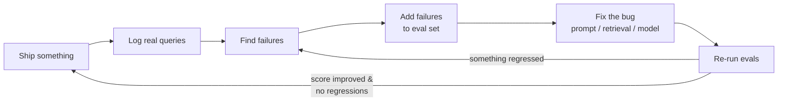

# Stage 6 — Your first eval set

> **Time budget:** ~1 week

> **In one line:** Build a 50–100 case test suite for your RAG (from Stage 5), with at least one deterministic check and one LLM-as-judge check — the discipline that lets you change anything without breaking everything.

This is the inflection point. Engineers who ship AI without evals iterate on vibes — every change might be better, might be worse, nobody can tell. Engineers with evals iterate on numbers, ship confidently, and survive model swaps without panic.

:::tip[In plain English]
An eval is just a unit test for an LLM call. "Given this input, the output should pass these checks." Run them after every change — new prompt, new model, new chunking, new retrieval. If the score drops, you broke something. This is the only honest feedback loop in AI engineering, and the field's #1 missing skill.
:::

## 1. The shape of an eval set

A flat JSON file. Each entry: an input, an expected behavior, and one or more checks.

```python
[
    {
        "id": "rag-001",
        "question": "What is structured output?",
        "expected_source_contains": "structured-output",
        "must_say": "schema",
        "must_not_hallucinate_sources": True,
    },
    {
        "id": "rag-002",
        "question": "How do I delete my account?",
        "expected_answer": "I don't know",  # not in docs — should refuse
    },
    # ... 48–98 more
]
```

The hard part isn't writing the runner; it's *curating cases*. A good eval set has:

- **Easy cases** — "the model should obviously get this right." Catches regressions.
- **Hard cases** — ambiguous, multi-hop, ones you've personally seen the system get wrong.
- **Refusal cases** — questions whose answer isn't in your docs; correct behavior is "I don't know."
- **Adversarial cases** — prompt injection, leading questions, intentionally-wrong premises.
- **Representative cases** — sampled from actual user queries (once you have any).

50 cases is a real eval set. 5 is a smoke test. 500+ is a maturity signal.

## 2. Two kinds of checks: deterministic and LLM-graded

### Deterministic checks (fast, cheap, narrow)

```python
def check_must_contain(output: str, substring: str) -> bool:
    return substring.lower() in output.lower()

def check_must_not_contain(output: str, substring: str) -> bool:
    return substring.lower() not in output.lower()

def check_cited_sources_exist(output: str, retrieved_chunks: list) -> bool:
    """Every [Source: X] in the output must match an actually-retrieved source."""
    import re
    cited = re.findall(r"\[Source: ([^\]]+)\]", output)
    retrieved_srcs = {chunk.source for chunk in retrieved_chunks}
    return all(src in retrieved_srcs for src in cited)

def check_schema(output: dict, schema: type) -> bool:
    try:
        schema.model_validate(output)  # pydantic
        return True
    except Exception:
        return False
```

Use deterministic checks wherever you can — they're free, fast, and don't require judgment calls. Most are one or two lines.

### LLM-as-judge (slow, expensive, broad)

```python
JUDGE_PROMPT = """You are evaluating an AI assistant's answer.

QUESTION: {question}
GOLD ANSWER (what a perfect answer would look like): {gold}
ACTUAL ANSWER: {actual}

Score the actual answer on:
1. Correctness (0-5): does it answer the question accurately?
2. Faithfulness (0-5): does it stay grounded in the gold/context (no invented facts)?
3. Helpfulness (0-5): is it the answer the user wanted, or a non-sequitur?

Return JSON: {{"correctness": int, "faithfulness": int, "helpfulness": int, "rationale": str}}"""


def judge(question: str, gold: str, actual: str) -> dict:
    response = client.chat.completions.create(
        model="gpt-5-mini",  # the judge is usually cheaper than the model being judged
        messages=[{"role": "user", "content": JUDGE_PROMPT.format(
            question=question, gold=gold, actual=actual,
        )}],
        response_format={"type": "json_object"},
        temperature=0,
    )
    import json
    return json.loads(response.choices[0].message.content)
```

LLM-as-judge handles the cases deterministic checks can't ("is this answer actually helpful?"). It has known biases (next page covers them in depth: [Eval mindset](../03-part-3-beyond/02-eval-mindset.md)), but it's the only practical way to grade open-ended responses at scale.

## 3. The full eval runner

```python
# stage-6/eval.py
import json
from dataclasses import dataclass
from rag import answer, retrieve  # from Stage 5


@dataclass
class CaseResult:
    case_id: str
    passed: bool
    score: float
    notes: str


def run_case(case: dict) -> CaseResult:
    q = case["question"]
    output = answer(q)
    retrieved = retrieve(q)

    notes = []
    passed = True

    if "must_say" in case:
        if case["must_say"].lower() not in output.lower():
            passed = False
            notes.append(f"missing required substring: {case['must_say']}")

    if "must_not_say" in case:
        if case["must_not_say"].lower() in output.lower():
            passed = False
            notes.append(f"contains forbidden substring: {case['must_not_say']}")

    if case.get("expected_answer") == "I don't know":
        if "i don't know" not in output.lower():
            passed = False
            notes.append("should have refused (not in docs); did not")

    if case.get("must_not_hallucinate_sources"):
        import re
        cited = re.findall(r"\[Source: ([^\]]+)\]", output)
        retrieved_srcs = {src for src, _ in retrieved}
        hallucinated = [c for c in cited if c not in retrieved_srcs]
        if hallucinated:
            passed = False
            notes.append(f"hallucinated sources: {hallucinated}")

    # LLM-judge for the open-ended quality
    if "gold_answer" in case:
        judgment = judge(q, case["gold_answer"], output)
        if judgment["correctness"] < 3:
            passed = False
            notes.append(f"low correctness: {judgment['rationale']}")

    return CaseResult(
        case_id=case["id"],
        passed=passed,
        score=1.0 if passed else 0.0,
        notes="; ".join(notes),
    )


def run_eval(cases_file: str):
    cases = json.loads(open(cases_file).read())
    results = [run_case(c) for c in cases]

    passed = sum(1 for r in results if r.passed)
    total = len(results)
    pass_rate = passed / total

    print(f"\n{'='*60}\n{passed}/{total} passed ({pass_rate:.0%})\n{'='*60}")
    for r in results:
        if not r.passed:
            print(f"FAIL [{r.case_id}]: {r.notes}")

    # Save for diffing across runs
    with open(f"results-{int(time.time())}.json", "w") as f:
        json.dump([r.__dict__ for r in results], f, indent=2)

    return pass_rate


if __name__ == "__main__":
    run_eval("cases.json")
```

Run this on every change. The first run gives you a baseline (probably ~70% if your RAG is real). Each prompt tweak, model swap, chunking change — re-run, compare scores, look at which cases regressed.

## 4. The iteration loop



The eval set grows organically. Every real-world failure becomes a permanent test case. After 3–6 months, the set is ~200–500 cases and covers your actual usage distribution, not your imagined one.

## 5. What to grade vs not

| Grade with deterministic | Grade with LLM judge | Don't grade in eval (sample manually) |
|--------------------------|---------------------|----------------------------------------|
| Schema validity | Answer correctness on open questions | Tone, style |
| Required substrings | Faithfulness to context | Cultural appropriateness |
| Forbidden substrings (PII, profanity) | Helpfulness | Subjective "delight" |
| Citation source-exists | Refusal correctness ("did it correctly say I don't know") | UI / latency UX |
| JSON parse success | Comparative ranking (A vs B) | |
| Length bounds | | |

If you can write a 5-line deterministic check, do that. LLM-judge is your second choice, not your default.

## 6. Eval tools when you outgrow a script

Start with the script. Move only when:

- The eval set passes 100+ cases and the script's >300 lines.
- You want to A/B compare two model versions visually.
- You want to track scores over time (regression dashboard).
- A team needs to add cases without merge conflicts.

Then look at:

| Tool | Hosted/OSS | Best for |
|------|------------|----------|
| **Braintrust** | Hosted | Pro AI teams; rich UI, fast comparisons, traces |
| **Langfuse** | OSS + Hosted | Open-source, full observability + evals in one |
| **LangSmith** | Hosted | LangChain shops |
| **Promptfoo** | OSS | CLI-first, great for CI integration |
| **DeepEval** | OSS | Pytest-style; familiar for Python teams |
| **Ragas** | OSS | RAG-specific metrics (faithfulness, context recall) |
| **OpenAI Evals** | OSS | Reference framework; pretty bare-bones |

Pick based on your stack and the kind of eval you do most. [Stack: Eval tools](/docs/stack/eval-tools) has the full comparison.

## 7. The pitfalls every eval set hits

### Overfitting the eval set

If you tune your prompts to pass every case in the set, you'll start passing the set without improving real performance. Mitigations: hold out 20% of cases as a "test set" you only run occasionally; keep adding new cases from production failures.

### LLM-judge biases

The judge model has positional bias (prefers first option), verbosity bias (prefers longer answers), self-preference (prefers outputs from its own family). Mitigations:

- Randomize the order of options in A-vs-B comparisons.
- Use a different model family for the judge than the one being judged.
- Anchor with a reference/gold answer.
- Calibrate against ~20 human-rated cases periodically.

→ Deep dive: [Eval mindset (Part III)](../03-part-3-beyond/02-eval-mindset.md).

### Eval drift

Your eval set was made on Q1 docs. Q3 docs changed. Now half your "I don't know" cases should say "yes, here's the answer." Schedule periodic eval-set audits.

### Eval velocity vs scope

A 1000-case set that takes 30 minutes to run is worse than a 100-case set that takes 30 seconds and gets run on every commit. Pick a size that supports your iteration speed.

## Where to go deeper

- [Eugene Yan: LLM-eval patterns](https://eugeneyan.com/writing/llm-evals/) — currently the best practical guide on LLM evals.
- [Hamel Husain: Field guide to LLM evals](https://hamel.dev/blog/posts/evals/) — written by someone who's run them on hundreds of production systems.
- [Anthropic: Building evals](https://docs.anthropic.com/en/docs/build-with-claude/develop-tests) — provider-flavored but the principles transfer.
- [Promptfoo docs](https://www.promptfoo.dev) — best free hands-on tool for getting started.

## Deeper in this guide

- [Eval mindset (Part III)](../03-part-3-beyond/02-eval-mindset.md) — the *thinking* side of evals: bias, calibration, drift.
- [Stack: Eval tools](/docs/stack/eval-tools) — the tier list of evaluation tools.
- [Patterns: Evals](/docs/patterns/pattern-evals) — production eval patterns: CI integration, regression dashboards, traffic-sampled grading.
- [Lifecycle: Evals](/docs/lifecycle/lifecycle-evals) — where evals fit in the build-iterate-ship cycle.

## Project

:::tip[Project — A real eval suite for your RAG]
Take the RAG from Stage 5. Curate **50+ cases**: 30 easy/representative, 10 hard/ambiguous, 5 refusal (no-answer-in-docs), 5 adversarial. For each case, define one deterministic check and (where the question is open-ended) one LLM-judge check. Build the runner. Get to **>80% pass** on your set. Then change one thing — the system prompt, or the model, or the chunk size — and re-run. **Look at what regressed.** Save the eval JSON in your repo; from here on, every change to the RAG runs against it before you ship.
:::

## Common mistakes

:::caution[Where people commonly trip up]
- **Skipping evals because "the model is good enough."** Models change; prompts change; libraries change. Without evals you'll silently regress and learn about it from users churning. The cost of writing evals is small; the cost of NOT having them is failure modes you'll discover only in production.
- **5-case eval sets.** Anything under ~30 cases is statistical noise — a single flipped answer changes your "pass rate" by 20%. 50 is the minimum useful, 100+ is real.
- **Only easy cases.** A 100-case eval that's all easy queries gives you 100% pass and tells you nothing. The hard / adversarial / edge cases are where the eval earns its keep.
- **LLM-judge without a reference answer.** Asking "is this good?" gets you junk grading. Asking "compared to this gold answer, how good is this one?" anchors the judge and produces useful signal.
- **Single-grader bias.** If you only ever judge with `gpt-5-mini` and you're testing `gpt-5-mini`, self-preference inflates your scores. Use a different family for the judge.
- **No version-control for cases or results.** Eval JSON belongs in git. Results-per-run belong in a directory or a hosted tool. Without diffing across runs, you can't tell when you regressed.
:::

## Page checkpoint

<Quiz id="stage-6-evals-quick-check" variant="micro" title="Quick check">

<Question
  prompt="You want to check that every source the model cites was actually in the retrieved chunk set. What kind of check should this be?"
  options={[
    { text: "A deterministic check — a few lines of regex against the retrieved set, free and fast" },
    { text: "An LLM-as-judge check, since citations require semantic understanding" },
    { text: "Manual sampling, since citations are too subjective to automate" },
    { text: "A separate fine-tuned classifier model" }
  ]}
  correct={0}
  explanation="Extract the [Source: X] patterns with a regex and verify each one appears in the retrieved set — two trivial lines that catch the most common RAG hallucination. The page's rule: if a 5-line deterministic check can do the job, use it; LLM-judge is the second choice for genuinely open-ended qualities like helpfulness, because it is slow, expensive, and has its own biases. Reaching for a judge here would pay all those costs to answer a question string matching answers exactly."
/>

<Question
  prompt="Why is judging your gpt-5-mini system with gpt-5-mini as the judge a problem?"
  options={[
    { text: "Using the same model twice doubles your API cost per case" },
    { text: "A model cannot parse its own output format" },
    { text: "Self-preference bias — judges rate outputs from their own model family higher, inflating your scores" },
    { text: "Providers block a model from evaluating its own responses" }
  ]}
  correct={2}
  explanation="LLM judges carry known biases: positional bias, verbosity bias, and self-preference — a tendency to favor outputs that sound like their own family's writing. Judge your model with itself and your pass rate reads higher than reality, which defeats the entire point of measuring. The mitigation is cheap: pick a judge from a different model family, anchor it with a gold answer, and periodically calibrate against human-rated cases. There is no provider restriction; the API will happily let you fool yourself."
/>

<Question
  prompt="A teammate proposes shipping with a 5-case eval set, arguing 'it covers our main scenarios.' What is the strongest objection from this page?"
  options={[
    { text: "Five cases take too long to run in CI" },
    { text: "Eval sets must contain at least one case per model you support" },
    { text: "Small sets cannot include LLM-judge checks" },
    { text: "With 5 cases, a single flipped answer swings your pass rate by 20% — the score is statistical noise, not signal" }
  ]}
  correct={3}
  explanation="The point of an eval is to detect whether a change made things better or worse; at 5 cases, one lucky or unlucky answer moves the score 20 points, so you cannot distinguish a real regression from noise. The page calls anything under ~30 cases noise, 50 the minimum useful set, and 100+ real — including hard, refusal, and adversarial cases, since an all-easy set scores 100% and tells you nothing. Five cases is a smoke test, and runtime is the one thing it has going for it."
/>

</Quiz>

→ [Next: Stage 7 — Observability](./08-stage-7-observability.md) · [Back to Part I overview](./index.md)
