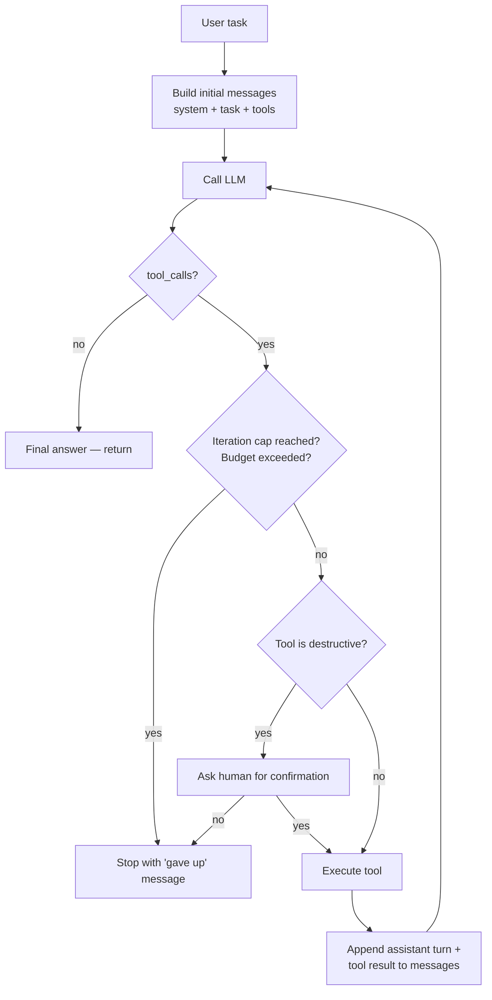

# Stage 8 — A simple agent

> **Time budget:** ~1–2 weeks

> **In one line:** Run the LLM in a loop with tools until a goal is reached — with iteration caps, tool budgets, full observability, and human confirmation on destructive actions.

An "agent" is the marketing word. Underneath, it's Stage 4 (tool calling) in a loop, observed via Stage 7, measured via Stage 6, with safety rails because the loop can run away and the tools can do real damage.

You're ready for this only because you've done Stages 4, 6, and 7. Most agent projects that fail in production fail because the team built the loop before they had observability or evals — every run looked the same opaque "it didn't work."

:::tip[In plain English]
An agent is a small program that asks the LLM "what should I do next?", does that thing, asks again, repeats — until the LLM says "I'm done." The LLM is the brain; your code is the body. The trap: brains can hallucinate, loops can run forever, and tools can do irreversible things. Discipline is everything.
:::

## 1. The loop



Three guardrails embedded in the loop, not bolted on after:

1. **Iteration cap** (`max_iters=10`). Without it, a confused model can loop forever.
2. **Budget** (token / cost / wall-time). Without it, one user task can cost $50.
3. **Human-in-the-loop on writes**. Without it, the model can email, delete, charge — at scale, accidentally.

## 2. The full Python implementation

```python
# stage-8/agent.py
import json
import time
import uuid
from dataclasses import dataclass
from typing import Callable
from openai import OpenAI
from observability import logged_completion  # from Stage 7

client = OpenAI()


@dataclass
class Tool:
    name: str
    description: str
    parameters: dict
    handler: Callable
    is_destructive: bool = False  # requires human confirmation if True


@dataclass
class AgentResult:
    final_answer: str | None
    iterations: int
    total_cost_usd: float
    total_time_sec: float
    stopped_reason: str  # "done", "max_iters", "budget", "user_cancelled", "error"
    trace_id: str


def run_agent(
    task: str,
    tools: list[Tool],
    *,
    max_iters: int = 10,
    max_cost_usd: float = 1.00,
    max_time_sec: float = 60.0,
    user_id: str = "anon",
    confirm: Callable[[str, dict], bool] = None,  # called for destructive tools
) -> AgentResult:
    trace_id = f"trace_{uuid.uuid4().hex[:12]}"
    t0 = time.time()
    total_cost = 0.0
    by_name = {t.name: t for t in tools}

    messages = [
        {"role": "system", "content": (
            "You are a careful task-completing agent. "
            "Plan your steps; call tools to gather information or take actions. "
            "When the task is complete, reply with the final answer in plain text "
            "and stop calling tools."
        )},
        {"role": "user", "content": task},
    ]
    tool_defs = [
        {"type": "function", "function": {"name": t.name, "description": t.description, "parameters": t.parameters}}
        for t in tools
    ]

    for iteration in range(max_iters):
        # Check budget
        if total_cost >= max_cost_usd:
            return AgentResult(None, iteration, total_cost, time.time() - t0, "budget", trace_id)
        if time.time() - t0 >= max_time_sec:
            return AgentResult(None, iteration, total_cost, time.time() - t0, "timeout", trace_id)

        response = logged_completion(
            messages=messages, model="gpt-5-mini",
            tools=tool_defs, user_id=user_id, feature="agent",
            trace_id=trace_id,
        )
        msg = response.choices[0].message
        total_cost += response.usage.prompt_tokens / 1_000_000 * 0.25 + response.usage.completion_tokens / 1_000_000 * 2.0

        # Terminal condition: no tool calls = final answer
        if not msg.tool_calls:
            return AgentResult(msg.content, iteration + 1, total_cost, time.time() - t0, "done", trace_id)

        # Otherwise: execute tools
        messages.append(msg)
        for call in msg.tool_calls:
            fn_name = call.function.name
            args = json.loads(call.function.arguments)
            tool = by_name.get(fn_name)

            if tool is None:
                result = {"error": f"unknown tool: {fn_name}"}
            else:
                # Human-in-the-loop for destructive actions
                if tool.is_destructive:
                    if not (confirm and confirm(fn_name, args)):
                        return AgentResult(None, iteration + 1, total_cost, time.time() - t0, "user_cancelled", trace_id)
                try:
                    result = tool.handler(**args)
                except Exception as e:
                    result = {"error": str(e)}

            messages.append({
                "role": "tool",
                "tool_call_id": call.id,
                "content": json.dumps(result),
            })

    return AgentResult(None, max_iters, total_cost, time.time() - t0, "max_iters", trace_id)
```

## 3. A real example task: GitHub triage

```python
# stage-8/github_triage.py
import os
import requests
from agent import Tool, run_agent

GH_TOKEN = os.environ["GH_TOKEN"]
REPO = "youruser/yourepo"


def list_unlabeled_issues() -> list[dict]:
    r = requests.get(
        f"https://api.github.com/repos/{REPO}/issues",
        headers={"Authorization": f"Bearer {GH_TOKEN}"},
        params={"labels": "", "state": "open", "per_page": 20},
    )
    return [{"number": i["number"], "title": i["title"], "body": (i["body"] or "")[:500]} for i in r.json()]


def get_issue(number: int) -> dict:
    r = requests.get(
        f"https://api.github.com/repos/{REPO}/issues/{number}",
        headers={"Authorization": f"Bearer {GH_TOKEN}"},
    )
    issue = r.json()
    return {"number": issue["number"], "title": issue["title"], "body": issue["body"]}


def set_labels(number: int, labels: list[str]) -> dict:
    r = requests.post(
        f"https://api.github.com/repos/{REPO}/issues/{number}/labels",
        headers={"Authorization": f"Bearer {GH_TOKEN}"},
        json={"labels": labels},
    )
    return {"ok": r.ok, "applied": labels}


tools = [
    Tool(name="list_unlabeled_issues",
         description="List up to 20 open unlabeled issues. Returns number, title, body excerpt.",
         parameters={"type": "object", "properties": {}},
         handler=lambda: list_unlabeled_issues()),
    Tool(name="get_issue",
         description="Get the full body of a specific issue by number.",
         parameters={"type": "object", "properties": {"number": {"type": "integer"}}, "required": ["number"]},
         handler=lambda number: get_issue(number)),
    Tool(name="set_labels",
         description="Apply labels to an issue. DESTRUCTIVE — modifies the repo.",
         parameters={"type": "object", "properties": {
             "number": {"type": "integer"},
             "labels": {"type": "array", "items": {"type": "string"}},
         }, "required": ["number", "labels"]},
         handler=lambda number, labels: set_labels(number, labels),
         is_destructive=True),
]


def confirm_handler(tool_name: str, args: dict) -> bool:
    print(f"\n[CONFIRM] {tool_name}({args})  [y/N]: ", end="")
    return input().strip().lower() == "y"


if __name__ == "__main__":
    result = run_agent(
        task="Triage the open unlabeled issues. For each, read it and apply appropriate labels: bug, feature, docs, question, or chore.",
        tools=tools,
        max_iters=15,
        max_cost_usd=0.50,
        confirm=confirm_handler,
    )
    print(f"\n{result}")
```

Run it. The agent will list issues, fetch a few, propose labels for each, ask you to confirm every write. The loop terminates either when it's labeled everything, or hits a cap, or you Ctrl-C.

## 4. The caps are not optional

You will be tempted to remove them — "this task is bigger than 10 iterations." Don't. Instead:

- **Raise the cap with intent**: `max_iters=30` for a known-bigger task, document why.
- **Split the task** — if it needs >20 iterations, it's probably two tasks. Run two agents.
- **Add intermediate "did anything change?" checks** — if iterations 5–10 produce no new tool calls or no progress, exit early.

Without caps, the failure mode is: the model gets stuck in a loop ("let me list the issues again... let me get issue #42 again..."), iterates 200 times, costs $30, and produces nothing.

## 5. The "agent is a debugger of its own loop" pattern

When (not if) the agent fails, the trace_id from Stage 7 is what saves you:

```sql
SELECT id, ts, model,
       prompt->'messages' AS prompt_msgs,
       response->'choices' AS response,
       cost_usd, latency_ms
FROM llm_calls
WHERE trace_id = 'trace_abc123'
ORDER BY ts;
```

You see every step the agent took. The most common failure modes:

| Symptom | Diagnosis | Fix |
|---------|-----------|-----|
| Same tool called with same args 5x in a row | Model not using tool result properly | Tighten tool result format; add explicit "you already called this" hint |
| Tool errors that the model ignores | Model assumes success | Make error format obvious: `{"error": "...", "do_not_retry": true}` |
| Hit max_iters with no progress | Task is too vague | Break task into sub-tasks; give the agent a clearer success criterion |
| Cost blew through budget on iteration 3 | One tool returns huge output | Truncate tool results before sending to model |

## 6. Where frameworks help

You implemented the raw loop above. Now the trade-off becomes visible. Frameworks worth trying *after* you've built one from scratch:

| Framework | Why use it |
|-----------|-----------|
| **OpenAI Agents SDK** | Official; handles loop + handoffs + tracing |
| **LangGraph** | Stateful agents as graphs; great for branching workflows |
| **Pydantic AI** | Strongly-typed agents; if you're a Python-types person |
| **Vercel AI SDK** (`generateText` w/ `maxSteps`) | TS-native; very clean for chatbot-shaped agents |
| **Mastra** | TypeScript agent framework; good DX for orchestration |

→ [Stack: Agent frameworks](/docs/stack/agent-frameworks) has the full comparison. The right answer is almost always "raw loop until it hurts, then evaluate frameworks against the specific pain."

## 7. Multi-agent: don't, yet

The "multi-agent system" pattern (one orchestrator delegates to specialist agents) is hyped. For 95% of problems a single well-designed agent with good tools is better. Multi-agent adds complexity (more loops, more state, more failure modes) for marginal gain on most tasks.

When multi-agent *is* the right shape:
- Heterogeneous specialist roles (a research agent, a writing agent, a critic agent) where each benefits from a different system prompt + tool set.
- Truly parallel subtasks where the orchestrator dispatches work.
- Tasks where one agent's hallucination needs critique by an independent agent.

For everything else, start single, scale only when forced. → [Foundations: Multi-agent](/docs/foundations/multi-agent).

## Where to go deeper

- [Anthropic: Building effective agents](https://www.anthropic.com/research/building-effective-agents) — current best primer on agent patterns from Anthropic.
- [OpenAI Agents SDK docs](https://platform.openai.com/docs/agents) — official guide with the full feature set.
- [LangGraph tutorials](https://langchain-ai.github.io/langgraph/) — the graph-based mental model is worth understanding even if you don't adopt it.

## Deeper in this guide

- [Foundations: Agent loop](/docs/foundations/agent-loop) — the conceptual loop in detail.
- [Foundations: Multi-agent](/docs/foundations/multi-agent) — when and how to use multiple agents.
- [Patterns: Agent loop](/docs/patterns/agent-loop) — production patterns: memory, retries, planner-executor split.
- [Agent discipline (Part III)](../03-part-3-beyond/04-agent-discipline.md) — the *judgment* side: when to use agents, when not to.

## Project

:::tip[Project — A single-agent loop that does something real]
Pick a task that's annoying enough to want automated but bounded enough to be safe: triaging GitHub issues, sorting newsletter emails, drafting brief responses to common support questions. Build the agent with 3–5 tools. **Add iteration cap, cost cap, and human-confirmation on any write.** Run it 10 times against real (or replayed) inputs. Use Stage 7 traces to debug. Track: how often did it complete? How often did it hit a cap? How many user-confirmations got rejected? **Then build a 10-case eval** from those runs.
:::

## Common mistakes

:::caution[Where people commonly trip up]
- **No iteration cap.** The single most common agent disaster: a confused model in a loop, 200 iterations later, $30 spent. Always cap; raise with intent.
- **No human confirmation on writes.** "The agent worked in testing" → "the agent emailed our entire user list in production." Every destructive tool needs an explicit confirmation step until the agent has months of clean track record.
- **Building the agent before evals + observability.** Without traces, every failure is opaque. Without evals, you can't tell if a fix actually helped. Stages 6 and 7 are prerequisites; if you skipped them, go back.
- **Treating multi-agent as default.** The hype suggests "agents handing off to agents." The reality: most tasks are better solved by one agent with good tools. Use multi-agent only when single fails.
- **Giant tool results.** A `list_issues` that returns 10MB of JSON will blow up context and confuse the model. Truncate, paginate, summarize tool outputs *before* they go back into the conversation.
- **Treating the agent's plan as ground truth.** The agent might say "I'll do steps A, B, C." It might do B, fail at A, hallucinate C. Always verify outcomes against the actual world (re-fetch state, check side effects) — not against the agent's narration of what it did.
:::

## Page checkpoint


→ [Next: Stage 9 — Ship it](./10-stage-9-ship.md) · [Back to Part I overview](./index.md)
