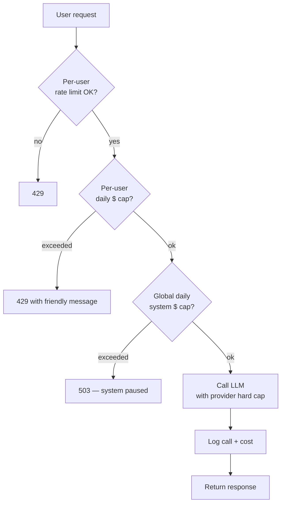

# Stage 9 — Ship it

> **Time budget:** ~1 week

> **In one line:** Pick one of your earlier projects (the RAG or the agent), put it behind auth + rate limits + cost caps + observability + a status page, and deploy it where anyone can use it.

By the end of Stage 9 you have something resume-worthy: a deployed AI feature with the operational discipline that distinguishes a portfolio piece from a CS-101 demo. The whole stage is operational work; the LLM logic is already done.

:::tip[In plain English]
Shipping isn't a creative act; it's a checklist. Most of the items have nothing to do with the model — they're about not blowing up your bill, not getting your key stolen, not embarrassing yourself when the provider has an outage. Boring but load-bearing.
:::

## 1. Pick the project

Pick **one** of your earlier projects to ship — don't try to ship all of them:

- The Stage 5 RAG is the safest choice: clear input/output, deterministic enough to not embarrass you, useful enough to demo.
- The Stage 8 agent is the more impressive choice but you'll spend more time on caps, confirmations, and recovery.
- The Stage 2 chatbot is the easiest but the least distinctive — everyone has shipped a chatbot.

Make this decision early; don't switch midway.

## 2. The deployment matrix

| Path | Deploy target | Strength |
|------|---------------|----------|
| TS / Next.js | Vercel | Zero-config; great for serverless + streaming |
| TS / Next.js | Cloudflare Pages + Workers | Global edge; cheap at scale |
| TS / any | Fly.io, Railway | Long-lived servers; good for WebSocket/agent loops |
| Python / FastAPI | Render, Railway, Fly.io | Boring-tech answer; predictable |
| Python / async heavy | Modal | Pay-per-second; great for embedding pipelines |
| Anything with a database | Neon, Supabase (Postgres) | Free tier covers a side project; pgvector ready |
| Anything with auth | Clerk, Auth.js, Supabase Auth | Drop-in auth + UI |

Pick one stack and don't yak-shave alternatives. If you already use Vercel + Neon for other projects, use them again here.

## 3. Auth — even a single login

Public AI endpoints get scraped within hours of being indexed. Even minimal auth (one Google sign-in) keeps you off bot scanners' radar.

```ts
// Next.js + Auth.js example
import NextAuth from "next-auth";
import Google from "next-auth/providers/google";

export const { handlers, auth } = NextAuth({
  providers: [Google],
});

// in your /api/chat route
export async function POST(req: Request) {
  const session = await auth();
  if (!session?.user) return new Response("unauthorized", { status: 401 });
  // ... rest of handler
}
```

If you genuinely want public access for a demo, use:

- A waitlist + invite codes.
- A "captcha + 5 free messages then sign up" gate.
- A read-only public demo with hardcoded queries; the live one needs auth.

## 4. Rate limits

Even with auth, one user can hammer your endpoint and burn your budget. Layer two limits:

### Per-user rate limit

```ts
import { Ratelimit } from "@upstash/ratelimit";
import { Redis } from "@upstash/redis";

const ratelimit = new Ratelimit({
  redis: Redis.fromEnv(),
  limiter: Ratelimit.slidingWindow(10, "1 m"),  // 10 requests per minute per user
});

const { success } = await ratelimit.limit(session.user.id);
if (!success) return new Response("rate limited", { status: 429 });
```

### Daily cost cap per user

```ts
const todayCost = await db.queryOne(
  "SELECT COALESCE(SUM(cost_usd), 0) AS spent FROM llm_calls WHERE user_id = $1 AND ts > now() - interval '24h'",
  [session.user.id]
);
if (todayCost.spent > 0.50) return new Response("daily limit reached", { status: 429 });
```

Two layers; both cheap; both essential. The per-user rate limit protects throughput; the per-user daily cost cap protects your wallet.

## 5. Cost caps at every layer



Four caps, all required:

1. **Provider-level hard cap** (set in OpenAI/Anthropic dashboard) — last line of defense.
2. **Global system daily cap** in your code — pause the whole feature if you blow past expected daily spend.
3. **Per-user daily cap** — protect against a single misbehaving user / leaked credential.
4. **Per-user rate limit** — protect against burst load.

The provider cap saves you in the absolute-worst case; the others catch problems earlier and give you actionable signals.

## 6. Status page + /healthz

```ts
// /api/healthz
export async function GET() {
  // Liveness only — am I running?
  return Response.json({ ok: true, ts: new Date().toISOString() });
}

// /api/health/llm
export async function GET() {
  // Deeper — can I reach the LLM?
  try {
    const start = Date.now();
    await openai.chat.completions.create({
      model: "gpt-5-mini",
      messages: [{ role: "user", content: "ok" }],
      max_tokens: 1,
    });
    return Response.json({ ok: true, latency_ms: Date.now() - start });
  } catch (e) {
    return Response.json({ ok: false, error: String(e) }, { status: 503 });
  }
}
```

Then either:

- Use an uptime monitor (UptimeRobot, BetterStack — free tier) that pings `/healthz` every minute.
- Use a hosted status page (StatusPage, BetterStack Status) that displays provider status alongside yours.

When OpenAI has an outage (they do), users will think *your* app is broken. A status page with "Upstream: OpenAI degraded" is the difference between "your app sucks" and "OpenAI is having a bad day, we're affected."

## 7. Streaming everywhere user-facing

You built this in Stage 2. Don't forget to keep it on in production. Streaming changes the user's perceived latency from "this is slow / broken" to "this is fast" — even with the same total time.

For deployment-specific gotchas:

- **Vercel serverless functions**: set `export const maxDuration = 30` (or 60+ on paid tiers). Without it, streams cut off at 10s.
- **Cloudflare Workers**: streaming works natively but watch for the CPU time limit on long responses.
- **AWS Lambda / API Gateway**: streaming requires Lambda Function URLs with `RESPONSE_STREAM` mode, not API Gateway.

→ [Latency intuition (Part III)](../03-part-3-beyond/06-latency-intuition.md) goes deep on TTFT and the streaming UX.

## 8. Observability is on

You built this in Stage 7. In production it earns its keep:

- Every call logged with user_id, feature, model, tokens, cost, latency, trace_id.
- A `/admin` page (auth-gated to your own email) that renders the four SQL queries from Stage 7.
- Alerts (Slack, email) for: cost spike, error rate spike, latency p95 spike.

Without alerts you'll discover problems from users. With alerts you'll catch most issues in the first hour.

## 9. Secrets management

`.env` is fine in dev. In production:

- **Vercel**: use environment variables in the dashboard, scoped per environment (production / preview / dev).
- **Cloudflare**: use Workers Secrets, encrypted at rest.
- **AWS / GCP / Azure**: use the platform's secrets manager (Secrets Manager, Secret Manager, Key Vault).

Rotate keys after deployment. The dev key that bounced through your laptop, Cursor, three SDK installs, and your IDE's autocomplete — assume it's compromised. Rotate before going live.

## 10. The pre-launch checklist

Before you tweet the URL:

- [ ] API keys not in any committed file (`git log --all --full-history --oneline | xargs git grep -l "sk-"` to be sure)
- [ ] Provider hard spend cap set
- [ ] Per-user rate limit + daily cap working (test by hitting the limits yourself)
- [ ] System-wide daily cost cap working
- [ ] Auth required for all LLM endpoints (test by hitting one without a session)
- [ ] Streaming works end-to-end
- [ ] `/healthz` returns 200; uptime monitor configured
- [ ] Observability logs every call
- [ ] One error path tested: what happens when OpenAI returns 429? When it times out? When it returns garbage?
- [ ] PII handling decided (don't log content for sensitive features, or hash, or redact)
- [ ] A "what does this do / privacy / contact" page

Skipping any of these will eventually cost you a weekend.

## 11. What you've built

By the end of Stage 9 you have:

- A deployed AI feature, live at a URL, that anyone (with auth) can use.
- A 50–100 case eval suite that runs on every change.
- Logs and traces for every LLM call.
- Cost dashboards broken down by feature and user.
- Rate limits and cost caps at multiple layers.
- A status page that handles provider outages gracefully.
- One agent project, one RAG project, one streaming chat project, one structured-output project — all working end-to-end.

That's a competent junior-AI-engineer portfolio. From here you specialize:

- Want to go deep on agents? Look at LangGraph + tool design.
- Want to go deep on retrieval? Hybrid search, reranking, eval-driven chunking.
- Want to go deep on cost? Caching, prompt compression, model routing.
- Want to go deep on safety? Threat modeling, red-teaming, eval-as-defense.

Each of those is its own multi-month track. The roadmap got you to the starting line.

## Where to go deeper

- [Vercel: Deploying AI apps](https://vercel.com/docs/ai) — opinionated walkthrough if you're on the Vercel + Next.js stack.
- [Cloudflare AI Gateway](https://developers.cloudflare.com/ai-gateway/) — wraps your LLM calls with rate limiting, caching, observability — worth using even if your app isn't on Cloudflare.
- [Eugene Yan: Patterns for building LLM-powered software](https://eugeneyan.com/writing/llm-patterns/) — production patterns from someone who's shipped many.

## Deeper in this guide

- [Lifecycle: Deploy](/docs/lifecycle/08-deploy) — the lifecycle perspective on deployment.
- [Lifecycle: Monitor](/docs/lifecycle/09-monitor) — what to monitor post-launch.
- [Stack: AI gateways](/docs/stack/ai-gateways) — gateways like Cloudflare AI Gateway, LiteLLM, Helicone that add rate limiting + caching + observability as middleware.
- [Patterns: Cost control](/docs/patterns/cost-control) — production patterns for keeping cost predictable.

## Project

:::tip[Project — Ship one project]
Pick **one** of your previous projects (recommendation: the Stage 5 RAG). Walk through the entire checklist above. Deploy it to a URL. Share the URL with three friends, watch them use it (in person if possible). Note: at least one of them will do something you didn't anticipate. Add their case to the eval set. Iterate. **That moment — watching a non-engineer use your AI feature and break it — is the most useful single hour in the entire roadmap.**
:::

## Common mistakes

:::caution[Where people commonly trip up]
- **No spend cap at the provider level.** The provider cap is the last line of defense. Set it before deploy, not after. The horror stories ("woke up to a $5K bill") all share this missing safety net.
- **Auth-less "demo" endpoint.** A public LLM endpoint is a public crypto-miner endpoint within hours of being indexed. Even a placeholder password gate dramatically reduces abuse.
- **Streaming broken in production.** Works in dev (long-lived `npm run dev`), fails in serverless (10-second function timeout). Test streaming on a *deployed* preview, not just locally.
- **No rate limit, just trust users.** One enthusiastic user with auto-retry logic in their script can burn your daily cap in minutes. Layer per-user rate limit + per-user daily cap from day one.
- **Treating the provider as 100% available.** OpenAI / Anthropic have hours-long outages every few months. Test what happens when the API returns 503: do you crash? Fall back to a cached response? Show a friendly error? Decide before users find out.
- **No `/healthz`.** Without a health endpoint, your uptime monitor monitors nothing. Five-line endpoint, install it day one.
:::

## Page checkpoint


→ Back to the [Roadmap overview](../index.md) or continue to [Part II — The 2026 AI Stack](../02-part-2-modern-stack/index.md).
