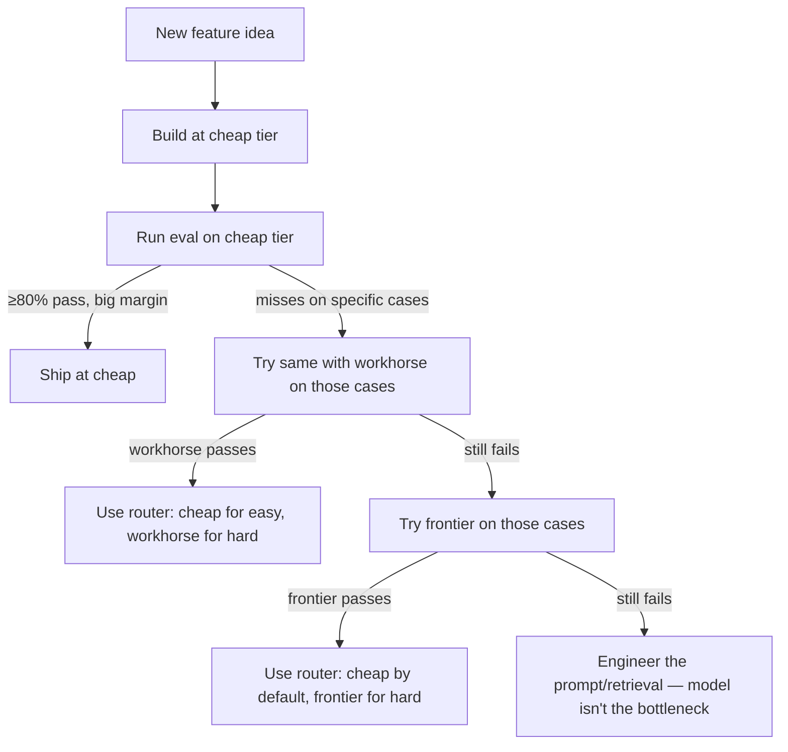

# Cheap Tier — Start Here, Climb Only When Forced

> **In one line:** Start every new feature here. If the eval passes, you're done — and you saved your future self 10–30x the bill.

## What's in this tier (as of 2026)

| Model | Provider | Strength | Roughly per M tokens (in / out) |
|-------|----------|----------|----------------------------------|
| **Claude Haiku 4.5** | Anthropic | Best quality-per-dollar in the tier; excellent tool use | $0.80 / $4 |
| **GPT-5-mini** | OpenAI | Most capable cheap model; structured output works well | $0.25 / $2 |
| **GPT-5-nano** | OpenAI | The cheapest current OpenAI; for high-volume classification | $0.05 / $0.40 |
| **Gemini 2.x Flash** | Google | Fast, multimodal, generous free tier | $0.075 / $0.30 |
| **Gemini 2.x Flash-Lite** | Google | Cheapest Gemini; for ultra-high-volume jobs | $0.04 / $0.15 |

These models are sometimes 50–100x cheaper than frontier — and on routine tasks, they pass the same evals.

## Why this tier matters more than people think

The most consistent mistake AI engineers make: **assuming the cheap tier is "for prototypes" and the workhorse/frontier tier is "for production."** It's backwards for a huge fraction of tasks.

Modern cheap-tier models in 2026 are roughly what frontier was in 2024. They do:

- Structured output extraction reliably.
- Tool calling with 95%+ correctness on simple tools.
- RAG answer generation when the retrieval is good.
- Classification, summarization, formatting, content moderation.
- Short reasoning chains (~3–5 steps).

They struggle with:

- Long reasoning chains (~10+ steps without breakdown).
- Complex code generation.
- Nuanced judgment in adversarial domains.
- Very long context (most are 128k max, less effective near the limit).

For ~70% of production AI features, cheap-tier passes the evals. The other 30% needs workhorse/frontier. **Start here every time.**

## The economic case

Recall the cost projection from the [Frontier tier page](./01-frontier-tier.md):

A SaaS feature at 100 calls/user/day, 50K users:
- Frontier: ~$6.75M/month
- Workhorse: ~$2M/month
- Cheap: ~$225K/month

If your eval shows the cheap tier passes with the same quality, you just saved $1.8M–$6.5M per month. That's an entire engineering team's salary, paid for by *not* using GPT-5 when Haiku works.

:::tip[The cardinal rule]
**No model upgrade without a failed eval case forcing the climb.** If you swap cheap → workhorse and your evals don't move, you wasted money. If they move significantly on specific cases, you got real value. The numbers tell you which.
:::

## When cheap is the right call

- **Classification and labeling** — "is this email spam? what category? what priority?" Cheap models nail this.
- **Structured extraction** — pulling fields from well-formed input.
- **Content moderation** — detecting policy violations, profanity, PII.
- **First-pass routing** — triage incoming requests, classify intent, route to the right downstream model/handler.
- **RAG answer generation** when retrieval is solid — the model is summarizing retrieved facts, not doing deep reasoning.
- **Short tool-calling loops** — a 3-tool assistant with 2–3 iterations.
- **Background jobs** — anything not user-facing where latency is forgiving and volume is high.
- **Eval judging** (when judging cheap-tier outputs) — but use workhorse+ when judging workhorse/frontier outputs.

## When cheap is the wrong call

- **Long reasoning chains** — cheap models break down around step 5; you'll see them hallucinate or contradict prior reasoning.
- **Coding** — for non-trivial code generation, workhorse minimum. Cheap-tier coding is hit-or-miss.
- **Tool calls with 5+ tools and complex disambiguation** — the cheap models pick wrong tools more often.
- **Highly adversarial domains** — content moderation at the edge cases, legal interpretation, medical advice.
- **Long-context** — even though Haiku/Flash claim 200k+ context, quality degrades faster near the limit than workhorse/frontier.

## Pricing structure quirks

Cheap-tier providers compete aggressively on input pricing because that's the volume side. Watch for:

- **Asymmetric in/out pricing** — output is 5–10x more expensive than input across the board. Optimize prompt-engineering for shorter outputs.
- **Free tiers** — Gemini and Groq both offer generous free tiers (millions of tokens/day) for development. Use them.
- **Prompt caching available even at cheap tier** — Anthropic's prompt caching works on Haiku; you can get 90% off input on cached prefixes. Stacks with the already-low price.
- **Batch APIs** — OpenAI and Anthropic both offer 50% discounts on batch (non-realtime) jobs. For analytics or backfill jobs, this is real money.

## How to pick within the tier

| Decision | Lean toward |
|----------|-------------|
| Best quality-per-dollar overall | Claude Haiku 4.5 |
| Best structured output | GPT-5-mini |
| Lowest latency | Groq-hosted Llama (~10x faster than OpenAI/Anthropic on cheap tier) |
| Largest free tier | Gemini Flash |
| Multimodal cheap | Gemini Flash |
| Self-hosting later | Llama, Mistral via Groq/Together/Fireworks |

For high-volume features, run a side-by-side on your top eval cases. Pricing models change quarterly; what was cheapest in Q1 may not be in Q4.

## The cheap-tier-first workflow

The discipline that separates engineers who survive AI cost pressure from those who don't:

Note: very few features end at "always use frontier." Most end at "router + cheap-default."

## Common mistakes

:::caution[Where people commonly trip up]
- **"Cheap is for prototypes; production needs better."** Wrong. Modern cheap-tier is 2024-frontier quality. Many production AI features run on it permanently. Eval, don't assume.
- **Not running comparative evals.** "GPT-5 felt better in my chat" is not evidence. Same 30 eval cases, measure both, look at the numbers.
- **Skipping prompt caching at this tier.** People assume caching is "only worth it for expensive models." Caching on Haiku at 90% off input is still meaningful at scale.
- **Using cheap for tasks they fail at.** Throwing a 12-step reasoning chain at GPT-5-mini and concluding "the cheap tier doesn't work." Use the right tier for the task; cheap isn't for everything.
- **Ignoring Groq for latency-sensitive cheap work.** Groq runs open-weights models at ~10x the speed of OpenAI/Anthropic for the same models. For chat UIs where TTFT matters, this is a free latency win.
:::

→ Next: [Embedding tier](./04-embedding-tier.md) — the picks for the vectors under your RAG.
