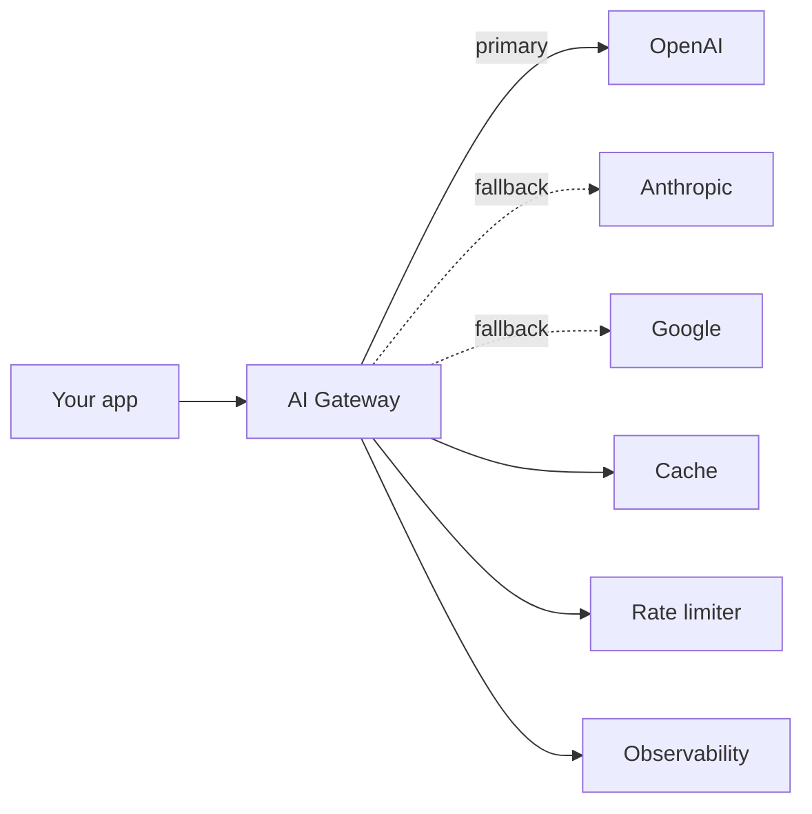

# Gateway Pick — Do You Need One, and Which?

> **In one line:** An AI gateway is middleware between your app and providers — adding rate limiting, caching, fallbacks, and observability. Worth it as soon as you have multiple providers, multi-tenant cost attribution, or care about resilience.

## What an AI gateway does



A gateway sits between your app and provider APIs. Your code calls the gateway as if it were the provider; the gateway adds:

- **Caching** — same prompt + params returns the cached response without hitting the model.
- **Rate limiting** — per-user, per-key, global limits.
- **Fallbacks** — primary provider down? Try the secondary.
- **Cost tracking** — per-key, per-tenant, per-feature.
- **Observability** — logs every call without you instrumenting.
- **A/B routing** — send 10% of traffic to a new model for comparison.
- **PII redaction** — strip emails / phone numbers from prompts before they hit the provider.

For solo projects, raw SDK calls are fine. For multi-tenant apps, multi-provider apps, or anything needing resilience, gateways earn their keep.

## Tier 1 — strongly consider

### Cloudflare AI Gateway

**Strengths:**
- Free up to generous limits.
- Drop-in proxy — change the base URL, you're done.
- Excellent observability dashboard.
- Built-in caching, rate limiting, fallbacks.
- Works with any provider.

**Trade-offs:**
- Adds a hop (Cloudflare → provider). Latency cost is small but real.
- Cloudflare-hosted; data passes through their edge.

**Pick if:** you want the lowest-friction gateway; you're cost-sensitive; you don't mind a small added latency.

### LiteLLM (OSS)

Python library AND optional proxy server.

**Strengths:**
- OSS — self-host the proxy or use as library only.
- Supports ~100+ providers (one of the most comprehensive).
- Strong fallback chains, cost tracking.
- Used at scale by many teams.

**Trade-offs:**
- More setup than Cloudflare's hosted version.
- Smaller observability UI (mostly metrics; deep tracing is BYO).

**Pick if:** you want OSS, you need to support many providers, you're in Python.

### Helicone (also acts as gateway)

Covered in [Observability pick](./08-observability-pick.md). When you use Helicone as a proxy, it functions as a gateway too.

**Pick if:** you want one tool for obs + gateway.

## Tier 2 — worth knowing

### OpenRouter

A gateway that's also a model marketplace — single API to access ~100 models including proprietary AND open-weights.

**Strengths:**
- Single API key, single SDK call, access dozens of models.
- Aggregated pricing — you fund one wallet, spend across providers.
- Auto-fallback between providers.

**Trade-offs:**
- Adds a small margin over direct provider pricing.
- Hosted; routes through OpenRouter's infra.

**Pick if:** you experiment with many models often, or you want a single key for many providers.

### Portkey

Another gateway with strong enterprise features (PII detection, guardrails, prompt versioning).

**Pick if:** enterprise compliance is a hard requirement, or you want guardrails as middleware.

## Tier 3 — skip or defer

- **Building your own gateway.** Tempting, ~2 weeks of work that Cloudflare or LiteLLM gives you free.
- **Multiple gateways layered.** Cloudflare → LiteLLM → providers. Adds latency and debugging surface area for no gain.

## When you don't need a gateway

- **One provider, one key, one tenant** — direct SDK calls are fine.
- **Hobby project under 1000 calls/month** — you're not at scale where gateways add value.
- **Latency-critical** — gateways add 20–100ms; if your TTFT budget is tight, evaluate whether the cost is worth the features.

## When you definitely need one

- **Multi-tenant SaaS** — per-tenant cost attribution + rate limits.
- **Provider redundancy required** — OpenAI outage shouldn't take down your app; automatic fallback to Anthropic.
- **Heavy caching opportunity** — many repeat prompts; cache hits save real money.
- **Compliance / data residency** — gateway can route by region, redact PII, log to your own systems.

## The matrix

| Need | Pick |
|------|------|
| Lowest friction, hosted | **Cloudflare AI Gateway** |
| OSS, Python, many providers | **LiteLLM** |
| Already on Helicone for obs | **Helicone** |
| Many models behind one API | **OpenRouter** |
| Enterprise guardrails | **Portkey** |
| Solo dev, one provider | **None — raw SDK** |

## Caching strategies through a gateway

The single biggest cost win from gateways: caching.

- **Exact-prompt caching** — same prompt + params returns cached response. Simple, effective for FAQ-style features. Cache hit rates of 20–60% are common.
- **Semantic caching** — embed the prompt; if there's a "close enough" cached prompt (cosine similarity > threshold), return that. Higher hit rates, real risk of returning subtly wrong responses.

Start with exact-prompt; consider semantic only when you can afford the eval cost of verifying it.

## Fallback chains

```yaml
# LiteLLM example config
model_list:
  - model_name: gpt-5-mini
    litellm_params:
      model: openai/gpt-5-mini
      fallbacks:
        - claude-haiku-4-5    # if OpenAI down
        - gemini-2-flash      # if both down
```

When the primary errors (5xx, timeout, rate limit), the gateway automatically retries on the next model. Critical for production resilience — OpenAI and Anthropic have outages every few months.

The catch: fallback to a different model means responses can vary in style. For most apps it's worth the resilience trade; for some (strict style requirements), it isn't.

## Common mistakes

:::caution[Where people commonly trip up]
- **Adopting a gateway before you need one.** A hobby project doesn't need Cloudflare AI Gateway in front. Direct SDK calls are simpler; add the gateway when you can name what it gives you.
- **Caching everything by default.** Some prompts shouldn't be cached (anything with the current date, user-specific context, randomized output). Configure cache rules; don't blindly cache.
- **Fallback without compatibility checking.** Falling back from GPT-5 to Llama 3 when the prompt uses GPT-specific features (tool calling syntax, structured output) gives errors instead of responses. Test fallback paths.
- **Skipping the gateway's free tier.** Cloudflare's free tier is generous. Start there; pay only when you're past it.
- **Two gateways stacked.** "Cloudflare in front of LiteLLM in front of providers" is two layers of debugging surface for no gain. Pick one.
:::

→ Next: [Trends](./10-trends.md) — six 2026 directional shifts to recognize.
