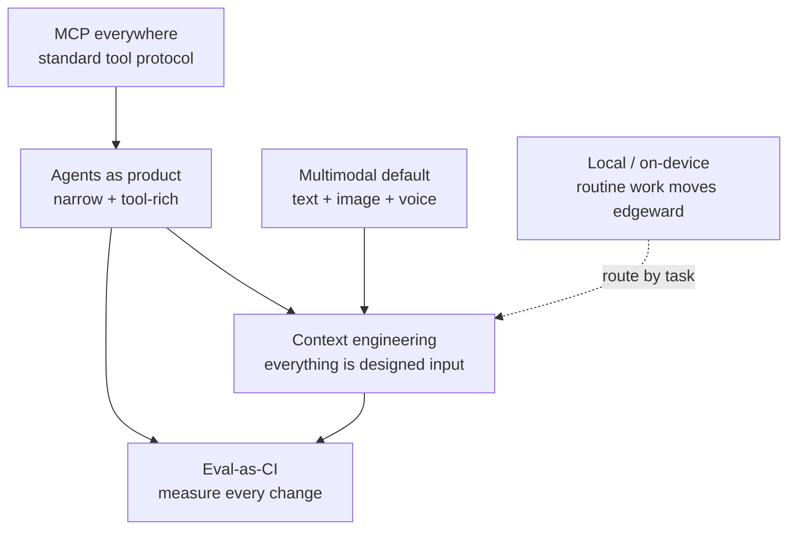

# Trends — Six 2026 Shifts

:::info[Dated content — June 2026]
This page names specific tools, models, and prices, which rotate quarterly. The *selection
logic* is durable; the names are a snapshot. Cross-check the
[Model snapshot](/docs/model-snapshot) for current model names and pricing.
:::

> **In one line:** Six directional shifts that reshape how 2026 AI apps are built. Not tools to adopt — patterns to recognize.

:::tip[In plain English]
Every previous page in this part picked a specific tool; this one is different — it describes six broad directions the whole field is moving in. Think of it as a weather forecast rather than a shopping list: you don't need to act on any of it today, but recognizing these patterns helps you make choices that age well. Knowing the currents also protects you from hype — you'll be able to tell when a trend genuinely fits a problem you have versus when it's just the loud thing this quarter. The page ends with the most useful advice of all: adopt at most one of these at a time, and only against a pain you can name.
:::

## 1. Context engineering replaces "prompt engineering"

The 2023 framing — "tweak the prompt wording" — has been superseded by a broader discipline: **the entire input to the model is a designed artifact**. System prompt, user message, retrieved chunks, tool definitions, conversation history, structured output schema — all of it is "context," and all of it is engineered.

What this looks like in practice:

- Prompts versioned in git (`prompt_v3-2026-05-21.md`), changes reviewed in PRs.
- A/B'd in production with eval-gated rollout.
- Tool definitions written and refined like API designs (the description IS the prompt).
- Retrieved chunks shaped and re-ordered by relevance.
- System prompts that include explicit failure-mode warnings ("never invent sources; if unsure say 'I don't know'").

The word "prompt engineering" still exists but the discipline is bigger. → [Prompting as craft (Part III)](../03-part-3-beyond/01-prompting-as-craft.md).

:::info[Why this matters architecturally]
The model is one component. The input you build is the rest. Treat the input as code: versioned, reviewed, measured, regression-tested. That's the difference between an AI feature that improves over time and one that drifts.
:::

## 2. Agents as the product (selectively)

For most of 2023–2024, "agent" was a marketing word. In 2026, certain narrow agent products genuinely work: coding agents (Devin, Cursor's agent mode, Claude Code, OpenAI's Codex), browser-using agents, deep-research agents.

The pattern that works:

- **Narrow scope** — the agent does ONE class of task very well.
- **Strong tool design** — 5–15 well-described tools, no kitchen sink.
- **Rich observability** — every step traceable, every tool call inspectable.
- **Human-in-the-loop on writes** — even mature agents pause for confirmation on irreversible actions.
- **Eval-driven** — measured against curated task sets; regressions caught.

What still doesn't work: "general-purpose autonomous agents that do anything you ask." The hype is years ahead of the reality on those.

If you're building an agent product, the [Stage 8 page](../01-part-1-from-zero/09-stage-8-agent.md) and [Agent discipline (Part III)](../03-part-3-beyond/04-agent-discipline.md) are your starting points.

## 3. Multimodal as default

Text-only models are increasingly the legacy. New deployments are text + image + audio + (sometimes) video. Use cases that have moved from "research demo" to "shipped":

- **Image understanding in chat** — paste a screenshot, ask about it. GPT-5, Claude 4.x, Gemini 2.x all handle this well.
- **Voice as primary interface** — real-time voice (OpenAI Realtime, ElevenLabs, Hume) for customer support, tutoring, coaching.
- **Document understanding** — PDFs, charts, tables parsed natively without OCR.
- **Image generation** in product flows — not just standalone art, but UI components, diagrams, mockups.

Implications:

- Embedding models need to be multimodal-aware for cross-modal retrieval (text query → image result).
- Cost models change — image input tokens count differently; audio is priced per second.
- UI patterns shift — chat with multiple input modalities is the new default.

[Stack: Voice infra](/docs/stack/voice-infra) and [Foundations: Multi-agent](/docs/foundations/multi-agent) have more.

## 4. On-device / local inference is real

In 2024, "run an LLM on your laptop" was a hobby. In 2026, it's a deployment target:

- **Apple's local MLX models** + Apple Intelligence — small but capable models running on M-series Macs and iPhones.
- **Llama 3.x / 4 on quantized inference** — runs on a single consumer GPU or even CPU at usable speed for ~7B models.
- **Browser-native inference** — WebGPU lets you run 7B models in a tab; latency for simple tasks competes with hosted APIs.
- **Edge inference at CDNs** — Cloudflare Workers AI, Vercel inference, etc., put models close to the user.

What it's good for:

- Privacy-first features (data never leaves the device).
- Offline-capable apps.
- Latency-critical tasks (no network round-trip).
- Bypassing per-call API cost at scale.

What it isn't yet:

- A replacement for frontier-tier quality.
- Easy ops (model updates, hardware variance).
- Multimodal at parity with hosted.

The right pattern emerging: **local for routine, hosted for hard**. The same model-routing pattern, but with "model" including a local one.

## 5. MCP (Model Context Protocol) everywhere

[Model Context Protocol](https://modelcontextprotocol.io) is the emerging standard for how models talk to tools. Think of it as USB-C for AI tools — a service exposes MCP; any compatible AI client (Claude, Cursor, your app) can use it without custom integration.

What's shifted in 2025–26:

- Major IDEs, AI clients, and frameworks support MCP natively.
- A growing registry of MCP servers for common services (GitHub, Slack, your DB, your filesystem).
- Companies are shipping MCP servers for their products as the "AI integration story" — analogous to how SaaS shipped public APIs in 2010–2015.

If you're shipping a tool, exposing an MCP server is becoming the default. If you're consuming tools, MCP clients save you the custom integration work for every service. → Once you've built Stage 4 (tool calling) the long way, MCP is the natural next step.

## 6. Eval-as-CI is the maturity signal

In 2023–24, evals were "what we do before a release." In 2026, mature teams treat evals as CI:

- **Every PR runs a smoke eval** (~50–100 cases, \&lt;5 min) on the new prompt / model / retrieval.
- **Nightly runs the full eval** (~500–5000 cases).
- **Production samples** are continually graded and turned back into eval cases.
- **Eval regressions block deploys**, just like test regressions.
- **Eval dashboards** are first-class; pass-rate-over-time is tracked like uptime.

The teams that ship reliable AI have evals running constantly; the teams that struggle have evals as a quarterly exercise. → [Eval mindset (Part III)](../03-part-3-beyond/02-eval-mindset.md).

## How the six trends interrelate

> **Reading this diagram:** Context engineering and eval-as-CI are the foundation — once your inputs are designed and your changes are measured, the other trends fit cleanly. Agents lean on both. MCP feeds agents. Multimodal expands what context can be. Local inference is an orthogonal deployment shift.

## Common mistakes

:::caution[Where people commonly trip up]
- **Treating "trend" as "rewrite now."** These are patterns to recognize, not weekend projects. Adopt one per quarter against a specific painpoint, not all six at once.
- **Shipping agents because agents are trendy.** Most user-facing features are better served by a single LLM call + good UI. Agents are right for the small set of problems where the action-loop is the value; for everything else, simpler patterns win.
- **Defaulting to multimodal in places text would do.** Voice and image add latency, cost, and complexity. Use them when the modality is the value, not because it's possible.
- **Local inference for premium features.** On-device models are great for routine work, not yet for the high-quality bar your premium feature needs.
- **Adding MCP servers before they're needed.** MCP shines when you have many tools or many AI clients; on a single agent with 5 hand-coded tools, it adds ceremony.
- **Eval-as-CI without enough cases.** A 5-case CI eval is theater. Build the eval set first (Stage 6); then automate it.
:::

<Quiz id="trends-quick-check" variant="micro" title="Quick check">

<Question
  prompt="How does this page say you should respond to these six trends?"
  options={[
    { text: "Rewrite your stack now so you are not left behind" },
    { text: "Treat them as patterns to recognize, adopting roughly one per quarter against a specific painpoint" },
    { text: "Ignore them until they appear in vendor marketing" },
    { text: "Adopt all six at once since they reinforce each other" }
  ]}
  correct={1}
  explanation="Trends are directional, not to-do lists. The failure mode is treating 'trend' as 'rewrite now' — the page recommends adopting one at a time, each tied to a painpoint you can actually name, not a wholesale migration."
/>

<Question
  prompt="According to this page, what kind of agent products genuinely work in 2026?"
  options={[
    { text: "General-purpose autonomous agents that handle any request" },
    { text: "Agents with as many tools as possible, to maximize coverage" },
    { text: "Narrow agents with a small set of well-designed tools, rich observability, and human confirmation on irreversible actions" },
    { text: "Agents that run fully unattended with no tracing, to reduce overhead" }
  ]}
  correct={2}
  explanation="The agents that work share a pattern: one class of task done very well, 5 to 15 carefully described tools, every step traceable, eval-driven development, and a human in the loop on writes. The general-purpose do-anything agent remains hype ahead of reality."
/>

<Question
  prompt="What distinguishes a mature team's approach to evals, per the eval-as-CI trend?"
  options={[
    { text: "Evals run constantly — smoke evals on every PR, full runs nightly, and regressions block deploys" },
    { text: "Evals run once before each major release" },
    { text: "Evals are replaced by monitoring production complaints" },
    { text: "A 5-case eval wired into CI is sufficient to claim maturity" }
  ]}
  correct={0}
  explanation="The maturity signal is evals treated like tests: per-PR smoke runs, nightly full runs, production samples graded and folded back into the eval set, and regressions blocking deploys. A tiny CI eval is theater — build a real eval set first, then automate it."
/>

</Quiz>

---

That's Part II. The tier-list pages give you opinionated picks; the trends page tells you what's coming. Together they're a working map of the 2026 AI stack.

→ Continue to [Part III — Beyond the Stack](../03-part-3-beyond/index.md) — the skills the stack doesn't teach you.
