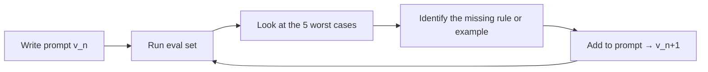

# Prompting as Craft (Context Engineering)

> **In one line:** "Prompt engineering" was about wording. **Context engineering** is about treating the entire model input — system prompt, examples, retrieved chunks, tool definitions, schema — as a designed artifact you version, measure, and iterate on.

:::tip[In plain English]
When people say "prompt engineering," they usually mean fiddling with the wording of one message. Context engineering is the bigger, more honest version: everything the model sees — the instructions, the examples, the tool descriptions, the retrieved documents — is something you designed, and all of it shapes the answer. So treat that whole package the way you treat code: keep it in version control, review changes, and measure whether each change actually helped. This page is about building that habit.
:::

The discipline shift in 2024–2026: stop thinking of "the prompt" as a string and start thinking of it as a *program* whose source is your context window. Same engineering rigor as code: versioned in git, reviewed in PRs, measured by evals, regression-tested on every change.

## 1. What's in "the context"

Everything the model sees on a given call:

- **System prompt** — behavior, persona, rules, refusals.
- **Tool definitions** — names, descriptions, schemas.
- **Few-shot examples** — input/output pairs demonstrating the task.
- **Retrieved chunks** (in RAG) — documents fetched for this query.
- **Conversation history** — prior user + assistant turns.
- **User message** — the actual query.
- **Structured output schema** — the shape of the expected response.
- **Implicit constraints** — `temperature`, `max_tokens`, `stop` sequences, `seed`.

All of it is your design. Tweaking the user prompt is one knob out of seven.

## 2. The system prompt is your highest-leverage artifact

A well-designed system prompt is ~150–800 tokens and looks like a small spec:

```
You are a customer support triage assistant for ACME Corp.

# Your job
Read an incoming customer email. Return a JSON object with:
- category: one of {billing, technical, account, feedback, other}
- priority: one of {low, medium, high, urgent}
- summary: one sentence
- needs_human: true if the message is angry, legally risky, or you're uncertain
- confidence: 0-1, your confidence in the classification

# Rules
- If unclear, lower confidence and set needs_human=true. Don't guess.
- Mark "billing" only for charge/refund/invoice issues. NOT for pricing questions (those are "other").
- Set "urgent" only for: outage reports, data loss, security incidents.
- NEVER include the user's email body verbatim in the summary.

# Output
Schema-validated JSON only. No commentary.
```

What this prompt does that a one-liner doesn't:

- Establishes role + scope (one sentence).
- Specifies the output shape AND the values' meaning.
- Includes explicit edge-case guidance ("billing only for charges, not pricing").
- Has an explicit escape hatch (`needs_human=true` when unsure).
- Forbids a specific failure mode (`NEVER include the user's email body verbatim`).

Each rule typically comes from a real failure case you found. Prompts grow organically from production logs.

## 3. The mental model: prompts as programs

A prompt is the *source code* for one LLM call. Apply the same engineering practices:

| Code practice | Prompt equivalent |
|---------------|-------------------|
| Source control | Prompts in git, not buried in code as string literals |
| Code review | Prompt changes reviewed in PRs |
| Versioning | `prompt_v3-2026-05-21.md`; logged with each call (Stage 7) |
| Refactoring | Periodic cleanup of accumulated cruft |
| Tests | Eval set covers the prompt's intended behaviors |
| Documentation | Comments in the prompt explaining WHY a rule exists |
| DRY | Reuse common patterns (output formats, refusal language) |

## 4. The few-shot examples lever

When instructions alone don't get the right behavior, add examples. The model imitates examples extremely well.

```
# Examples

User: "Charged twice for September"
Output: {"category": "billing", "priority": "high", "summary": "Customer reports duplicate September charge.", "needs_human": false, "confidence": 0.95}

User: "Dashboard slow on Safari"
Output: {"category": "technical", "priority": "medium", "summary": "Performance issue specific to Safari browser.", "needs_human": false, "confidence": 0.88}

User: "I'm going to sue you"
Output: {"category": "feedback", "priority": "urgent", "summary": "Customer threatening legal action.", "needs_human": true, "confidence": 1.0}
```

Three examples is often the sweet spot. More can hurt — the model overfits to surface patterns. Diversity matters more than quantity: include the edge cases that trip up your classifier.

## 5. Tool descriptions ARE prompts

If you've done [Stage 4](../01-part-1-from-zero/05-stage-4-tools.md), you know: the model picks tools by description. The description is a prompt, not a comment.

```python
# Bad — terse
"description": "Search docs"

# Good — specific about scope and exclusions
"description": "Search ACME's internal product documentation. Use this for product-specific questions only — NOT for general programming questions or third-party API questions (those should be answered from your general knowledge). Returns up to 5 relevant doc snippets with title + 200-char excerpt."
```

Apply the same craft. The description tells the model when to use the tool AND when not to.

## 6. Versioning, in practice

```python
# prompts/triage_v3.py
TRIAGE_SYSTEM_v3 = """..."""
TRIAGE_SYSTEM_VERSION = "triage_v3_2026-05-21"

# In your call:
response = client.chat.completions.create(
    model="gpt-5-mini",
    messages=[{"role": "system", "content": TRIAGE_SYSTEM_v3}, ...],
)

# In your log (Stage 7):
log_call(prompt_version=TRIAGE_SYSTEM_VERSION, ...)
```

Now you can:

- See which prompt version produced any logged call.
- A/B prompt versions in production (50% on v3, 50% on v4).
- Roll back instantly if v4 regresses on evals.
- Diff `git log prompts/triage_v3.py` to see how the prompt evolved.

## 7. The structured output schema is also part of the prompt

The model "reads" your schema — it shapes generation around it. A loose schema gives a loose response; a tight schema with descriptions guides the model's reasoning.

```python
# Loose
class Result(BaseModel):
    answer: str
    confidence: float

# Tighter — the descriptions guide generation
class Result(BaseModel):
    answer: str = Field(description="The direct answer to the user's question. Maximum 3 sentences. If unsure, say 'I don't know'.")
    confidence: float = Field(ge=0, le=1, description="Your confidence in the answer. Below 0.7 means the system should defer to a human.")
    citations: list[str] = Field(description="Source filenames you drew the answer from. Empty list if you said 'I don't know'.")
```

The `description` strings inform the model as much as the system prompt does. Treat them as prompt copy.

## 8. The patterns that work

### Chain-of-thought (when it helps)

Asking the model to "think step by step" or "reason before answering" improves results on multi-step problems. For modern frontier models, it's often unnecessary — they CoT internally. For cheap/workhorse models on hard problems, explicit CoT in the prompt still helps.

```python
"First, list the relevant facts from the context. Then, reason through the question. Finally, give a one-line answer prefixed with 'Answer: '."
```

### Decomposition (when CoT isn't enough)

Hard problems benefit from breaking the prompt into stages: extract → reason → synthesize → format. Three smaller calls often beat one big one for both quality AND debuggability.

### Self-critique

"Now critique your answer. Are there facts that don't appear in the context? Revise if so." Adds a refinement turn. Costs more, sometimes worth it for high-stakes outputs.

### Constrained role

A specific persona ("You are a meticulous code reviewer with 15 years of experience...") often outperforms generic instructions. Not because the model "is" the persona — but because the role primes the kind of response.

## 9. The patterns that don't work as advertised

- **"You are an expert in X."** Mild help, often overrated. The role description matters more than the credentials claim.
- **"Take a deep breath."** Internet folklore; modern models don't need it.
- **"This is very important."** Negligible effect; the model doesn't weight by urgency claims.
- **Threatening or rewarding ("$100 tip if you do this right").** Reported gains evaporate under careful eval. Don't ship it.

## 10. The eval-driven prompt loop



This is the loop. Every prompt change comes from a specific failure case. Every change is measured against the eval set before merging. No "I think this version reads better" without numbers.

## Common mistakes

:::caution[Where people commonly trip up]
- **Treating prompt-tuning as wordsmithing.** Without an eval set, you'll move the prompt in circles. Each tweak needs a measurable target.
- **Prompts in code as string literals scattered across files.** Centralize in a `prompts/` directory, version them, log the version with every call.
- **Adding rules without removing.** Prompts accumulate cruft. Periodically prune rules that no longer fire (use logs to check) — long prompts cost tokens AND dilute attention.
- **Ignoring tool/schema descriptions.** The description is part of the prompt. Treat it with the same craft.
- **Chasing prompting tricks from Twitter without testing.** Most reported "magic phrases" don't survive eval. Trust your eval, not anecdotes.
- **Not versioning prompts in production logs.** When v3 regresses and you don't know which version generated yesterday's bad output, debugging is impossible.
:::

<Quiz id="prompting-as-craft-quick-check" variant="micro" title="Quick check">

<Question
  prompt="What does 'context engineering' treat as the designed artifact?"
  options={[
    { text: "Just the wording of the user message" },
    { text: "The entire model input - system prompt, examples, tool definitions, retrieved chunks, and schema" },
    { text: "Only the system prompt" },
    { text: "The model's training data" }
  ]}
  correct={1}
  explanation="The shift from 'prompt engineering' to context engineering is treating everything the model sees on a call as one designed artifact. Tweaking the user prompt is one knob out of seven."
/>

<Question
  prompt="According to the page, which prompting pattern does NOT survive careful evaluation?"
  options={[
    { text: "Explicit chain-of-thought for cheap models on hard problems" },
    { text: "Decomposing a hard task into extract, reason, synthesize stages" },
    { text: "Threatening or rewarding the model, like offering a '$100 tip'" },
    { text: "Adding a self-critique turn for high-stakes outputs" }
  ]}
  correct={2}
  explanation="Reported gains from threats and rewards evaporate under careful eval - don't ship them. CoT, decomposition, and self-critique are listed among the patterns that genuinely work."
/>

<Question
  prompt="In the eval-driven prompt loop, where should each prompt change come from?"
  options={[
    { text: "A specific failure case found by running the eval set" },
    { text: "A sense that the new version reads better" },
    { text: "The latest prompting trick trending on social media" },
    { text: "A goal of making the prompt as short as possible" }
  ]}
  correct={0}
  explanation="The loop is: run the eval, look at the worst cases, identify the missing rule or example, add it, and measure again. No change merges on vibes - every change is tied to a measured failure."
/>

</Quiz>

→ Next: [Eval mindset](./02-eval-mindset.md) — how to think about measurement, LLM-judge biases, and the calibration problem.
