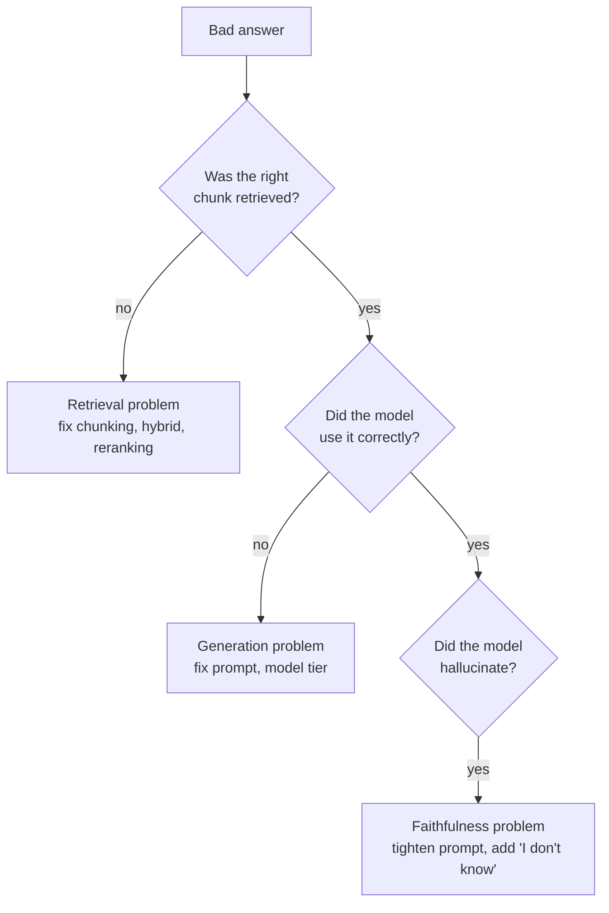
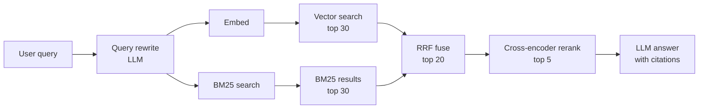

# Retrieval Quality

> **In one line:** In production RAG, retrieval quality dominates generation quality — and chunking + hybrid search dominate embedding model choice. Tune in that order.

You built the RAG pipeline in [Stage 5](../01-part-1-from-zero/06-stage-5-rag.md). The first version always feels magical for a week. The next month of work is RAG-quality engineering — and almost none of it is about LLMs.

## 1. The retrieval-vs-generation diagnosis

When a RAG answer is wrong, the first question is *where*:



The diagnostic is concrete: log the retrieved chunks, look at them. If the answer-bearing text isn't in the top-K, it's a retrieval bug. If it IS in the top-K but the answer is still wrong, it's a generation bug.

In practice, ~70% of bad RAG answers are retrieval bugs.

## 2. The lever ranking

What actually moves retrieval quality, from most-impactful to least:

| Lever | Typical lift | Effort |
|-------|--------------|--------|
| **Better chunking** (structure-aware, paragraph-respecting) | 10–30% recall | Medium |
| **Hybrid retrieval** (BM25 + vector) | 10–20% recall | Low |
| **Reranking** (cross-encoder over top-K) | 5–15% precision | Low |
| **Query rewriting** (LLM rewrites query before embedding) | 3–10% recall | Low |
| **Better embedding model** | 3–8% recall | Low (but re-index cost) |
| **Larger K + filtering** | Variable | Low |
| **Hypothetical doc embedding (HyDE)** | 3–8% on hard queries | Low |

Note that **embedding model swap is mid-tier on impact** despite being the most-discussed change. Chunking and hybrid retrieval are dramatically higher-impact.

## 3. Chunking — the highest-leverage knob

### The wrong way

```python
def chunk(text, size=500):
    return [text[i:i+size] for i in range(0, len(text), size)]
```

This splits mid-word, mid-sentence, mid-code-block. Every chunk is half a thought. Recall craters.

### Better: paragraph-respecting

```python
def chunk(text, max_tokens=500, overlap=50):
    paragraphs = text.split("\n\n")
    chunks, current = [], []
    current_tokens = 0
    for p in paragraphs:
        p_tokens = len(p.split())  # rough proxy
        if current_tokens + p_tokens > max_tokens and current:
            chunks.append("\n\n".join(current))
            # carry last few sentences as overlap
            current = [current[-1]] if current else []
            current_tokens = len(current[0].split()) if current else 0
        current.append(p)
        current_tokens += p_tokens
    if current:
        chunks.append("\n\n".join(current))
    return chunks
```

Respects paragraph boundaries; overlaps for context recovery.

### Best: structure-aware

For markdown, HTML, structured docs:

- Split on headings (keep heading WITH its content; chunk title + body).
- Keep code blocks intact (never split mid-block).
- Keep tables together.
- Carry the section title down into subsection chunks: `## Configuration > ### Database` so each chunk knows where it lives.

[LlamaIndex](https://docs.llamaindex.ai)'s `MarkdownNodeParser`, `HTMLNodeParser`, and similar do this out of the box. Worth using.

### Contextual chunks (Anthropic's pattern)

Before storing each chunk, prepend an LLM-generated context summary:

```
This chunk is from "Stage 5 — RAG", in the section about chunking strategies. It explains the difference between fixed-size and structure-aware chunking.

[Original chunk text]
```

The context summary helps embedding AND helps the LLM when this chunk is retrieved. Anthropic reported ~50% recall improvement on hard corpora. Pricey at indexing time (~5x cost), once-only.

## 4. Hybrid retrieval — the second highest-leverage

Pure vector search misses exact-match terms ("error code E_TIMEOUT_42"). Pure BM25 misses semantic matches ("how do I make it faster" should retrieve a chunk about "performance tuning").

Combine with **Reciprocal Rank Fusion (RRF)**:

```python
def rrf_fuse(vec_hits, bm25_hits, k=5, c=60):
    scores = {}
    for rank, hit_id in enumerate(vec_hits):
        scores[hit_id] = scores.get(hit_id, 0) + 1 / (c + rank)
    for rank, hit_id in enumerate(bm25_hits):
        scores[hit_id] = scores.get(hit_id, 0) + 1 / (c + rank)
    return sorted(scores, key=scores.get, reverse=True)[:k]
```

RRF needs no tuning, no learned weights, no embedding fiddling. It just works.

## 5. Reranking — the third highest-leverage

After retrieving top-K candidates (say K=30), use a **cross-encoder reranker** to re-score them in pairs (query, doc) and take the top-N (say N=5) to send to the LLM.

```python
from sentence_transformers import CrossEncoder
reranker = CrossEncoder("cross-encoder/ms-marco-MiniLM-L-12-v2")  # or Cohere Rerank for hosted

def rerank(query: str, chunks: list[str], n: int = 5) -> list[str]:
    scores = reranker.predict([(query, c) for c in chunks])
    return [c for _, c in sorted(zip(scores, chunks), reverse=True)[:n]]
```

Why it works: vector search is fast but coarse (one number per pair). A cross-encoder reads the (query, doc) jointly and scores precisely. Trade-off: slower per pair, so you can't do it over 1M docs — but over 30 retrieved candidates, it's milliseconds and adds 5–15% precision.

Hosted reranker options: **Cohere Rerank v3** is the popular pick.

## 6. Query rewriting

Users don't write queries like docs. Rewriting the user's query into a more retrieval-friendly form often boosts recall:

```python
def rewrite(question: str) -> str:
    response = client.chat.completions.create(
        model="gpt-5-mini",
        messages=[{"role": "user", "content": (
            f"Rewrite this user question as a search query optimized for "
            f"document retrieval. Expand acronyms, include synonyms, keep it concise.\n\n"
            f"Question: {question}\n\nSearch query:"
        )}],
    )
    return response.choices[0].message.content.strip()
```

Then embed the rewritten query, not the original. The LLM cost is small; the recall lift is real for casual user queries.

Variants worth trying:

- **Multi-query** — generate 3 rewrites; retrieve for each; union results.
- **HyDE (Hypothetical Document Embeddings)** — ask the model to *write* a hypothetical answer; embed that; retrieve docs similar to it. Counter-intuitive but works.

## 7. The eval-driven retrieval loop

Just like prompt engineering, retrieval engineering needs an eval set:

```python
# Per-case: question + at least one chunk_id that MUST appear in top-K
[
    {"q": "What is structured output?", "must_include_chunks": ["stage-3-001", "stage-3-007"]},
    {"q": "How do I delete my account?", "must_include_chunks": []},  # no matching chunks
]
```

Metrics:

- **Recall@K** — fraction of relevant chunks in the top-K.
- **MRR (mean reciprocal rank)** — how high the first relevant chunk ranks.
- **Precision@K** — fraction of top-K that are relevant.

These are *retrieval* metrics, separate from *generation* metrics. Track both. A retrieval fix should move retrieval metrics; if it moves generation metrics but not retrieval, you measured wrong.

## 8. Anti-patterns

### Re-ranking before retrieval

Don't rerank random docs. Rerank top-K from cheap retrieval. The order matters.

### Embedding the wrong text

Embed the chunk *with its context header* (heading, source, surrounding sentences) if you can — but retrieve the chunk body. Embedding includes context; retrieval returns clean text. Otherwise you waste context window on duplicated headers.

### Over-large K

Sending 50 chunks to the LLM dilutes attention; the answer often gets worse with more context, not better. K=5–10 is the right range for most apps.

### Stale index

Your docs changed yesterday; your index is from last month. The model gives outdated answers. Re-index on a schedule (or event-driven on doc changes).

### Mismatched embedding models

Documents embedded with model A; queries with model B. Silently broken. Always pin the same model+version.

## 9. The full quality stack



Most production RAG ends up close to this. You don't need all of it on day one; add layers as your evals show their absence.

## Common mistakes

:::caution[Where people commonly trip up]
- **Tweaking embeddings before fixing chunking.** Embedding swap is mid-impact; chunking is highest. Fix the obvious wins first.
- **Pure vector when hybrid would do.** Adding BM25 + RRF is a 50-line change that typically lifts recall 10–20 points.
- **No retrieval-specific evals.** You measure end-to-end quality but not retrieval recall separately. A regression in generation might be a retrieval regression in disguise. Track both.
- **Stuffing too much context.** "More chunks = better answer" is wrong past K~10. Attention dilutes; quality drops.
- **Forgetting to re-index after schema changes.** Changed chunk size? Switched embedding models? Modified the chunking algorithm? Re-index everything, not just new docs.
- **Reranker over the wrong candidates.** Rerank the top-K from cheap retrieval, not random docs or the whole corpus.
:::

→ Next: [Agent discipline](./04-agent-discipline.md) — when agents are the right shape, when they're not, how to keep loops safe.
