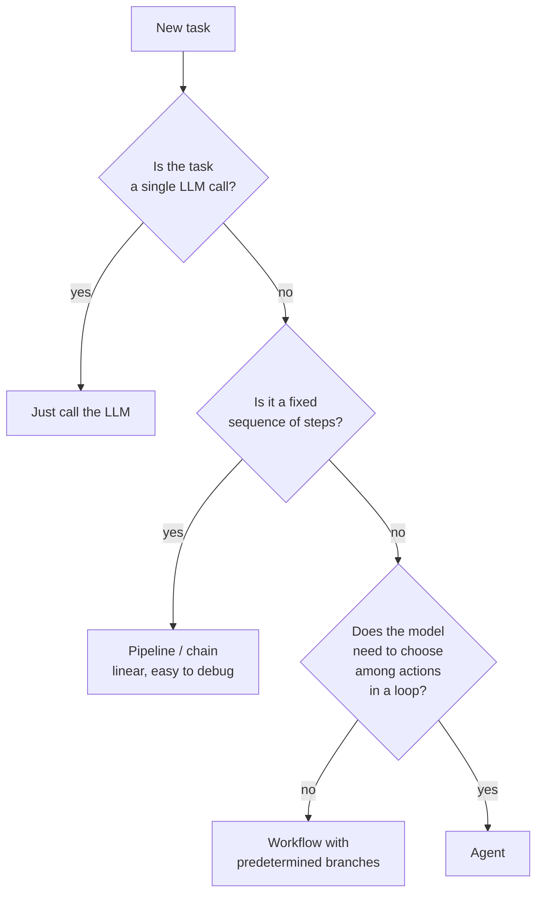

# Agent Discipline

> **In one line:** Most "AI agent" failures aren't intelligence failures — they're discipline failures. Caps, budgets, observability, human-in-the-loop on writes, and the judgment to use simpler patterns when they'd do.

:::tip[In plain English]
The word "agent" gets used for everything, but it has a precise shape: a model choosing actions in a loop, where the next step depends on what the previous step returned. Most AI features don't need that — a single call, a fixed pipeline, or a simple branch covers them. And when you do build an agent, the wins come from boring discipline: caps on iterations and spending, a confirmation step before destructive actions, and logs you can replay. This page is about choosing the simple shape when it works and constraining the loop when it doesn't.
:::

You built an agent in [Stage 8](../01-part-1-from-zero/09-stage-8-agent.md). This page is about *when to use one* (less often than the hype suggests), *how to design the loop* (constraints first, capabilities second), and *the failure modes* (which all repeat across teams).

## 1. The "is this really an agent" question

Before building an agent, check whether a simpler pattern would do:

The order matters. **Most production AI doesn't need agents.** Specifically:

- **Single LLM call** — classification, structured extraction, summarization, simple chatbot.
- **Pipeline/chain** — RAG (retrieve → answer), multi-step extraction (extract → validate → enrich).
- **Workflow** — predetermined branches based on a classifier ("if billing → handle billing; if technical → handle technical").

Agents are right when the *sequence of steps* itself depends on the model's reasoning, in a loop, with tools. Coding agents fit; "automate my whole job" agents usually don't.

## 2. The "agent that actually works" pattern

What separates the agents that ship from the ones that demo-only-fail:

| Trait | Failing agent | Working agent |
|-------|---------------|---------------|
| Scope | "Do anything" | One task class, well-defined |
| Tools | 30+, generic | 5–15, purpose-built, well-described |
| Loop cap | None ("let it run") | Hard cap (≤20 iterations) |
| Budget cap | None | Per-run $ + per-run time limits |
| Writes | Auto-execute | Human confirmation on irreversible |
| Observability | Print to stdout | Full trace IDs, per-step logs |
| Eval | None | Curated task set, regularly run |

Coding agents (Cursor, Claude Code, Devin) hit all of these. "Build me an SaaS" agents hit none.

## 3. The seven failure modes (and how to engineer around each)

### Failure mode 1: The infinite loop

The agent calls the same tool with the same args, repeatedly. Most common cause: it ignored the tool's result.

**Engineer for it:**
- Hard `max_iters` cap (Stage 8).
- Detect "same tool, same args, no progress" — exit early.
- Make tool results impossible to ignore: explicit `{"error": "...", "do_not_retry": true}` shape.

### Failure mode 2: Tool result poisoning

A tool returns 10MB of JSON. The next LLM call's context is blown out. Subsequent reasoning falls apart.

**Engineer for it:**
- Truncate tool outputs at the agent layer before sending to the model.
- Paginate large results: return summary + "call get_more(page=2) for the rest."
- Summarize verbose tool outputs with a cheap model before feeding back.

### Failure mode 3: The hallucinated tool

The model emits a tool call to `delete_everything_dangerous` which doesn't exist.

**Engineer for it:**
- Always check `tool_name in registry`; return an explicit error if not.
- Log the hallucination — it's a sign the system prompt or tool list needs tightening.

### Failure mode 4: The destructive cascade

The agent decides to "clean up" by deleting 500 records. The single confirmation gate gets bypassed because it was on the wrong tool.

**Engineer for it:**
- Mark *every* state-changing tool `is_destructive=True` until proven otherwise.
- Add per-tool budgets: "this tool may be called at most 3 times per agent run."
- Make destructive operations dry-run by default; require explicit `confirm: True` parameter.

### Failure mode 5: The goal drift

The agent starts working on the task, gets distracted by an interesting tool result, ends up doing something else.

**Engineer for it:**
- Periodic "re-anchor" — every N iterations, remind the model of the original goal.
- Explicit success criteria in the system prompt: "You're done when X. Don't do Y, even if it seems useful."
- Track goal-progress signals: did the agent make a tool call that moves toward the goal in the last few iterations?

### Failure mode 6: The runaway cost

The agent's loop runs 200 iterations on one task. $50 spent. Nothing useful.

**Engineer for it:**
- Per-run cost cap, checked every iteration.
- Aggregate across tools: even if no single tool is expensive, total cost rises.
- Alert on per-run cost exceeding a soft threshold.

### Failure mode 7: The opaque debug

Something went wrong. You have no idea where in the 15-step loop.

**Engineer for it:**
- Trace IDs from day one (Stage 7).
- Per-step logs with explicit "before / after" state.
- A replay capability: re-run a logged trace with the same tools (mocked or real) to reproduce the bug.

## 4. The "is the model the bottleneck?" check

When agents fail, the temptation is to blame the model. Usually it's not the model. Common actual causes:

| Symptom | Likely actual cause |
|---------|---------------------|
| Picks the wrong tool | Tool description too vague |
| Loops on the same tool | Tool result format unclear, or task ambiguous |
| Hallucinates a tool that doesn't exist | System prompt doesn't enumerate tools clearly |
| Skips a required step | No explicit success criterion |
| Stops too early | No verification step; finish_reason ambiguous |
| Cost runaway | Tool returns too much data; no truncation |
| Destructive mistake | No confirmation gate; no is_destructive flag |

For each, the fix is engineering — better descriptions, clearer prompts, tighter constraints — not "switch to a smarter model."

## 5. The human-in-the-loop trade

Confirmation prompts feel like friction. They feel like "the agent isn't really automated." But:

- **The cost of a wrong action** (emails sent, data deleted, money moved) is usually 100x the cost of a confirmation prompt's UX hit.
- **Trust builds gradually.** Start with confirmation on everything; remove gates one at a time as the agent earns trust on each tool.
- **Audit logs** of the confirm/reject decisions are eval gold — they tell you exactly which actions the agent picks badly.

Keep human-in-the-loop until you have months of clean track record per tool. And keep it forever for very destructive actions (delete account, charge card, send mass email).

## 6. Multi-agent: probably not yet

The "multi-agent system" hype suggests "one orchestrator, specialist agents, dynamic handoffs." For 95% of problems, this is over-engineering.

**Where it IS the right shape:**
- Heterogeneous specialists with very different tools (researcher with search, writer with no tools, critic with rubric).
- Truly parallel subtasks (analyze 10 docs in parallel; orchestrator gathers).
- Adversarial review (one agent generates; another critiques independently).

**Where it ISN'T:**
- "Maybe this would scale better?" Speculative use case.
- One agent could do it with the same tools but maybe slower. Slower beats more failure modes.
- The architecture is hyped on Twitter this week.

Default to single-agent. Climb to multi-agent only when single fails for a specific named reason.

## 7. The "is the agent actually doing what it says?" check

Agents narrate. "I'll search for X, then read Y, then summarize." The narration is not the action. Verify:

- After the agent reports success, re-fetch the world state. Was the label actually applied? Was the file actually saved?
- Decouple "the agent says it did X" from "X actually happened in the system."
- Run independent verifications (a separate tool, a separate LLM call, a deterministic check).

This is especially important for agents that claim to write code, send messages, or interact with external systems.

## 8. What success looks like

A well-designed production agent has:

- A clear, narrow scope.
- 5–15 tools, each with thoughtful descriptions and error formats.
- Iteration caps, budget caps, and per-tool budgets.
- Human-in-the-loop on destructive operations.
- Full trace logs with replay capability.
- An eval set of representative tasks; regression-tested.
- A "give up gracefully" pathway when caps are hit — clear message to the user, no silent failure.
- Cost and latency per run measured and dashboarded.

If any of these are missing, the agent is in demo state, not production state.

## Common mistakes

:::caution[Where people commonly trip up]
- **Building agents because "agents are the future."** Most user-facing AI features don't need agents. Use the simpler pattern.
- **Skipping caps "because the task needs more iterations."** The right move is "raise the cap to N with intent and document why," not "remove the cap."
- **Generic tool descriptions.** "Search" is a description that gets the model to misuse the tool. Spend disproportionate effort on tool descriptions; they're the model's UI to your code.
- **Auto-executing destructive operations.** "It worked in testing" is famous last words. Keep confirmation gates on writes for the long haul.
- **No trace IDs.** Debugging a multi-step agent run without trace IDs is impossible. Add them on day one.
- **Multi-agent for problems single agents would solve.** Adds debugging surface area and failure modes for marginal gain.
- **Trusting agent narration over verification.** The agent says "I did X." Always verify X actually happened by checking real-world state, not by trusting the agent's report.
:::

<Quiz id="agent-discipline-quick-check" variant="micro" title="Quick check">

<Question
  prompt="According to the page, when is an agent actually the right shape for a task?"
  options={[
    { text: "Whenever the task involves more than one LLM call" },
    { text: "When the sequence of steps itself depends on the model's reasoning, in a loop, with tools" },
    { text: "When you want higher quality answers from a single call" },
    { text: "Whenever a pipeline feels too slow to build" }
  ]}
  correct={1}
  explanation="The decision tree goes single call, then pipeline, then workflow, and only then agent. Agents earn their complexity only when the step sequence is genuinely dynamic - most production AI stops earlier."
/>

<Question
  prompt="A tool returns 10MB of JSON and blows out the context window for subsequent reasoning. What does the page recommend?"
  options={[
    { text: "Switch to a model with a larger context window" },
    { text: "Lower the temperature so the model is less distracted" },
    { text: "Truncate, paginate, or summarize tool outputs before they reach the model" },
    { text: "Remove the tool from the agent entirely" }
  ]}
  correct={2}
  explanation="This is the 'tool result poisoning' failure mode. The fix is at the agent layer: truncate outputs, paginate large results behind a get_more call, or summarize verbose outputs with a cheap model."
/>

<Question
  prompt="The agent reports 'Done - I applied the label and saved the file.' What does the page say you should do?"
  options={[
    { text: "Verify by re-fetching the real-world state, since narration is not the action" },
    { text: "Trust the report - models rarely misreport their own actions" },
    { text: "Ask the agent to confirm a second time in the same conversation" },
    { text: "Only verify when the operation was marked destructive" }
  ]}
  correct={0}
  explanation="Agents narrate, and the narration is not the action. Decouple 'the agent says it did X' from 'X actually happened' by re-fetching world state or running an independent deterministic check."
/>

</Quiz>

→ Next: [Cost intuition](./05-cost-intuition.md) — order-of-magnitude estimation and the optimizations that actually move the bill.
