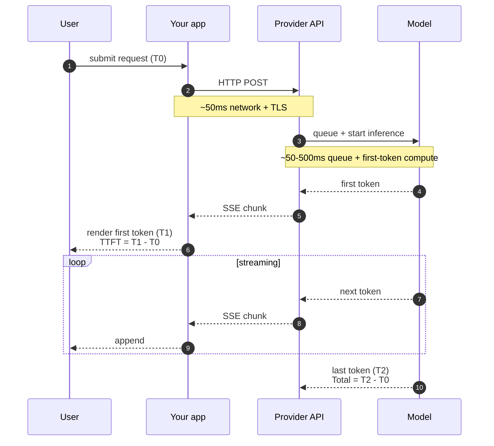

# Latency Intuition

> **In one line:** Users care about *time to first token* far more than total time — and streaming makes a slow model feel fast as long as the first token shows up quickly.

## 1. The two latencies

| Metric | What it measures | What users feel |
|--------|------------------|------------------|
| **TTFT** (Time to First Token) | From request sent → first token rendered | "How fast did this start?" |
| **Total time** | From request sent → last token rendered | "How long until I can act?" |
| **Inter-token time** | Steady-state stream rate | "Is it stalling?" |

For a streaming chat response, **TTFT dominates user perception**. A 200ms TTFT followed by 4 seconds of streaming feels instant. A 4-second TTFT followed by a single dump feels broken — even if total time is identical.

## 2. The user-perception thresholds

| Threshold | What it means |
|-----------|---------------|
| \&lt;100ms | Feels instant |
| 100–300ms | Feels responsive |
| 300ms–1s | Noticeable lag |
| 1–3s | "Is this thing working?" |
| >3s | Many users abandon |

For TTFT in a chat UI, the target is **\&lt;500ms**. For non-streaming responses (small structured outputs), the target is **total time \&lt;1s**.

## 3. What goes into LLM latency



The breakdown for a typical workhorse call:

- **Network + TLS**: ~50ms (or 200ms if you're far from the provider).
- **API queueing**: 0–200ms depending on load.
- **First-token compute**: 100–500ms (varies by model, prompt length).
- **Total TTFT**: typically 300ms–1.5s.
- **Per-token streaming rate**: typically 30–100 tok/s on modern providers; up to 500+ tok/s on Groq for open-weights models.

## 4. The optimizations, ranked by impact

### 1. Streaming (often a 5–10x perceived speedup)

The single biggest UX win. Non-streaming: user stares at a blinking cursor for 3s, then a wall of text. Streaming: tokens appear in 300ms, user starts reading immediately.

If your UI shows model output to a human, stream. Almost always.

### 2. Smaller / faster models (often 2–5x TTFT improvement)

Cheap tier models are typically 2–3x faster TTFT than workhorse. If you can drop a tier without losing quality, you gain latency for free.

### 3. Groq / hosted-open-weights (often 5–10x speedup for open models)

Groq runs Llama / Mistral models on custom hardware at ~500 tok/s — sometimes 10x faster than the same models on standard inference. For chat UIs where TTFT matters, this is a free win if your evals pass on these models.

### 4. Shorter prompts (10–30% TTFT improvement)

First-token compute scales with input size. A 10k-token prompt's TTFT is meaningfully slower than a 1k-token prompt's, especially on workhorse+ tiers.

Cache stable prefixes (Anthropic prompt caching, OpenAI cached input). Cached input doesn't just save cost — it also speeds up TTFT.

### 5. Shorter outputs (linear in output length)

Total time is dominated by output length once streaming starts. "Reply concisely" + a tight `max_tokens` reduces total time directly.

### 6. Provider geographic routing (50–200ms)

If your users are in EU and your provider region is US, every call adds 100–200ms round-trip. Some providers offer regional endpoints; AI gateways (Cloudflare AI Gateway) can route to the closest region.

### 7. Avoiding agent loops on user-facing requests

An agent that takes 5 iterations is 5x the latency. Where possible, do prep work asynchronously (precompute embeddings, pre-fetch context) and put only the final "answer" call in the user's critical path.

### 8. Pre-warming / connection pooling

The first request to a new connection pays TCP+TLS handshake. Keep connections alive. Most SDKs do this automatically; verify.

## 5. The streaming UX patterns

Streaming isn't just "show tokens as they arrive." Production patterns:

### Show a "thinking" state immediately

The 200ms–1.5s TTFT window is the killer. Show *something* immediately — a typing-dots indicator, a skeleton, anything — so the user knows the system received the input.

### Progressive disclosure

For structured outputs, stream parsed chunks as they complete: show the user the `category` field as soon as it parses, before the rest finishes.

### Don't block the input while streaming

Many chat UIs disable the input during generation. For long responses, users want to type their next message. Show the streaming response in a "currently generating" state but keep the input live.

### The stop button (re-emphasis from Stage 2)

A working stop button changes "this is slow" to "I'm in control." Critical for trust.

### Inter-token-time alerts

If the stream stalls for >2 seconds mid-generation, show a visible "still working..." indicator. Users assume "stalled stream" = "broken app" unless told otherwise.

## 6. Latency budgets by feature shape

Rough targets for shipping-quality:

| Feature | TTFT target | Total time target | Notes |
|---------|-------------|---------------------|-------|
| Chat reply | \&lt;500ms | \&lt;8s | Streaming essential |
| Autocomplete | \&lt;100ms | \&lt;300ms | Cheap-tier + Groq |
| Structured extraction (background) | n/a | \&lt;2s | No user wait |
| Search reranking | \&lt;200ms | \&lt;500ms | Cheap-tier or specialized reranker |
| Voice response (TTS) | \&lt;300ms TTFT | \&lt;2s | Voice is unforgiving |
| Agent step | \&lt;1s | \&lt;30s per run | Multi-step; total = sum of steps |
| Document summarization | \&lt;2s | \&lt;30s | Async; users tolerate a "processing..." UI |

Miss a budget and the feature feels broken even if it's working correctly.

## 7. Measuring latency

Track in your observability layer (Stage 7):

```sql
SELECT feature, model,
       PERCENTILE_CONT(0.5) WITHIN GROUP (ORDER BY ttft_ms) AS p50_ttft,
       PERCENTILE_CONT(0.95) WITHIN GROUP (ORDER BY ttft_ms) AS p95_ttft,
       PERCENTILE_CONT(0.99) WITHIN GROUP (ORDER BY ttft_ms) AS p99_ttft,
       PERCENTILE_CONT(0.95) WITHIN GROUP (ORDER BY total_ms) AS p95_total
FROM llm_calls WHERE ts > now() - interval '24h'
GROUP BY feature, model
ORDER BY p95_ttft DESC;
```

Alert when p95 TTFT exceeds your budget for a sustained window (say 10 minutes).

## 8. The provider/model latency variance

Latency varies by provider AND model AND time of day:

- **OpenAI / Anthropic**: typically 200–500ms TTFT for workhorse; can spike to 2–5s under load.
- **Groq**: extremely fast (~100ms TTFT) for open-weights; less stable, narrower model set.
- **Google Gemini**: middle of the pack, often very fast on Flash variants.
- **Self-hosted (vLLM, Ollama)**: depends entirely on your hardware; can be sub-100ms or multi-second.

Time-of-day matters: peak US business hours show 30–100% higher latency at major providers. Budget for the p95, not the median.

## 9. When latency vs quality forces a trade

Sometimes the model that passes evals is too slow. Options:

- **Two-tier**: fast cheap-tier for the user-visible response, workhorse for the deeper async work after.
- **Speculative**: start generating with a faster model; if it's clearly wrong, retry with the slower model.
- **Streaming + abort**: start the fast model; if it pauses (suggesting it's struggling), abort and switch.
- **Cached precomputation**: do the slow analysis ahead of time on common queries; serve from cache.

Latency is a UX decision, not a model decision. Architect around it.

## Common mistakes

:::caution[Where people commonly trip up]
- **Optimizing total time, ignoring TTFT.** Users feel TTFT. A 200ms TTFT with slow streaming beats a 4s TTFT with fast streaming, every time, on identical total times.
- **Not streaming.** "I'll add streaming later." Now is later. The single biggest UX improvement for chat UIs.
- **Long prompts everywhere.** First-token compute scales with input. A bloated system prompt costs latency AND cost. Cache prefixes.
- **Synchronous agent loops in user-facing requests.** Multi-step agents in the critical path are the slowest UX. Push prep work async.
- **No latency dashboards.** "It feels fast on my machine" is not data. P95 TTFT broken down by feature is data.
- **Treating "the API is slow" as the model being slow.** Often it's your network, region, prompt length, or queue. Decompose before fixing.
:::

→ Next: [Safety mindset](./07-safety-mindset.md) — prompt injection, data exfiltration, the defense-in-depth that actually works.
