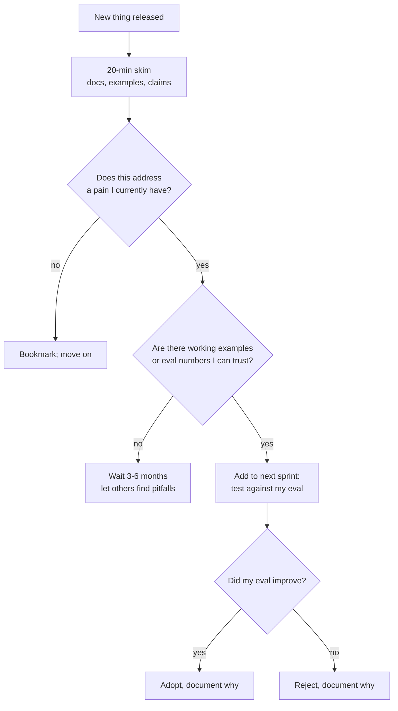

# How to Learn AI Fast

> **In one line:** The field moves too fast to learn it linearly — build your own eval set, run new models against it, and ignore 95% of the discourse. Numbers > vibes > influencer takes.

The field is overwhelming on purpose. Every week is a new model, a new framework, a new pattern. Three habits separate engineers who get steadily better from engineers who run on a hype treadmill.

## 1. Your eval set IS your information filter

If you remember one thing from this entire roadmap, remember this.

The fastest, most truthful way to evaluate any new AI thing — a new model, a new prompt technique, a new framework — is to run it against **your own eval set in your own problem domain**.

- New model released, "best at coding"? Run your code eval. If it's actually better on your tasks, switch. If not, ignore the hype.
- New chunking technique, "improves RAG recall by 30%"? Add it to your pipeline behind a feature flag. Run your retrieval eval. Check the actual lift.
- New framework, "agents made easy"? Build one of your existing agent tasks with it. Compare lines of code, debug experience, eval results.

**Your eval set in your domain is the ground truth. Public benchmarks are not.** Every model claims SOTA on something; that something is rarely your problem.

This is why [Stage 6 (evals)](../01-part-1-from-zero/07-stage-6-evals.md) is the single load-bearing stage. Without it, you have no filter; everything is exciting; nothing gets measured.

## 2. The 20-minute decision rule for new things

When something new appears (model, framework, library, technique), give it 20 minutes:

The trap: trying everything in real time. You'll spend all your time evaluating, none shipping. 20-minute filter → ship-time test on actual problems only.

## 3. The "ignore by default" categories

Things that look like signal but mostly aren't:

- **Twitter posts about benchmark wins.** Almost always cherry-picked; almost never reproduce on your tasks.
- **"I built X in 50 lines with Y" tweets.** Toy examples that fall apart on the first real input.
- **Newsletter "this week in AI" digests** beyond skim level. Twenty things mentioned; one will matter; you can't tell which without running them.
- **Multi-agent demos.** Mostly show the framework's UI, not real reliability.
- **"AGI in N months" takes.** Pure speculation; no actionable signal.
- **YouTube tutorials.** Often months out of date by the time you watch them, even for "current" topics.

Things that ARE signal:

- **Provider release notes** for the providers you use.
- **Specific eval results** with methodology, not headline numbers.
- **Postmortems** from teams running AI in production.
- **Talks from production engineers** at AI Engineer Summit, etc.
- **Long-form blog posts** from engineers who've been in the trenches (Eugene Yan, Hamel Husain, Simon Willison, Anthropic / OpenAI engineering posts).

## 4. The build-to-learn loop

Reading about AI tells you the names of things. Building exposes what they actually do.

For every concept you want to learn:

1. **Read enough to know what to build** (~30 min).
2. **Build the smallest possible version** that demonstrates the concept (~1–2 hours).
3. **Run it on your eval set** if relevant.
4. **Take notes on what you found surprising.**

Examples:
- Want to learn RAG? Don't read a tutorial. Build a 50-line RAG on your own notes. (Stage 5.)
- Want to learn structured output? Build a triage extractor. (Stage 3.)
- Want to learn prompt caching? Add it to one of your existing apps and measure the cost change.
- Want to evaluate a new framework? Port one of your existing features to it.

The "smallest version that shows the concept" + "your eval to verify" is the loop. The 3:1 build-to-read ratio from learning literature applies here too.

## 5. Re-evaluate every quarter

Quarterly habit:

- Run your eval set against the current top model from each provider.
- Check your dependencies — are framework versions still recommended?
- Look at your `llm_calls` table — is the cost distribution still sensible? Have new tiers / pricing emerged?
- Survey new tier-1 picks (the equivalent of [Part II](../02-part-2-modern-stack/index.md), refreshed).

A two-hour audit each quarter prevents the "wait, when did the landscape shift this much?" moment that hits you a year later.

## 6. Specialize earlier than you think

Generalist AI engineering is fine for the first year. Past that, depth wins:

- **RAG specialist** — retrieval quality, chunking, hybrid, reranking.
- **Agent specialist** — multi-step reliability, tool design, planning.
- **Cost/scale specialist** — caching, model routing, infrastructure.
- **Evals specialist** — measurement, calibration, regression systems.
- **Voice specialist** — real-time, latency, the audio pipeline.
- **Multimodal specialist** — image / video understanding, generation.
- **Safety/security specialist** — red-teaming, defense-in-depth.
- **Domain specialist** — AI for legal / medical / fintech / education.

Specialization gives you something deeper than "I've heard of everything." It also gives you a clear "what to read next" — your specialty's papers, communities, conferences.

## 7. The Twitter / X strategy

Twitter is the field's best signal channel AND its worst noise channel. The trick: curate aggressively.

- Follow ~20 people who actually ship production AI.
- Mute or unfollow anyone whose ratio of takes-to-evidence is high.
- Use lists (not the home feed). The home feed is hype-optimized; a list is signal-optimized.
- Block any "AI guru" who hasn't shipped a real product.

Suggested starting list (not exhaustive, not endorsement): Simon Willison (`@simonw`), Eugene Yan (`@eugeneyan`), Hamel Husain (`@HamelHusain`), people from Anthropic / OpenAI / DeepMind engineering teams, the Latent Space podcast crew.

## 8. The "I'm behind" feeling is permanent

This is important: **the feeling of being behind is the default state in AI engineering and it never goes away.** The reason: the volume of new releases is genuinely faster than any human can absorb.

Senior AI engineers cope by:

- Being VERY deliberate about what to engage with.
- Trusting their own eval over the discourse.
- Specializing — being current in one area, intentionally lagging on others.
- Tuning out hype cycles in real time; revisiting periodically.

If you're feeling behind on every announcement, you're trying to keep up with everything. Pick your depth, ignore the rest.

## 9. The personal AI lab habit

The single best growth habit: maintain a personal repo of small experiments — `~/ai-experiments/` — where you try every concept that catches your eye in a 1-2 hour session.

After 6–12 months, this is:

- A personal reference. "How did I implement that thing?"
- A portfolio. Public link, organized by experiment.
- A measure of your growth. The early ones look naive; that's good.
- A confidence-builder. You've actually touched the things you've heard of.

## Common mistakes

:::caution[Where people commonly trip up]
- **Trying to read everything.** The volume is unsurvivable. Filter aggressively; default to "skip" not "engage."
- **Trusting benchmarks over your own evals.** SOTA on MMLU doesn't tell you whether the model handles YOUR problem.
- **Watching, not building.** Tutorials and conference talks feel productive; they're recognition, not skill. Build at a 3:1 ratio.
- **Switching frameworks every quarter.** Every new framework promises productivity; switching costs are real. Audit periodically; switch with intent.
- **Not specializing.** "I want to be good at everything" → you're a beginner at everything. Pick a depth by year two.
- **Treating "I'm behind" as failure.** Everyone is behind. The skill is being deliberate about which behind-ness costs you and which doesn't.
:::

→ Next: [Papers worth reading](./02-papers-worth-reading.md) — the short list, plus how to skim the rest.
