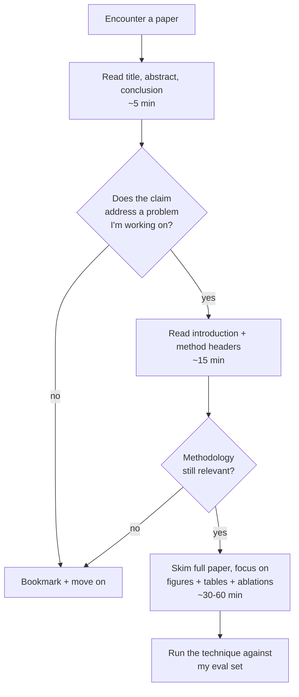

# Papers Worth Reading

> **In one line:** Most AI papers don't matter for shipping AI. A short list of foundational ones gives you the conceptual vocabulary; the rest you skim only when they intersect a problem you're hitting.

## 1. The honest claim

You can ship production AI for years without reading a single research paper. Most AI engineering is engineering — prompts, evals, retrieval, observability, deployment. The papers are interesting but rarely actionable.

That said, ~10 foundational papers give you the conceptual vocabulary that every newer paper references. Knowing them makes everything else easier to skim.

## 2. The foundational ten (read these, in this order)

### Transformer architecture

1. **Attention is All You Need** (Vaswani et al., 2017) — the original transformer paper. The architecture every LLM is built on.

### Scale and capability

2. **Language Models are Few-Shot Learners** (Brown et al., 2020 — the GPT-3 paper) — why scale alone produces emergent capabilities; the "in-context learning" concept.
3. **Scaling Laws for Neural Language Models** (Kaplan et al., 2020) — how loss scales with model size, dataset size, compute.

### Alignment and instruction-following

4. **Training Language Models to Follow Instructions with Human Feedback** (Ouyang et al., 2022 — the InstructGPT paper) — RLHF, why "instruct"-tuned models behave like GPT-3.5 / ChatGPT.

### Tools, agents, retrieval

5. **Retrieval-Augmented Generation for Knowledge-Intensive NLP Tasks** (Lewis et al., 2020) — the original RAG paper.
6. **ReAct: Synergizing Reasoning and Acting in Language Models** (Yao et al., 2022) — the tool-use loop pattern.
7. **Chain-of-Thought Prompting Elicits Reasoning** (Wei et al., 2022) — why "let's think step by step" works.

### Modern surveys and frames

8. **A Survey of Large Language Models** (Zhao et al., 2023+ updates) — a periodically-updated landscape view; skim the latest version.
9. **The Bitter Lesson** (Sutton, 2019 — an essay, not a paper) — why general methods that leverage compute beat domain-specific cleverness.
10. **Building Effective Agents** (Anthropic, 2024 — an engineering essay, not academic) — current best primer on agent patterns from a major lab.

Read these and you have the vocabulary to follow any newer paper. ~30 hours of reading total.

## 3. How to actually read a paper

You don't have to read papers like a textbook. The triage method:

90% of papers stop at "bookmark + move on." That's correct. The remaining 10% you actually use, you test before adopting.

## 4. The categories worth tracking

You don't need every paper, but knowing the categories helps:

| Category | Cadence | Why |
|----------|---------|-----|
| Frontier model technical reports | Per release | What's new in capability |
| RAG / retrieval methods | Monthly | This area is moving fast |
| Agent / planning architectures | Monthly | Same |
| Eval methodology | Quarterly | Slowly improving |
| Prompting techniques | Quarterly | Mostly diminishing returns |
| Long-context tricks | Quarterly | When you hit context limits |
| Safety / alignment | Quarterly | Slow but important |
| Quantization / efficient inference | If you self-host | Only if relevant |

## 5. Where to find the worthwhile ones

- **arXiv cs.CL and cs.LG** — the firehose. Use it via a curated filter, not directly.
- **Papers with Code** — adds the "reproducible?" signal.
- **Latent Space podcast** — weekly summary by people who read more than you can.
- **The Sequence / Import AI / The Batch** — newsletters with paper digests.
- **AlphaSignal** — daily AI papers + a brief, decent signal-to-noise.
- **Twitter / X lists** (see Part IV-1) — researchers post their own papers; aggregators retweet the important ones.

## 6. The lab blog posts are often better than the papers

For practical engineering, the major labs' engineering blog posts are often higher signal than their research papers:

- [Anthropic news / research](https://www.anthropic.com/news) — usually framed for engineers.
- [OpenAI cookbook](https://github.com/openai/openai-cookbook) — runnable patterns.
- [Google DeepMind blog](https://deepmind.google/discover/blog/) — research + engineering posts.
- [Mistral docs / cookbook](https://docs.mistral.ai/) — concise, practical.

Engineering posts tell you "here's how to use this in your app." Papers tell you "here's why this exists." For shipping, the first is usually what you need.

## 7. The papers worth re-reading

A few papers reward re-reading at different career stages:

- **Attention is All You Need** — at year 0 (architecture overview), at year 2 (multi-head attention details), at year 4 (positional encoding choices).
- **Scaling Laws** — at year 0 (the existence of the laws), at year 2 (why frontier-tier costs what it does).
- **The Bitter Lesson** — annually. It's short, and the lesson is unintuitive enough that re-reading recalibrates your priors.

## 8. When NOT to read papers

Specifically, don't:

- **Read a paper to "stay current"** if it doesn't address something you're building. The cost of context-switching to academic prose outweighs the benefit.
- **Read 12 RAG papers before building your first RAG.** Build first. Read after.
- **Read a paper to refute someone on Twitter.** The expected ROI is negative.

## 9. The "what would I cite?" test

Useful self-check: in a technical discussion with another AI engineer, would you actually cite this paper to make a point? If not, the paper wasn't worth your time. If yes, you remember it; you internalized it.

Most papers fail this test. The foundational ten pass it constantly.

## 10. The bibliography habit

Keep a simple `~/notes/papers-read.md` — title, link, one-sentence takeaway, date.

After two years you have:

- A scannable list of what you've read.
- A reference when you need to cite something.
- A growth artifact — early entries look unsophisticated; that's progress.

## Common mistakes

:::caution[Where people commonly trip up]
- **Trying to read everything new on arXiv.** The volume is unsurvivable; ~85% of papers are noise. Filter ruthlessly.
- **Reading papers without building.** You "understand" RAG from a paper but have never built one. Building is the test of understanding.
- **Treating engineering blog posts as inferior.** For practical AI engineering, lab blog posts often beat papers — they're written for engineers, not reviewers.
- **Skipping the foundational ten.** Reading newer papers without the foundations is reading a sequel you haven't read the original of.
- **Reading to "look smart."** If the only audience for your reading is yourself-pretending-to-be-impressive, skip it. Read what you'll use.
:::

→ Next: [Communities and conferences](./03-communities-and-conferences.md) — where production AI engineers actually congregate.
